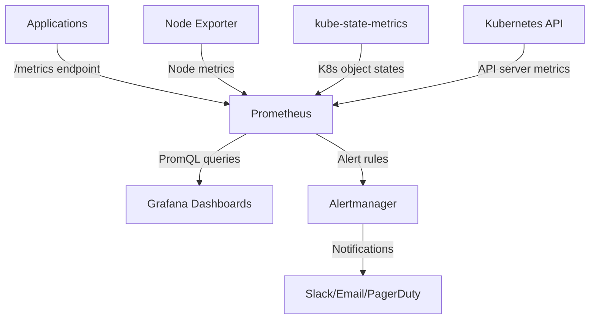

# How to Set Up Prometheus and Grafana Monitoring Stack on AKS Using Helm

Author: [nawazdhandala](https://www.github.com/nawazdhandala)

Tags: AKS, Prometheus, Grafana, Monitoring, Helm, Kubernetes, Observability

Description: Complete guide to deploying a Prometheus and Grafana monitoring stack on AKS using Helm for cluster and application observability.

---

Every production Kubernetes cluster needs monitoring. While Azure Monitor and Container Insights work well for Azure-native metrics, many teams prefer the Prometheus and Grafana combination for its flexibility, PromQL query language, and massive ecosystem of exporters and dashboards. Deploying this stack on AKS with Helm takes about 15 minutes and gives you comprehensive cluster and application monitoring.

## What You Get with the Prometheus-Grafana Stack

The kube-prometheus-stack Helm chart deploys a complete monitoring pipeline:

- **Prometheus**: Scrapes and stores time-series metrics from pods, nodes, and Kubernetes components.
- **Grafana**: Visualizes metrics with pre-built and custom dashboards.
- **Alertmanager**: Routes alerts to email, Slack, PagerDuty, and other channels.
- **Node Exporter**: Collects hardware and OS metrics from each node.
- **kube-state-metrics**: Generates metrics about Kubernetes object states (deployments, pods, nodes).
- **Prometheus Operator**: Manages Prometheus instances and metric targets declaratively with CRDs.



## Prerequisites

- An AKS cluster with at least 3 nodes (the stack needs roughly 2 GB RAM and 1 CPU)
- Helm 3 installed
- kubectl configured for your cluster
- A storage class that supports persistent volumes (AKS has this by default)

## Step 1: Add the Helm Repository

```bash
# Add the prometheus-community Helm repo
helm repo add prometheus-community https://prometheus-community.github.io/helm-charts

# Update your local chart cache
helm repo update
```

## Step 2: Create a Values File

Customize the installation with a values file. This is where you configure storage, retention, and Grafana settings.

```yaml
# monitoring-values.yaml
# Custom values for the kube-prometheus-stack Helm chart

# Prometheus configuration
prometheus:
  prometheusSpec:
    # How long to keep metrics data
    retention: 15d
    # Persistent storage for metrics
    storageSpec:
      volumeClaimTemplate:
        spec:
          storageClassName: managed-csi
          accessModes: ["ReadWriteOnce"]
          resources:
            requests:
              # Size based on retention and scrape volume
              storage: 50Gi
    # Resource limits for the Prometheus server
    resources:
      requests:
        cpu: 500m
        memory: 1Gi
      limits:
        cpu: 2000m
        memory: 4Gi
    # Scrape all ServiceMonitors regardless of labels
    serviceMonitorSelectorNilUsesHelmValues: false
    podMonitorSelectorNilUsesHelmValues: false

# Grafana configuration
grafana:
  # Enable persistent storage for Grafana dashboards and settings
  persistence:
    enabled: true
    storageClassName: managed-csi
    size: 10Gi
  # Set the admin password (change this for production)
  adminPassword: "changeme-grafana-admin"
  # Install additional Grafana plugins
  plugins:
    - grafana-piechart-panel
  # Resource limits
  resources:
    requests:
      cpu: 100m
      memory: 256Mi
    limits:
      cpu: 500m
      memory: 512Mi

# Alertmanager configuration
alertmanager:
  alertmanagerSpec:
    storage:
      volumeClaimTemplate:
        spec:
          storageClassName: managed-csi
          accessModes: ["ReadWriteOnce"]
          resources:
            requests:
              storage: 5Gi

# Node exporter - runs on every node to collect OS-level metrics
nodeExporter:
  resources:
    requests:
      cpu: 50m
      memory: 64Mi
    limits:
      cpu: 200m
      memory: 128Mi

# kube-state-metrics - tracks Kubernetes object states
kubeStateMetrics:
  resources:
    requests:
      cpu: 50m
      memory: 64Mi
    limits:
      cpu: 200m
      memory: 256Mi
```

## Step 3: Install the Stack

Deploy the kube-prometheus-stack chart with your custom values.

```bash
# Install the monitoring stack into the monitoring namespace
helm install prometheus-stack prometheus-community/kube-prometheus-stack \
  --namespace monitoring \
  --create-namespace \
  --values monitoring-values.yaml \
  --wait
```

The installation takes 2-3 minutes. Verify everything is running.

```bash
# Check all pods in the monitoring namespace
kubectl get pods -n monitoring

# You should see:
# - prometheus-stack-kube-prom-operator (Prometheus Operator)
# - prometheus-prometheus-stack-kube-prom-prometheus (Prometheus server)
# - prometheus-stack-grafana (Grafana)
# - alertmanager-prometheus-stack-kube-prom-alertmanager (Alertmanager)
# - prometheus-stack-kube-prom-node-exporter (one per node)
# - prometheus-stack-kube-state-metrics
```

## Step 4: Access Grafana

Grafana is deployed as a ClusterIP service by default. Port-forward to access it locally.

```bash
# Port-forward Grafana to localhost:3000
kubectl port-forward svc/prometheus-stack-grafana -n monitoring 3000:80
```

Open http://localhost:3000 in your browser. Log in with username `admin` and the password you set in the values file.

For production access, create an Ingress resource.

```yaml
# grafana-ingress.yaml
# Expose Grafana through the ingress controller
apiVersion: networking.k8s.io/v1
kind: Ingress
metadata:
  name: grafana-ingress
  namespace: monitoring
  annotations:
    nginx.ingress.kubernetes.io/ssl-redirect: "true"
    cert-manager.io/cluster-issuer: "letsencrypt-prod"
spec:
  ingressClassName: nginx
  tls:
  - hosts:
    - grafana.example.com
    secretName: grafana-tls
  rules:
  - host: grafana.example.com
    http:
      paths:
      - path: /
        pathType: Prefix
        backend:
          service:
            name: prometheus-stack-grafana
            port:
              number: 80
```

## Step 5: Explore Built-in Dashboards

The kube-prometheus-stack comes with over 20 pre-built Grafana dashboards. Navigate to Dashboards in Grafana and browse the "General" folder. Key dashboards include:

- **Kubernetes / Compute Resources / Cluster**: Overall cluster CPU and memory usage
- **Kubernetes / Compute Resources / Namespace (Pods)**: Per-pod resource usage
- **Kubernetes / Networking / Pod**: Network traffic per pod
- **Node Exporter / Nodes**: Detailed node hardware metrics (disk I/O, CPU, memory)
- **Kubernetes / Persistent Volumes**: PV usage and capacity

## Step 6: Configure Alertmanager Notifications

Set up Alertmanager to send notifications to Slack or email when alerts fire.

```yaml
# alertmanager-config.yaml
# ConfigMap or secret with Alertmanager routing configuration
apiVersion: v1
kind: Secret
metadata:
  name: alertmanager-config
  namespace: monitoring
stringData:
  alertmanager.yaml: |
    global:
      resolve_timeout: 5m
    route:
      group_by: ['alertname', 'namespace']
      group_wait: 30s
      group_interval: 5m
      repeat_interval: 4h
      receiver: 'slack-notifications'
      routes:
      - match:
          severity: critical
        receiver: 'slack-critical'
        repeat_interval: 1h
    receivers:
    - name: 'slack-notifications'
      slack_configs:
      - api_url: 'https://hooks.slack.com/services/T00/B00/XXXX'
        channel: '#alerts'
        send_resolved: true
        title: '{{ .GroupLabels.alertname }}'
        text: '{{ range .Alerts }}{{ .Annotations.description }}{{ end }}'
    - name: 'slack-critical'
      slack_configs:
      - api_url: 'https://hooks.slack.com/services/T00/B00/XXXX'
        channel: '#alerts-critical'
        send_resolved: true
```

You can also configure this through the Helm values file under `alertmanager.config`.

## Step 7: Add Custom Alert Rules

Create PrometheusRule resources to define custom alerts.

```yaml
# custom-alerts.yaml
# Custom alert rules for application-specific monitoring
apiVersion: monitoring.coreos.com/v1
kind: PrometheusRule
metadata:
  name: custom-app-alerts
  namespace: monitoring
  labels:
    # This label must match what Prometheus Operator looks for
    release: prometheus-stack
spec:
  groups:
  - name: application-alerts
    rules:
    # Alert when a pod is restarting too frequently
    - alert: PodCrashLooping
      expr: rate(kube_pod_container_status_restarts_total[15m]) * 60 * 15 > 3
      for: 5m
      labels:
        severity: warning
      annotations:
        summary: "Pod {{ $labels.namespace }}/{{ $labels.pod }} is crash looping"
        description: "Pod has restarted more than 3 times in the last 15 minutes"

    # Alert when node memory is above 90%
    - alert: NodeMemoryHigh
      expr: (1 - node_memory_MemAvailable_bytes / node_memory_MemTotal_bytes) > 0.9
      for: 10m
      labels:
        severity: critical
      annotations:
        summary: "Node {{ $labels.instance }} memory usage above 90%"
        description: "Node memory has been above 90% for 10 minutes"

    # Alert when persistent volume is almost full
    - alert: PersistentVolumeFilling
      expr: kubelet_volume_stats_used_bytes / kubelet_volume_stats_capacity_bytes > 0.85
      for: 15m
      labels:
        severity: warning
      annotations:
        summary: "PV {{ $labels.persistentvolumeclaim }} is filling up"
        description: "Persistent volume is above 85% capacity"
```

## Step 8: Monitor Your Applications

To scrape metrics from your own applications, create ServiceMonitor resources.

```yaml
# app-service-monitor.yaml
# Tell Prometheus to scrape metrics from your application
apiVersion: monitoring.coreos.com/v1
kind: ServiceMonitor
metadata:
  name: my-app-metrics
  namespace: default
  labels:
    release: prometheus-stack
spec:
  selector:
    matchLabels:
      app: my-app
  endpoints:
  # Scrape the /metrics endpoint every 15 seconds
  - port: http
    path: /metrics
    interval: 15s
```

Verify Prometheus is scraping your application by checking the Targets page. Port-forward to Prometheus and visit http://localhost:9090/targets.

```bash
# Port-forward to the Prometheus UI
kubectl port-forward svc/prometheus-stack-kube-prom-prometheus -n monitoring 9090:9090
```

## Step 9: Create Custom Grafana Dashboards

While the built-in dashboards cover cluster metrics, you will want custom dashboards for your applications. Create them in the Grafana UI or define them as ConfigMaps.

```yaml
# custom-dashboard.yaml
# Define a Grafana dashboard as a ConfigMap
apiVersion: v1
kind: ConfigMap
metadata:
  name: my-app-dashboard
  namespace: monitoring
  labels:
    # This label tells the Grafana sidecar to load this dashboard
    grafana_dashboard: "1"
data:
  my-app.json: |
    {
      "dashboard": {
        "title": "My Application",
        "panels": [
          {
            "title": "Request Rate",
            "type": "graph",
            "targets": [
              {
                "expr": "rate(http_requests_total{app=\"my-app\"}[5m])",
                "legendFormat": "{{method}} {{status}}"
              }
            ]
          }
        ]
      }
    }
```

## Scaling Considerations

For large clusters (50+ nodes, hundreds of pods), consider these adjustments:

- **Increase Prometheus memory**: Large clusters generate more time series. Monitor Prometheus memory usage and increase limits accordingly.
- **Use recording rules**: Pre-compute expensive PromQL queries as recording rules to reduce dashboard query time.
- **Shard Prometheus**: For very large clusters, run multiple Prometheus instances with different scrape targets.
- **Increase storage**: The default 50 Gi fills up faster with more targets. Budget approximately 1-2 MB per active time series per day of retention.

## Summary

The kube-prometheus-stack Helm chart gives you a production-ready monitoring pipeline on AKS in minutes. Prometheus handles metric collection and alerting, Grafana provides visualization, and the Prometheus Operator makes configuration declarative through CRDs. Start with the built-in dashboards and alerts, then extend with custom ServiceMonitors, PrometheusRules, and Grafana dashboards as your monitoring needs grow. For most AKS clusters, this stack provides more flexibility and depth than Azure-native monitoring tools, especially for application-level metrics.
