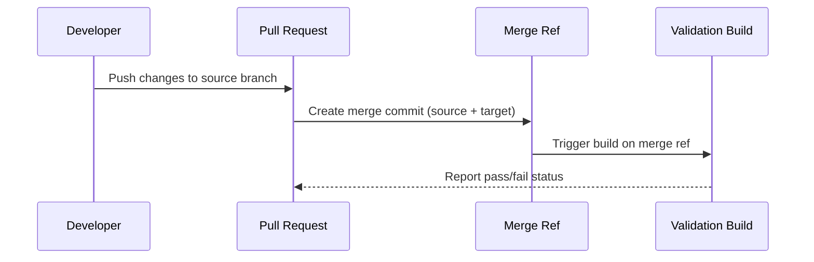

# How to Set Up Pull Request Triggers and Validation Builds in Azure Repos

Author: [nawazdhandala](https://www.github.com/nawazdhandala)

Tags: Azure Repos, Pull Requests, Build Validation, Azure Pipelines, CI/CD, Code Quality, Azure DevOps

Description: Configure pull request triggers and validation builds in Azure Repos to catch issues before code reaches your main branch.

---

The best time to catch a bug is before it merges into your main branch. Pull request validation builds make this automatic. When someone opens a PR or pushes new commits to an existing one, a build pipeline runs against the proposed changes. If the build fails, the PR cannot be merged.

This is one of those things that sounds simple in concept but has enough nuance in practice that it is worth covering properly. In this post, I will walk through setting up PR triggers, configuring build validation policies, handling the common edge cases, and tuning things for performance.

## Two Ways to Trigger PR Builds

Azure DevOps gives you two mechanisms for running builds on pull requests, and they work differently:

**PR triggers in YAML** (the `pr:` section) control when the pipeline runs in response to PR events. This is configured in the pipeline file itself.

**Build validation policies** on branches control which pipelines are required to pass before a PR can complete. This is configured in branch policies.

You typically use both together: the YAML trigger controls when the build fires, and the branch policy controls whether the build is required for merging.

## Configuring PR Triggers in YAML

The `pr:` trigger in your YAML pipeline specifies which branches and paths should trigger a build when a PR targets them.

The following configuration runs the pipeline when a PR targets the main or release branches, but only if the changed files are in the src directory.

```yaml
# azure-pipelines.yml - PR trigger configuration
trigger: none  # Disable CI trigger; this pipeline is PR-only

# Run on PRs targeting main or release branches
pr:
  branches:
    include:
      - main
      - release/*
  paths:
    include:
      - src/**
      - tests/**
    exclude:
      - docs/**
      - '**/*.md'

pool:
  vmImage: 'ubuntu-latest'

steps:
  - task: DotNetCoreCLI@2
    displayName: 'Restore'
    inputs:
      command: 'restore'

  - task: DotNetCoreCLI@2
    displayName: 'Build'
    inputs:
      command: 'build'
      arguments: '--no-restore'

  - task: DotNetCoreCLI@2
    displayName: 'Test'
    inputs:
      command: 'test'
      arguments: '--no-build --logger trx'

  - task: PublishTestResults@2
    displayName: 'Publish test results'
    inputs:
      testResultsFormat: 'VSTest'
      testResultsFiles: '**/*.trx'
```

The path filters are important for performance. If someone changes only documentation, there is no point in running a full build. The `exclude` pattern for markdown files is a simple optimization that saves your team time.

## Setting Up Build Validation Policies

To require the build to pass before merging, add it as a branch policy.

Go to **Repos > Branches**, find your branch (e.g., `main`), click the three dots menu, and select **Branch policies**. Under **Build Validation**, click **Add build policy**.

Configure these settings:

- **Build pipeline**: Select your PR validation pipeline
- **Trigger**: Automatic (runs on every PR update)
- **Policy requirement**: Required
- **Build expiration**: "Immediately when the source branch is updated" ensures stale builds do not count
- **Display name**: Something clear like "PR Build Validation"

Once set, the PR merge button will be blocked until the build passes.

## Understanding the PR Build Process

When a PR validation build runs, it does not build the source branch directly. Instead, it builds a temporary merge commit that represents what the target branch would look like after the merge.



This is important because it catches merge conflicts and integration issues that would only appear after merging, not just issues in the source branch alone.

## Handling Multiple Pipelines

Large projects often need multiple validation pipelines. For example, you might have separate pipelines for:

- Backend build and tests
- Frontend build and tests
- Integration tests
- Linting and code analysis
- Security scanning

Each of these can be added as a separate build validation policy. All required policies must pass before the PR can complete.

```yaml
# pr-backend.yml - Backend validation
trigger: none
pr:
  branches:
    include: [main]
  paths:
    include: [src/backend/**]

pool:
  vmImage: 'ubuntu-latest'

steps:
  - script: dotnet test src/backend/tests
    displayName: 'Backend tests'
```

```yaml
# pr-frontend.yml - Frontend validation
trigger: none
pr:
  branches:
    include: [main]
  paths:
    include: [src/frontend/**]

pool:
  vmImage: 'ubuntu-latest'

steps:
  - script: |
      cd src/frontend
      npm ci
      npm run lint
      npm test
    displayName: 'Frontend lint and tests'
```

With path-based triggers, each pipeline only runs when its relevant files change. A backend-only change does not trigger the frontend pipeline.

## Optional vs. Required Validation

Not every check needs to block merging. Some checks are informational - they provide context but should not prevent someone from completing a PR.

When adding a build validation policy, set the **Policy requirement** to:

- **Required**: Must pass to complete the PR (use for build, unit tests, linting)
- **Optional**: Shows status but does not block (use for optional checks like code coverage thresholds or performance benchmarks)

Optional checks show as yellow warnings in the PR, while required checks show as red blockers.

## Configuring Auto-Complete with Validation

Azure Repos supports auto-complete, which automatically merges the PR once all required checks pass. This is useful when you have slow-running validation pipelines.

The developer sets auto-complete on the PR, configures the merge options (squash, merge commit, etc.), and then walks away. When the last required check passes, the PR completes automatically.

This pairs well with approval requirements. The flow becomes:

1. Developer opens PR and sets auto-complete
2. Reviewer approves
3. Validation builds finish
4. PR auto-completes

No one has to sit around watching builds.

## Performance Optimization

PR builds that take too long erode the team's willingness to use them. Here are some strategies to keep them fast:

**Use path filters aggressively.** Do not run a full build when only docs changed.

**Cache dependencies.** The Cache task dramatically speeds up package restores.

```yaml
# Cache NuGet packages between pipeline runs
- task: Cache@2
  displayName: 'Cache NuGet packages'
  inputs:
    key: 'nuget | "$(Agent.OS)" | **/packages.lock.json'
    restoreKeys: |
      nuget | "$(Agent.OS)"
    path: $(NUGET_PACKAGES)

- task: DotNetCoreCLI@2
  displayName: 'Restore with cache'
  inputs:
    command: 'restore'
    projects: '**/*.csproj'
```

**Run tests in parallel.** Most test frameworks support parallel execution.

```yaml
# Run tests with parallel execution
- task: DotNetCoreCLI@2
  displayName: 'Run tests in parallel'
  inputs:
    command: 'test'
    arguments: '--no-build --parallel'
```

**Use a fast agent pool.** If your organization has self-hosted agents with more CPU and RAM, use those for PR validation. The faster feedback loop is worth it.

**Skip unnecessary steps.** In a PR validation, you probably do not need to publish artifacts or run deployment steps. Use conditions to skip them.

```yaml
# Only publish artifacts on CI builds, not PR validation
- task: PublishBuildArtifacts@1
  displayName: 'Publish artifacts'
  condition: and(succeeded(), ne(variables['Build.Reason'], 'PullRequest'))
  inputs:
    pathToPublish: '$(Build.ArtifactStagingDirectory)'
```

## Handling Flaky Tests

Flaky tests are the worst enemy of PR validation. A test that randomly fails 5% of the time will block developers regularly and erode trust in the system.

A few approaches to manage flaky tests:

- **Quarantine flaky tests.** Move them to a separate test category and exclude them from PR validation. Run them in a separate pipeline on a schedule.
- **Add retries.** Some test frameworks support automatic retries for failed tests.
- **Track flakiness.** Azure DevOps Test Analytics helps you identify which tests are flaky so you can fix or quarantine them.

## Status Checks and Branch Protection

Once build validation is configured, the PR page shows the status of each required check. The merge button stays disabled until all required checks pass.

You can also configure:

- **Reset votes on new pushes**: When new commits are pushed to the PR, previous approvals are reset. This prevents approved-then-changed scenarios.
- **Block direct pushes**: Prevent commits that bypass the PR process entirely.
- **Require specific merge types**: Force squash merges, merge commits, or rebase.

## Wrapping Up

Pull request validation builds are the single most impactful quality gate you can add to your development process. They catch bugs, enforce standards, and give reviewers confidence that the code at least compiles and passes tests. Start with a simple build-and-test pipeline, add it as a required branch policy, and iterate from there. The few minutes each PR build takes will save you hours of debugging broken builds on your main branch.
