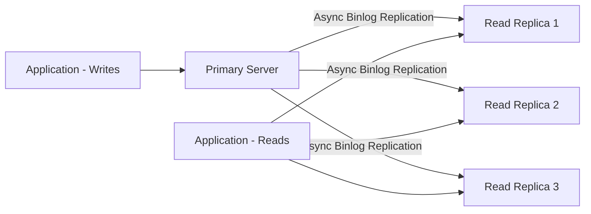

# How to Set Up Read Replicas in Azure Database for MySQL Flexible Server

Author: [nawazdhandala](https://www.github.com/nawazdhandala)

Tags: Azure, MySQL, Read Replicas, Flexible Server, Database Scaling, Replication, Performance

Description: A practical guide to setting up and managing read replicas in Azure Database for MySQL Flexible Server for scaling read-heavy workloads.

---

When your MySQL database is handling more read queries than it can comfortably manage, adding more CPU and RAM to the primary server only goes so far. At some point, you need to distribute the read load across multiple servers. That is where read replicas come in. Azure Database for MySQL Flexible Server supports up to 10 read replicas that you can use to offload reporting queries, analytics workloads, or read-heavy application traffic.

In this guide, I will cover how to create read replicas, how replication works under the hood, and the operational considerations you need to be aware of.

## How Read Replicas Work

Read replicas in Azure Database for MySQL Flexible Server use MySQL's native binary log (binlog) replication. Here is the flow:



Key characteristics:

- Replication is asynchronous. There will always be some lag between the primary and replicas.
- Replicas are read-only. You cannot write to them.
- Each replica has its own connection endpoint.
- Replicas can be in the same region or a different region (cross-region replicas).
- You can have up to 10 replicas per primary server.

The asynchronous nature means your reads might be slightly behind the primary. For many use cases - dashboards, analytics, reporting - this is perfectly acceptable. For use cases requiring strong consistency, you should read from the primary.

## Prerequisites

Before creating read replicas:

- The source server must be a Flexible Server (not Single Server).
- The `binlog_expire_logs_seconds` parameter should be set appropriately (default is fine for most cases).
- You need sufficient quota in your subscription for the additional compute resources.
- For cross-region replicas, both regions must support Flexible Server.

## Creating a Read Replica via Azure CLI

Here is how to create a read replica in the same region:

```bash
# Create a read replica in the same region as the source
az mysql flexible-server replica create \
  --resource-group myResourceGroup \
  --name my-mysql-replica-1 \
  --source-server my-mysql-primary \
  --zone 2
```

The replica inherits the compute tier, SKU, and storage configuration from the source server. You can specify a different availability zone for the replica.

For a cross-region replica:

```bash
# Create a cross-region read replica for disaster recovery
az mysql flexible-server replica create \
  --resource-group myResourceGroup \
  --name my-mysql-replica-westus \
  --source-server my-mysql-primary \
  --location westus2
```

Cross-region replicas are great for disaster recovery and for serving reads closer to users in other geographies.

## Creating a Read Replica via the Azure Portal

In the portal:

1. Navigate to your MySQL Flexible Server.
2. Click "Replication" in the left menu under Settings.
3. Click "Add Replica."
4. Choose a server name and region.
5. Select the availability zone.
6. Click "Create."

The replica creation takes several minutes. Azure takes a snapshot of the primary, restores it to the new server, and then starts streaming binlog events.

## Checking Replication Status

After creating a replica, verify that replication is healthy:

```bash
# List all replicas for a source server
az mysql flexible-server replica list \
  --resource-group myResourceGroup \
  --name my-mysql-primary \
  --output table
```

To check the replication lag on a specific replica, connect to it and run:

```sql
-- Check replication lag in seconds on the replica
SHOW SLAVE STATUS\G
```

Look at the `Seconds_Behind_Master` field. A value of 0 means the replica is caught up. Occasional spikes are normal during heavy write periods.

You can also monitor replication lag through Azure Monitor:

```bash
# Create an alert for replication lag exceeding 30 seconds
az monitor metrics alert create \
  --name mysql-replica-lag-alert \
  --resource-group myResourceGroup \
  --scopes "/subscriptions/{sub-id}/resourceGroups/myResourceGroup/providers/Microsoft.DBforMySQL/flexibleServers/my-mysql-replica-1" \
  --condition "avg ReplicationLag > 30" \
  --description "Replication lag exceeded 30 seconds" \
  --action-group myActionGroup
```

## Configuring Your Application

The primary and each replica have separate connection endpoints. Your application needs to know which endpoint to use for which queries.

### Splitting Reads and Writes

A common pattern is to maintain two connection configurations:

```python
import mysql.connector

# Write connection - always goes to the primary
write_config = {
    "host": "my-mysql-primary.mysql.database.azure.com",
    "user": "appuser",
    "password": "AppPassword123!",
    "database": "myapp",
    "ssl_ca": "/path/to/DigiCertGlobalRootCA.crt.pem"
}

# Read connection - goes to a replica
read_config = {
    "host": "my-mysql-replica-1.mysql.database.azure.com",
    "user": "appuser",
    "password": "AppPassword123!",
    "database": "myapp",
    "ssl_ca": "/path/to/DigiCertGlobalRootCA.crt.pem"
}

def execute_write(query, params=None):
    """Execute write queries against the primary server."""
    conn = mysql.connector.connect(**write_config)
    cursor = conn.cursor()
    cursor.execute(query, params)
    conn.commit()
    cursor.close()
    conn.close()

def execute_read(query, params=None):
    """Execute read queries against a replica for better distribution."""
    conn = mysql.connector.connect(**read_config)
    cursor = conn.cursor()
    cursor.execute(query, params)
    results = cursor.fetchall()
    cursor.close()
    conn.close()
    return results
```

### Load Balancing Across Multiple Replicas

If you have multiple replicas, distribute reads across them. You can use a simple round-robin approach:

```python
import random

# List of read replica endpoints
replica_hosts = [
    "my-mysql-replica-1.mysql.database.azure.com",
    "my-mysql-replica-2.mysql.database.azure.com",
    "my-mysql-replica-3.mysql.database.azure.com",
]

def get_read_host():
    """Pick a random replica for read load balancing."""
    return random.choice(replica_hosts)
```

For more sophisticated load balancing, you can use a proxy like ProxySQL or rely on your application framework's built-in read/write splitting.

## Scaling Replicas Independently

Each replica is an independent server. You can scale it differently from the primary:

```bash
# Scale a replica to a smaller tier if it handles lighter loads
az mysql flexible-server update \
  --resource-group myResourceGroup \
  --name my-mysql-replica-1 \
  --sku-name Standard_D2ds_v4 \
  --tier GeneralPurpose
```

This is useful when your replicas handle lighter workloads than the primary. No need to pay for the same compute tier on every replica.

## Promoting a Replica

If you need to promote a replica to a standalone server (for example, during a disaster recovery scenario), you can stop replication:

```bash
# Promote a replica to a standalone read-write server
az mysql flexible-server replica stop-replication \
  --resource-group myResourceGroup \
  --name my-mysql-replica-1
```

After promotion, the replica becomes an independent read-write server. It no longer receives updates from the former primary. This is a one-way operation - you cannot re-establish replication after stopping it.

## Cross-Region Replicas for Disaster Recovery

Cross-region replicas serve two purposes: disaster recovery and geo-distributed reads.

For disaster recovery, the plan is simple:

1. Maintain a cross-region replica in your DR region.
2. If the primary region goes down, promote the replica.
3. Update your application to point to the new server.
4. Once the original region recovers, set up replication in the other direction.

For geo-distributed reads, place replicas close to your users:

```bash
# Replica in Europe for European users
az mysql flexible-server replica create \
  --resource-group myResourceGroup \
  --name my-mysql-replica-europe \
  --source-server my-mysql-primary \
  --location northeurope

# Replica in Asia for Asian users
az mysql flexible-server replica create \
  --resource-group myResourceGroup \
  --name my-mysql-replica-asia \
  --source-server my-mysql-primary \
  --location southeastasia
```

Cross-region replication has higher latency than same-region replication, so expect more lag. Monitor it closely.

## Performance Considerations

A few things to keep in mind:

- **Replication uses binlog**: Heavy write workloads generate large binlogs, which increases replication lag and storage consumption on the primary.
- **Long-running transactions**: Long transactions on the primary delay binlog shipping. Keep transactions short.
- **DDL operations**: Schema changes (ALTER TABLE) on the primary can cause significant replication lag on replicas, especially for large tables.
- **Replica compute sizing**: If a replica's CPU or I/O is saturated, it cannot keep up with replication. Size your replicas appropriately.

## Limitations

There are some limitations to be aware of:

- Read replicas do not support high availability (zone-redundant HA). Only the primary can have HA.
- You cannot create a replica of a replica (cascading replication is not supported).
- If the primary server is deleted, all replicas are promoted to standalone servers.
- Replicas must be in the same subscription as the source server.
- Server parameters that affect binlog format should not be changed on replicas.

## Monitoring and Alerts

Set up monitoring for the metrics that matter:

- **Replication lag**: Alert when lag exceeds your tolerance.
- **Replica CPU and IOPS**: Alert when the replica is resource-constrained.
- **Binlog storage on primary**: Monitor to ensure binlogs do not consume excessive storage.

## Summary

Read replicas in Azure Database for MySQL Flexible Server are a reliable way to scale read-heavy workloads and improve geographic distribution. Setting them up is straightforward - a single CLI command or a few portal clicks. The important work is in your application: splitting reads from writes, handling replication lag gracefully, and monitoring the health of your replicas. With up to 10 replicas and cross-region support, you have plenty of room to scale.
