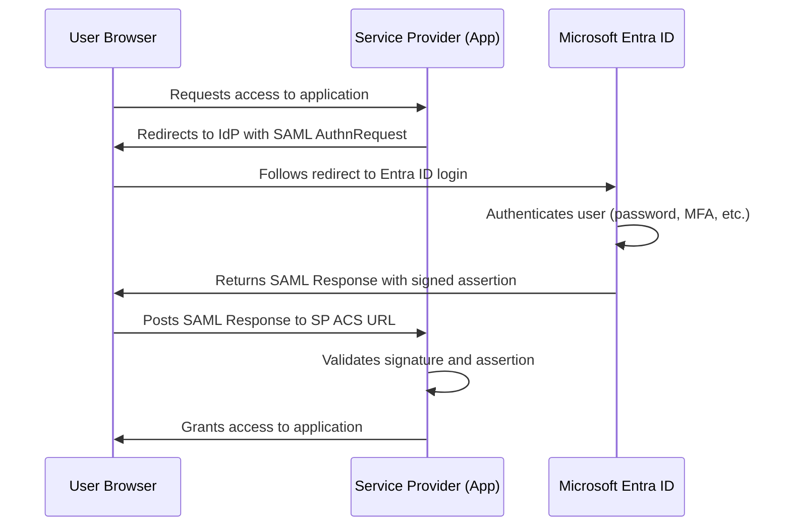

# How to Set Up SAML-Based Single Sign-On for Enterprise Applications in Microsoft Entra ID

Author: [nawazdhandala](https://www.github.com/nawazdhandala)

Tags: Azure, Microsoft Entra ID, SAML, Single Sign-On, SSO, Enterprise Applications, Identity

Description: A complete walkthrough for configuring SAML-based single sign-on in Microsoft Entra ID, from app registration to testing and troubleshooting.

---

Single Sign-On (SSO) is one of those things that sounds simple in principle but can get surprisingly tricky in practice. When you configure SAML-based SSO between Microsoft Entra ID and a third-party application, you are setting up a trust relationship where Entra ID acts as the identity provider (IdP) and the application acts as the service provider (SP). The user authenticates once with Entra ID and then gets seamless access to the application without entering credentials again.

In this guide, I will walk through the entire SAML SSO setup process from start to finish, including the parts that trip most people up.

## How SAML SSO Works

Before jumping into the configuration, it helps to understand the SAML authentication flow. When a user tries to access a SAML-enabled application, here is what happens:



The key pieces of information exchanged are:

- **Entity ID**: A unique identifier for both the IdP and SP
- **ACS URL** (Assertion Consumer Service): Where the SP expects to receive the SAML response
- **SAML Signing Certificate**: Used by the IdP to sign assertions so the SP can verify authenticity
- **Claims/Attributes**: User information (name, email, groups) included in the SAML assertion

## Prerequisites

To set up SAML SSO, you need:

- Microsoft Entra ID P1 or P2 license (or a free tier with limitations)
- Global Administrator, Application Administrator, or Cloud Application Administrator role
- The SAML configuration details from the third-party application (Entity ID, ACS URL, and optionally a Sign-on URL)
- A test user to verify the configuration

## Step 1: Add the Enterprise Application

First, you need to add the application to your Entra ID tenant:

1. Sign in to the Microsoft Entra admin center at entra.microsoft.com.
2. Navigate to Applications, then Enterprise applications.
3. Click New application.
4. Search the gallery for your application. Microsoft has pre-configured SAML templates for thousands of applications like Salesforce, ServiceNow, Slack, and many others.
5. If your application is not in the gallery, click Create your own application and select "Integrate any other application you don't find in the gallery (Non-gallery)".
6. Give the application a name and click Create.

If you found a gallery application, much of the configuration will be pre-filled for you. Non-gallery applications require manual configuration of all SAML parameters.

## Step 2: Configure SAML SSO

Once the application is created:

1. In the application overview, click Single sign-on in the left navigation.
2. Select SAML as the single sign-on method.
3. You will see the SAML configuration page with several sections.

### Basic SAML Configuration

Click Edit on the Basic SAML Configuration section:

- **Identifier (Entity ID)**: Enter the entity ID provided by the application. This is typically a URL like `https://app.example.com/saml/metadata`. You can add multiple identifiers if needed.
- **Reply URL (ACS URL)**: Enter the Assertion Consumer Service URL where Entra ID should send the SAML response. This is usually something like `https://app.example.com/saml/acs`.
- **Sign on URL** (optional): If the application supports SP-initiated SSO, enter the URL where users go to sign in.
- **Relay State** (optional): Some applications use a relay state parameter to redirect users to a specific page after authentication.
- **Logout URL** (optional): Where the user should be redirected after signing out.

Click Save after entering these values.

### Attributes and Claims

This section defines what user information is sent to the application in the SAML assertion. The defaults usually include:

- NameIdentifier (the unique user identifier, typically user.userprincipalname)
- First name
- Last name
- Email address
- Display name

To customize claims:

1. Click Edit on the Attributes and Claims section.
2. Click on any claim to modify it, or click Add new claim.
3. For each claim, specify the name, namespace (if required), and the source attribute from Entra ID.

For example, if your application expects a claim called "email" with the user's email address:

- Name: email
- Namespace: (leave empty or use the app's expected namespace)
- Source: Attribute
- Source attribute: user.mail

Some applications require specific claim formats. For instance, an application might expect group memberships in the SAML assertion. You can add group claims by clicking "Add a group claim" and selecting which groups to include.

### SAML Signing Certificate

This section shows the certificate Entra ID uses to sign SAML assertions. You will need to provide this certificate (or the Federation Metadata XML) to the application:

1. Download the Certificate (Base64) or the Federation Metadata XML.
2. Note the certificate expiration date and set a calendar reminder to rotate it before it expires.
3. Provide the certificate to the application per its documentation.

### Set Up the Application

This section provides the URLs you need to configure in the application:

- **Login URL**: The Entra ID SAML endpoint where the application should send authentication requests
- **Microsoft Entra Identifier**: The Entity ID for Entra ID as the identity provider
- **Logout URL**: The endpoint for single sign-out

Copy these values and configure them in your application's SAML settings.

## Step 3: Configure the Application Side

Every application has its own interface for SAML configuration. Generally, you will need to provide:

- The IdP Entity ID (Microsoft Entra Identifier)
- The IdP SSO URL (Login URL from Entra ID)
- The IdP signing certificate (downloaded in the previous step)
- Optionally, the IdP Single Logout URL

Some applications also accept the Federation Metadata XML, which contains all this information in one file and is the easiest way to configure the trust.

## Step 4: Assign Users and Groups

Users cannot access the application until they are assigned to it:

1. In the enterprise application, click Users and groups.
2. Click Add user/group.
3. Select the users or groups who should have access.
4. If the application supports roles, select the appropriate role.
5. Click Assign.

If you want all users in your tenant to access the application, you can disable the assignment requirement:

1. Go to the application's Properties page.
2. Set Assignment required to No.

However, for most enterprise applications, you want to control access through explicit user and group assignments.

## Step 5: Test the SSO Configuration

Microsoft Entra ID provides a built-in test feature:

1. Go to the Single sign-on page of the application.
2. Scroll down to the Test section.
3. Click Test sign-in.
4. Select a test user.
5. If everything is configured correctly, you will be signed in to the application.

If the test fails, Entra ID provides detailed error information to help you troubleshoot.

## Troubleshooting Common SAML Issues

SAML SSO problems usually fall into a few categories:

### Mismatched Entity IDs

The Entity ID configured in Entra ID must exactly match what the application expects. Even a trailing slash can cause a mismatch. Check both sides carefully.

### Incorrect ACS URL

If the Reply URL in Entra ID does not match the ACS URL the application expects, the authentication will fail. Verify the URL is exact, including the protocol (http vs https) and path.

### Certificate Issues

If the application cannot validate the SAML signature, check that:
- You uploaded the correct certificate to the application
- The certificate has not expired
- The application is configured to use the correct signature algorithm (SHA-256 is recommended)

### NameID Format Mismatch

Some applications require a specific NameID format (email address, persistent, transient, etc.). If the application expects an email but you are sending a UPN, authentication may fail. Adjust the NameIdentifier claim in Entra ID to match what the application expects.

### Clock Skew

SAML assertions have a time window during which they are valid. If the clocks on the IdP and SP are not synchronized, the assertion may be rejected. This is rare with cloud services but can happen with on-premises applications.

For debugging SAML responses, I recommend installing a browser extension like SAML-tracer for Firefox or a SAML decoder for Chrome. These tools let you inspect the raw SAML request and response to see exactly what is being sent.

## Automating SAML Configuration with PowerShell

For organizations managing many SAML applications, automation is essential:

```powershell
# Connect to Microsoft Graph
Connect-MgGraph -Scopes "Application.ReadWrite.All"

# Create a new service principal for a custom SAML application
$params = @{
    DisplayName = "My Custom SAML App"
    # Use a non-gallery application template
    Tags = @("WindowsAzureActiveDirectoryIntegratedApp")
}

$sp = New-MgServicePrincipal @params

# Configure SAML SSO properties
$samlParams = @{
    PreferredSingleSignOnMode = "saml"
    # Set the SAML SSO URL configuration
    SamlSingleSignOnSettings = @{
        RelayState = ""
    }
}

Update-MgServicePrincipal -ServicePrincipalId $sp.Id -BodyParameter $samlParams

Write-Host "Service Principal created with ID: $($sp.Id)"
Write-Host "Configure SAML settings in the portal for detailed claim mapping."
```

## Certificate Rotation Planning

SAML signing certificates expire, and if you do not plan for rotation, SSO will break. Here is a simple process:

1. Set a calendar reminder 60 days before expiration.
2. Generate a new certificate in Entra ID (you can have multiple active certificates).
3. Upload the new certificate to the application.
4. Set the new certificate as active in Entra ID.
5. Remove the old certificate after confirming everything works.

Entra ID lets you have up to three certificates per application, making zero-downtime rotation possible.

## Conclusion

Setting up SAML-based SSO in Microsoft Entra ID is a process that requires attention to detail, especially when it comes to matching Entity IDs, ACS URLs, and claim formats between the identity provider and the service provider. Start with the gallery if your application is listed there, use the built-in test feature to verify your configuration, and always plan for certificate rotation. Once configured properly, SAML SSO provides a seamless and secure authentication experience for your users while giving you centralized control over application access.
