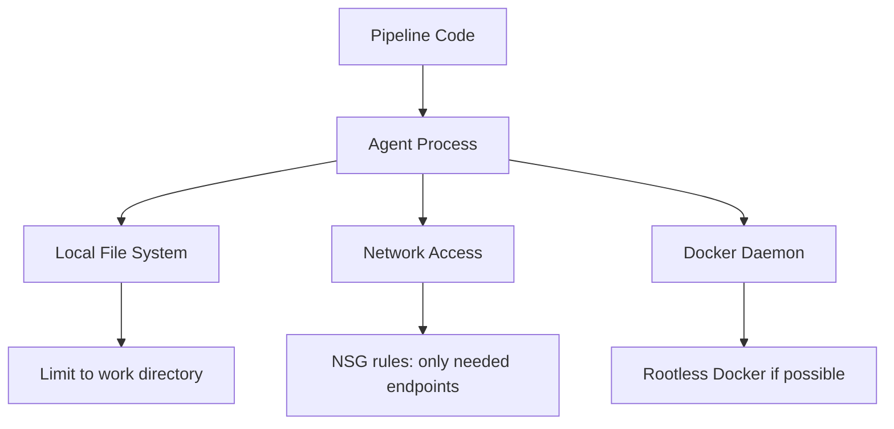

# How to Set Up Self-Hosted Agents in Azure Pipelines on Linux Virtual Machines

Author: [nawazdhandala](https://www.github.com/nawazdhandala)

Tags: Azure Pipelines, Self-Hosted Agents, Linux, CI/CD, Azure DevOps, Build Agents, DevOps

Description: A complete guide to setting up and configuring self-hosted Azure Pipelines agents on Linux VMs for faster and more customizable builds.

---

Microsoft-hosted agents in Azure Pipelines are convenient, but they come with limitations. Each job starts with a fresh VM, meaning you lose all caching between runs. You get a fixed set of pre-installed tools, so if you need something unusual, you have to install it every time. And if you are on the free tier, you get limited parallel jobs with a maximum of 1800 minutes per month.

Self-hosted agents solve these problems. You run them on your own infrastructure, which means persistent caching, custom tooling, access to private networks, and no minute limits. The trade-off is that you are responsible for maintaining the machines, but for many teams that is a worthwhile deal.

In this post, I will walk through setting up a self-hosted agent on an Ubuntu Linux VM, configuring it as a systemd service, and sharing maintenance patterns that keep things running smoothly.

## Prerequisites

You need:

- An Azure DevOps organization and project
- A Linux VM (Ubuntu 20.04 or 22.04 works well) with at least 2 vCPUs and 4 GB RAM
- SSH access to the VM
- A Personal Access Token (PAT) with Agent Pools (read, manage) scope

## Step 1: Create an Agent Pool

In Azure DevOps, go to **Organization Settings > Agent pools**. Click **Add pool**, select **Self-hosted**, and give it a name like `linux-agents`. This pool will hold all your Linux agents.

You can also create the pool at the project level under **Project Settings > Agent pools**, but organization-level pools are more flexible since they can be shared across projects.

## Step 2: Download and Configure the Agent

SSH into your Linux VM and follow these steps.

The following commands download the agent, extract it, and run the configuration.

```bash
# Create a directory for the agent
mkdir -p ~/azagent && cd ~/azagent

# Download the latest agent package (check for current version)
curl -O -L https://vstsagentpackage.azureedge.net/agent/3.232.1/vsts-agent-linux-x64-3.232.1.tar.gz

# Extract the agent
tar zxvf vsts-agent-linux-x64-3.232.1.tar.gz

# Run the configuration script
./config.sh
```

The configuration script will prompt you for several values:

- **Server URL**: `https://dev.azure.com/yourorganization`
- **Authentication type**: PAT (press Enter for default)
- **Personal access token**: Paste your PAT
- **Agent pool**: Enter the name of the pool you created
- **Agent name**: Give it a descriptive name like `linux-agent-01`
- **Work folder**: Press Enter for the default (`_work`)

## Step 3: Install as a systemd Service

Running the agent interactively is fine for testing, but for production you want it running as a service that starts on boot and restarts on failure.

The agent package includes a script for this.

```bash
# Install the agent as a systemd service (run as root)
sudo ./svc.sh install $(whoami)

# Start the service
sudo ./svc.sh start

# Check the status
sudo ./svc.sh status
```

You can verify the service is running with systemctl directly.

```bash
# Check the agent service status
systemctl status vsts.agent.yourorg.linux-agents.linux-agent-01

# View recent logs
journalctl -u vsts.agent.yourorg.linux-agents.linux-agent-01 -n 50
```

## Step 4: Install Build Dependencies

Unlike Microsoft-hosted agents, self-hosted agents start with whatever is on the machine. You need to install the tools your pipelines require.

Here is a script that sets up common build tools on Ubuntu.

```bash
#!/bin/bash
# install-build-tools.sh - Install common CI/CD dependencies

# Update package lists
sudo apt-get update

# Install essential build tools
sudo apt-get install -y \
  build-essential \
  curl \
  wget \
  git \
  zip \
  unzip \
  jq

# Install .NET SDK
wget https://dot.net/v1/dotnet-install.sh -O dotnet-install.sh
chmod +x dotnet-install.sh
./dotnet-install.sh --channel 8.0
echo 'export DOTNET_ROOT=$HOME/.dotnet' >> ~/.bashrc
echo 'export PATH=$PATH:$HOME/.dotnet' >> ~/.bashrc

# Install Node.js via nvm
curl -o- https://raw.githubusercontent.com/nvm-sh/nvm/v0.39.7/install.sh | bash
source ~/.nvm/nvm.sh
nvm install 20
nvm use 20

# Install Docker
curl -fsSL https://get.docker.com | sudo sh
sudo usermod -aG docker $(whoami)

# Install Azure CLI
curl -sL https://aka.ms/InstallAzureCLIDeb | sudo bash

echo "Build tools installation complete."
```

After installing tools, restart the agent service so it picks up the new environment.

```bash
# Restart the agent to pick up new tools
sudo ./svc.sh stop && sudo ./svc.sh start
```

## Step 5: Use the Self-Hosted Agent in Pipelines

To use your self-hosted agent, reference the pool name in your pipeline YAML.

```yaml
# azure-pipelines.yml - Using a self-hosted agent pool
trigger:
  - main

# Use the self-hosted agent pool instead of a Microsoft-hosted image
pool:
  name: 'linux-agents'

steps:
  - script: |
      echo "Running on $(hostname)"
      dotnet --version
      node --version
      docker --version
    displayName: 'Verify tools'

  - task: DotNetCoreCLI@2
    displayName: 'Build'
    inputs:
      command: 'build'
```

You can also use agent capabilities to target specific agents. If you have agents with different tools installed, add capabilities to differentiate them.

## Configuring Agent Capabilities

Capabilities are key-value pairs that describe what an agent can do. Azure Pipelines automatically detects system capabilities (installed software, environment variables), but you can add custom ones.

In Azure DevOps, go to your agent pool, click on the specific agent, and go to the **Capabilities** tab. Under **User capabilities**, add entries like:

- `docker` = `true`
- `gpu` = `nvidia-a100`
- `dotnet-sdk` = `8.0`

Then in your pipeline, you can demand specific capabilities.

```yaml
# Target agents that have Docker and GPU capabilities
pool:
  name: 'linux-agents'
  demands:
    - docker
    - gpu -equals nvidia-a100
```

## Running Multiple Agents on One VM

If your VM has enough resources, you can run multiple agents to handle parallel jobs. Each agent needs its own directory.

```bash
# Set up a second agent
mkdir -p ~/azagent2 && cd ~/azagent2

# Download and extract (same package)
curl -O -L https://vstsagentpackage.azureedge.net/agent/3.232.1/vsts-agent-linux-x64-3.232.1.tar.gz
tar zxvf vsts-agent-linux-x64-3.232.1.tar.gz

# Configure with a different agent name
./config.sh  # Use name like linux-agent-02

# Install as a separate service
sudo ./svc.sh install $(whoami)
sudo ./svc.sh start
```

A good rule of thumb is one agent per 2 vCPUs, assuming typical build workloads. If your builds are CPU-intensive, one agent per VM might be better.

## Keeping Agents Updated

Microsoft releases agent updates regularly. Agents can auto-update if you enable it, but I prefer controlling updates in production.

```bash
# Check the current agent version
cat ~/azagent/.agent | jq '.agentVersion'

# To update manually: stop the service, download new version, reconfigure
sudo ./svc.sh stop
# Download and extract new version
./config.sh --unattended --replace
sudo ./svc.sh start
```

## Cleaning Up Build Artifacts

Self-hosted agents accumulate build artifacts over time. Unlike Microsoft-hosted agents (which start fresh), your agent's work directory grows with every build.

The following cron job cleans up old build data.

```bash
# Add to crontab: clean up work directories older than 7 days
# Run every Sunday at 2 AM
0 2 * * 0 find /home/azureuser/azagent/_work -maxdepth 1 -mindepth 1 -type d -mtime +7 -exec rm -rf {} \;
```

You can also configure workspace cleanup in your pipeline.

```yaml
# Clean the workspace before each build
steps:
  - checkout: self
    clean: true  # Cleans the working directory before checkout
```

## Security Considerations

Self-hosted agents run your pipeline code directly, which means any code in a pipeline has access to whatever the agent's service account can access. Keep these practices in mind:

- Run the agent service as a dedicated user with minimal privileges
- Do not store secrets on the agent machine
- Use network security groups to restrict what the agent can reach
- If the agent is in your corporate network, be deliberate about what internal resources it can access
- Regularly patch the OS and installed tools



## Monitoring Agent Health

A down agent means stuck pipelines. Set up basic monitoring to catch issues before they affect your team.

```bash
# Simple health check script for the agent service
#!/bin/bash
# check-agent-health.sh

SERVICE_NAME="vsts.agent.yourorg.linux-agents.linux-agent-01"

# Check if service is running
if ! systemctl is-active --quiet $SERVICE_NAME; then
  echo "Agent service is not running. Attempting restart..."
  sudo systemctl restart $SERVICE_NAME
  # Send alert (replace with your notification method)
  curl -X POST "https://your-webhook-url" \
    -H "Content-Type: application/json" \
    -d '{"text": "Azure Pipelines agent restarted on linux-agent-01"}'
fi

# Check disk space (alert if less than 10GB free)
FREE_SPACE=$(df -BG / | awk 'NR==2 {print $4}' | tr -d 'G')
if [ "$FREE_SPACE" -lt 10 ]; then
  echo "Low disk space: ${FREE_SPACE}GB remaining"
fi
```

## Wrapping Up

Self-hosted agents give you control over your build environment, faster builds through persistent caching, and access to private networks. The setup takes about 30 minutes per agent, and the ongoing maintenance is minimal if you automate cleanup and updates. Start with one agent to validate your setup, then scale out as your team's build volume grows. The combination of self-hosted agents for heavy workloads and Microsoft-hosted agents for lightweight jobs gives you the best of both worlds.
