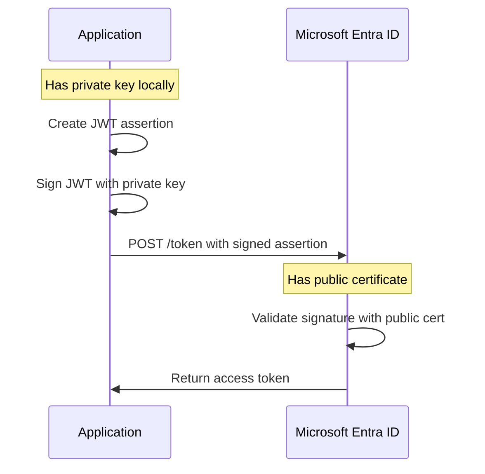

# How to Set Up Service Principal Authentication with Certificate-Based Credentials in Microsoft Entra ID

Author: [nawazdhandala](https://www.github.com/nawazdhandala)

Tags: Service Principal, Certificate Authentication, Microsoft Entra ID, Azure AD, Security, Automation, Identity

Description: Learn how to create a service principal with certificate-based credentials for secure, secret-free authentication to Azure resources.

---

Client secrets are the most common way to authenticate service principals in Microsoft Entra ID, but they have a significant weakness: they are just strings that can be accidentally logged, committed to source control, or leaked through configuration files. Certificate-based authentication eliminates this risk by using asymmetric cryptography. The private key stays on your server and never leaves, while only the public certificate is uploaded to Entra ID.

This guide covers how to generate the certificate, create the service principal, configure the credential, and authenticate from your application code.

## Why Certificates Are Better Than Secrets

Here is the practical difference between the two approaches:

**Client Secret**: Your application sends the secret string to Entra ID during authentication. If someone intercepts that string (through logs, network sniffing, or configuration exposure), they can impersonate your service principal from anywhere.

**Certificate**: Your application signs a JWT assertion with the private key and sends the signed assertion to Entra ID. Entra ID validates the signature using the uploaded public certificate. Even if someone intercepts the signed assertion, they cannot reuse it (it has a short lifetime) and they cannot create new ones without the private key.



## Step 1: Generate a Self-Signed Certificate

For production use, you should use a certificate from a trusted CA or your internal PKI. For development and internal services, a self-signed certificate works fine.

Generate a certificate using OpenSSL.

```bash
# Generate a 2048-bit RSA private key and self-signed certificate
# The certificate is valid for 2 years (730 days)
openssl req -x509 \
  -newkey rsa:2048 \
  -keyout service-principal.key \
  -out service-principal.crt \
  -days 730 \
  -nodes \
  -subj "/CN=contoso-automation-sp/O=Contoso/C=US"

# Create a PFX file that contains both the private key and certificate
# Some libraries and platforms require PFX format
openssl pkcs12 -export \
  -out service-principal.pfx \
  -inkey service-principal.key \
  -in service-principal.crt \
  -passout pass:YourPfxPassword
```

Alternatively, you can generate the certificate using PowerShell on Windows.

```powershell
# Generate a self-signed certificate using PowerShell
# Stores it in the local machine certificate store
$cert = New-SelfSignedCertificate `
  -Subject "CN=contoso-automation-sp" `
  -CertStoreLocation "Cert:\CurrentUser\My" `
  -KeyExportPolicy Exportable `
  -KeySpec Signature `
  -KeyLength 2048 `
  -KeyAlgorithm RSA `
  -HashAlgorithm SHA256 `
  -NotAfter (Get-Date).AddYears(2)

# Export the public certificate (CER format) for uploading to Entra ID
Export-Certificate `
  -Cert $cert `
  -FilePath ".\service-principal.cer" `
  -Type CERT

# Export the PFX with private key for your application
Export-PfxCertificate `
  -Cert $cert `
  -FilePath ".\service-principal.pfx" `
  -Password (ConvertTo-SecureString -String "YourPfxPassword" -Force -AsPlainText)

# Display the certificate thumbprint (you will need this later)
Write-Host "Thumbprint: $($cert.Thumbprint)"
```

## Step 2: Create the Service Principal and Upload the Certificate

Create an app registration in Entra ID and associate the certificate.

```bash
# Create the app registration with the certificate
az ad app create \
  --display-name "contoso-automation-sp" \
  --key-type AsymmetricX509Cert \
  --key-usage Verify \
  --key-value "$(cat service-principal.crt | grep -v '-----' | tr -d '\n')"

# Get the app ID from the output
APP_ID=$(az ad app list --display-name "contoso-automation-sp" --query '[0].appId' -o tsv)

# Create the service principal for the app registration
az ad sp create --id $APP_ID
```

You can also upload the certificate through the Azure portal:

1. Navigate to Microsoft Entra ID > App registrations
2. Select your application
3. Go to Certificates & secrets > Certificates
4. Click Upload certificate
5. Select the `.crt` or `.cer` file
6. Click Add

The portal shows the certificate thumbprint, start date, and expiration date. Make note of the thumbprint - some authentication libraries use it to identify which certificate to use.

## Step 3: Assign RBAC Roles

The service principal needs permissions to access Azure resources. Assign the appropriate RBAC roles.

```bash
# Get the service principal object ID
SP_OBJECT_ID=$(az ad sp list --display-name "contoso-automation-sp" --query '[0].id' -o tsv)

# Assign Contributor role on a specific resource group
az role assignment create \
  --assignee-object-id $SP_OBJECT_ID \
  --assignee-principal-type ServicePrincipal \
  --role "Contributor" \
  --scope "/subscriptions/YOUR_SUB/resourceGroups/automation-rg"

# For more restrictive access, use a custom role or built-in specific role
az role assignment create \
  --assignee-object-id $SP_OBJECT_ID \
  --assignee-principal-type ServicePrincipal \
  --role "Key Vault Secrets User" \
  --scope "/subscriptions/YOUR_SUB/resourceGroups/automation-rg/providers/Microsoft.KeyVault/vaults/my-vault"
```

Follow the principle of least privilege. If your automation only reads secrets from Key Vault, assign "Key Vault Secrets User" instead of "Contributor."

## Step 4: Authenticate Using the Certificate in Python

Here is how to authenticate with the certificate in a Python application using the Azure Identity library.

```python
# Python authentication using certificate-based credentials
from azure.identity import CertificateCredential
from azure.keyvault.secrets import SecretClient

# Authentication parameters
tenant_id = "your-tenant-id"
client_id = "your-app-client-id"
cert_path = "/path/to/service-principal.pem"  # PEM file with private key

# Create the credential using the certificate
# The PEM file should contain both the private key and the certificate
credential = CertificateCredential(
    tenant_id=tenant_id,
    client_id=client_id,
    certificate_path=cert_path
)

# Use the credential to access Azure resources
vault_url = "https://my-vault.vault.azure.net"
secret_client = SecretClient(vault_url=vault_url, credential=credential)

# Retrieve a secret from Key Vault
secret = secret_client.get_secret("my-secret")
print(f"Secret value retrieved successfully: {secret.name}")
```

If your certificate is in PFX format with a password, use the `password` parameter.

```python
# Authentication with a PFX certificate that has a password
credential = CertificateCredential(
    tenant_id=tenant_id,
    client_id=client_id,
    certificate_path="/path/to/service-principal.pfx",
    password="YourPfxPassword"  # PFX password
)
```

## Step 5: Authenticate Using the Certificate in .NET

For .NET applications, the `Azure.Identity` package provides the same functionality.

```csharp
// .NET authentication using certificate-based credentials
using Azure.Identity;
using Azure.Security.KeyVault.Secrets;

// Load the certificate from the file system
var credential = new ClientCertificateCredential(
    tenantId: "your-tenant-id",
    clientId: "your-app-client-id",
    clientCertificatePath: "/path/to/service-principal.pfx",
    new ClientCertificateCredentialOptions
    {
        // Send the certificate chain for better compatibility
        SendCertificateChain = true
    }
);

// Use the credential to access Key Vault
var client = new SecretClient(
    new Uri("https://my-vault.vault.azure.net"),
    credential
);

// Retrieve a secret
KeyVaultSecret secret = await client.GetSecretAsync("my-secret");
Console.WriteLine($"Retrieved secret: {secret.Name}");
```

You can also load the certificate from the Windows certificate store by thumbprint.

```csharp
// Load certificate from the Windows certificate store using thumbprint
using System.Security.Cryptography.X509Certificates;

var store = new X509Store(StoreLocation.CurrentUser);
store.Open(OpenFlags.ReadOnly);
var certs = store.Certificates.Find(
    X509FindType.FindByThumbprint,
    "YOUR_CERT_THUMBPRINT",
    validOnly: false
);
store.Close();

var credential = new ClientCertificateCredential(
    tenantId: "your-tenant-id",
    clientId: "your-app-client-id",
    certificate: certs[0]
);
```

## Step 6: Authenticate Using the Certificate in Azure CLI

The Azure CLI also supports certificate-based service principal authentication.

```bash
# Login with a service principal using a PEM certificate
az login --service-principal \
  --username "your-app-client-id" \
  --tenant "your-tenant-id" \
  --password /path/to/service-principal.pem

# Verify the login
az account show --query '{subscription: name, user: user.name}'
```

Note that the `--password` parameter is confusingly named here - it takes the path to the PEM file, not a password string.

## Step 7: Rotate Certificates Before Expiration

Certificate rotation is critical. If your certificate expires and you have not uploaded a new one, your automation breaks. Here is a rotation strategy:

1. Generate a new certificate at least 30 days before the old one expires
2. Upload the new certificate to the app registration (you can have multiple certificates active simultaneously)
3. Update your application to use the new certificate
4. Test the new certificate in a non-production environment
5. Remove the old certificate from the app registration after confirming the new one works

```bash
# Upload a new certificate while keeping the old one active
az ad app credential reset \
  --id $APP_ID \
  --cert @new-service-principal.crt \
  --append

# List all certificates on the app registration
az ad app credential list --id $APP_ID --cert --query '[].{keyId: keyId, endDate: endDateTime}'

# Remove the old certificate after successful rotation
az ad app credential delete --id $APP_ID --key-id "old-key-id"
```

## Storing the Private Key Securely

The private key is the crown jewel. Here are some options for secure storage:

- **Azure Key Vault**: Store the PFX in Key Vault as a certificate and retrieve it at runtime
- **Windows Certificate Store**: Import the PFX into the machine certificate store (used by .NET apps)
- **Kubernetes Secrets**: Mount the certificate as a volume in your pod
- **Azure Managed Identity**: If your workload runs on Azure, consider using Managed Identity instead of service principals entirely

For Azure-hosted workloads, Managed Identity is almost always the better choice since it eliminates credential management altogether. Service principal certificates are most valuable for on-premises applications, CI/CD pipelines, and cross-cloud scenarios where Managed Identity is not available.

## Wrapping Up

Certificate-based authentication for service principals is more secure than client secrets and should be the default choice for production workloads. The initial setup takes a bit more effort, but the security benefits - no secret strings to leak, no credentials in config files, stronger cryptographic authentication - are well worth it. Generate a certificate, upload the public portion to Entra ID, configure your application to sign assertions with the private key, and set up a rotation schedule so you never get caught with an expired certificate.
