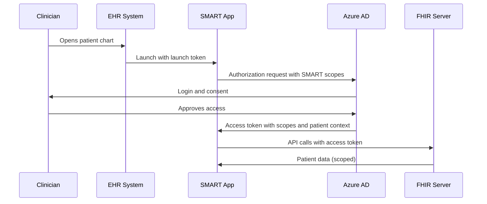

# How to Set Up SMART on FHIR Authentication for Clinical Applications in Azure Health Data Services

Author: [nawazdhandala](https://www.github.com/nawazdhandala)

Tags: SMART on FHIR, Azure Health Data Services, Healthcare, OAuth2, Authentication, Clinical Apps, FHIR

Description: Learn how to configure SMART on FHIR authentication in Azure Health Data Services so clinical applications can securely access patient data with proper authorization scopes.

---

SMART on FHIR is the standard framework for launching clinical applications from within electronic health records (EHRs) and accessing patient data with appropriate authorization. It builds on OAuth 2.0 and OpenID Connect, adding healthcare-specific scopes and launch context. When a clinician opens an app from their EHR, SMART handles the authentication, determines which patient is in context, and limits the app's access to only the data it needs. Azure Health Data Services supports SMART on FHIR, and this guide shows how to configure it.

## What SMART on FHIR Adds to OAuth 2.0

Standard OAuth 2.0 handles authentication and authorization. SMART on FHIR extends it with:

- **Launch context**: When an app is launched from an EHR, it receives the current patient ID and encounter ID, so it knows which patient the clinician is working with.
- **Clinical scopes**: Instead of generic read/write permissions, SMART defines scopes like `patient/Observation.read` or `user/MedicationRequest.write` that limit access to specific FHIR resource types.
- **Standalone and EHR launch flows**: Apps can be launched from within an EHR (EHR launch) or independently (standalone launch).



## Prerequisites

- Azure Health Data Services workspace with a FHIR service
- Azure AD tenant
- Understanding of OAuth 2.0 authorization code flow
- A SMART on FHIR client application (we will create a simple one)

## Step 1: Register the SMART Application in Azure AD

Each SMART on FHIR application needs an Azure AD app registration:

```bash
# Register the SMART app in Azure AD
SMART_APP_NAME="clinical-dashboard"
REDIRECT_URI="https://myapp.example.com/callback"

# Create the app registration with the redirect URI
APP_ID=$(az ad app create \
    --display-name $SMART_APP_NAME \
    --web-redirect-uris $REDIRECT_URI \
    --sign-in-audience AzureADMyOrg \
    --query appId -o tsv)

# Create a client secret
CLIENT_SECRET=$(az ad app credential reset \
    --id $APP_ID \
    --display-name "smart-secret" \
    --query password -o tsv)

echo "Client ID: $APP_ID"
echo "Client Secret: $CLIENT_SECRET"
```

## Step 2: Configure API Permissions

The app needs permission to access the FHIR API. In Azure AD, this is configured through API permissions:

```bash
# Get the FHIR service's Application ID URI
FHIR_URL="https://healthworkspace01-fhir-clinical.fhir.azurehealthcareapis.com"

# Add API permission for the FHIR service
# The FHIR server's API scope is typically "user_impersonation"
az ad app permission add \
    --id $APP_ID \
    --api "4f6778d8-5aef-43dc-a1ff-b073724b9495" \
    --api-permissions "311a71cc-e848-46a1-bdf8-97ff7156d8e6=Scope"

# Grant admin consent
az ad app permission admin-consent --id $APP_ID
```

## Step 3: Configure SMART on FHIR on the FHIR Service

Azure Health Data Services supports SMART on FHIR through its authentication configuration. You need to set up the SMART configuration properties:

```bash
# Update the FHIR service with SMART configuration
RESOURCE_GROUP="rg-health-data"
WORKSPACE_NAME="healthworkspace01"
FHIR_SERVICE="fhir-clinical"

# Enable SMART on FHIR by configuring the authority and audience
az healthcareapis fhir-service update \
    --name $FHIR_SERVICE \
    --workspace-name $WORKSPACE_NAME \
    --resource-group $RESOURCE_GROUP \
    --smart-proxy-enabled true
```

## Step 4: Set Up the SMART Well-Known Configuration

SMART on FHIR clients discover server capabilities through a well-known endpoint. The FHIR server should expose `.well-known/smart-configuration`:

```bash
# Verify the SMART configuration endpoint
curl -s "${FHIR_URL}/.well-known/smart-configuration" | jq .
```

The response should include:

```json
{
    "authorization_endpoint": "https://login.microsoftonline.com/<tenant-id>/oauth2/v2.0/authorize",
    "token_endpoint": "https://login.microsoftonline.com/<tenant-id>/oauth2/v2.0/token",
    "capabilities": [
        "launch-ehr",
        "launch-standalone",
        "client-public",
        "client-confidential-symmetric",
        "context-ehr-patient",
        "sso-openid-connect",
        "permission-offline",
        "permission-patient",
        "permission-user"
    ],
    "scopes_supported": [
        "openid",
        "profile",
        "launch",
        "launch/patient",
        "patient/*.read",
        "user/*.read",
        "offline_access"
    ]
}
```

## Step 5: Implement the Standalone Launch Flow

Here is a Python Flask application that implements the SMART on FHIR standalone launch:

```python
# app.py - SMART on FHIR standalone launch implementation
from flask import Flask, redirect, request, session, jsonify
import requests
import secrets

app = Flask(__name__)
app.secret_key = secrets.token_hex(32)

# Configuration
FHIR_URL = "https://healthworkspace01-fhir-clinical.fhir.azurehealthcareapis.com"
CLIENT_ID = "<your-client-id>"
CLIENT_SECRET = "<your-client-secret>"
REDIRECT_URI = "https://myapp.example.com/callback"
TENANT_ID = "<your-tenant-id>"

# Azure AD endpoints
AUTH_URL = f"https://login.microsoftonline.com/{TENANT_ID}/oauth2/v2.0/authorize"
TOKEN_URL = f"https://login.microsoftonline.com/{TENANT_ID}/oauth2/v2.0/token"


@app.route("/launch")
def launch():
    """Initiate the SMART on FHIR standalone launch."""
    # Generate a state parameter to prevent CSRF attacks
    state = secrets.token_urlsafe(32)
    session["state"] = state

    # Build the authorization URL with SMART scopes
    # patient/*.read gives read access to all resource types for the selected patient
    params = {
        "response_type": "code",
        "client_id": CLIENT_ID,
        "redirect_uri": REDIRECT_URI,
        "scope": f"openid profile launch/patient patient/*.read offline_access {FHIR_URL}/.default",
        "state": state,
        "aud": FHIR_URL,
    }

    # Redirect the user to Azure AD for authentication
    auth_redirect = f"{AUTH_URL}?{'&'.join(f'{k}={v}' for k, v in params.items())}"
    return redirect(auth_redirect)


@app.route("/callback")
def callback():
    """Handle the OAuth callback after user authentication."""
    # Verify the state parameter
    if request.args.get("state") != session.get("state"):
        return "Invalid state parameter", 400

    # Exchange the authorization code for tokens
    code = request.args.get("code")

    token_response = requests.post(TOKEN_URL, data={
        "grant_type": "authorization_code",
        "code": code,
        "redirect_uri": REDIRECT_URI,
        "client_id": CLIENT_ID,
        "client_secret": CLIENT_SECRET,
        "scope": f"{FHIR_URL}/.default",
    })

    tokens = token_response.json()

    # Store the access token in the session
    session["access_token"] = tokens["access_token"]

    # The token response may include the patient context
    session["patient_id"] = tokens.get("patient")

    return redirect("/dashboard")


@app.route("/dashboard")
def dashboard():
    """Display patient data using the FHIR API."""
    access_token = session.get("access_token")
    patient_id = session.get("patient_id")

    if not access_token:
        return redirect("/launch")

    # Fetch patient data from the FHIR server
    headers = {"Authorization": f"Bearer {access_token}"}

    # Get the patient resource
    patient = requests.get(
        f"{FHIR_URL}/Patient/{patient_id}",
        headers=headers
    ).json()

    # Get recent observations for the patient
    observations = requests.get(
        f"{FHIR_URL}/Observation?subject=Patient/{patient_id}&_sort=-date&_count=10",
        headers=headers
    ).json()

    return jsonify({
        "patient": {
            "name": patient.get("name", [{}])[0].get("family", "Unknown"),
            "birthDate": patient.get("birthDate"),
            "gender": patient.get("gender"),
        },
        "recentObservations": [
            {
                "code": entry["resource"]["code"]["coding"][0]["display"],
                "value": entry["resource"].get("valueQuantity", {}).get("value"),
                "date": entry["resource"].get("effectiveDateTime"),
            }
            for entry in observations.get("entry", [])
        ]
    })
```

## Step 6: Implement the EHR Launch Flow

The EHR launch flow is slightly different. The EHR passes a `launch` parameter when it opens your app:

```python
# ehr_launch.py - EHR launch flow handler
@app.route("/ehr-launch")
def ehr_launch():
    """Handle an EHR-initiated launch.
    The EHR sends a launch parameter and the FHIR server URL.
    """
    # The EHR provides the launch token and FHIR server URL
    launch_token = request.args.get("launch")
    iss = request.args.get("iss")  # FHIR server URL

    if not launch_token or not iss:
        return "Missing launch parameters", 400

    # Store the launch context
    session["launch_token"] = launch_token
    session["fhir_url"] = iss

    # Generate state
    state = secrets.token_urlsafe(32)
    session["state"] = state

    # Include the launch token in the authorization request
    params = {
        "response_type": "code",
        "client_id": CLIENT_ID,
        "redirect_uri": REDIRECT_URI,
        "scope": f"openid profile launch patient/*.read {iss}/.default",
        "state": state,
        "aud": iss,
        "launch": launch_token,  # This ties the auth to the EHR context
    }

    auth_redirect = f"{AUTH_URL}?{'&'.join(f'{k}={v}' for k, v in params.items())}"
    return redirect(auth_redirect)
```

The key difference is the `launch` parameter in the authorization request. This tells the authorization server to include the patient context (and optionally encounter context) in the token response, based on the patient the clinician currently has open in the EHR.

## Step 7: Configure Scope-Based Access Control

SMART scopes control what data the app can access. Azure Health Data Services can enforce these scopes to restrict API access:

- `patient/Patient.read` - Read access to Patient resources only
- `patient/Observation.read` - Read access to Observations only
- `patient/*.read` - Read access to all resource types for the patient in context
- `user/MedicationRequest.write` - Write access to MedicationRequests for any patient the user can access
- `launch/patient` - Request patient context during launch

Configure your app registration to request only the scopes it needs. Requesting broad scopes when you only need specific ones is a security concern and will raise red flags during app review.

## Testing with a SMART Launcher

During development, use the SMART Launcher tool to simulate EHR launches without needing an actual EHR:

```bash
# The SMART Launcher is available at:
# https://launch.smarthealthit.org

# Configure it with:
# - FHIR Server URL: your Azure FHIR endpoint
# - App Launch URL: your app's /ehr-launch endpoint
# - Client ID: your Azure AD app registration client ID
```

This tool simulates the EHR context and lets you test the full SMART launch flow without needing access to a real EHR system. It is invaluable during development and debugging.

## Security Considerations

When implementing SMART on FHIR:

- Always validate the `state` parameter to prevent CSRF attacks
- Store tokens securely (encrypted session cookies or server-side session stores)
- Use PKCE (Proof Key for Code Exchange) for public clients (single-page apps)
- Refresh tokens should be stored server-side, never in browser localStorage
- Validate the token audience matches your FHIR server URL
- Log all FHIR API access for audit purposes (required by HIPAA)

## Summary

SMART on FHIR in Azure Health Data Services enables clinical applications to securely access patient data with proper authorization. The setup involves registering your app in Azure AD, configuring SMART capabilities on the FHIR service, and implementing either the standalone or EHR launch flow in your application. The key healthcare-specific additions over standard OAuth 2.0 are launch context (knowing which patient is selected) and clinical scopes (limiting access to specific resource types). With this foundation, you can build clinical decision support tools, patient portals, and care coordination apps that integrate with any SMART-enabled EHR.
