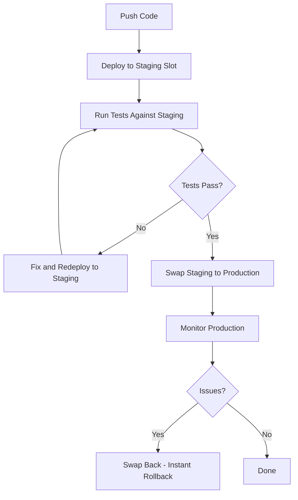

# How to Set Up Staging Environments and Swap Slots in Azure App Service

Author: [nawazdhandala](https://www.github.com/nawazdhandala)

Tags: Azure, App Service, Deployment Slots, Staging, Blue-Green Deployment, DevOps, Cloud Computing

Description: How to create and manage deployment slots in Azure App Service for zero-downtime deployments and safe staging-to-production swaps.

---

Deploying directly to production is nerve-wracking. One bad deployment and your users see errors until you roll back. Azure App Service deployment slots solve this by giving you separate environments that you can deploy to, test, and then swap into production with near-zero downtime.

This post covers how to set up deployment slots, configure them properly, perform swaps, and handle the quirks that come with slot-based deployments.

## What Are Deployment Slots?

Deployment slots are live instances of your App Service with their own hostnames, configurations, and content. Every App Service has a production slot by default. You can add additional slots like "staging," "testing," or "canary."

Each slot gets its own URL in the format `https://your-app-staging.azurewebsites.net`. You deploy your new code to the staging slot, verify it works, then swap it with production. The swap is fast because it just changes the routing - it does not redeploy anything.

Deployment slots are available on Standard tier and above. The number of available slots depends on your plan:

- Standard: 5 slots
- Premium: 20 slots
- Isolated: 20 slots

## Creating a Deployment Slot

### Through the Azure Portal

1. Go to your App Service
2. Click "Deployment slots" in the left menu
3. Click "Add Slot"
4. Give it a name (e.g., "staging")
5. Optionally clone settings from an existing slot
6. Click Add

### Through Azure CLI

```bash
# Create a staging deployment slot
az webapp deployment slot create \
    --name my-app-service \
    --resource-group my-resource-group \
    --slot staging

# Create a slot and clone configuration from production
az webapp deployment slot create \
    --name my-app-service \
    --resource-group my-resource-group \
    --slot staging \
    --configuration-source my-app-service
```

## Configuring Slot-Specific Settings

This is where things get interesting. Some settings should swap with the code (like feature flags), while others should stay with the slot (like database connection strings that point to different databases).

### Slot-Sticky Settings

Settings marked as "slot settings" (also called sticky settings) stay with the slot and do not swap. Common examples:

- Database connection strings (staging points to staging DB, production points to production DB)
- Application Insights keys (different instances for different environments)
- Feature flags for environment-specific behavior

```bash
# Set an app setting that is sticky to the slot
az webapp config appsettings set \
    --name my-app-service \
    --resource-group my-resource-group \
    --slot staging \
    --slot-settings \
        DATABASE_URL="Server=staging-db.database.windows.net;Database=staging" \
        APPINSIGHTS_KEY="staging-key-here" \
        ENVIRONMENT_NAME="staging"
```

The `--slot-settings` flag (note the plural) marks these as slot-sticky. If you use `--settings` instead, they will swap with the code.

### Settings That Should Swap

Application settings that are part of your deployment (like feature flags, API versions, or build numbers) should not be sticky. They will naturally follow the code when you swap:

```bash
# These settings will swap with the code
az webapp config appsettings set \
    --name my-app-service \
    --resource-group my-resource-group \
    --slot staging \
    --settings \
        FEATURE_NEW_UI=true \
        API_VERSION=v2 \
        BUILD_NUMBER=1234
```

## Deploying to a Slot

Deploy to a slot exactly as you would deploy to the main app, but specify the slot name:

```bash
# Deploy a ZIP package to the staging slot
az webapp deployment source config-zip \
    --name my-app-service \
    --resource-group my-resource-group \
    --slot staging \
    --src app.zip

# Or deploy a Docker container to the staging slot
az webapp config container set \
    --name my-app-service \
    --resource-group my-resource-group \
    --slot staging \
    --container-image-name myregistry.azurecr.io/myapp:v2
```

## Performing a Swap

Once your staging slot is tested and ready, swap it to production:

### Simple Swap

```bash
# Swap staging to production
az webapp deployment slot swap \
    --name my-app-service \
    --resource-group my-resource-group \
    --slot staging \
    --target-slot production
```

This completes in seconds. What actually happens during a swap:

1. Azure applies the production slot's sticky settings to the staging slot and restarts it
2. Azure waits for the staging slot to finish warming up (responding to HTTP requests)
3. Azure swaps the routing rules so traffic goes to what was the staging instance
4. The old production instance now becomes the staging slot

### Swap with Preview (Multi-Phase Swap)

For extra safety, you can do a swap with preview. This applies the target slot's settings to the source slot without completing the swap, letting you verify that your app works with production settings:

```bash
# Phase 1: Apply production settings to staging without swapping
az webapp deployment slot swap \
    --name my-app-service \
    --resource-group my-resource-group \
    --slot staging \
    --target-slot production \
    --action preview

# Test the staging slot with production settings
# Visit https://my-app-service-staging.azurewebsites.net

# Phase 2: Complete the swap if everything looks good
az webapp deployment slot swap \
    --name my-app-service \
    --resource-group my-resource-group \
    --slot staging \
    --target-slot production

# Or cancel if something is wrong
az webapp deployment slot swap \
    --name my-app-service \
    --resource-group my-resource-group \
    --slot staging \
    --target-slot production \
    --action reset
```

## Rolling Back

If something goes wrong after a swap, rolling back is just another swap. Since the old production code is now in the staging slot, swap them back:

```bash
# Rollback - swap production back to staging
az webapp deployment slot swap \
    --name my-app-service \
    --resource-group my-resource-group \
    --slot staging \
    --target-slot production
```

This is one of the biggest advantages of deployment slots. Rollbacks are instant and do not require a new deployment.

## Traffic Routing

You can also use slots to gradually route traffic to a new version before doing a full swap. This is sometimes called canary deployment:

```bash
# Route 10% of production traffic to the staging slot
az webapp traffic-routing set \
    --name my-app-service \
    --resource-group my-resource-group \
    --distribution staging=10

# Increase to 25%
az webapp traffic-routing set \
    --name my-app-service \
    --resource-group my-resource-group \
    --distribution staging=25

# Clear traffic routing (all traffic goes to production)
az webapp traffic-routing clear \
    --name my-app-service \
    --resource-group my-resource-group
```

Users are assigned to a slot using a cookie (`x-ms-routing-name`), so they get a consistent experience. Once a user is routed to staging, they stay on staging for the duration of their session.

## The Deployment Flow

Here is the typical flow for using deployment slots:



## Common Gotchas

### Warming Up After Swap

After a swap, the first requests to the new production instance might be slow because the application needs to warm up caches, JIT compile, and establish connections. To mitigate this, configure your application to warm up during the swap:

Add a `applicationInitialization` section to your `web.config` (Windows) to specify URLs that Azure should hit before completing the swap:

```xml
<system.webServer>
    <applicationInitialization>
        <add initializationPage="/api/health" />
        <add initializationPage="/api/warmup" />
    </applicationInitialization>
</system.webServer>
```

### Connection String Confusion

If you forget to mark a database connection string as slot-sticky, your staging slot might suddenly point to the production database after a swap. Always double-check which settings are sticky.

### Slot-Specific Custom Domains

Custom domains are not slot-sticky by default. If you have a custom domain on production, it stays on production after a swap (which is what you want).

## Summary

Deployment slots are one of the best features of Azure App Service. They give you safe, zero-downtime deployments with instant rollback capability. The key is getting your slot-sticky settings right so that environment-specific configuration stays with the right slot. Start with a single staging slot, get comfortable with the swap workflow, and then explore traffic routing for canary deployments when you are ready.
