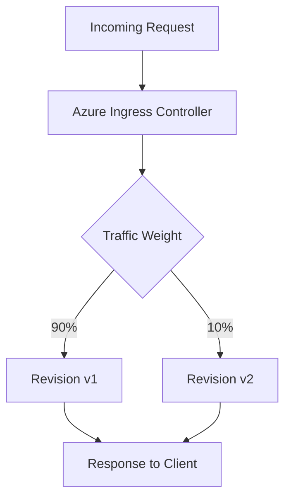

# How to Set Up Traffic Splitting Between Revisions in Azure Container Apps

Author: [nawazdhandala](https://www.github.com/nawazdhandala)

Tags: Azure, Container Apps, Traffic Splitting, Blue-Green, Canary, Deployments, DevOps

Description: Learn how to configure traffic splitting between multiple revisions in Azure Container Apps for canary deployments and gradual rollouts.

---

Traffic splitting is one of the most practical features of Azure Container Apps. It lets you route a percentage of incoming traffic to different revisions of your application, which is exactly what you need for canary deployments, A/B testing, or gradual rollouts. Instead of deploying a new version and hoping for the best, you can send 10% of traffic to the new version, watch the metrics, and then gradually increase the percentage. This post walks through how to set it up.

## Understanding Revisions

Every time you update a container app's template (changing the image, environment variables, or scale rules), Azure Container Apps creates a new revision. A revision is an immutable snapshot of your app at a point in time. By default, Azure Container Apps runs in single-revision mode, which means all traffic goes to the latest revision and old ones are deactivated.

To use traffic splitting, you need to switch to multi-revision mode.

## Step 1: Enable Multi-Revision Mode

You can set the revision mode when creating the app or update it later.

```bash
# Create a container app in multiple revision mode
az containerapp create \
  --name my-api \
  --resource-group my-rg \
  --environment my-env \
  --image myregistry.azurecr.io/my-api:v1 \
  --target-port 8080 \
  --ingress external \
  --revision-mode multiple

# Or update an existing app to multiple revision mode
az containerapp revision set-mode \
  --name my-api \
  --resource-group my-rg \
  --mode multiple
```

Once multi-revision mode is enabled, old revisions will remain active instead of being automatically deactivated when a new one is deployed.

## Step 2: Deploy a New Revision

Deploy an updated version of your application. You can do this with a suffix to make revisions easier to identify.

```bash
# Deploy a new revision with a custom suffix
az containerapp update \
  --name my-api \
  --resource-group my-rg \
  --image myregistry.azurecr.io/my-api:v2 \
  --revision-suffix v2
```

This creates a new revision called `my-api--v2`. The previous revision (let's say `my-api--v1`) is still running.

## Step 3: List Active Revisions

Check which revisions are currently active and how traffic is distributed.

```bash
# List all revisions for the container app
az containerapp revision list \
  --name my-api \
  --resource-group my-rg \
  --output table
```

You should see both revisions listed, with their status and traffic weight.

## Step 4: Configure Traffic Splitting

Now split traffic between the two revisions. Start by sending 90% to the stable version and 10% to the new one.

```bash
# Split traffic: 90% to v1, 10% to v2
az containerapp ingress traffic set \
  --name my-api \
  --resource-group my-rg \
  --revision-weight my-api--v1=90 my-api--v2=10
```

The traffic weights must add up to 100. After running this command, approximately 10% of all incoming requests will be routed to the v2 revision.

## Step 5: Gradually Increase Traffic

If the new revision looks healthy (no errors, acceptable latency), increase the traffic percentage.

```bash
# Shift more traffic to v2
az containerapp ingress traffic set \
  --name my-api \
  --resource-group my-rg \
  --revision-weight my-api--v1=50 my-api--v2=50
```

Then, when you are confident, send all traffic to v2.

```bash
# Route all traffic to v2
az containerapp ingress traffic set \
  --name my-api \
  --resource-group my-rg \
  --revision-weight my-api--v2=100
```

## Step 6: Use the Latest Revision Label

If you want to always send a percentage of traffic to whatever the latest revision is, use the `latest` label instead of a specific revision name.

```bash
# Send 80% to a specific revision, 20% to latest
az containerapp ingress traffic set \
  --name my-api \
  --resource-group my-rg \
  --revision-weight my-api--v1=80 latest=20
```

This is useful for continuous deployment pipelines where new revisions are created automatically. The `latest` label always points to the most recently deployed revision.

## Step 7: Access Specific Revisions Directly

Each revision gets its own unique URL, even if it receives 0% of the main traffic. This is useful for testing a revision before sending real traffic to it.

The revision-specific URL looks like this:

```
https://my-api--v2.happyocean-abc123.eastus.azurecontainerapps.io
```

You can use this URL to run smoke tests against the new revision without affecting production users.

## Traffic Splitting Flow

Here is a visual representation of how traffic splitting works.



## Real-World Deployment Strategy

Here is a deployment strategy I have used in production that works well.

**Phase 1 - Deploy and test internally:** Deploy the new revision with 0% traffic. Use the revision-specific URL to run integration tests and manual verification.

**Phase 2 - Canary release:** Route 5% of traffic to the new revision. Monitor error rates, latency percentiles, and business metrics for at least 30 minutes.

**Phase 3 - Gradual rollout:** If metrics look good, increase to 25%, then 50%, then 100% over the next hour or two.

**Phase 4 - Cleanup:** Once all traffic is on the new revision, deactivate the old one.

```bash
# Deactivate the old revision to stop it from consuming resources
az containerapp revision deactivate \
  --name my-api \
  --resource-group my-rg \
  --revision my-api--v1
```

## Implementing a Rollback

If the new revision has issues, rolling back is instant. Just shift all traffic back to the old revision.

```bash
# Instant rollback to v1
az containerapp ingress traffic set \
  --name my-api \
  --resource-group my-rg \
  --revision-weight my-api--v1=100
```

This takes effect immediately because both revisions are still running. No new deployment is needed.

## Monitoring Traffic Split Performance

Use Azure Monitor and Log Analytics to compare the performance of each revision.

```kusto
// Compare error rates between revisions
ContainerAppConsoleLogs_CL
| where ContainerAppName_s == "my-api"
| summarize ErrorCount = countif(Log_s contains "error") by RevisionName_s, bin(TimeGenerated, 5m)
| render timechart
```

You can also check the revision-level metrics in the Azure Portal under the Metrics blade, where you can filter by revision name.

## Tips for Production Use

Keep these things in mind when using traffic splitting:

1. **Session affinity is not guaranteed.** By default, consecutive requests from the same client may hit different revisions. If your app depends on sticky sessions, you need to handle this at the application level.

2. **Database migrations require care.** Both revisions share the same backend resources. Make sure database schema changes are backward-compatible so both revisions can work with the same database.

3. **Keep old revisions active during rollout.** Do not deactivate the old revision until you are fully committed to the new one. An active old revision costs nothing if it receives no traffic and scales to zero.

4. **Automate with CI/CD.** Use GitHub Actions or Azure DevOps to automate the traffic shifting. You can build pipelines that deploy a new revision, wait for health checks, and then gradually shift traffic.

## Summary

Traffic splitting in Azure Container Apps gives you a safe and controlled way to roll out changes. By keeping multiple revisions active and gradually shifting traffic, you reduce the risk of deploying bad code to all your users at once. The whole process is managed through simple CLI commands or ARM templates, and rollbacks are instantaneous. If you are running anything customer-facing on Azure Container Apps, this is a feature you should be using.
