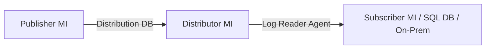

# How to Set Up Transactional Replication with Azure SQL Managed Instance

Author: [nawazdhandala](https://www.github.com/nawazdhandala)

Tags: Azure, SQL Managed Instance, Transactional Replication, Database Replication, SQL Server

Description: Step-by-step instructions for configuring transactional replication with Azure SQL Managed Instance as publisher, subscriber, or distributor.

---

Transactional replication is one of those SQL Server features that was historically only available on-premises or on VMs. With Azure SQL Managed Instance, you can now use it in a fully managed environment. This is useful for real-time data distribution, migration scenarios, and keeping reporting databases in sync. Let me walk through how to set this up properly.

## Understanding the Roles

Transactional replication has three main roles:

- **Publisher**: The source database that owns the data and publishes changes
- **Distributor**: An intermediary that stores changes in a distribution database and forwards them to subscribers
- **Subscriber**: The target database that receives replicated data

With SQL Managed Instance, a single instance can serve as both publisher and distributor. The subscriber can be another Managed Instance, an Azure SQL Database, or even an on-premises SQL Server.



In many setups, the publisher and distributor live on the same Managed Instance, which simplifies the architecture.

## Prerequisites

Before starting, make sure you have:

- At least one Azure SQL Managed Instance (General Purpose or Business Critical tier)
- The source database with tables that have primary keys (transactional replication requires primary keys on all published tables)
- Network connectivity between publisher and subscriber (VNet peering, VPN gateway, or public endpoint)
- SQL Server Management Studio (SSMS) 18.0 or later

## Step 1: Configure the Distributor

First, configure your Managed Instance as the distributor. Connect to the instance using SSMS and run the following:

```sql
-- Configure the Managed Instance as a distributor
-- The @distributor parameter should match the instance name
EXEC sp_adddistributor
    @distributor = N'myinstance.abc123.database.windows.net',
    @password = N'StrongDistributorPassword123!';

-- Create the distribution database
-- This stores metadata and queued transactions
EXEC sp_adddistributiondb
    @database = N'distribution',
    @security_mode = 0,
    @login = N'adminuser',
    @password = N'StrongDistributorPassword123!';
```

The distribution database acts as a queue for changes. It stores transaction log entries from the publisher until they have been delivered to all subscribers.

## Step 2: Configure the Publisher

Next, register the publisher with the distributor. Since the publisher and distributor are on the same instance, this is straightforward:

```sql
-- Register the local instance as a publisher
-- This tells the distributor which server is allowed to publish
EXEC sp_adddistpublisher
    @publisher = N'myinstance.abc123.database.windows.net',
    @distribution_db = N'distribution',
    @security_mode = 0,
    @login = N'adminuser',
    @password = N'StrongDistributorPassword123!',
    @working_directory = N'\\storageaccount.file.core.windows.net\replshare',
    @trusted = N'false',
    @thirdparty_flag = 0,
    @publisher_type = N'MSSQLSERVER';
```

The working directory must be an Azure file share. This is where snapshot files are stored. Create the Azure file share before running this command.

## Step 3: Set Up the Azure File Share

You need a storage account and file share for snapshot files. Here is how to create them using Azure CLI:

```bash
# Create a storage account for replication snapshots
az storage account create \
    --name replstorage \
    --resource-group myResourceGroup \
    --location eastus \
    --sku Standard_LRS

# Create a file share in the storage account
az storage share create \
    --name replshare \
    --account-name replstorage

# Get the storage account key (you will need this for the credential)
az storage account keys list \
    --account-name replstorage \
    --resource-group myResourceGroup \
    --query '[0].value' -o tsv
```

Then create a credential on the Managed Instance so it can access the file share:

```sql
-- Create a credential for accessing the Azure file share
-- The identity is the storage account name
-- The secret is the storage account key
CREATE CREDENTIAL [\\replstorage.file.core.windows.net\replshare]
    WITH IDENTITY = 'replstorage',
    SECRET = 'YourStorageAccountKey';
```

## Step 4: Create a Publication

Now create a publication on the source database. A publication defines which tables and articles are replicated.

```sql
-- Switch to the source database
USE [MySourceDatabase];
GO

-- Enable the database for replication
EXEC sp_replicationdboption
    @dbname = N'MySourceDatabase',
    @optname = N'publish',
    @value = N'true';

-- Create a transactional publication
EXEC sp_addpublication
    @publication = N'MyPublication',
    @status = N'active',
    @allow_push = N'true',
    @allow_pull = N'true',
    @snapshot_in_defaultfolder = N'true';

-- Set the snapshot agent schedule
-- This agent generates the initial snapshot of published data
EXEC sp_addpublication_snapshot
    @publication = N'MyPublication',
    @frequency_type = 1,  -- One-time
    @frequency_interval = 1,
    @frequency_subday_type = 1,
    @frequency_subday_interval = 5,
    @job_login = N'adminuser',
    @job_password = N'StrongPassword123!',
    @publisher_security_mode = 0,
    @publisher_login = N'adminuser',
    @publisher_password = N'StrongPassword123!';
```

## Step 5: Add Articles to the Publication

Each table you want to replicate is added as an article:

```sql
-- Add a table as an article to the publication
-- Repeat this for each table you want to replicate
EXEC sp_addarticle
    @publication = N'MyPublication',
    @article = N'Customers',
    @source_object = N'Customers',
    @source_owner = N'dbo',
    @type = N'logbased',
    @schema_option = 0x000000000803509F,
    @identityrangemanagementoption = N'manual',
    @destination_table = N'Customers',
    @destination_owner = N'dbo';

-- Add another table
EXEC sp_addarticle
    @publication = N'MyPublication',
    @article = N'Orders',
    @source_object = N'Orders',
    @source_owner = N'dbo',
    @type = N'logbased',
    @schema_option = 0x000000000803509F,
    @identityrangemanagementoption = N'manual',
    @destination_table = N'Orders',
    @destination_owner = N'dbo';
```

## Step 6: Add a Subscriber

Finally, add the subscriber. This can be another Managed Instance or an Azure SQL Database:

```sql
-- Add a push subscription to another Managed Instance
EXEC sp_addsubscription
    @publication = N'MyPublication',
    @subscriber = N'subscriberinstance.xyz789.database.windows.net',
    @destination_db = N'MyTargetDatabase',
    @subscription_type = N'Push',
    @sync_type = N'automatic';

-- Add the push subscription agent
-- This agent pushes changes from the distributor to the subscriber
EXEC sp_addpushsubscription_agent
    @publication = N'MyPublication',
    @subscriber = N'subscriberinstance.xyz789.database.windows.net',
    @subscriber_db = N'MyTargetDatabase',
    @subscriber_security_mode = 0,
    @subscriber_login = N'adminuser',
    @subscriber_password = N'SubscriberPassword123!',
    @job_login = N'adminuser',
    @job_password = N'StrongPassword123!';
```

## Step 7: Start the Snapshot Agent

Generate the initial snapshot so the subscriber gets a baseline copy of the data:

```sql
-- Start the snapshot agent to generate the initial snapshot
EXEC sp_startpublication_snapshot
    @publication = N'MyPublication';
```

## Monitoring Replication

Once replication is running, monitor it to catch issues early:

```sql
-- Check the status of replication agents
-- Run this on the distributor
USE distribution;
GO

-- View recent agent history for the log reader
SELECT TOP 20
    agent_id,
    runstatus,
    comments,
    time
FROM MSlogreader_history
ORDER BY time DESC;

-- View distribution agent history
SELECT TOP 20
    agent_id,
    runstatus,
    comments,
    time,
    delivered_transactions,
    delivered_commands
FROM MSdistribution_history
ORDER BY time DESC;

-- Check for undistributed commands (indicates lag)
EXEC sp_replmonitorsubscriptionpendingcmds
    @publisher = N'myinstance.abc123.database.windows.net',
    @publisher_db = N'MySourceDatabase',
    @publication = N'MyPublication',
    @subscriber = N'subscriberinstance.xyz789.database.windows.net',
    @subscriber_db = N'MyTargetDatabase',
    @subscription_type = 0;
```

## Troubleshooting Common Issues

Here are the most common problems people run into:

**Snapshot agent fails**: Usually a permissions issue with the Azure file share. Double-check the credential and make sure the storage account key is correct. Also verify the file share exists and the Managed Instance can reach it over the network.

**Log reader agent not starting**: Make sure the database has been enabled for replication with sp_replicationdboption. Also check that the database recovery model is set to FULL.

**Subscriber falling behind**: This usually means the subscriber cannot keep up with the rate of changes. Check the subscriber's DTU or vCore usage and consider scaling up. You can also look at the undistributed commands count to see how far behind the subscriber is.

**Network connectivity errors**: If the publisher and subscriber are in different VNets, make sure VNet peering is configured and that the SQL Managed Instance ports (1433, 11000-11999) are allowed through NSG rules.

## Cleaning Up Replication

If you need to remove replication, do it in reverse order:

```sql
-- Remove the subscription first
EXEC sp_dropsubscription
    @publication = N'MyPublication',
    @subscriber = N'subscriberinstance.xyz789.database.windows.net',
    @destination_db = N'MyTargetDatabase',
    @article = N'all';

-- Remove the publication
EXEC sp_droppublication
    @publication = N'MyPublication';

-- Disable replication on the database
EXEC sp_replicationdboption
    @dbname = N'MySourceDatabase',
    @optname = N'publish',
    @value = N'false';

-- Remove the distributor
EXEC sp_dropdistributor
    @no_checks = 1;
```

Transactional replication on Managed Instance works much the same as it does on traditional SQL Server. The main differences are around network configuration and using Azure file shares instead of local file system paths. Once you have the initial setup working, it is a reliable way to keep databases synchronized in real time.
