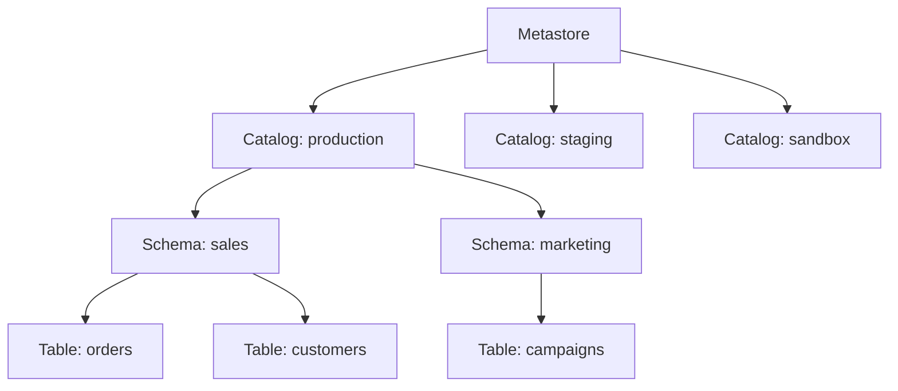

# How to Set Up Unity Catalog for Data Governance in Azure Databricks

Author: [nawazdhandala](https://www.github.com/nawazdhandala)

Tags: Unity Catalog, Azure Databricks, Data Governance, Access Control, Data Mesh, Azure

Description: A comprehensive guide to setting up Unity Catalog in Azure Databricks for centralized data governance, access control, and data discovery across workspaces.

---

As your Databricks environment grows, you quickly run into governance questions. Who can access which tables? Where is sensitive data stored? How do you share data across workspaces without duplicating it? Unity Catalog answers all of these questions by providing a unified governance layer for all data and AI assets in Azure Databricks.

Unity Catalog replaces the legacy workspace-level Hive metastore with a centralized, account-level catalog that spans multiple workspaces. It gives you fine-grained access control, data lineage tracking, and a single place to discover and manage all your data assets.

In this post, I will walk through setting up Unity Catalog from scratch, configuring the three-level namespace, managing permissions, and establishing a governance framework.

## Unity Catalog Architecture

Unity Catalog uses a three-level namespace: **catalog.schema.table**.



- **Metastore** - the top-level container, one per region. It holds all catalogs and the governance metadata.
- **Catalog** - a logical grouping, typically by environment (production, staging) or business domain.
- **Schema** - a grouping within a catalog, similar to a database schema. Typically organized by subject area.
- **Table/View/Function** - the actual data objects.

## Prerequisites

Before setting up Unity Catalog, you need:

1. An Azure Databricks account (premium tier)
2. An Azure Databricks account admin role
3. An Azure Data Lake Storage Gen2 account for the metastore storage
4. An Azure Active Directory tenant for identity management
5. A Databricks Access Connector for Azure (managed identity)

## Step 1: Create the Metastore Storage

Unity Catalog needs a storage location for managed tables and the metastore metadata.

1. Create an Azure Data Lake Storage Gen2 account (or use an existing one)
2. Create a container named `unity-catalog` (or any name you prefer)
3. Create a Databricks Access Connector in the Azure portal:
   - Search for "Access Connector for Azure Databricks"
   - Create it in the same region as your Databricks workspace
   - Note the managed identity resource ID

4. Grant the Access Connector's managed identity the **Storage Blob Data Contributor** role on the storage account.

```bash
# Grant the access connector permission to the storage account
az role assignment create \
  --role "Storage Blob Data Contributor" \
  --assignee-object-id "<access-connector-managed-identity-id>" \
  --scope "/subscriptions/<sub-id>/resourceGroups/<rg>/providers/Microsoft.Storage/storageAccounts/<storage-account>"
```

## Step 2: Create the Metastore

1. Log into the Databricks account console (accounts.azuredatabricks.net)
2. Go to **Data** > **Create metastore**
3. Fill in:
   - **Name**: `main-metastore` (or your preferred name)
   - **Region**: must match your Databricks workspace region
   - **ADLS Gen2 path**: `abfss://unity-catalog@<storage-account>.dfs.core.windows.net/`
   - **Access Connector ID**: the resource ID of your Databricks Access Connector

4. Click **Create**

## Step 3: Assign the Metastore to Workspaces

A metastore can be shared across multiple Databricks workspaces in the same region.

1. In the account console, go to **Data** > your metastore
2. Click **Workspaces** > **Assign to workspace**
3. Select the workspace(s) you want to connect

After assignment, the workspace can access Unity Catalog objects. The legacy Hive metastore still works but is separate from Unity Catalog.

## Step 4: Create Catalogs and Schemas

Now set up the namespace structure. Open a Databricks notebook in your workspace and run these commands.

```sql
-- Create catalogs for different environments
CREATE CATALOG IF NOT EXISTS production
COMMENT 'Production data assets';

CREATE CATALOG IF NOT EXISTS staging
COMMENT 'Staging and testing data';

CREATE CATALOG IF NOT EXISTS sandbox
COMMENT 'Developer sandbox for experimentation';

-- Create schemas within the production catalog
USE CATALOG production;

CREATE SCHEMA IF NOT EXISTS sales
COMMENT 'Sales domain data';

CREATE SCHEMA IF NOT EXISTS marketing
COMMENT 'Marketing domain data';

CREATE SCHEMA IF NOT EXISTS finance
COMMENT 'Finance domain data';

-- Set a default catalog for the session
USE CATALOG production;
USE SCHEMA sales;
```

## Step 5: Configure External Locations

External locations define where data physically resides in cloud storage. They are a security boundary - only users with access to the external location can create external tables pointing to that storage path.

```sql
-- Create a storage credential (references the access connector)
CREATE STORAGE CREDENTIAL IF NOT EXISTS main_storage_credential
WITH (
    AZURE_MANAGED_IDENTITY = (
        ACCESS_CONNECTOR_ID = '/subscriptions/<sub-id>/resourceGroups/<rg>/providers/Microsoft.Databricks/accessConnectors/<connector-name>'
    )
)
COMMENT 'Main storage credential for data lake access';

-- Create an external location
CREATE EXTERNAL LOCATION IF NOT EXISTS raw_data_location
URL 'abfss://raw@mystorageaccount.dfs.core.windows.net/'
WITH (STORAGE CREDENTIAL main_storage_credential)
COMMENT 'Raw data landing zone';
```

## Step 6: Set Up Access Control

Unity Catalog uses a privilege-based access control model. Privileges are granted at any level of the hierarchy and inherit downward.

### Grant Catalog-Level Access

```sql
-- Grant data engineers full access to the production catalog
GRANT USE CATALOG ON CATALOG production TO `data-engineers@company.com`;
GRANT CREATE SCHEMA ON CATALOG production TO `data-engineers@company.com`;

-- Grant data analysts read-only access
GRANT USE CATALOG ON CATALOG production TO `data-analysts@company.com`;
```

### Grant Schema-Level Access

```sql
-- Grant full access to the sales schema
GRANT USE SCHEMA ON SCHEMA production.sales TO `data-engineers@company.com`;
GRANT CREATE TABLE ON SCHEMA production.sales TO `data-engineers@company.com`;

-- Grant read-only access to analysts
GRANT USE SCHEMA ON SCHEMA production.sales TO `data-analysts@company.com`;
GRANT SELECT ON SCHEMA production.sales TO `data-analysts@company.com`;
```

### Grant Table-Level Access

```sql
-- Grant select on a specific table
GRANT SELECT ON TABLE production.sales.orders TO `report-readers@company.com`;

-- Grant select on all tables in a schema
GRANT SELECT ON SCHEMA production.sales TO `report-readers@company.com`;
```

### Manage Groups

Use Azure AD groups for access management rather than individual users. This scales much better.

```sql
-- Show current grants on a table
SHOW GRANTS ON TABLE production.sales.orders;

-- Revoke access
REVOKE SELECT ON TABLE production.sales.orders FROM `temp-contractor@company.com`;
```

## Step 7: Create Managed and External Tables

Unity Catalog supports two types of tables:

- **Managed tables** - Unity Catalog manages the data files. When you drop the table, the data is deleted.
- **External tables** - you manage the data files. Dropping the table removes only the metadata.

```sql
-- Create a managed table (data stored in metastore storage)
CREATE TABLE production.sales.customers (
    customer_id INT,
    name STRING,
    email STRING,
    created_date DATE
)
USING DELTA
COMMENT 'Customer master data';

-- Create an external table (data stored at a specific location)
CREATE TABLE production.sales.raw_orders (
    order_id INT,
    customer_id INT,
    amount DECIMAL(10, 2),
    order_date TIMESTAMP
)
USING DELTA
LOCATION 'abfss://raw@mystorageaccount.dfs.core.windows.net/orders/'
COMMENT 'Raw order data from source systems';
```

## Step 8: Enable Data Lineage

Unity Catalog automatically tracks data lineage - the flow of data from source tables to downstream tables. This is enabled by default for Delta tables.

To view lineage:
1. Open the Databricks workspace
2. Go to **Catalog** in the left sidebar
3. Navigate to a table
4. Click the **Lineage** tab

You will see a visual graph showing which tables are upstream (data sources) and downstream (tables that depend on this one).

## Step 9: Tag and Classify Data

Use tags and comments to make data discoverable and to classify sensitive data.

```sql
-- Add tags to a table
ALTER TABLE production.sales.customers
SET TAGS ('pii' = 'true', 'domain' = 'sales', 'data_owner' = 'sales-team');

-- Add column-level comments
ALTER TABLE production.sales.customers
ALTER COLUMN email COMMENT 'Customer email address - PII';

-- Add column-level tags
ALTER TABLE production.sales.customers
ALTER COLUMN email SET TAGS ('pii' = 'true', 'classification' = 'confidential');
```

## Governance Best Practices

Based on production experience, here are the practices that work well:

1. **Use Azure AD groups for all permissions** - never grant access to individual users. When someone changes roles, you just update their group membership.
2. **Follow the principle of least privilege** - grant the minimum access needed. Start with USE CATALOG and SELECT, then add write permissions as needed.
3. **Separate environments with catalogs** - use different catalogs for production, staging, and sandbox. This prevents accidental writes to production data.
4. **Tag sensitive data consistently** - establish a tagging taxonomy and enforce it. PII, confidential, and public classifications help teams understand what they are working with.
5. **Use external locations for raw data** - keep raw data as external tables. Use managed tables for curated data.
6. **Review access regularly** - periodically audit who has access to what using the SHOW GRANTS command.

## Wrapping Up

Unity Catalog brings proper data governance to Azure Databricks. The three-level namespace keeps data organized. Fine-grained access control ensures the right people have access to the right data. Automatic lineage tracking shows how data flows through your pipelines. And centralized management across workspaces eliminates the silos that come with workspace-level metastores. The setup takes some effort upfront, but the governance, security, and discoverability benefits pay for themselves quickly as your data platform grows.
