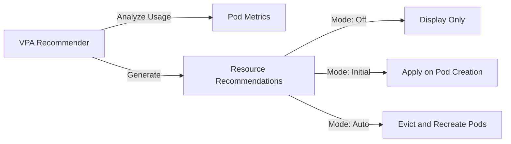

# How to Set Up Vertical Pod Autoscaler on AKS for Automatic Resource Right-Sizing

Author: [nawazdhandala](https://www.github.com/nawazdhandala)

Tags: AKS, Vertical Pod Autoscaler, VPA, Kubernetes, Resource Management, Cost Optimization, Auto Scaling

Description: How to deploy and configure the Vertical Pod Autoscaler on AKS to automatically adjust pod CPU and memory requests based on actual usage patterns.

---

Setting resource requests and limits for Kubernetes pods is more art than science. Request too little and your pods get throttled or OOM killed. Request too much and you waste cluster resources (and money). The Vertical Pod Autoscaler (VPA) solves this by monitoring actual resource usage and automatically adjusting requests and limits to match what your pods actually need.

## What VPA Does (and Does Not Do)

VPA differs from the Horizontal Pod Autoscaler (HPA) in a fundamental way. HPA scales the number of pods (horizontal). VPA scales the resources per pod (vertical). They address different problems:

- **HPA**: "I need more pods to handle increased load."
- **VPA**: "Each pod needs more (or less) CPU and memory than currently configured."

VPA has three modes:

- **Off**: VPA calculates recommendations but does not apply them. Good for getting suggestions.
- **Initial**: VPA sets resource requests only when pods are created. No changes to running pods.
- **Auto**: VPA evicts and recreates pods with updated resource requests. Most powerful but can cause brief disruption.



## Prerequisites

- An AKS cluster running Kubernetes 1.24+
- Metrics Server installed (enabled by default on AKS)
- kubectl and Helm configured for your cluster

## Step 1: Install VPA on AKS

VPA is not installed by default on AKS. Install it using the official manifests or Helm.

```bash
# Clone the VPA repository
git clone https://github.com/kubernetes/autoscaler.git
cd autoscaler/vertical-pod-autoscaler

# Install VPA components
./hack/vpa-up.sh
```

Or install with Helm using a community chart.

```bash
# Add the Fairwinds Helm repo (maintains a VPA chart)
helm repo add fairwinds-stable https://charts.fairwinds.com/stable
helm repo update

# Install VPA
helm install vpa fairwinds-stable/vpa \
  --namespace vpa \
  --create-namespace \
  --set recommender.resources.requests.cpu=50m \
  --set recommender.resources.requests.memory=500Mi
```

Verify the installation.

```bash
# Check VPA components are running
kubectl get pods -n vpa

# You should see:
# vpa-recommender - analyzes usage and generates recommendations
# vpa-updater - evicts pods that need resource updates (Auto mode)
# vpa-admission-controller - mutates pod requests on creation
```

## Step 2: Deploy a Test Application

Deploy an application with intentionally wrong resource requests to see VPA in action.

```yaml
# test-app.yaml
# Application with resource requests that are probably wrong
apiVersion: apps/v1
kind: Deployment
metadata:
  name: resource-test
  namespace: default
spec:
  replicas: 2
  selector:
    matchLabels:
      app: resource-test
  template:
    metadata:
      labels:
        app: resource-test
    spec:
      containers:
      - name: app
        image: nginx:1.25
        ports:
        - containerPort: 80
        resources:
          requests:
            # These are deliberately set too high for nginx
            cpu: 500m
            memory: 512Mi
          limits:
            cpu: 1000m
            memory: 1Gi
```

## Step 3: Create a VPA Object in Recommendation Mode

Start with recommendation mode to see what VPA suggests without making any changes.

```yaml
# vpa-recommend.yaml
# VPA in recommendation mode - observe only, no changes to pods
apiVersion: autoscaling.k8s.io/v1
kind: VerticalPodAutoscaler
metadata:
  name: resource-test-vpa
  namespace: default
spec:
  targetRef:
    apiVersion: apps/v1
    kind: Deployment
    name: resource-test
  updatePolicy:
    # Off mode: generate recommendations but do not apply them
    updateMode: "Off"
  resourcePolicy:
    containerPolicies:
    - containerName: app
      # Set minimum and maximum bounds for recommendations
      minAllowed:
        cpu: 10m
        memory: 32Mi
      maxAllowed:
        cpu: 2000m
        memory: 4Gi
      controlledResources: ["cpu", "memory"]
```

Apply and wait a few minutes for VPA to collect enough data.

```bash
kubectl apply -f test-app.yaml
kubectl apply -f vpa-recommend.yaml

# Wait 5-10 minutes for VPA to generate recommendations
# Then check what VPA suggests
kubectl describe vpa resource-test-vpa
```

The output includes a recommendation section.

```
Recommendation:
  Container Recommendations:
    Container Name: app
    Lower Bound:
      Cpu:     10m
      Memory:  26Mi
    Target:
      Cpu:     25m
      Memory:  52Mi
    Uncapped Target:
      Cpu:     25m
      Memory:  52Mi
    Upper Bound:
      Cpu:     100m
      Memory:  200Mi
```

This tells you that the nginx container actually needs about 25m CPU and 52 Mi memory - far less than the 500m CPU and 512 Mi we requested. VPA would save significant resources here.

## Step 4: Switch to Auto Mode

Once you are comfortable with the recommendations, switch to auto mode. VPA will evict pods and recreate them with the recommended resources.

```yaml
# vpa-auto.yaml
# VPA in auto mode - actively adjusts pod resources
apiVersion: autoscaling.k8s.io/v1
kind: VerticalPodAutoscaler
metadata:
  name: resource-test-vpa
  namespace: default
spec:
  targetRef:
    apiVersion: apps/v1
    kind: Deployment
    name: resource-test
  updatePolicy:
    # Auto mode: evict and recreate pods with updated resources
    updateMode: "Auto"
  resourcePolicy:
    containerPolicies:
    - containerName: app
      minAllowed:
        cpu: 10m
        memory: 32Mi
      maxAllowed:
        cpu: 2000m
        memory: 4Gi
      controlledResources: ["cpu", "memory"]
      # Control whether VPA sets requests, limits, or both
      controlledValues: RequestsAndLimits
```

Apply the updated VPA.

```bash
kubectl apply -f vpa-auto.yaml

# Watch pods get evicted and recreated with new resource values
kubectl get pods -l app=resource-test --watch

# After recreation, check the new resource requests
kubectl get pod -l app=resource-test -o jsonpath='{.items[0].spec.containers[0].resources}'
```

## Step 5: Configure Resource Boundaries

The `minAllowed` and `maxAllowed` settings are crucial for safety. Without them, VPA might set resources too low (causing OOM kills) or too high (wasting resources).

```yaml
resourcePolicy:
  containerPolicies:
  - containerName: app
    # Never go below these values
    minAllowed:
      cpu: 50m
      memory: 64Mi
    # Never exceed these values
    maxAllowed:
      cpu: 4000m
      memory: 8Gi
    # Which resources VPA controls
    controlledResources: ["cpu", "memory"]
    # RequestsOnly: VPA adjusts requests, limits stay as defined
    # RequestsAndLimits: VPA adjusts both proportionally
    controlledValues: RequestsAndLimits
```

For production applications, set `minAllowed` to values you know your application needs even during idle periods. Set `maxAllowed` based on your node size and budget.

## Step 6: VPA for Multiple Containers

If your pods have sidecar containers, configure VPA policies for each.

```yaml
# vpa-multi-container.yaml
# VPA with per-container policies
apiVersion: autoscaling.k8s.io/v1
kind: VerticalPodAutoscaler
metadata:
  name: multi-container-vpa
  namespace: default
spec:
  targetRef:
    apiVersion: apps/v1
    kind: Deployment
    name: my-app-with-sidecars
  updatePolicy:
    updateMode: "Auto"
  resourcePolicy:
    containerPolicies:
    # Main application container
    - containerName: my-app
      minAllowed:
        cpu: 100m
        memory: 128Mi
      maxAllowed:
        cpu: 2000m
        memory: 4Gi
    # Sidecar container - keep resources fixed
    - containerName: envoy-proxy
      mode: "Off"
    # Logging sidecar - let VPA manage it
    - containerName: fluentd
      minAllowed:
        cpu: 10m
        memory: 32Mi
      maxAllowed:
        cpu: 200m
        memory: 256Mi
```

Setting a container's mode to `Off` tells VPA to leave that container alone while still managing others.

## Step 7: Use VPA with HPA

VPA and HPA should not both control the same resource metric on the same deployment. If HPA scales on CPU, VPA should not adjust CPU. They can coexist if they control different dimensions.

```yaml
# Safe combination: VPA controls memory, HPA controls replicas based on CPU
# VPA configuration
apiVersion: autoscaling.k8s.io/v1
kind: VerticalPodAutoscaler
metadata:
  name: my-app-vpa
spec:
  targetRef:
    apiVersion: apps/v1
    kind: Deployment
    name: my-app
  updatePolicy:
    updateMode: "Auto"
  resourcePolicy:
    containerPolicies:
    - containerName: my-app
      # Only control memory, leave CPU to HPA
      controlledResources: ["memory"]
      minAllowed:
        memory: 128Mi
      maxAllowed:
        memory: 4Gi
---
# HPA configuration
apiVersion: autoscaling/v2
kind: HorizontalPodAutoscaler
metadata:
  name: my-app-hpa
spec:
  scaleTargetRef:
    apiVersion: apps/v1
    kind: Deployment
    name: my-app
  minReplicas: 2
  maxReplicas: 10
  metrics:
  - type: Resource
    resource:
      name: cpu
      target:
        type: Utilization
        averageUtilization: 70
```

## Step 8: Monitor VPA Activity

Track what VPA is doing across your cluster.

```bash
# List all VPA objects and their modes
kubectl get vpa --all-namespaces

# Check recommendations for a specific VPA
kubectl describe vpa my-app-vpa -n default

# View VPA-related events (evictions and recreations)
kubectl get events --field-selector reason=EvictedByVPA --all-namespaces
```

## Best Practices

**Start with Off mode**: Always start in recommendation mode to understand what VPA would do before enabling auto mode. Run in Off mode for at least a week to capture different traffic patterns.

**Use Pod Disruption Budgets**: In Auto mode, VPA evicts pods to apply new resources. PDBs ensure not all replicas are evicted simultaneously.

```yaml
apiVersion: policy/v1
kind: PodDisruptionBudget
metadata:
  name: my-app-pdb
spec:
  minAvailable: 1
  selector:
    matchLabels:
      app: my-app
```

**Set realistic bounds**: The minAllowed and maxAllowed values prevent VPA from making bad decisions. Base them on your application's actual behavior and your cluster's capacity.

**Avoid using VPA with JVM applications without tuning**: Java applications have their own memory management (heap, metaspace). VPA adjusting container memory without corresponding JVM flag changes can cause issues. Set memory bounds that account for JVM overhead.

**Watch for eviction storms**: If many VPA objects are in Auto mode and recommendations change frequently, you might see a lot of pod churn. Set appropriate resource bounds to reduce oscillation.

## Summary

The Vertical Pod Autoscaler removes the guesswork from pod resource configuration. Start in recommendation mode to get data-driven insights into what your pods actually need, then switch to auto mode for continuous right-sizing. VPA is especially valuable for workloads with variable resource needs and for catching over-provisioned pods that waste cluster capacity. Combined with HPA for horizontal scaling, VPA ensures your AKS cluster is both responsive to load changes and efficient with resources.
