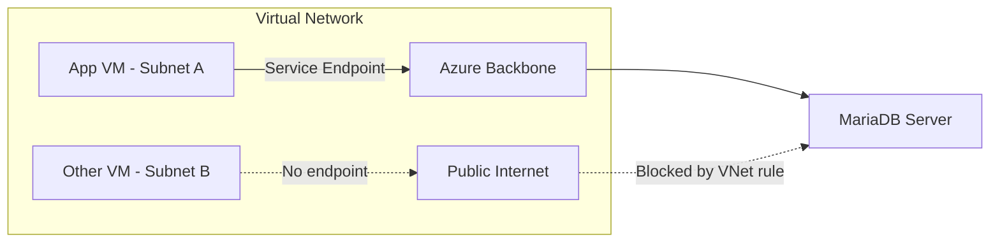

# How to Set Up Virtual Network Service Endpoints for Azure Database for MariaDB

Author: [nawazdhandala](https://www.github.com/nawazdhandala)

Tags: Azure, MariaDB, VNet, Service Endpoints, Networking, Security, Database Security

Description: Learn how to configure Virtual Network service endpoints for Azure Database for MariaDB to restrict database access to specific Azure virtual networks.

---

By default, Azure Database for MariaDB accepts connections from any IP address that passes the firewall rules. While firewall rules provide basic access control, they are IP-based and do not account for the identity or location of the connecting resource within Azure. Virtual Network (VNet) service endpoints give you a more secure approach by allowing you to restrict access to your MariaDB server from specific subnets within your Azure VNet.

In this post, I will explain how VNet service endpoints work, walk through the setup process, and cover the operational considerations you need to know.

## How VNet Service Endpoints Work

Without service endpoints, traffic from your Azure VMs or App Services to your MariaDB server travels over the public network, even though both resources are in Azure. The MariaDB server identifies the source by its public IP address.

With VNet service endpoints enabled:

1. The subnet is configured with a service endpoint for `Microsoft.DBforMariaDB`.
2. Traffic from that subnet takes an optimized route through the Azure backbone network.
3. The MariaDB server identifies the traffic as coming from a specific VNet/subnet (not just an IP).
4. VNet rules on the server allow or deny traffic based on the source subnet.



The key benefit is that the source is identified by its subnet, not its IP. This is more robust because:

- IP addresses can change (especially with dynamic allocation).
- Multiple resources in the same subnet share access.
- You do not need to maintain individual IP-based firewall rules.

## Prerequisites

Before setting up VNet service endpoints:

- An Azure Database for MariaDB server (General Purpose or Memory Optimized tier - Basic tier does not support VNet rules).
- A Virtual Network with at least one subnet.
- The subnet must not already have a delegation to another service (some delegations conflict with service endpoints).
- Contributor permissions on both the VNet and the MariaDB server.

## Step 1: Enable the Service Endpoint on the Subnet

First, enable the `Microsoft.DBforMariaDB` service endpoint on the subnet where your application resources live:

```bash
# Enable the service endpoint on the subnet
az network vnet subnet update \
  --resource-group myResourceGroup \
  --vnet-name myVNet \
  --name myAppSubnet \
  --service-endpoints Microsoft.DBforMariaDB
```

This operation might take a minute. During this time, existing connections from the subnet may experience a brief interruption as the routing changes take effect.

You can verify the service endpoint is enabled:

```bash
# Check the service endpoints on a subnet
az network vnet subnet show \
  --resource-group myResourceGroup \
  --vnet-name myVNet \
  --name myAppSubnet \
  --query "serviceEndpoints"
```

## Step 2: Create a VNet Rule on the MariaDB Server

Now create a VNet rule on the MariaDB server to allow traffic from the subnet:

```bash
# Create a VNet rule to allow the subnet
az mariadb server vnet-rule create \
  --resource-group myResourceGroup \
  --server-name my-mariadb-server \
  --name AllowAppSubnet \
  --vnet-name myVNet \
  --subnet myAppSubnet
```

You can also do this in the Azure portal:

1. Navigate to your MariaDB server.
2. Click "Connection security" in the left menu.
3. Scroll to the "Virtual network rules" section.
4. Click "Add existing virtual network."
5. Select your VNet and subnet.
6. Click "OK."

## Step 3: Verify the Configuration

List the VNet rules on your server:

```bash
# List all VNet rules
az mariadb server vnet-rule list \
  --resource-group myResourceGroup \
  --server-name my-mariadb-server \
  --output table
```

Test connectivity from a VM in the allowed subnet:

```bash
# From a VM in myAppSubnet
mysql -h my-mariadb-server.mariadb.database.azure.com \
  -u myadmin@my-mariadb-server \
  -p \
  --ssl \
  -e "SELECT 'Connection successful from VNet' AS status;"
```

## Managing Multiple Subnets

If your application spans multiple subnets, add a VNet rule for each:

```bash
# Allow the web tier subnet
az mariadb server vnet-rule create \
  --resource-group myResourceGroup \
  --server-name my-mariadb-server \
  --name AllowWebSubnet \
  --vnet-name myVNet \
  --subnet webSubnet

# Allow the API tier subnet
az mariadb server vnet-rule create \
  --resource-group myResourceGroup \
  --server-name my-mariadb-server \
  --name AllowApiSubnet \
  --vnet-name myVNet \
  --subnet apiSubnet

# Allow a subnet from a peered VNet
az mariadb server vnet-rule create \
  --resource-group myResourceGroup \
  --server-name my-mariadb-server \
  --name AllowPeeredSubnet \
  --vnet-name peerVNet \
  --subnet appSubnet
```

VNet rules work across peered VNets as long as:

- The VNets are peered.
- Service endpoints are enabled on the source subnet.
- The service endpoint targets the correct region.

## Handling Cross-Region Access

VNet service endpoints are regional. If your application and database are in different regions, you need to configure the service endpoint to target the database's region:

```bash
# Enable service endpoint targeting a specific region
az network vnet subnet update \
  --resource-group myResourceGroup \
  --vnet-name myVNet \
  --name myAppSubnet \
  --service-endpoints Microsoft.DBforMariaDB \
  --service-endpoint-policy ""
```

Azure handles the cross-region routing automatically once the endpoint is configured.

## Combining VNet Rules with Firewall Rules

VNet rules and IP firewall rules can coexist on the same server. The server evaluates access in this order:

1. Check VNet rules: If the request comes from an allowed subnet, allow it.
2. Check IP firewall rules: If the source IP is in an allowed range, allow it.
3. Deny: If neither matches, deny the connection.

For a production setup, you might:

- Use VNet rules for application servers (deployed in Azure VNets).
- Use IP firewall rules for developer machines or on-premises access through VPN.
- Disable "Allow Azure services" for tighter security.

```bash
# Deny access from Azure services (recommended when using VNet rules)
az mariadb server update \
  --resource-group myResourceGroup \
  --name my-mariadb-server \
  --public-network-access Enabled

# Remove the allow-all-azure-services rule if it exists
az mariadb server firewall-rule delete \
  --resource-group myResourceGroup \
  --server-name my-mariadb-server \
  --name AllowAllWindowsAzureIps
```

## Working with App Service VNet Integration

If your application runs on Azure App Service, you can use App Service VNet Integration to route traffic through a VNet, then use VNet service endpoints to secure access to MariaDB:

```bash
# Enable VNet integration on the App Service
az webapp vnet-integration add \
  --resource-group myResourceGroup \
  --name my-web-app \
  --vnet myVNet \
  --subnet appServiceSubnet

# Enable the service endpoint on the App Service subnet
az network vnet subnet update \
  --resource-group myResourceGroup \
  --vnet-name myVNet \
  --name appServiceSubnet \
  --service-endpoints Microsoft.DBforMariaDB \
  --delegations Microsoft.Web/serverFarms

# Create the VNet rule
az mariadb server vnet-rule create \
  --resource-group myResourceGroup \
  --server-name my-mariadb-server \
  --name AllowAppService \
  --vnet-name myVNet \
  --subnet appServiceSubnet
```

This ensures that your App Service traffic to MariaDB goes through the VNet and is authorized by the VNet rule, not by an IP-based firewall rule.

## Removing VNet Rules

If you need to remove a VNet rule:

```bash
# Remove a specific VNet rule
az mariadb server vnet-rule delete \
  --resource-group myResourceGroup \
  --server-name my-mariadb-server \
  --name AllowAppSubnet
```

Removing a VNet rule immediately blocks traffic from that subnet. Make sure no active services are using that access path before removing it.

## Monitoring and Auditing

Track who is connecting to your server:

```bash
# Enable diagnostic logging for connection events
az monitor diagnostic-settings create \
  --name mariadb-connection-logs \
  --resource "/subscriptions/{sub-id}/resourceGroups/myResourceGroup/providers/Microsoft.DBforMariaDB/servers/my-mariadb-server" \
  --workspace "/subscriptions/{sub-id}/resourceGroups/myResourceGroup/providers/Microsoft.OperationalInsights/workspaces/myWorkspace" \
  --logs '[{"category": "MySqlAuditLogs", "enabled": true}]'
```

In Log Analytics, query connection events:

```
AzureDiagnostics
| where Category == "MySqlAuditLogs"
| where event_class_s == "connection_log"
| project TimeGenerated, ip_s, host_s, user_s, db_s, event_subclass_s
| order by TimeGenerated desc
| take 50
```

## Troubleshooting

**Cannot connect after adding VNet rule**: Verify the service endpoint is enabled on the subnet. Check with `az network vnet subnet show`. The service endpoint and VNet rule must both be in place.

**Intermittent connectivity after enabling service endpoint**: The initial setup can cause a brief disruption. If it persists, check for NSG (Network Security Group) rules that might be blocking traffic.

**App Service cannot connect**: Make sure the App Service VNet integration is configured, the subnet has the service endpoint enabled, and the subnet delegation is set to `Microsoft.Web/serverFarms`.

**VNet rule creation fails**: The subnet might have a conflicting delegation. Check `az network vnet subnet show` for existing delegations.

## VNet Service Endpoints vs. Private Link

Service endpoints and Private Link both secure network access, but they work differently:

| Feature | VNet Service Endpoints | Private Link |
|---------|----------------------|--------------|
| Traffic path | Optimized Azure route | Private IP in your VNet |
| Public IP | Server keeps public IP | Can disable public IP |
| Cross-region | Supported | Supported |
| Cross-subscription | Limited | Supported |
| Cost | Free | Per-hour + data processing |

For Azure Database for MariaDB, VNet service endpoints are the primary option. Private Link may not be available for MariaDB (it is available for MySQL and PostgreSQL Flexible Server).

## Summary

VNet service endpoints for Azure Database for MariaDB provide a straightforward way to restrict database access to specific Azure subnets. The setup takes just two steps - enable the endpoint on the subnet and create a VNet rule on the server. Combined with IP firewall rules for non-VNet access, this gives you a solid network security posture. As you plan your migration from MariaDB to MySQL Flexible Server, note that Flexible Server offers even more advanced networking options including full VNet integration and Private Link.
