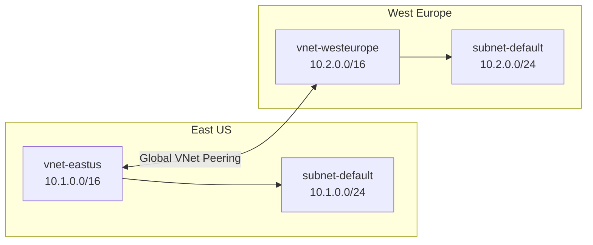

# How to Set Up VNet Peering Between Two Azure Virtual Networks in Different Regions

Author: [nawazdhandala](https://www.github.com/nawazdhandala)

Tags: Azure, VNet Peering, Networking, Azure Virtual Network, Cloud Infrastructure

Description: Learn how to set up global VNet peering between two Azure virtual networks in different regions for seamless cross-region connectivity.

---

When you run workloads across multiple Azure regions, there is almost always a point where resources in one region need to talk to resources in another. Maybe your application servers sit in East US while your database cluster runs in West Europe. Or perhaps you have a disaster recovery setup where a secondary region needs to replicate data from the primary. Whatever the case, Azure VNet Peering is the cleanest way to connect two virtual networks without routing traffic over the public internet.

VNet peering creates a direct connection between two virtual networks using Microsoft's backbone network. When the two networks are in different regions, this is called global VNet peering. Traffic between peered networks stays on the Microsoft backbone and never touches the public internet, which means lower latency and better security compared to alternatives like VPN gateways.

## Prerequisites

Before you start, make sure you have the following in place:

- An Azure subscription with permissions to create and manage virtual networks
- Azure CLI installed and configured, or access to the Azure Portal
- Two virtual networks in different regions (we will create them if you do not already have them)

## Step 1: Create Two Virtual Networks in Different Regions

If you already have two VNets, skip ahead. Otherwise, let us create them using the Azure CLI.

First, create a resource group and two virtual networks. The following script sets up one VNet in East US and another in West Europe.

```bash
# Create a resource group for our networking resources
az group create --name rg-vnet-peering-demo --location eastus

# Create the first virtual network in East US
az network vnet create \
  --resource-group rg-vnet-peering-demo \
  --name vnet-eastus \
  --location eastus \
  --address-prefixes 10.1.0.0/16 \
  --subnet-name subnet-eastus-default \
  --subnet-prefixes 10.1.0.0/24

# Create the second virtual network in West Europe
az network vnet create \
  --resource-group rg-vnet-peering-demo \
  --name vnet-westeurope \
  --location westeurope \
  --address-prefixes 10.2.0.0/16 \
  --subnet-name subnet-westeurope-default \
  --subnet-prefixes 10.2.0.0/24
```

Pay attention to the address spaces. The two VNets must not have overlapping CIDR ranges. If `vnet-eastus` uses `10.1.0.0/16` and `vnet-westeurope` uses `10.2.0.0/16`, they do not overlap, and peering will work fine. Overlapping address spaces is the number one reason peering fails during setup.

## Step 2: Create the Peering from VNet A to VNet B

VNet peering is not a single operation. You need to create a peering link from each side. Think of it like a two-way handshake. First, create the peering from the East US VNet to the West Europe VNet.

```bash
# Get the resource ID of the West Europe VNet
VNET_WESTEUROPE_ID=$(az network vnet show \
  --resource-group rg-vnet-peering-demo \
  --name vnet-westeurope \
  --query id --output tsv)

# Create peering from East US to West Europe
az network vnet peering create \
  --resource-group rg-vnet-peering-demo \
  --name peer-eastus-to-westeurope \
  --vnet-name vnet-eastus \
  --remote-vnet $VNET_WESTEUROPE_ID \
  --allow-vnet-access
```

The `--allow-vnet-access` flag is what actually permits traffic to flow between the two networks. Without it, the peering link exists but nothing can communicate.

## Step 3: Create the Peering from VNet B to VNet A

Now create the reverse direction. Until both peering links are established, the status will show as "Initiated" rather than "Connected."

```bash
# Get the resource ID of the East US VNet
VNET_EASTUS_ID=$(az network vnet show \
  --resource-group rg-vnet-peering-demo \
  --name vnet-eastus \
  --query id --output tsv)

# Create peering from West Europe to East US
az network vnet peering create \
  --resource-group rg-vnet-peering-demo \
  --name peer-westeurope-to-eastus \
  --vnet-name vnet-westeurope \
  --remote-vnet $VNET_EASTUS_ID \
  --allow-vnet-access
```

## Step 4: Verify the Peering Status

After creating both peering links, verify that the status shows "Connected" on both sides.

```bash
# Check peering status from East US side
az network vnet peering show \
  --resource-group rg-vnet-peering-demo \
  --vnet-name vnet-eastus \
  --name peer-eastus-to-westeurope \
  --query peeringState --output tsv

# Check peering status from West Europe side
az network vnet peering show \
  --resource-group rg-vnet-peering-demo \
  --vnet-name vnet-westeurope \
  --name peer-westeurope-to-eastus \
  --query peeringState --output tsv
```

Both commands should return "Connected." If one of them says "Initiated," double-check that the reverse peering link was created correctly.

## Understanding Peering Options

There are several flags you can set when creating a peering connection, and they matter depending on your use case:

- `--allow-vnet-access`: Enables communication between VMs in the peered networks. You almost always want this on.
- `--allow-forwarded-traffic`: If traffic is being forwarded by a network virtual appliance (NVA) in one VNet, this flag allows that forwarded traffic to reach the peered VNet.
- `--allow-gateway-transit`: If one VNet has a VPN gateway and you want the peered VNet to use it, enable this on the VNet with the gateway.
- `--use-remote-gateways`: Enable this on the VNet that does not have a gateway but wants to use the one in the peered network.

Here is a diagram showing the architecture of a global VNet peering setup:



## Common Pitfalls

There are a few things that catch people off guard with VNet peering:

**Overlapping address spaces.** If both VNets use `10.0.0.0/16`, peering creation will fail. Plan your IP address scheme before deploying anything.

**Peering is not transitive.** If VNet A peers with VNet B, and VNet B peers with VNet C, VNet A cannot reach VNet C through VNet B automatically. You need a hub-spoke topology with a network virtual appliance or Azure Firewall to achieve this.

**NSG rules still apply.** Just because two networks are peered does not mean all traffic flows freely. Network Security Groups attached to subnets or NICs still filter traffic. You need to ensure your NSG rules allow the traffic you expect.

**Cost considerations.** VNet peering within the same region is cheap, but global VNet peering (across regions) has data transfer charges. Check the Azure pricing page for current rates before setting up cross-region peering for high-throughput workloads.

## Using the Azure Portal

If you prefer the portal, navigate to your virtual network, click "Peerings" in the left menu, and click "Add." Fill in the peering name, select the remote virtual network, and configure the access settings. The portal lets you create both peering links in a single operation, which is a bit more convenient than the CLI approach.

## Monitoring Peered Traffic

Once peering is active, you can use Azure Network Watcher to monitor traffic between the peered networks. Enable NSG flow logs to see which traffic is flowing between the VNets, and use Connection Monitor to track latency and packet loss across the peering link.

## Cleanup

If you are done testing, clean up the resources to avoid unnecessary charges.

```bash
# Delete the resource group and all resources in it
az group delete --name rg-vnet-peering-demo --yes --no-wait
```

## Wrapping Up

Setting up global VNet peering in Azure is straightforward once you understand the two-way handshake model. Create a peering link from each side, make sure your address spaces do not overlap, and verify that both links show "Connected." The traffic stays on the Microsoft backbone, giving you low latency and high throughput without the complexity of managing VPN tunnels. For multi-region architectures, this is typically the first networking component you should configure before building out the rest of your infrastructure.
