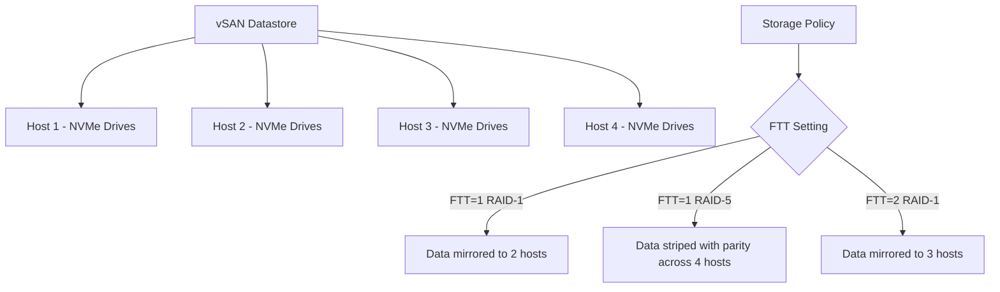

# How to Set Up vSAN Storage Policies and Scaling in Azure VMware Solution

Author: [nawazdhandala](https://www.github.com/nawazdhandala)

Tags: Azure, VMware, vSAN, Storage, Scaling, Private Cloud, Performance

Description: Learn how to configure vSAN storage policies and scale storage in Azure VMware Solution to meet performance and capacity requirements for your workloads.

---

Storage in Azure VMware Solution runs on VMware vSAN, a software-defined storage platform that aggregates local NVMe drives across all ESXi hosts into a shared datastore. How you configure storage policies directly affects performance, availability, and usable capacity. Getting these settings right matters because changing storage policies after VMs are running triggers a full data migration within the vSAN cluster.

This guide covers vSAN storage policy configuration, capacity planning, and scaling options in Azure VMware Solution.

## How vSAN Works in AVS

Each ESXi host in your AVS cluster contributes NVMe flash drives to the vSAN datastore. The AV36 host type provides approximately 15.2 TB of raw NVMe capacity per host. With a 3-host cluster, you get around 45.6 TB raw capacity, but usable capacity depends on your storage policy settings.

vSAN distributes data across hosts according to storage policies. These policies control:

- **Failures to Tolerate (FTT)** - How many host failures the data can survive.
- **Failure Tolerance Method** - Whether to use RAID-1 (mirroring) or RAID-5/6 (erasure coding).
- **Stripe Width** - How many disks data is spread across for performance.



## Default Storage Policy in AVS

When you deploy an AVS private cloud, it comes with a default storage policy called `vSAN Default Storage Policy`. This policy uses:

- **FTT = 1** (tolerates one host failure)
- **RAID-1 mirroring**
- **Object space reservation = thin provisioning**

With RAID-1 and FTT=1, every piece of data is stored on two different hosts. This means your usable capacity is approximately 50% of the raw capacity. For a 3-host cluster with 45.6 TB raw, you get roughly 22.8 TB usable.

## Step 1: Understand Storage Policy Options

Here are the storage policy combinations available and their capacity implications:

| FTT | Method | Min Hosts | Capacity Overhead | Usable % |
|-----|--------|-----------|-------------------|----------|
| 1 | RAID-1 (Mirror) | 3 | 2x | ~50% |
| 1 | RAID-5 (Erasure) | 4 | 1.33x | ~75% |
| 2 | RAID-1 (Mirror) | 5 | 3x | ~33% |
| 2 | RAID-6 (Erasure) | 6 | 1.5x | ~67% |

RAID-5 erasure coding gives you significantly more usable capacity than RAID-1 mirroring, but requires a minimum of 4 hosts and has slightly higher write latency. For capacity-sensitive workloads, RAID-5 with FTT=1 is often the best balance.

## Step 2: Create a Custom Storage Policy

To create a custom storage policy, log in to vCenter as `cloudadmin@vsphere.local`.

1. Navigate to Policies and Profiles > VM Storage Policies.
2. Click "Create."
3. Name the policy (for example, "RAID-5-FTT1").
4. Under "vSAN", enable the rule set.
5. Configure the following settings:
   - **Failures to tolerate**: 1
   - **Failure tolerance method**: RAID-5/6 (Erasure Coding)
   - **Number of disk stripes per object**: 1 (default is fine)
   - **Object space reservation**: 0% (thin provisioning) or 100% (thick)
   - **Flash read cache reservation**: 0% (vSAN manages cache automatically)
   - **Force provisioning**: No
6. Review compatible datastores and click Finish.

You can also do this through PowerCLI for automation.

```powershell
# Connect to the AVS vCenter
Connect-VIServer -Server vcenter-ip -User 'cloudadmin@vsphere.local' -Password 'your-password'

# Create a new vSAN storage policy with RAID-5 erasure coding
$rule = New-SpbmRule -Capability (Get-SpbmCapability -Name 'VSAN.hostFailuresToTolerate') -Value 1
$ruleSet = New-SpbmRuleSet -Name "RAID5-Rules" -AllOfRules $rule

# Add the erasure coding rule
$ecRule = New-SpbmRule -Capability (Get-SpbmCapability -Name 'VSAN.replicaPreference') -Value 'RAID-5/6 (Erasure Coding) - Capacity'
$ruleSet = New-SpbmRuleSet -Name "RAID5-Rules" -AllOfRules @($rule, $ecRule)

# Create the policy
New-SpbmStoragePolicy -Name "RAID-5-FTT1" -Description "RAID-5 erasure coding with FTT=1" -AnyOfRuleSets $ruleSet

# Verify the policy was created
Get-SpbmStoragePolicy -Name "RAID-5-FTT1"
```

## Step 3: Apply the Storage Policy to VMs

Apply the new policy to VMs during creation or by modifying existing VMs.

### During VM creation

When creating a VM in vCenter, select the custom storage policy in the "Select storage" step of the wizard. The policy dropdown shows all available policies and their compatible datastores.

### For existing VMs

```powershell
# Apply the storage policy to an existing VM's disks
$vm = Get-VM -Name "web-server-01"
$policy = Get-SpbmStoragePolicy -Name "RAID-5-FTT1"

# Apply to all virtual disks on the VM
$vm | Get-HardDisk | Set-SpbmEntityConfiguration -StoragePolicy $policy

# Check the compliance status
$vm | Get-SpbmEntityConfiguration
```

When you change a storage policy on an existing VM, vSAN redistributes the data in the background according to the new policy. This process is called "resyncing" and happens without downtime, but it generates significant I/O load. Avoid changing policies during peak hours.

## Step 4: Monitor vSAN Health and Capacity

Monitoring storage health is essential for maintaining performance and catching capacity issues before they cause problems.

In vCenter, navigate to the cluster and select the Monitor tab. Under vSAN, you will find:

- **Performance** - IOPS, throughput, and latency per host and disk group.
- **Capacity** - Used, free, and reserved space with deduplication/compression ratios.
- **Health** - Tests for network, physical disk, data, and cluster health.

```powershell
# Check vSAN capacity using PowerCLI
$cluster = Get-Cluster -Name "Cluster-1"
$vsanView = Get-VsanView -Id "VsanVcClusterHealthSystem-vsan-cluster-health-system"

# Get the space usage summary
$spaceUsage = $vsanView.VsanQuerySpaceUsage(
    $cluster.ExtensionData.MoRef,
    $null
)

Write-Host "Total Capacity: $([math]::Round($spaceUsage.TotalCapacityB / 1TB, 2)) TB"
Write-Host "Free Capacity: $([math]::Round($spaceUsage.FreeCapacityB / 1TB, 2)) TB"
Write-Host "Used: $([math]::Round(($spaceUsage.TotalCapacityB - $spaceUsage.FreeCapacityB) / 1TB, 2)) TB"
```

Set up alerts for:
- **Capacity below 25% free** - Warning. Start planning scale-up.
- **Capacity below 15% free** - Critical. vSAN performance degrades and resyncing operations may fail.
- **Disk health warnings** - Any disk showing pre-failure status needs attention.

## Step 5: Scale Storage by Adding Hosts

The simplest way to increase vSAN capacity is to add more hosts to the cluster. Each host brings additional NVMe capacity.

```bash
# Scale the cluster from 3 to 4 hosts
az vmware cluster update \
  --resource-group myResourceGroup \
  --private-cloud myAVSPrivateCloud \
  --name Cluster-1 \
  --size 4
```

Adding a host takes about 30 minutes. Once added, vSAN automatically rebalances data across all hosts to optimize capacity and performance distribution.

After scaling to 4 hosts, you can switch from RAID-1 to RAID-5, which increases usable capacity from roughly 50% to 75% of raw capacity. This is often a more cost-effective approach than adding more hosts just for capacity.

## Step 6: Add External Storage with Azure NetApp Files

If you need storage beyond what vSAN provides, or if you need NFS datastores for specific workloads, connect Azure NetApp Files (ANF) as an external datastore.

```bash
# Create an Azure NetApp Files account
az netappfiles account create \
  --resource-group myResourceGroup \
  --name myNetAppAccount \
  --location eastus

# Create a capacity pool
az netappfiles pool create \
  --resource-group myResourceGroup \
  --account-name myNetAppAccount \
  --name avs-pool \
  --size 4 \
  --service-level Premium

# Create a volume for the AVS datastore
az netappfiles volume create \
  --resource-group myResourceGroup \
  --account-name myNetAppAccount \
  --pool-name avs-pool \
  --name avs-datastore \
  --file-path avsdata \
  --usage-threshold 4096 \
  --vnet hub-vnet \
  --subnet anf-subnet \
  --protocol-types NFSv3
```

After creating the volume, attach it as a datastore in AVS.

```bash
# Attach the ANF volume as a datastore in AVS
az vmware datastore netapp-volume create \
  --resource-group myResourceGroup \
  --private-cloud myAVSPrivateCloud \
  --cluster-name Cluster-1 \
  --name anf-datastore \
  --volume-id "/subscriptions/<sub-id>/resourceGroups/myResourceGroup/providers/Microsoft.NetApp/netAppAccounts/myNetAppAccount/capacityPools/avs-pool/volumes/avs-datastore"
```

## Step 7: Enable Deduplication and Compression

vSAN supports space-saving features that reduce the physical storage consumed.

In vCenter, navigate to Cluster > Configure > vSAN > Services. Enable:

- **Deduplication**: Eliminates duplicate data blocks.
- **Compression**: Compresses data blocks after deduplication.

These features are applied together (you cannot enable one without the other in vSAN). Typical space savings range from 1.5x to 3x depending on the workload. Virtual desktops see the highest savings because many VMs share identical OS files. Database workloads see less benefit because the data is already unique.

Note that enabling deduplication and compression triggers a full data rewrite, which can take hours on large datastores. Plan this operation for a maintenance window.

## Summary

vSAN storage in Azure VMware Solution is flexible but requires thoughtful policy configuration. The choice between RAID-1 and RAID-5 directly impacts your usable capacity, and the number of hosts determines both your capacity ceiling and your fault tolerance options. Start with the default policy for initial deployment, then customize as you understand your workload patterns. Monitor capacity proactively and scale either by adding hosts (which also adds compute) or by attaching Azure NetApp Files for storage-only expansion. Getting the storage policies right from the start avoids expensive data migrations down the road.
