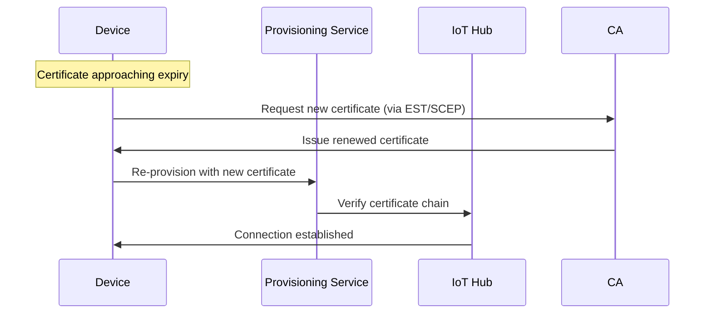

# How to Set Up X.509 Certificate Authentication for Devices in Azure IoT Hub

Author: [nawazdhandala](https://www.github.com/nawazdhandala)

Tags: Azure IoT Hub, X.509 Certificates, Device Authentication, IoT Security, Certificate Authority, TLS, PKI

Description: Step-by-step guide to setting up X.509 certificate-based authentication for IoT devices in Azure IoT Hub for production-grade security.

---

Symmetric keys are the simplest way to authenticate IoT devices in Azure IoT Hub, but they have a significant weakness: the key is a shared secret that lives on both the device and the hub. If someone extracts the key from a device, they can impersonate it. For production deployments, especially in sensitive industries like healthcare, manufacturing, and critical infrastructure, X.509 certificate authentication provides a much stronger security posture. Each device gets its own certificate signed by a trusted certificate authority (CA), and the private key never leaves the device.

This guide covers the full setup process: creating a certificate chain, registering it with IoT Hub, provisioning devices with individual certificates, and testing the connection.

## How X.509 Authentication Works in IoT Hub

When a device connects to IoT Hub using X.509 authentication, the TLS handshake includes the device presenting its client certificate. IoT Hub validates the certificate against the registered CA certificates and checks that the certificate's common name (CN) matches a registered device ID. If everything checks out, the connection is established without any symmetric key exchange.

There are two approaches:

- **CA-signed certificates** - You register a CA certificate with IoT Hub, and any device presenting a certificate signed by that CA (with a matching device ID) is accepted. This is the scalable approach.
- **Self-signed thumbprint** - You register the SHA-256 thumbprint of each device's certificate individually. This works for testing and small deployments but does not scale.

We will focus on the CA-signed approach since that is what you want for production.

## Step 1: Create a Root CA Certificate

In a real production environment, you would use a proper PKI infrastructure or a managed CA service. For this guide, we will create a test CA using OpenSSL. Do not use these certificates in production without hardening your key management.

```bash
# Create a directory structure for the CA
mkdir -p ~/iot-certs/{ca,devices}
cd ~/iot-certs

# Generate the root CA private key (4096-bit RSA)
openssl genrsa -out ca/root-ca.key 4096

# Create the root CA certificate (valid for 10 years)
openssl req -x509 -new -nodes \
  -key ca/root-ca.key \
  -sha256 -days 3650 \
  -out ca/root-ca.pem \
  -subj "/CN=IoT Root CA/O=MyOrg/C=US"

# Verify the certificate
openssl x509 -in ca/root-ca.pem -text -noout | head -20
```

## Step 2: Register the CA Certificate in IoT Hub

Upload the root CA certificate to IoT Hub and verify ownership through a proof-of-possession challenge.

```bash
# Upload the CA certificate to IoT Hub
az iot hub certificate create \
  --hub-name my-iot-hub \
  --name root-ca-cert \
  --path ca/root-ca.pem

# Get the verification code for proof of possession
ETAG=$(az iot hub certificate show \
  --hub-name my-iot-hub \
  --name root-ca-cert \
  --query etag -o tsv)

VERIFICATION_CODE=$(az iot hub certificate generate-verification-code \
  --hub-name my-iot-hub \
  --name root-ca-cert \
  --etag "$ETAG" \
  --query properties.verificationCode -o tsv)

echo "Verification code: $VERIFICATION_CODE"
```

Now create a verification certificate signed by your root CA that has the verification code as its common name.

```bash
# Generate a key for the verification certificate
openssl genrsa -out ca/verification.key 2048

# Create a CSR with the verification code as the CN
openssl req -new \
  -key ca/verification.key \
  -out ca/verification.csr \
  -subj "/CN=$VERIFICATION_CODE"

# Sign the verification certificate with the root CA
openssl x509 -req \
  -in ca/verification.csr \
  -CA ca/root-ca.pem \
  -CAkey ca/root-ca.key \
  -CAcreateserial \
  -out ca/verification.pem \
  -days 1 \
  -sha256

# Get the updated etag
ETAG=$(az iot hub certificate show \
  --hub-name my-iot-hub \
  --name root-ca-cert \
  --query etag -o tsv)

# Verify the CA certificate with IoT Hub
az iot hub certificate verify \
  --hub-name my-iot-hub \
  --name root-ca-cert \
  --path ca/verification.pem \
  --etag "$ETAG"
```

After successful verification, the CA certificate status changes to "Verified" in IoT Hub.

## Step 3: Generate Device Certificates

For each device, create a certificate signed by the root CA. The certificate's common name must match the device ID registered in IoT Hub.

```bash
# Set the device ID
DEVICE_ID="sensor-device-01"

# Generate the device private key
openssl genrsa -out devices/${DEVICE_ID}.key 2048

# Create a certificate signing request (CSR)
# The CN MUST match the device ID in IoT Hub
openssl req -new \
  -key devices/${DEVICE_ID}.key \
  -out devices/${DEVICE_ID}.csr \
  -subj "/CN=${DEVICE_ID}/O=MyOrg/C=US"

# Sign the device certificate with the root CA (valid for 1 year)
openssl x509 -req \
  -in devices/${DEVICE_ID}.csr \
  -CA ca/root-ca.pem \
  -CAkey ca/root-ca.key \
  -CAcreateserial \
  -out devices/${DEVICE_ID}.pem \
  -days 365 \
  -sha256

# Verify the device certificate was signed by the CA
openssl verify -CAfile ca/root-ca.pem devices/${DEVICE_ID}.pem
```

## Step 4: Register the Device in IoT Hub

Register the device with X.509 CA authentication type.

```bash
# Register the device with X.509 CA-signed authentication
az iot hub device-identity create \
  --hub-name my-iot-hub \
  --device-id sensor-device-01 \
  --auth-method x509_ca
```

Note the `--auth-method x509_ca` flag. This tells IoT Hub to validate the device certificate against the registered CA instead of checking a specific thumbprint.

## Step 5: Connect the Device Using its Certificate

Now write device code that connects using the X.509 certificate instead of a symmetric key.

```javascript
// device-x509.js - Connect to IoT Hub using X.509 certificate
const { Client } = require('azure-iot-device');
const { Mqtt } = require('azure-iot-device-mqtt');
const fs = require('fs');

// Read the device certificate and private key
const deviceCert = fs.readFileSync('/path/to/devices/sensor-device-01.pem', 'utf8');
const deviceKey = fs.readFileSync('/path/to/devices/sensor-device-01.key', 'utf8');

// Connection string without SharedAccessKey - using x509 instead
const connectionString = 'HostName=my-iot-hub.azure-devices.net;DeviceId=sensor-device-01;x509=true';

// Create the client with X.509 credentials
const client = Client.fromConnectionString(connectionString, Mqtt);

// Set the certificate options on the client
client.setOptions({
  cert: deviceCert,
  key: deviceKey,
  // If using an intermediate CA, include the full chain
  // ca: fs.readFileSync('/path/to/ca/root-ca.pem', 'utf8')
});

async function main() {
  await client.open();
  console.log('Connected to IoT Hub using X.509 certificate');

  // Send a test message
  const { Message } = require('azure-iot-common');
  const msg = new Message(JSON.stringify({
    temperature: 22.5,
    humidity: 65,
    deviceId: 'sensor-device-01'
  }));

  await client.sendEvent(msg);
  console.log('Telemetry message sent successfully');

  await client.close();
}

main().catch((err) => {
  console.error('Connection failed:', err.message);
  process.exit(1);
});
```

## Certificate Lifecycle Management

Certificates expire. This is a feature, not a bug - it limits the window of exposure if a certificate is compromised. But it means you need a plan for certificate renewal.



For automated certificate rotation, consider using the Azure Device Provisioning Service (DPS) with X.509 enrollment groups. When a device's certificate is renewed, it re-provisions through DPS and gets assigned to the same IoT Hub seamlessly.

## Intermediate CA Certificates

In production, you typically do not sign device certificates directly with the root CA. Instead, you create an intermediate CA and sign device certificates with that. This adds a layer of protection - if the intermediate CA is compromised, you can revoke it without replacing the root CA on every device.

```bash
# Generate intermediate CA key
openssl genrsa -out ca/intermediate-ca.key 4096

# Create intermediate CA CSR
openssl req -new \
  -key ca/intermediate-ca.key \
  -out ca/intermediate-ca.csr \
  -subj "/CN=IoT Intermediate CA/O=MyOrg/C=US"

# Sign with root CA
openssl x509 -req \
  -in ca/intermediate-ca.csr \
  -CA ca/root-ca.pem \
  -CAkey ca/root-ca.key \
  -CAcreateserial \
  -out ca/intermediate-ca.pem \
  -days 1825 \
  -sha256

# Create the full chain file (intermediate + root)
cat ca/intermediate-ca.pem ca/root-ca.pem > ca/chain.pem
```

When using an intermediate CA, upload the full chain to IoT Hub and set the `ca` option in your device code to include the full chain.

## Security Best Practices

Here are the security practices that matter most for X.509 in IoT:

- Store device private keys in a hardware security module (HSM) or trusted platform module (TPM) whenever possible. Software keys on flash storage can be extracted.
- Use separate intermediate CAs for different device groups or regions. This limits the blast radius of a CA compromise.
- Set certificate validity periods based on your rotation capability. If you can rotate certificates automatically, 1 year is fine. If rotation is manual, consider longer periods but accept the higher risk.
- Monitor certificate expiration dates proactively. Create alerts that fire 30, 14, and 7 days before expiration.
- Keep the root CA private key offline, ideally in an air-gapped HSM. Only bring it online to sign intermediate CA certificates.

## Wrapping Up

X.509 certificate authentication is more work to set up than symmetric keys, but the security benefits are substantial. Each device has a unique cryptographic identity, private keys never need to leave the device, and the certificate chain model gives you flexible revocation and rotation options. For any production IoT deployment where security is a concern - and it should always be a concern - X.509 is the right choice. Start with the CA-signed approach and invest in a proper PKI infrastructure early, because retrofitting certificate management onto an existing fleet is far more painful than building it in from the start.
