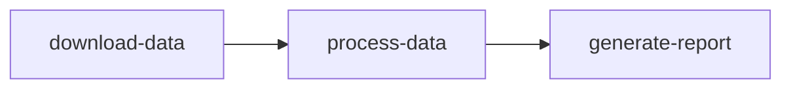

# How to Submit and Monitor Jobs and Tasks in Azure Batch

Author: [nawazdhandala](https://www.github.com/nawazdhandala)

Tags: Azure, Batch, Jobs, Tasks, HPC, Parallel Computing, Monitoring

Description: Learn how to create jobs, submit tasks, manage dependencies, and monitor execution progress in Azure Batch for large-scale parallel workloads.

---

Creating an Azure Batch pool gives you compute capacity. But the pool just sits there idle until you submit work to it. In Azure Batch, work is organized into jobs and tasks. A job is a logical grouping, and tasks are the individual units of work that run on compute nodes. This post covers the full lifecycle - creating jobs, submitting tasks with input files, handling dependencies between tasks, and monitoring progress.

## Understanding the Job and Task Model

The hierarchy in Azure Batch is straightforward:

- **Batch Account** contains everything
- **Pools** are collections of compute nodes (VMs)
- **Jobs** are submitted to a pool and contain tasks
- **Tasks** are command-line operations that run on nodes

A single job can contain thousands or even millions of tasks. Batch handles scheduling them across the available nodes in the pool.

## Step 1: Create a Job

A job is tied to a specific pool. When you create a job, it becomes active and starts accepting tasks.

```bash
# Make sure you are logged in to the Batch account
az batch account login \
  --name mybatchaccount \
  --resource-group batch-rg \
  --shared-key-auth

# Create a job on the compute pool
az batch job create \
  --id render-job-001 \
  --pool-id my-compute-pool
```

You can also set job-level properties like priority and constraints.

```bash
# Create a job with priority and max task retry count
az batch job create \
  --id data-processing-job \
  --pool-id my-compute-pool \
  --priority 100 \
  --max-task-retry-count 3 \
  --max-wall-clock-time "PT24H"
```

The `--max-wall-clock-time` sets a maximum duration for the entire job. If the job exceeds 24 hours, it is automatically terminated.

## Step 2: Submit a Simple Task

A task is a command that runs on one of the pool's compute nodes.

```bash
# Submit a single task
az batch task create \
  --job-id render-job-001 \
  --task-id task-001 \
  --command-line "/bin/bash -c 'echo Hello from Azure Batch && hostname && date'"
```

The `--command-line` is what runs on the node. It can be any shell command, script execution, or application call.

## Step 3: Submit Tasks with Input Files

Most real tasks need input files. You can stage files from Azure Storage using resource files.

First, upload your input data to a blob container.

```bash
# Upload input files to Azure Storage
az storage container create \
  --name input-data \
  --account-name batchstorageacct

az storage blob upload-batch \
  --source ./data \
  --destination input-data \
  --account-name batchstorageacct
```

Then reference the files in the task.

```bash
# Submit a task with resource files from blob storage
az batch task create \
  --job-id data-processing-job \
  --task-id process-001 \
  --command-line "/bin/bash -c 'python3 process.py --input input.csv --output output.csv'" \
  --resource-files '[{"httpUrl": "https://batchstorageacct.blob.core.windows.net/input-data/input.csv", "filePath": "input.csv"}, {"httpUrl": "https://batchstorageacct.blob.core.windows.net/scripts/process.py", "filePath": "process.py"}]'
```

## Step 4: Submit Tasks in Bulk

For large numbers of tasks, use a JSON file to submit them in bulk. This is much faster than submitting one by one.

```json
[
  {
    "id": "frame-001",
    "commandLine": "/bin/bash -c 'ffmpeg -i input.mp4 -vf \"select=eq(n\\,0)\" -vframes 1 frame-001.png'",
    "resourceFiles": [
      {
        "httpUrl": "https://batchstorageacct.blob.core.windows.net/videos/input.mp4",
        "filePath": "input.mp4"
      }
    ],
    "outputFiles": [
      {
        "filePattern": "frame-*.png",
        "destination": {
          "container": {
            "containerUrl": "https://batchstorageacct.blob.core.windows.net/output?sv=..."
          }
        },
        "uploadOptions": {
          "uploadCondition": "taskCompletion"
        }
      }
    ]
  },
  {
    "id": "frame-002",
    "commandLine": "/bin/bash -c 'ffmpeg -i input.mp4 -vf \"select=eq(n\\,30)\" -vframes 1 frame-002.png'",
    "resourceFiles": [
      {
        "httpUrl": "https://batchstorageacct.blob.core.windows.net/videos/input.mp4",
        "filePath": "input.mp4"
      }
    ]
  }
]
```

```bash
# Submit tasks from a JSON file
az batch task create \
  --job-id render-job-001 \
  --json-file tasks.json
```

## Step 5: Configure Task Output Files

Batch can automatically upload task output files to Azure Storage when the task completes.

```json
{
  "id": "analysis-task",
  "commandLine": "/bin/bash -c 'python3 analyze.py > results.json'",
  "outputFiles": [
    {
      "filePattern": "results.json",
      "destination": {
        "container": {
          "containerUrl": "https://batchstorageacct.blob.core.windows.net/results?sv=...",
          "path": "analysis/results.json"
        }
      },
      "uploadOptions": {
        "uploadCondition": "taskSuccess"
      }
    },
    {
      "filePattern": "stderr.txt",
      "destination": {
        "container": {
          "containerUrl": "https://batchstorageacct.blob.core.windows.net/logs?sv=...",
          "path": "analysis/error.log"
        }
      },
      "uploadOptions": {
        "uploadCondition": "taskFailure"
      }
    }
  ]
}
```

The `uploadCondition` can be `taskSuccess`, `taskFailure`, or `taskCompletion` (both).

## Step 6: Set Up Task Dependencies

Some tasks need to wait for others to complete. Batch supports task dependencies for this.

```bash
# Enable task dependencies on the job
az batch job create \
  --id pipeline-job \
  --pool-id my-compute-pool \
  --uses-task-dependencies true
```

Then submit tasks with dependency specifications.

```json
[
  {
    "id": "download-data",
    "commandLine": "/bin/bash -c 'wget https://example.com/dataset.zip && unzip dataset.zip'"
  },
  {
    "id": "process-data",
    "commandLine": "/bin/bash -c 'python3 process.py'",
    "dependsOn": {
      "taskIds": ["download-data"]
    }
  },
  {
    "id": "generate-report",
    "commandLine": "/bin/bash -c 'python3 report.py'",
    "dependsOn": {
      "taskIds": ["process-data"]
    }
  }
]
```

The dependency flow looks like this.



You can also depend on a range of task IDs.

```json
{
  "id": "merge-results",
  "commandLine": "/bin/bash -c 'python3 merge.py'",
  "dependsOn": {
    "taskIdRanges": [
      {
        "start": 1,
        "end": 100
      }
    ]
  }
}
```

This task waits for tasks with IDs "1" through "100" to complete.

## Step 7: Monitor Job and Task Status

Check the overall job status.

```bash
# View job status
az batch job show \
  --job-id render-job-001 \
  --query "{state:state, executionInfo:executionInfo}"

# List all tasks with their states
az batch task list \
  --job-id render-job-001 \
  --output table
```

Get a summary of task counts by state.

```bash
# Get task counts by state
az batch job task-counts show \
  --job-id render-job-001
```

This returns counts for active, running, completed, succeeded, and failed tasks.

## Step 8: View Task Output and Errors

When a task fails, check its stdout and stderr.

```bash
# View the stdout of a specific task
az batch task file download \
  --job-id render-job-001 \
  --task-id task-001 \
  --file-path stdout.txt \
  --destination ./stdout.txt

# View the stderr
az batch task file download \
  --job-id render-job-001 \
  --task-id task-001 \
  --file-path stderr.txt \
  --destination ./stderr.txt
```

You can also list all files on the task's working directory.

```bash
# List files in the task's working directory
az batch task file list \
  --job-id render-job-001 \
  --task-id task-001 \
  --output table
```

## Step 9: Handle Task Failures and Retries

Configure automatic retries for tasks that might fail due to transient issues.

```json
{
  "id": "flaky-task",
  "commandLine": "/bin/bash -c 'python3 process.py'",
  "constraints": {
    "maxTaskRetryCount": 3,
    "maxWallClockTime": "PT1H",
    "retentionTime": "PT7D"
  }
}
```

- `maxTaskRetryCount: 3` retries the task up to 3 times on failure
- `maxWallClockTime: PT1H` kills the task if it runs longer than 1 hour
- `retentionTime: PT7D` keeps the task data for 7 days after completion

## Step 10: Terminate and Clean Up

When all tasks are done, terminate the job. Then delete it to free up resources.

```bash
# Terminate a running job
az batch job set \
  --job-id render-job-001 \
  --on-all-tasks-complete "terminateJob"

# Or terminate immediately
az batch job stop \
  --job-id render-job-001

# Delete the job and all its tasks
az batch job delete \
  --job-id render-job-001 \
  --yes
```

## Monitoring Best Practices

1. **Use task counts, not task lists** for progress monitoring. Listing all tasks is slow when you have thousands. The task counts endpoint is much faster.

2. **Set up the Job Manager task** for complex workflows. A Job Manager task runs on one node and can programmatically submit and monitor other tasks.

3. **Use output file uploads** instead of manually downloading results. Configure output files on each task to automatically upload to storage.

4. **Set realistic timeouts.** A task without a `maxWallClockTime` can run indefinitely, blocking the node. Always set a timeout.

## Summary

Azure Batch jobs and tasks give you a scalable way to run parallel workloads. The key concepts are simple - jobs group tasks, tasks run commands on nodes, and dependencies control execution order. For production workloads, configure output file uploads, set retry policies, and use task dependency chains to build complex processing pipelines. The monitoring tools give you visibility into progress and failures, making it practical to run thousands of tasks reliably.
