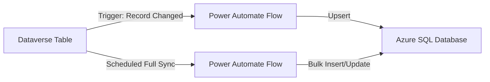

# How to Sync Dataverse Tables with Azure SQL Database Using Power Automate

Author: [nawazdhandala](https://www.github.com/nawazdhandala)

Tags: Dataverse, Azure SQL, Power Automate, Data Sync, Power Platform, ETL, SQL Database

Description: Build a Power Automate flow to synchronize Dataverse tables with Azure SQL Database for reporting, analytics, and integration scenarios.

---

Dataverse is the data platform behind Power Apps and Dynamics 365, but many organizations need that data available in Azure SQL Database for reporting, analytics, or integration with other systems. While Microsoft offers Azure Synapse Link for Dataverse as a managed solution, sometimes you need more control over what syncs, when it syncs, and how the data is transformed. Power Automate gives you that control.

This guide walks through building a Power Automate flow that syncs data from Dataverse tables to Azure SQL Database, handling both initial loads and incremental updates.

## Architecture Overview

The sync approach uses two flow patterns:

1. **Initial full sync**: Runs once to load all existing data from Dataverse to Azure SQL.
2. **Incremental sync**: Runs on a schedule (or triggered by Dataverse changes) to sync only new and modified records.



## Step 1: Prepare the Azure SQL Database

Create a table in Azure SQL that mirrors your Dataverse table structure. Here is an example for syncing the Contacts table:

```sql
-- Create the target table in Azure SQL
-- Column types should match the Dataverse column types
CREATE TABLE dbo.SyncedContacts (
    DataverseId UNIQUEIDENTIFIER PRIMARY KEY,
    FirstName NVARCHAR(200),
    LastName NVARCHAR(200),
    Email NVARCHAR(200),
    Phone NVARCHAR(50),
    Company NVARCHAR(200),
    CreatedOn DATETIME2,
    ModifiedOn DATETIME2,
    SyncedAt DATETIME2 DEFAULT GETUTCDATE()
);

-- Create an index on ModifiedOn for incremental sync queries
CREATE INDEX IX_SyncedContacts_ModifiedOn
ON dbo.SyncedContacts(ModifiedOn);
```

Also create a table to track sync metadata:

```sql
-- Track when each table was last synced
-- The flow reads this to know where to pick up
CREATE TABLE dbo.SyncMetadata (
    TableName NVARCHAR(200) PRIMARY KEY,
    LastSyncTime DATETIME2,
    LastSyncStatus NVARCHAR(50),
    RecordsSynced INT
);

-- Initialize the metadata for our contacts sync
INSERT INTO dbo.SyncMetadata (TableName, LastSyncTime, LastSyncStatus, RecordsSynced)
VALUES ('Contacts', '1900-01-01', 'NotStarted', 0);
```

## Step 2: Create a Stored Procedure for Upserts

Rather than checking if a record exists and then inserting or updating, use a SQL MERGE statement wrapped in a stored procedure:

```sql
-- Upsert procedure that handles both inserts and updates
-- Uses MERGE to atomically insert or update based on the Dataverse ID
CREATE PROCEDURE dbo.sp_UpsertContact
    @DataverseId UNIQUEIDENTIFIER,
    @FirstName NVARCHAR(200),
    @LastName NVARCHAR(200),
    @Email NVARCHAR(200),
    @Phone NVARCHAR(50),
    @Company NVARCHAR(200),
    @CreatedOn DATETIME2,
    @ModifiedOn DATETIME2
AS
BEGIN
    SET NOCOUNT ON;

    MERGE dbo.SyncedContacts AS target
    USING (SELECT @DataverseId AS DataverseId) AS source
    ON target.DataverseId = source.DataverseId
    WHEN MATCHED THEN
        UPDATE SET
            FirstName = @FirstName,
            LastName = @LastName,
            Email = @Email,
            Phone = @Phone,
            Company = @Company,
            ModifiedOn = @ModifiedOn,
            SyncedAt = GETUTCDATE()
    WHEN NOT MATCHED THEN
        INSERT (DataverseId, FirstName, LastName, Email, Phone, Company, CreatedOn, ModifiedOn, SyncedAt)
        VALUES (@DataverseId, @FirstName, @LastName, @Email, @Phone, @Company, @CreatedOn, @ModifiedOn, GETUTCDATE());
END;
```

## Step 3: Build the Incremental Sync Flow

Create a new Power Automate cloud flow with a Recurrence trigger. Set the interval based on how fresh you need the data. Every 15 minutes is reasonable for most reporting scenarios.

### Get the Last Sync Time

Add a SQL Server action to query the sync metadata:

- Action: Execute a SQL query
- Query: `SELECT LastSyncTime FROM dbo.SyncMetadata WHERE TableName = 'Contacts'`

Store the result in a variable.

### Query Dataverse for Changed Records

Add a Dataverse "List rows" action:

- Table name: Contacts
- Filter rows: `modifiedon gt @{variables('LastSyncTime')}`
- Select columns: `contactid,firstname,lastname,emailaddress1,telephone1,parentcustomerid,createdon,modifiedon`
- Order by: `modifiedon asc`

The filter ensures you only fetch records modified since the last sync.

### Loop and Upsert

Add an "Apply to each" loop over the Dataverse results. Inside the loop, add a SQL Server "Execute stored procedure" action:

- Procedure: `sp_UpsertContact`
- Map each Dataverse field to the corresponding procedure parameter.

### Update Sync Metadata

After the loop completes, add a SQL Server action to update the metadata:

- Action: Execute a SQL query
- Query: `UPDATE dbo.SyncMetadata SET LastSyncTime = GETUTCDATE(), LastSyncStatus = 'Success', RecordsSynced = @{length(outputs('List_rows')?['body/value'])} WHERE TableName = 'Contacts'`

## Step 4: Handle Pagination

Dataverse returns a maximum of 5,000 rows per request by default. If your incremental sync pulls more than that, you need to handle pagination.

Enable pagination in the Dataverse "List rows" action:

1. Click the three dots on the action > Settings.
2. Turn on Pagination.
3. Set the threshold to a reasonable number (e.g., 100,000).

Power Automate will automatically make multiple requests to fetch all pages.

## Step 5: Handle Deletions

The trickiest part of data sync is handling deletions. When a record is deleted in Dataverse, there is no "modified" record to pick up. You have a few options.

### Option A: Soft Deletes

If your Dataverse table uses a status field (Active/Inactive), sync the status and filter on it in your reporting queries. This is the simplest approach.

### Option B: Periodic Full Comparison

Run a weekly flow that compares all Dataverse record IDs with the Azure SQL table and removes any records from SQL that no longer exist in Dataverse.

```sql
-- Delete records that no longer exist in Dataverse
-- Pass the list of current Dataverse IDs as a parameter
DELETE FROM dbo.SyncedContacts
WHERE DataverseId NOT IN (
    SELECT DataverseId FROM @CurrentDataverseIds
);
```

### Option C: Use Dataverse Audit Log

Query the Dataverse audit log for delete events and process them in your sync flow. This is the most accurate but also the most complex approach.

## Step 6: Error Handling

Production sync flows need proper error handling. Add these patterns:

### Try-Catch with Scope

Wrap the main sync logic in a Scope action. Add a parallel branch configured to run only on failure. In the failure branch, send an email notification or log to Application Insights.

### Retry Logic

The SQL Server connector in Power Automate has built-in retry logic for transient failures. You can configure it in the action settings:

1. Click the three dots on the SQL action > Settings.
2. Under Retry Policy, set the type to "Fixed interval".
3. Set count to 3 and interval to PT30S (30 seconds).

### Dead Letter Handling

If a specific record fails to sync, do not let it block the entire batch. Add error handling inside the Apply to each loop:

1. Wrap the upsert action in a Scope.
2. Add a parallel branch that runs on failure.
3. In the failure branch, log the failed record ID to a separate error table.

## Step 7: Optimize Performance

Syncing record by record is slow. Here are ways to speed things up:

### Batch Operations

Instead of calling the stored procedure for each record, collect records in an array and send them to SQL in batches using a table-valued parameter:

```sql
-- Table type for batch inserts
CREATE TYPE dbo.ContactBatchType AS TABLE (
    DataverseId UNIQUEIDENTIFIER,
    FirstName NVARCHAR(200),
    LastName NVARCHAR(200),
    Email NVARCHAR(200),
    Phone NVARCHAR(50),
    Company NVARCHAR(200),
    CreatedOn DATETIME2,
    ModifiedOn DATETIME2
);
```

### Concurrency Control

In the Apply to each action settings, set the Degree of Parallelism to a higher number (e.g., 20). This processes multiple records simultaneously.

### Use Premium Connectors Wisely

If you have a premium license, consider using the HTTP action with the Azure SQL REST API for bulk operations instead of the SQL Server connector, which is designed for single-row operations.

## Monitoring the Sync

Build a simple Power BI dashboard that reads from the SyncMetadata table to track:

- Last successful sync time for each table
- Number of records synced per run
- Failure counts over time
- Average sync duration

This gives you visibility into whether the sync is running smoothly or falling behind.

## Wrapping Up

Syncing Dataverse tables to Azure SQL Database with Power Automate gives you flexibility that managed solutions like Synapse Link may not provide. The key components are a well-designed target schema with upsert procedures, incremental sync based on the ModifiedOn timestamp, proper pagination handling, deletion detection, and error handling. Start with a single table, get the pattern working reliably, and then replicate it across other tables. For very high-volume scenarios where Power Automate throughput is not enough, consider Azure Data Factory or custom Azure Functions instead.
