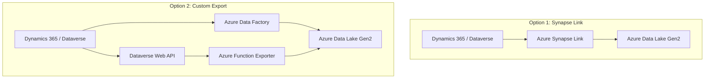

# How to Sync Dynamics 365 Customer Data with Azure Data Lake Using Data Export Service

Author: [nawazdhandala](https://www.github.com/nawazdhandala)

Tags: Dynamics 365, Azure Data Lake, Data Export Service, Dataverse, Data Sync, Analytics, ETL

Description: Sync Dynamics 365 customer data to Azure Data Lake Storage using the Data Export Service for analytics, reporting, and machine learning workloads.

---

Dynamics 365 stores valuable customer data - contacts, accounts, interactions, opportunities, and service cases. But running heavy analytics queries directly against your production CRM is not ideal. It adds load to the system, it is limited by Dataverse query capabilities, and it does not support the kind of data transformations that analytics teams need.

The solution is to export your Dynamics 365 data to Azure Data Lake Storage, where you can run complex queries, build machine learning models, and feed data warehouses without touching your production CRM. In this guide, I will walk through setting up a data sync pipeline from Dynamics 365 to Azure Data Lake Storage Gen2, covering both the Dataverse built-in export and a custom export approach for more control.

## Architecture Options

There are two main approaches to syncing Dynamics 365 data to Azure Data Lake:



Azure Synapse Link is the easiest option but gives you less control over the export format and schedule. A custom export with Azure Data Factory or Azure Functions gives you full control over what gets exported, how it is transformed, and when it runs.

## Option 1: Azure Synapse Link for Dataverse

This is the fastest path. Synapse Link continuously exports Dataverse tables to your data lake in Delta or CSV format:

```bash
# Create the Data Lake Storage account
az storage account create \
  --name std365datalake \
  --resource-group rg-d365-analytics \
  --location eastus \
  --sku Standard_LRS \
  --kind StorageV2 \
  --hns true

# Create a container for the exported data
az storage container create \
  --name d365-export \
  --account-name std365datalake
```

Then configure Synapse Link in the Power Platform admin center:

1. Navigate to your environment settings
2. Go to Data management, then Azure Synapse Link
3. Click "New link to data lake"
4. Select the storage account and container
5. Choose the tables to export: account, contact, lead, opportunity, incident, etc.
6. Select the export format (Delta Lake recommended)

The initial sync can take several hours for large datasets. After that, changes are streamed with about 15-30 minutes of latency.

## Option 2: Custom Export with Azure Functions

For more control over the export, build a custom exporter using the Dataverse Web API:

```csharp
// Azure Function that incrementally exports Dynamics 365 data to Azure Data Lake
public class DataverseExporter
{
    private readonly HttpClient _dataverseClient;
    private readonly DataLakeServiceClient _dataLakeClient;
    private readonly ILogger<DataverseExporter> _logger;

    public DataverseExporter(
        IHttpClientFactory httpClientFactory,
        DataLakeServiceClient dataLakeClient,
        ILogger<DataverseExporter> logger)
    {
        _dataverseClient = httpClientFactory.CreateClient("Dataverse");
        _dataLakeClient = dataLakeClient;
        _logger = logger;
    }

    [Function("ExportCustomerData")]
    public async Task Run(
        [TimerTrigger("0 0 */2 * * *")] TimerInfo timer, // Every 2 hours
        ILogger log)
    {
        // Get the last export timestamp from storage
        var lastExport = await GetLastExportTimestampAsync();

        // Define the entities to export
        var entities = new[]
        {
            new EntityExportConfig("accounts", "account",
                "accountid,name,telephone1,emailaddress1,address1_city,address1_stateorprovince,revenue,numberofemployees,industrycode,createdon,modifiedon"),
            new EntityExportConfig("contacts", "contact",
                "contactid,fullname,emailaddress1,telephone1,jobtitle,parentcustomerid,createdon,modifiedon"),
            new EntityExportConfig("leads", "lead",
                "leadid,fullname,emailaddress1,companyname,leadsourcecode,statuscode,createdon,modifiedon"),
            new EntityExportConfig("opportunities", "opportunity",
                "opportunityid,name,estimatedvalue,actualvalue,closeprobability,statuscode,actualclosedate,parentaccountid,createdon,modifiedon")
        };

        foreach (var entityConfig in entities)
        {
            try
            {
                await ExportEntityAsync(entityConfig, lastExport);
            }
            catch (Exception ex)
            {
                log.LogError(ex,
                    "Failed to export entity: {Entity}", entityConfig.EntityName);
            }
        }

        // Update the last export timestamp
        await SetLastExportTimestampAsync(DateTime.UtcNow);

        log.LogInformation("Customer data export completed");
    }

    private async Task ExportEntityAsync(
        EntityExportConfig config, DateTime lastExport)
    {
        var filter = $"modifiedon gt {lastExport:yyyy-MM-ddTHH:mm:ssZ}";
        var url = $"api/data/v9.2/{config.PluralName}?" +
                  $"$select={config.Columns}&" +
                  $"$filter={filter}&" +
                  $"$orderby=modifiedon asc";

        var allRecords = new List<Dictionary<string, object>>();
        var nextLink = url;

        // Page through all results
        while (!string.IsNullOrEmpty(nextLink))
        {
            var response = await _dataverseClient.GetAsync(nextLink);
            response.EnsureSuccessStatusCode();

            var data = await response.Content
                .ReadFromJsonAsync<DataverseResponse>();

            allRecords.AddRange(data.Value);
            nextLink = data.NextLink;
        }

        if (allRecords.Count == 0)
        {
            _logger.LogInformation(
                "No changes for {Entity} since {LastExport}",
                config.EntityName, lastExport);
            return;
        }

        // Write to Data Lake as a Parquet file
        await WriteToDataLakeAsync(config.FolderName, allRecords);

        _logger.LogInformation(
            "Exported {Count} records for {Entity}",
            allRecords.Count, config.EntityName);
    }

    private async Task WriteToDataLakeAsync(
        string folderName, List<Dictionary<string, object>> records)
    {
        var fileSystem = _dataLakeClient.GetFileSystemClient("d365-export");
        var directory = fileSystem.GetDirectoryClient(
            $"{folderName}/{DateTime.UtcNow:yyyy/MM/dd}");

        await directory.CreateIfNotExistsAsync();

        // Write as JSON Lines format (one JSON object per line)
        var fileName = $"export-{DateTime.UtcNow:HHmmss}.jsonl";
        var fileClient = directory.GetFileClient(fileName);

        var lines = records.Select(r => JsonSerializer.Serialize(r));
        var content = string.Join("\n", lines);
        var bytes = Encoding.UTF8.GetBytes(content);

        using var stream = new MemoryStream(bytes);
        await fileClient.UploadAsync(stream, overwrite: true);
    }

    private async Task<DateTime> GetLastExportTimestampAsync()
    {
        // Read from a state file in the data lake
        var fileSystem = _dataLakeClient.GetFileSystemClient("d365-export");
        var fileClient = fileSystem.GetFileClient("_state/last-export.txt");

        try
        {
            var response = await fileClient.ReadAsync();
            using var reader = new StreamReader(response.Value.Content);
            var timestamp = await reader.ReadToEndAsync();
            return DateTime.Parse(timestamp);
        }
        catch
        {
            // First run - export everything from the last 30 days
            return DateTime.UtcNow.AddDays(-30);
        }
    }

    private async Task SetLastExportTimestampAsync(DateTime timestamp)
    {
        var fileSystem = _dataLakeClient.GetFileSystemClient("d365-export");
        var fileClient = fileSystem.GetFileClient("_state/last-export.txt");

        var content = Encoding.UTF8.GetBytes(timestamp.ToString("o"));
        using var stream = new MemoryStream(content);
        await fileClient.UploadAsync(stream, overwrite: true);
    }
}

public class EntityExportConfig
{
    public string FolderName { get; }
    public string PluralName { get; }
    public string EntityName { get; }
    public string Columns { get; }

    public EntityExportConfig(string pluralName, string entityName, string columns)
    {
        PluralName = pluralName;
        EntityName = entityName;
        FolderName = entityName;
        Columns = columns;
    }
}

public class DataverseResponse
{
    [JsonPropertyName("value")]
    public List<Dictionary<string, object>> Value { get; set; }

    [JsonPropertyName("@odata.nextLink")]
    public string NextLink { get; set; }
}
```

## Data Lake Organization

Organize the exported data in a way that supports efficient querying:

```
d365-export/
    account/
        2026/
            02/
                16/
                    export-020000.jsonl
                    export-040000.jsonl
    contact/
        2026/
            02/
                16/
                    export-020000.jsonl
    opportunity/
        2026/
            02/
                16/
                    export-020000.jsonl
    _state/
        last-export.txt
    _schemas/
        account.json
        contact.json
        opportunity.json
```

The date-partitioned folder structure makes it easy to query specific time ranges and supports incremental processing.

## Processing Data with Azure Databricks or Synapse

Once the data is in the data lake, process it with Synapse Spark or Azure Databricks:

```python
# PySpark code to process customer data from the data lake
from pyspark.sql import SparkSession
from pyspark.sql.functions import col, current_timestamp, lit

spark = SparkSession.builder.appName("D365CustomerAnalytics").getOrCreate()

# Read the latest account data
accounts = spark.read.json("abfss://d365-export@std365datalake.dfs.core.windows.net/account/2026/**/*.jsonl")

# Read the latest opportunity data
opportunities = spark.read.json("abfss://d365-export@std365datalake.dfs.core.windows.net/opportunity/2026/**/*.jsonl")

# Join accounts with their opportunities
customer_pipeline = accounts.alias("a").join(
    opportunities.alias("o"),
    col("a.accountid") == col("o.parentaccountid"),
    "left"
).select(
    col("a.accountid"),
    col("a.name").alias("account_name"),
    col("a.revenue").alias("annual_revenue"),
    col("a.industrycode").alias("industry"),
    col("o.opportunityid"),
    col("o.name").alias("opportunity_name"),
    col("o.estimatedvalue"),
    col("o.statuscode").alias("opportunity_status")
)

# Calculate account-level metrics
account_metrics = customer_pipeline.groupBy("accountid", "account_name", "industry").agg(
    {"estimatedvalue": "sum", "opportunityid": "count"}
).withColumnRenamed("sum(estimatedvalue)", "total_pipeline_value") \
 .withColumnRenamed("count(opportunityid)", "total_opportunities")

# Write results to a curated zone in the data lake
account_metrics.write \
    .mode("overwrite") \
    .parquet("abfss://d365-export@std365datalake.dfs.core.windows.net/_curated/account_metrics/")
```

## Handling Data Privacy and GDPR

Customer data exports need to comply with data protection regulations. Implement these safeguards:

```csharp
// Data masking service for exported customer data
public class DataMaskingService
{
    // Mask personally identifiable information before writing to the data lake
    public Dictionary<string, object> MaskPii(
        Dictionary<string, object> record, string entityType)
    {
        var masked = new Dictionary<string, object>(record);

        switch (entityType)
        {
            case "contact":
                // Mask email addresses
                if (masked.ContainsKey("emailaddress1"))
                    masked["emailaddress1"] = MaskEmail(masked["emailaddress1"]?.ToString());

                // Mask phone numbers
                if (masked.ContainsKey("telephone1"))
                    masked["telephone1"] = MaskPhone(masked["telephone1"]?.ToString());
                break;
        }

        return masked;
    }

    private string MaskEmail(string email)
    {
        if (string.IsNullOrEmpty(email)) return email;
        var parts = email.Split('@');
        if (parts.Length != 2) return "***@***.***";
        return $"{parts[0][0]}***@{parts[1]}";
    }

    private string MaskPhone(string phone)
    {
        if (string.IsNullOrEmpty(phone) || phone.Length < 4) return "****";
        return new string('*', phone.Length - 4) + phone[^4..];
    }
}
```

## Wrapping Up

Syncing Dynamics 365 customer data to Azure Data Lake opens up analytics capabilities that are simply not possible within the CRM itself. Azure Synapse Link provides the quickest path with minimal setup, while a custom export gives you control over what data flows, how it is transformed, and when it runs. Either way, the result is the same: your customer data is available in a platform designed for heavy analytical workloads, without any impact on your production CRM. Build your data lake pipeline once, and your analytics team gets a continuously updated dataset they can query, model, and visualize with their preferred tools.
