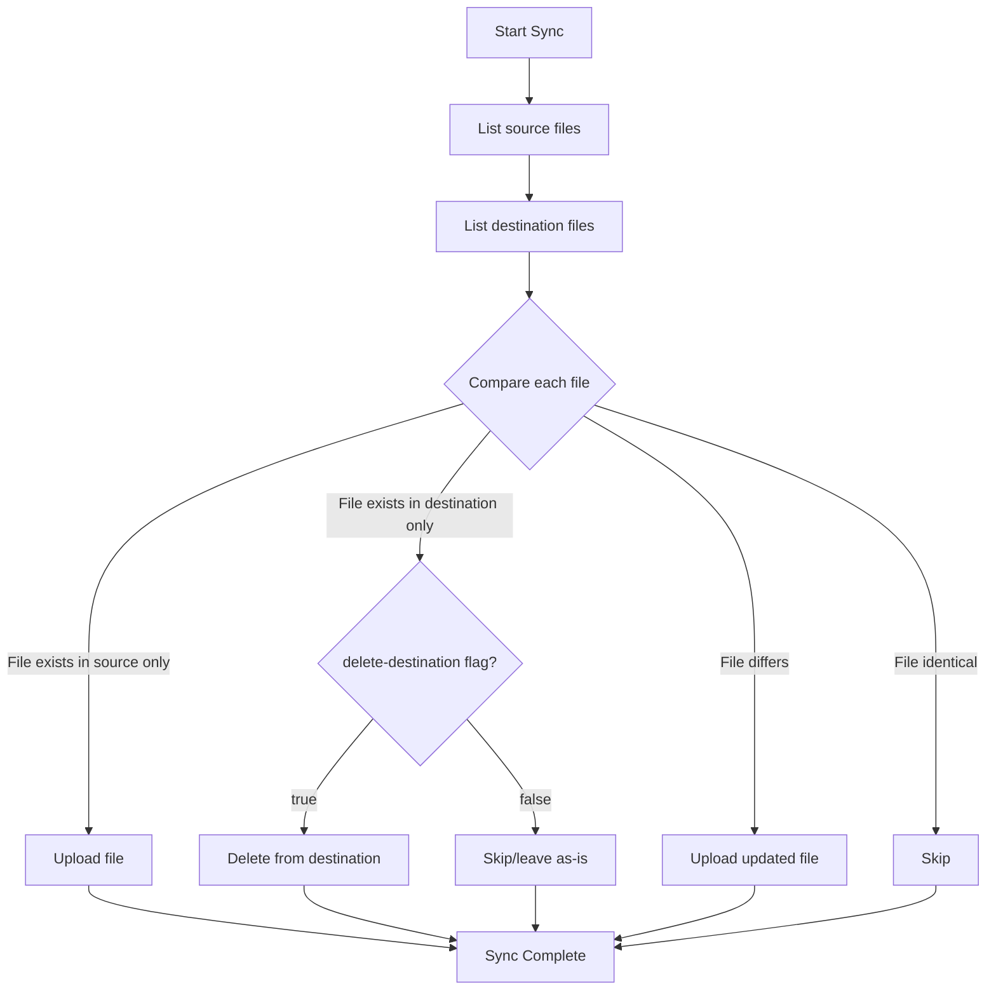

# How to Sync Local Folders with Azure Blob Storage Using AzCopy

Author: [nawazdhandala](https://www.github.com/nawazdhandala)

Tags: Azure, AzCopy, Blob Storage, Data Sync, File Synchronization, Azure Storage, Backup

Description: Learn how to use AzCopy sync to keep local directories and Azure Blob Storage containers in sync, including one-way and bidirectional sync strategies.

---

Uploading files to Azure Blob Storage is one thing. Keeping a local directory continuously synchronized with a blob container is another. The `azcopy sync` command handles this by comparing source and destination, then transferring only the files that have changed. It is like rsync but for Azure Blob Storage.

I use this for everything from keeping backup copies current to deploying static websites. Once you understand how it works, it becomes a natural part of your workflow.

## How AzCopy Sync Works

Unlike `azcopy copy`, which transfers everything you point it at, `azcopy sync` compares the source and destination and only transfers files that are different. The comparison is based on last modified time and file size by default.

Here is the flow:



By default, sync only uploads new or changed files. Files that exist in the destination but not the source are left alone unless you set `--delete-destination=true`.

## Basic Sync: Local to Azure

The simplest sync command pushes a local directory to a blob container:

```bash
# Sync a local directory to an Azure Blob container
# Only uploads files that are new or modified
azcopy sync "./local-data/" "https://mystorageaccount.blob.core.windows.net/mycontainer/"
```

This compares every file in `./local-data/` with the contents of `mycontainer` and uploads anything that has changed since the last sync.

## Sync with Deletion

If you want the destination to mirror the source exactly, including removing files that no longer exist locally:

```bash
# Sync and delete files from destination that do not exist in source
azcopy sync "./local-data/" "https://mystorageaccount.blob.core.windows.net/mycontainer/" \
  --delete-destination=true
```

Be careful with this flag. It permanently deletes blobs from the container that are not present in the local directory. Always test with a non-production container first.

If the container has soft delete enabled, deleted blobs can be recovered during the retention period. This adds a safety net when using `--delete-destination=true`.

## Sync from Azure to Local

You can also sync in the other direction, pulling changes from Azure to a local directory:

```bash
# Sync from Azure Blob container to a local directory
azcopy sync "https://mystorageaccount.blob.core.windows.net/mycontainer/" "./local-copy/"
```

This is useful for maintaining a local mirror of cloud data, or for pulling down updated content that other processes have uploaded to the container.

## Filtering Files During Sync

AzCopy sync supports include and exclude patterns:

```bash
# Sync only specific file types
azcopy sync "./data/" "https://mystorageaccount.blob.core.windows.net/mycontainer/" \
  --include-pattern "*.json;*.csv"
```

```bash
# Exclude certain files from sync
azcopy sync "./project/" "https://mystorageaccount.blob.core.windows.net/mycontainer/" \
  --exclude-pattern "*.tmp;*.log;node_modules/*"
```

You can also exclude specific paths:

```bash
# Exclude specific directories from sync
azcopy sync "./project/" "https://mystorageaccount.blob.core.windows.net/mycontainer/" \
  --exclude-path "build;.git;node_modules"
```

## Sync Comparison Modes

By default, AzCopy compares files using last modified time. If the source file's modified time is more recent than the destination, it gets transferred. You can change this behavior.

### Compare by MD5 Hash

For more accurate comparison, use MD5 hashes. This detects changes even when timestamps are unreliable:

```bash
# Sync using MD5 hash comparison instead of timestamps
azcopy sync "./data/" "https://mystorageaccount.blob.core.windows.net/mycontainer/" \
  --compare-hash=MD5
```

This is slower because AzCopy needs to compute hashes for every file, but it catches cases where a file was modified without its timestamp changing.

Note that for MD5 comparison to work with existing blobs, the blobs must have MD5 hashes stored in their properties. Blobs uploaded with the `--put-md5` flag have these hashes.

## Scheduling Regular Syncs

AzCopy sync does not have a built-in scheduling mechanism. You set up scheduling using your operating system's tools.

### Linux/macOS with Cron

```bash
# Add to crontab: sync every hour
# Open crontab editor with: crontab -e
0 * * * * /usr/local/bin/azcopy sync "/data/backups/" "https://mystorageaccount.blob.core.windows.net/backups/" --log-level ERROR >> /var/log/azcopy-sync.log 2>&1
```

### Windows with Task Scheduler

Create a batch file:

```batch
@echo off
REM sync-to-azure.bat - Syncs local backup directory to Azure
"C:\Tools\AzCopy\azcopy.exe" sync "C:\Backups" "https://mystorageaccount.blob.core.windows.net/backups/" --log-level ERROR
```

Then schedule it using Task Scheduler to run at your preferred interval.

### Using a Systemd Timer (Linux)

For more robust scheduling on Linux, use a systemd timer:

```ini
# /etc/systemd/system/azcopy-sync.service
[Unit]
Description=AzCopy sync to Azure Blob Storage

[Service]
Type=oneshot
ExecStart=/usr/local/bin/azcopy sync "/data/backups/" "https://mystorageaccount.blob.core.windows.net/backups/"
User=backup-service
```

```ini
# /etc/systemd/system/azcopy-sync.timer
[Unit]
Description=Run AzCopy sync every hour

[Timer]
OnCalendar=hourly
Persistent=true

[Install]
WantedBy=timers.target
```

Enable the timer:

```bash
# Enable and start the systemd timer
sudo systemctl enable azcopy-sync.timer
sudo systemctl start azcopy-sync.timer
```

## Authentication for Automated Syncs

For unattended sync jobs, you need non-interactive authentication. The best options are:

### Service Principal

```bash
# Set up environment variables for service principal authentication
export AZCOPY_SPA_APPLICATION_ID="your-app-id"
export AZCOPY_SPA_CLIENT_SECRET="your-client-secret"
export AZCOPY_TENANT_ID="your-tenant-id"

# Log in with the service principal
azcopy login --service-principal \
  --application-id "$AZCOPY_SPA_APPLICATION_ID" \
  --tenant-id "$AZCOPY_TENANT_ID"

# Now run the sync
azcopy sync "./data/" "https://mystorageaccount.blob.core.windows.net/mycontainer/"
```

### Managed Identity (for Azure VMs)

If AzCopy runs on an Azure VM with a managed identity:

```bash
# Log in using the VM's managed identity
azcopy login --identity

# Run the sync
azcopy sync "./data/" "https://mystorageaccount.blob.core.windows.net/mycontainer/"
```

### SAS Token in the URL

For simpler setups, embed a SAS token in the URL. Make sure the token has a long enough expiry for your sync schedule:

```bash
# Sync using a SAS token (no login needed)
azcopy sync "./data/" "https://mystorageaccount.blob.core.windows.net/mycontainer/?sv=2024-08-04&ss=b&srt=sco&sp=rwdl&se=2026-12-31&sig=..."
```

## Sync Performance

AzCopy sync can be slower than `azcopy copy` for initial transfers because it needs to list and compare both source and destination before starting transfers. For subsequent syncs where only a few files have changed, it is much faster because it skips unchanged files.

Tips for improving sync performance:

- **Limit the scope.** Sync specific subdirectories instead of entire containers when possible.
- **Use exclude patterns** to skip directories you know have not changed.
- **Increase concurrency** for high-bandwidth connections:

```bash
# Increase concurrent connections for faster sync
export AZCOPY_CONCURRENCY_VALUE=32
azcopy sync "./data/" "https://mystorageaccount.blob.core.windows.net/mycontainer/"
```

## Dry Run

Unfortunately, AzCopy does not have a native dry-run flag. To preview what would be synced, you can use the `--dry-run` flag which was added in recent versions:

```bash
# Preview what would be synced without actually transferring
azcopy sync "./data/" "https://mystorageaccount.blob.core.windows.net/mycontainer/" \
  --dry-run \
  --delete-destination=true
```

This shows you what files would be uploaded, downloaded, or deleted without actually performing the operations. Always run a dry run before using `--delete-destination=true` on a new sync target.

## Handling Conflicts

AzCopy sync uses a "last writer wins" approach based on the comparison method (timestamp or hash). If a file is modified in both the source and destination between syncs, the source version overwrites the destination when syncing local-to-Azure.

There is no built-in conflict resolution. If you need bidirectional sync with conflict handling, AzCopy sync is not the right tool. Consider Azure File Sync or a purpose-built synchronization service instead.

## Monitoring Sync Jobs

Check the logs after each sync to ensure everything completed successfully:

```bash
# View the most recent job's status
azcopy jobs list

# Show details of the most recent job
azcopy jobs show <job-id>

# Show only failed transfers from a job
azcopy jobs show <job-id> --with-status=Failed
```

For production sync jobs, build monitoring around the exit code. AzCopy returns 0 for success and non-zero for failures. Use this in your scripts:

```bash
# Run sync and check the exit code
azcopy sync "./data/" "https://mystorageaccount.blob.core.windows.net/mycontainer/"
if [ $? -ne 0 ]; then
    echo "Sync failed! Check AzCopy logs for details."
    # Send an alert here
fi
```

## Wrapping Up

AzCopy sync is a practical tool for keeping local directories and Azure Blob Storage in sync. It handles the comparison and incremental transfer automatically, making it well-suited for backup jobs, content deployment, and data distribution. Set up authentication with a service principal or managed identity for automated scenarios, use `--delete-destination=true` carefully, and always test with a dry run before running against production data.
