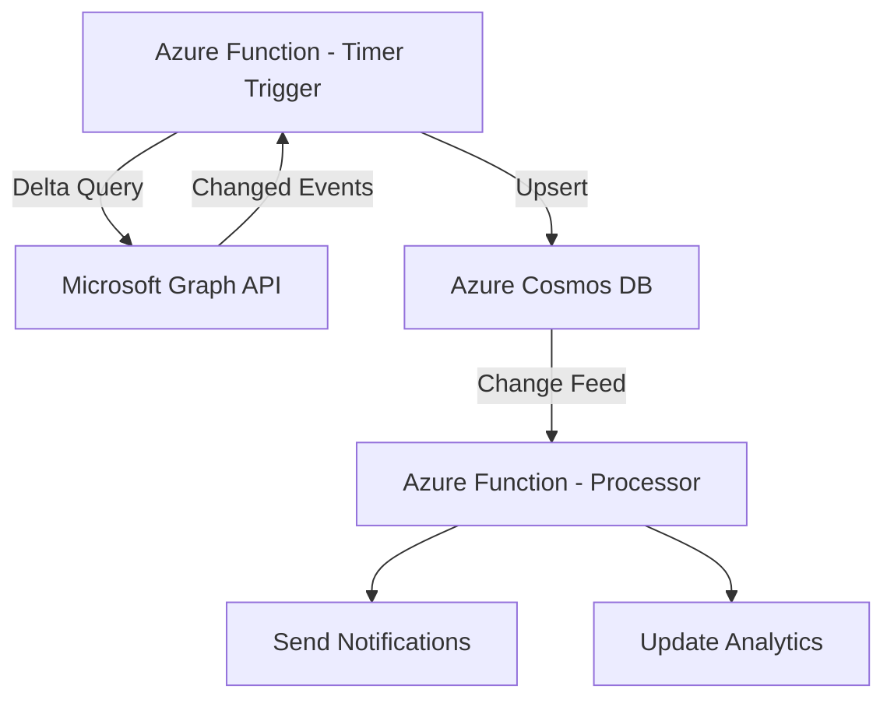

# How to Sync Microsoft 365 Calendar Events to Azure Cosmos DB Using Graph API

Author: [nawazdhandala](https://www.github.com/nawazdhandala)

Tags: Microsoft Graph API, Azure Cosmos DB, Calendar, Microsoft 365, Sync, Azure Functions, Serverless

Description: Build a synchronization pipeline that copies Microsoft 365 calendar events to Azure Cosmos DB using Graph API for custom analytics and search.

---

Microsoft 365 calendars are where organizations track meetings, appointments, and events. But building custom analytics, search, or reporting on top of calendar data is hard when it lives only in Exchange Online. By syncing calendar events to Azure Cosmos DB, you get a queryable, low-latency copy that supports full-text search, aggregation pipelines, and custom APIs that the Graph API alone cannot provide.

This guide covers building a sync pipeline with Azure Functions that uses Microsoft Graph API delta queries to efficiently keep Cosmos DB in sync with Exchange Online calendars.

## Why Cosmos DB for Calendar Data?

Cosmos DB gives you capabilities that Exchange Online does not expose through Graph API:

- Full-text search across all calendar events (Graph API search is limited).
- Cross-user aggregation queries (e.g., "how many meetings does the engineering team have this week?").
- Complex filtering and sorting that Graph API does not support.
- Sub-millisecond read latency for custom calendar UIs.
- Change feed for triggering downstream processes when events change.

## Architecture



## Step 1: Set Up Azure Cosmos DB

Create a Cosmos DB account and container for calendar events:

1. In the Azure portal, create a new Cosmos DB account (NoSQL API).
2. Create a database called `calendar-sync`.
3. Create a container called `events` with:
   - Partition key: `/userId`
   - Enable analytical store if you want to run analytics queries.

The document structure for a calendar event:

```json
{
    "id": "AAMkAGI2TG...",
    "userId": "user@contoso.com",
    "subject": "Weekly Team Standup",
    "bodyPreview": "Agenda: Project updates, blockers...",
    "start": {
        "dateTime": "2026-02-16T09:00:00",
        "timeZone": "Pacific Standard Time"
    },
    "end": {
        "dateTime": "2026-02-16T09:30:00",
        "timeZone": "Pacific Standard Time"
    },
    "location": {
        "displayName": "Conference Room B"
    },
    "organizer": {
        "emailAddress": {
            "name": "Alice Smith",
            "address": "alice@contoso.com"
        }
    },
    "attendees": [
        {
            "emailAddress": {
                "name": "Bob Jones",
                "address": "bob@contoso.com"
            },
            "status": {
                "response": "accepted"
            }
        }
    ],
    "isAllDay": false,
    "isCancelled": false,
    "sensitivity": "normal",
    "syncedAt": "2026-02-16T08:00:00Z",
    "deltaLink": null
}
```

## Step 2: Register the Azure AD Application

Create an app registration with the right permissions:

1. Register a new app in Azure AD.
2. Add Application permissions (not Delegated since this is a background sync):
   - `Calendars.Read` - Read all users' calendars
   - `User.Read.All` - List users to know whose calendars to sync
3. Grant admin consent.
4. Create a client secret.

## Step 3: Build the Delta Sync Function

Delta queries are the key to efficient sync. Instead of fetching all events every time, a delta query returns only the events that changed since the last sync.

```csharp
// Timer-triggered function that syncs calendar events using delta queries
// Runs every 5 minutes to keep Cosmos DB up to date
using Microsoft.Azure.WebJobs;
using Microsoft.Azure.Cosmos;
using Microsoft.Graph;
using Microsoft.Extensions.Logging;
using System.Collections.Generic;
using System.Threading.Tasks;

public class CalendarSyncFunction
{
    private readonly GraphServiceClient _graphClient;
    private readonly Container _cosmosContainer;
    private readonly Container _syncStateContainer;

    public CalendarSyncFunction(
        GraphServiceClient graphClient,
        CosmosClient cosmosClient)
    {
        _graphClient = graphClient;
        var database = cosmosClient.GetDatabase("calendar-sync");
        _cosmosContainer = database.GetContainer("events");
        _syncStateContainer = database.GetContainer("sync-state");
    }

    [FunctionName("SyncCalendarEvents")]
    public async Task Run(
        [TimerTrigger("0 */5 * * * *")] TimerInfo timer,
        ILogger log)
    {
        // Get the list of users to sync
        var users = await GetUsersToSync();
        log.LogInformation($"Syncing calendars for {users.Count} users");

        foreach (var userId in users)
        {
            try
            {
                await SyncUserCalendar(userId, log);
            }
            catch (Exception ex)
            {
                log.LogError(ex, $"Failed to sync calendar for {userId}");
            }
        }
    }

    private async Task SyncUserCalendar(string userId, ILogger log)
    {
        // Get the delta link from the last sync
        var syncState = await GetSyncState(userId);

        IEnumerable<Event> changedEvents;
        string newDeltaLink;

        if (syncState?.DeltaLink != null)
        {
            // Use the delta link to get only changes since last sync
            var deltaResult = await _graphClient.Users[userId]
                .CalendarView
                .Delta
                .GetAsync(config => {
                    // The delta link contains the previous query parameters
                });

            changedEvents = deltaResult.Value;
            newDeltaLink = deltaResult.OdataNextLink ?? deltaResult.OdataDeltaLink;
        }
        else
        {
            // First sync - get all events from the last 6 months
            var startDate = DateTime.UtcNow.AddMonths(-6);
            var endDate = DateTime.UtcNow.AddMonths(6);

            var events = await _graphClient.Users[userId]
                .CalendarView
                .GetAsync(config => {
                    config.QueryParameters.StartDateTime = startDate.ToString("o");
                    config.QueryParameters.EndDateTime = endDate.ToString("o");
                    config.QueryParameters.Select = new[] {
                        "id", "subject", "bodyPreview", "start", "end",
                        "location", "organizer", "attendees", "isAllDay",
                        "isCancelled", "sensitivity"
                    };
                    config.QueryParameters.Top = 500;
                });

            changedEvents = events.Value;
            newDeltaLink = events.OdataDeltaLink;
        }

        // Upsert changed events to Cosmos DB
        int upsertCount = 0;
        foreach (var evt in changedEvents)
        {
            var cosmosEvent = MapToCosmosDocument(userId, evt);
            await _cosmosContainer.UpsertItemAsync(
                cosmosEvent,
                new PartitionKey(userId)
            );
            upsertCount++;
        }

        // Save the new delta link for the next sync
        await SaveSyncState(userId, newDeltaLink);

        log.LogInformation($"Synced {upsertCount} events for {userId}");
    }

    private CalendarEventDocument MapToCosmosDocument(string userId, Event evt)
    {
        return new CalendarEventDocument
        {
            Id = evt.Id,
            UserId = userId,
            Subject = evt.Subject,
            BodyPreview = evt.BodyPreview,
            Start = evt.Start,
            End = evt.End,
            Location = evt.Location,
            Organizer = evt.Organizer,
            Attendees = evt.Attendees,
            IsAllDay = evt.IsAllDay ?? false,
            IsCancelled = evt.IsCancelled ?? false,
            Sensitivity = evt.Sensitivity?.ToString(),
            SyncedAt = DateTime.UtcNow
        };
    }
}
```

## Step 4: Handle Deletions

Delta queries indicate deleted events by including them in the response with a `@removed` annotation. Handle these by deleting the corresponding Cosmos DB document:

```csharp
// Check if the event was deleted in the delta response
// Deleted events have a @removed reason property
foreach (var evt in deltaResponse.Value)
{
    if (evt.AdditionalData.ContainsKey("@removed"))
    {
        // Event was deleted - remove from Cosmos DB
        try
        {
            await _cosmosContainer.DeleteItemAsync<CalendarEventDocument>(
                evt.Id,
                new PartitionKey(userId)
            );
            log.LogInformation($"Deleted event {evt.Id} for {userId}");
        }
        catch (CosmosException ex) when (ex.StatusCode == System.Net.HttpStatusCode.NotFound)
        {
            // Already deleted, ignore
        }
    }
    else
    {
        // Event was created or updated - upsert
        var cosmosEvent = MapToCosmosDocument(userId, evt);
        await _cosmosContainer.UpsertItemAsync(cosmosEvent, new PartitionKey(userId));
    }
}
```

## Step 5: Build Query APIs on Top of Cosmos DB

Now that the data is in Cosmos DB, build APIs for querying it:

```csharp
// API that searches calendar events across all users
// Something Graph API cannot do efficiently
[FunctionName("SearchEvents")]
public async Task<IActionResult> SearchEvents(
    [HttpTrigger(AuthorizationLevel.Function, "get")] HttpRequest req,
    ILogger log)
{
    string searchTerm = req.Query["q"];
    string startDate = req.Query["from"];
    string endDate = req.Query["to"];

    // Build the Cosmos DB SQL query
    var query = new QueryDefinition(
        @"SELECT * FROM c
          WHERE CONTAINS(LOWER(c.subject), LOWER(@search))
          AND c.start.dateTime >= @startDate
          AND c.start.dateTime <= @endDate
          ORDER BY c.start.dateTime ASC")
        .WithParameter("@search", searchTerm)
        .WithParameter("@startDate", startDate)
        .WithParameter("@endDate", endDate);

    var results = new List<CalendarEventDocument>();
    var iterator = _cosmosContainer.GetItemQueryIterator<CalendarEventDocument>(query);

    while (iterator.HasMoreResults)
    {
        var page = await iterator.ReadNextAsync();
        results.AddRange(page);
    }

    return new OkObjectResult(results);
}

// API that returns meeting analytics
// Aggregates meeting data across the organization
[FunctionName("MeetingAnalytics")]
public async Task<IActionResult> GetMeetingAnalytics(
    [HttpTrigger(AuthorizationLevel.Function, "get")] HttpRequest req,
    ILogger log)
{
    string startDate = req.Query["from"];
    string endDate = req.Query["to"];

    var query = new QueryDefinition(
        @"SELECT
            c.userId,
            COUNT(1) AS meetingCount,
            AVG(DateTimeDiff('minute', c.start.dateTime, c.end.dateTime)) AS avgDuration
          FROM c
          WHERE c.start.dateTime >= @startDate
          AND c.start.dateTime <= @endDate
          AND c.isCancelled = false
          GROUP BY c.userId")
        .WithParameter("@startDate", startDate)
        .WithParameter("@endDate", endDate);

    var results = new List<dynamic>();
    var iterator = _cosmosContainer.GetItemQueryIterator<dynamic>(query);

    while (iterator.HasMoreResults)
    {
        var page = await iterator.ReadNextAsync();
        results.AddRange(page);
    }

    return new OkObjectResult(results);
}
```

## Step 6: Use Cosmos DB Change Feed for Real-Time Processing

The Cosmos DB change feed triggers a function whenever an event is created or updated in the container:

```csharp
// Change feed processor that reacts to calendar event changes
// Use this for real-time notifications or downstream updates
[FunctionName("ProcessCalendarChanges")]
public async Task Run(
    [CosmosDBTrigger(
        databaseName: "calendar-sync",
        containerName: "events",
        Connection = "CosmosDBConnection",
        LeaseContainerName = "leases",
        CreateLeaseContainerIfNotExists = true)]
    IReadOnlyList<CalendarEventDocument> changes,
    ILogger log)
{
    foreach (var evt in changes)
    {
        log.LogInformation($"Calendar event changed: {evt.Subject} for {evt.UserId}");

        // Example: Send a Teams notification for new events
        if (evt.SyncedAt > DateTime.UtcNow.AddMinutes(-5))
        {
            // This is a recently synced event - might be new
            await SendTeamsNotification(evt);
        }

        // Example: Update a search index
        await UpdateSearchIndex(evt);
    }
}
```

## Step 7: Handle Edge Cases

### Recurring Events

Graph API returns individual instances of recurring events in calendar view queries. Each instance has a unique ID. Store them as separate documents in Cosmos DB.

### Time Zone Handling

Calendar events include time zone information. Store the original time zone and also store a UTC-normalized version for consistent querying:

```csharp
// Add UTC normalized times for consistent querying
cosmosEvent.StartUtc = TimeZoneInfo.ConvertTimeToUtc(
    DateTime.Parse(evt.Start.DateTime),
    TimeZoneInfo.FindSystemTimeZoneById(evt.Start.TimeZone)
);
```

### Large Tenants

For organizations with thousands of users, syncing all calendars sequentially takes too long. Use Azure Durable Functions to fan out the sync across users:

```csharp
// Orchestrator that fans out calendar sync across all users
[FunctionName("SyncAllCalendarsOrchestrator")]
public async Task Run(
    [OrchestrationTrigger] IDurableOrchestrationContext context)
{
    var users = await context.CallActivityAsync<List<string>>("GetUsersToSync");

    // Fan out - sync all users in parallel
    var syncTasks = users.Select(userId =>
        context.CallActivityAsync("SyncUserCalendar", userId)
    );

    await Task.WhenAll(syncTasks);
}
```

### Graph API Throttling

When syncing many users, you will hit Graph API rate limits. Implement throttling awareness in your sync:

- Respect the `Retry-After` header.
- Limit concurrent requests per tenant to 10-20.
- Spread sync times across the schedule window rather than syncing all users at once.

## Wrapping Up

Syncing Microsoft 365 calendar events to Azure Cosmos DB opens up capabilities that the Graph API alone does not support: cross-user search, meeting analytics, real-time change processing, and custom APIs with sub-millisecond latency. The delta query pattern ensures efficient incremental sync, Cosmos DB's change feed enables real-time downstream processing, and the partition-per-user design scales to large organizations. Handle edge cases like recurring events, time zones, and API throttling to make the system production-ready.
