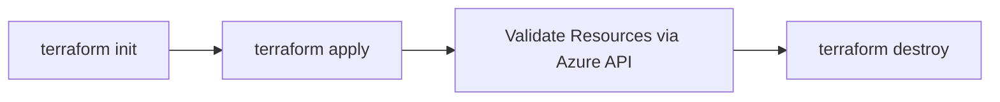

# How to Test Terraform Azure Infrastructure with Terratest in Go

Author: [nawazdhandala](https://www.github.com/nawazdhandala)

Tags: Terraform, Azure, Terratest, Go, Testing, Infrastructure as Code, DevOps

Description: Learn how to write automated integration tests for your Terraform Azure infrastructure using Terratest in Go to catch issues before they reach production.

---

Testing infrastructure code is one of those things that everyone agrees is important but few teams actually do well. Unit testing Terraform with mocks only gets you so far - the real value comes from integration tests that deploy actual resources, verify they work correctly, and tear them down. Terratest by Gruntwork is the most widely used framework for this, and it works exceptionally well with Azure.

In this post, I will show you how to write comprehensive Terratest tests for Azure Terraform modules, from setting up the test environment to writing assertions that validate real Azure resources.

## Why Terratest?

Terratest is a Go library that provides helper functions for testing infrastructure code. It handles the Terraform lifecycle (init, plan, apply, destroy) and gives you functions to interact with Azure APIs to verify that resources were created correctly.

The core flow is:



Tests are written in Go, which might seem odd if you are not a Go developer. But the test code is simple enough that you can be productive without deep Go expertise. The syntax is straightforward and Terratest handles most of the heavy lifting.

## Project Setup

Start by initializing a Go module in your Terraform project:

```bash
# Navigate to your test directory
mkdir -p test
cd test

# Initialize a Go module
go mod init github.com/yourorg/terraform-azure-modules/test

# Install Terratest and Azure SDK dependencies
go get github.com/gruntwork-io/terratest/modules/terraform
go get github.com/gruntwork-io/terratest/modules/azure
go get github.com/stretchr/testify/assert
```

Your project structure should look like this:

```
terraform-azure-modules/
  modules/
    resource-group/
      main.tf
      variables.tf
      outputs.tf
    virtual-network/
      main.tf
      variables.tf
      outputs.tf
  test/
    go.mod
    go.sum
    resource_group_test.go
    virtual_network_test.go
```

## The Terraform Module Under Test

Here is a simple module we will test - it creates a resource group with specific tags:

```hcl
# modules/resource-group/main.tf - Simple resource group module

variable "name" {
  description = "Name of the resource group"
  type        = string
}

variable "location" {
  description = "Azure region"
  type        = string
  default     = "eastus2"
}

variable "tags" {
  description = "Tags to apply"
  type        = map(string)
  default     = {}
}

resource "azurerm_resource_group" "this" {
  name     = var.name
  location = var.location
  tags     = merge(var.tags, {
    ManagedBy = "Terraform"
  })
}

output "name" {
  value = azurerm_resource_group.this.name
}

output "location" {
  value = azurerm_resource_group.this.location
}

output "id" {
  value = azurerm_resource_group.this.id
}
```

## Writing Your First Test

Here is a complete Terratest test for the resource group module:

```go
// test/resource_group_test.go - Integration test for the resource group module

package test

import (
	"fmt"
	"testing"
	"strings"
	"math/rand"
	"time"

	"github.com/gruntwork-io/terratest/modules/azure"
	"github.com/gruntwork-io/terratest/modules/terraform"
	"github.com/stretchr/testify/assert"
)

// generateUniqueName creates a random name to avoid conflicts between test runs
func generateUniqueName(prefix string) string {
	rand.Seed(time.Now().UnixNano())
	return fmt.Sprintf("%s-%d", prefix, rand.Intn(99999))
}

func TestResourceGroupModule(t *testing.T) {
	// Run tests in parallel to speed up the test suite
	t.Parallel()

	// Generate a unique name to avoid collisions with other test runs
	rgName := generateUniqueName("rg-test")
	expectedLocation := "eastus2"

	// Configure the Terraform options
	terraformOptions := &terraform.Options{
		// Path to the Terraform module being tested
		TerraformDir: "../modules/resource-group",

		// Variables to pass to the module
		Vars: map[string]interface{}{
			"name":     rgName,
			"location": expectedLocation,
			"tags": map[string]string{
				"Environment": "Test",
				"Project":     "Terratest",
			},
		},

		// Disable color in output for cleaner CI logs
		NoColor: true,
	}

	// Ensure resources are destroyed after the test, even if it fails
	defer terraform.Destroy(t, terraformOptions)

	// Run terraform init and terraform apply
	terraform.InitAndApply(t, terraformOptions)

	// Get outputs from the Terraform module
	outputName := terraform.Output(t, terraformOptions, "name")
	outputLocation := terraform.Output(t, terraformOptions, "location")
	outputId := terraform.Output(t, terraformOptions, "id")

	// Assert that the outputs match our expectations
	assert.Equal(t, rgName, outputName, "Resource group name should match input")
	assert.Equal(t, expectedLocation, outputLocation, "Location should match input")
	assert.True(t, strings.HasPrefix(outputId, "/subscriptions/"), "ID should be a valid Azure resource ID")

	// Verify the resource group actually exists in Azure using the Azure SDK
	exists := azure.ResourceGroupExists(t, rgName, "")
	assert.True(t, exists, "Resource group should exist in Azure")

	// Verify tags were applied correctly using the Azure API
	rg, err := azure.GetAResourceGroupE(rgName, "")
	assert.NoError(t, err)
	assert.Equal(t, "Test", rg.Tags["Environment"], "Environment tag should be set")
	assert.Equal(t, "Terratest", rg.Tags["Project"], "Project tag should be set")
	assert.Equal(t, "Terraform", rg.Tags["ManagedBy"], "ManagedBy tag should be auto-added")
}
```

## Testing a Virtual Network Module

Now let us test something more complex - a virtual network module with subnets:

```hcl
# modules/virtual-network/main.tf - VNet module to test

variable "name" {
  type = string
}

variable "resource_group_name" {
  type = string
}

variable "location" {
  type    = string
  default = "eastus2"
}

variable "address_space" {
  type    = list(string)
  default = ["10.0.0.0/16"]
}

variable "subnets" {
  type = map(object({
    address_prefixes = list(string)
  }))
  default = {}
}

resource "azurerm_virtual_network" "this" {
  name                = var.name
  location            = var.location
  resource_group_name = var.resource_group_name
  address_space       = var.address_space
}

resource "azurerm_subnet" "this" {
  for_each             = var.subnets
  name                 = each.key
  resource_group_name  = var.resource_group_name
  virtual_network_name = azurerm_virtual_network.this.name
  address_prefixes     = each.value.address_prefixes
}

output "vnet_name" {
  value = azurerm_virtual_network.this.name
}

output "vnet_id" {
  value = azurerm_virtual_network.this.id
}

output "subnet_ids" {
  value = { for k, v in azurerm_subnet.this : k => v.id }
}
```

And the test:

```go
// test/virtual_network_test.go - Integration test for the VNet module

package test

import (
	"testing"

	"github.com/gruntwork-io/terratest/modules/azure"
	"github.com/gruntwork-io/terratest/modules/terraform"
	"github.com/stretchr/testify/assert"
	"github.com/stretchr/testify/require"
)

func TestVirtualNetworkModule(t *testing.T) {
	t.Parallel()

	// Generate unique names for test isolation
	rgName := generateUniqueName("rg-vnet-test")
	vnetName := generateUniqueName("vnet-test")
	subscriptionID := ""  // Empty string uses the default subscription

	// First, create a resource group for the test
	rgOptions := &terraform.Options{
		TerraformDir: "../modules/resource-group",
		Vars: map[string]interface{}{
			"name":     rgName,
			"location": "eastus2",
		},
		NoColor: true,
	}

	defer terraform.Destroy(t, rgOptions)
	terraform.InitAndApply(t, rgOptions)

	// Now test the virtual network module
	vnetOptions := &terraform.Options{
		TerraformDir: "../modules/virtual-network",
		Vars: map[string]interface{}{
			"name":                vnetName,
			"resource_group_name": rgName,
			"location":            "eastus2",
			"address_space":       []string{"10.0.0.0/16"},
			"subnets": map[string]interface{}{
				"web": map[string]interface{}{
					"address_prefixes": []string{"10.0.1.0/24"},
				},
				"app": map[string]interface{}{
					"address_prefixes": []string{"10.0.2.0/24"},
				},
				"db": map[string]interface{}{
					"address_prefixes": []string{"10.0.3.0/24"},
				},
			},
		},
		NoColor: true,
	}

	defer terraform.Destroy(t, vnetOptions)
	terraform.InitAndApply(t, vnetOptions)

	// Verify the VNet exists and has correct address space
	vnetExists := azure.VirtualNetworkExists(t, vnetName, rgName, subscriptionID)
	assert.True(t, vnetExists, "Virtual network should exist")

	// Check that all subnets were created
	actualSubnets := azure.GetVirtualNetworkSubnets(t, vnetName, rgName, subscriptionID)
	require.Len(t, actualSubnets, 3, "Should have exactly 3 subnets")

	// Verify each subnet exists with the correct address prefix
	subnetNames := make([]string, 0, len(actualSubnets))
	for name := range actualSubnets {
		subnetNames = append(subnetNames, name)
	}
	assert.Contains(t, subnetNames, "web", "Should have a web subnet")
	assert.Contains(t, subnetNames, "app", "Should have an app subnet")
	assert.Contains(t, subnetNames, "db", "Should have a db subnet")

	// Verify the Terraform outputs
	vnetId := terraform.Output(t, vnetOptions, "vnet_id")
	assert.NotEmpty(t, vnetId, "VNet ID output should not be empty")
}
```

## Running the Tests

Run the tests with Go's built-in test runner:

```bash
# Run all tests with extended timeout (Azure deployments take time)
cd test
go test -v -timeout 30m

# Run a specific test
go test -v -timeout 30m -run TestResourceGroupModule

# Run tests in parallel with a limit on concurrency
go test -v -timeout 30m -parallel 4
```

The `-timeout` flag is important. Azure resource deployments can take several minutes, and Go's default 10-minute timeout is often not enough.

## Best Practices for Terratest

After writing hundreds of infrastructure tests, here are the practices that matter most:

**Always use `defer terraform.Destroy`.** This ensures cleanup happens even when tests fail. Without it, failed tests leave orphaned resources that cost money.

**Generate unique resource names.** Use random suffixes to avoid name collisions when tests run in parallel or when previous test runs did not clean up properly.

**Run tests in parallel.** Use `t.Parallel()` and Go's `-parallel` flag. Infrastructure tests are slow because they wait for Azure deployments. Running them in parallel reduces total test time significantly.

**Use a dedicated subscription for testing.** You do not want test resources appearing in production subscriptions. A dedicated test subscription with budget alerts prevents unexpected costs.

**Test the plan output too.** Sometimes you want to verify what Terraform will do without actually deploying. Terratest has `terraform.InitAndPlan` for this:

```go
// Test that the plan produces expected changes
func TestVNetPlanChanges(t *testing.T) {
    t.Parallel()

    options := &terraform.Options{
        TerraformDir: "../modules/virtual-network",
        Vars: map[string]interface{}{
            "name":                "vnet-plan-test",
            "resource_group_name": "rg-plan-test",
        },
        NoColor: true,
    }

    // Run plan and get the exit code
    // Exit code 2 means changes detected (which is expected for a new deployment)
    exitCode := terraform.InitAndPlanWithExitCode(t, options)
    assert.Equal(t, 2, exitCode, "Plan should detect changes for new resources")
}
```

## CI/CD Integration

Add Terratest to your CI pipeline to catch issues on every pull request:

```yaml
# .github/workflows/test-modules.yml
name: Test Terraform Modules

on:
  pull_request:
    paths:
      - 'modules/**'
      - 'test/**'

jobs:
  test:
    runs-on: ubuntu-latest
    env:
      ARM_CLIENT_ID: ${{ secrets.AZURE_CLIENT_ID }}
      ARM_CLIENT_SECRET: ${{ secrets.AZURE_CLIENT_SECRET }}
      ARM_SUBSCRIPTION_ID: ${{ secrets.AZURE_SUBSCRIPTION_ID }}
      ARM_TENANT_ID: ${{ secrets.AZURE_TENANT_ID }}

    steps:
      - uses: actions/checkout@v4
      - uses: actions/setup-go@v5
        with:
          go-version: '1.22'
      - uses: hashicorp/setup-terraform@v3
        with:
          terraform_version: '1.7.0'

      - name: Run Terratest
        working-directory: test
        run: go test -v -timeout 30m -parallel 4
```

## Wrapping Up

Terratest gives you confidence that your Terraform modules work correctly on real Azure infrastructure. The investment in writing tests pays for itself the first time they catch a breaking change before it reaches production. Start with simple tests that verify resources exist, then gradually add more specific assertions as your modules mature. The key is making tests a required part of your module development workflow - not an afterthought.
