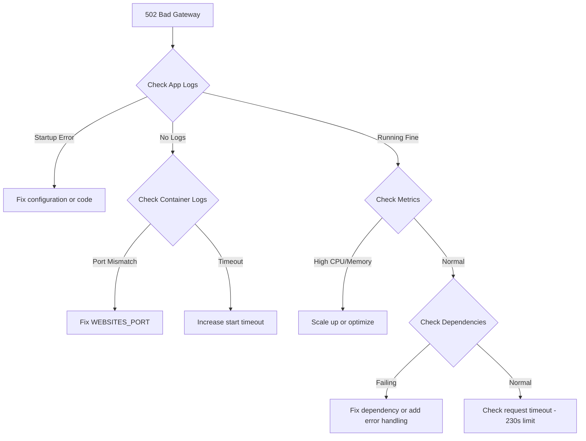

# How to Troubleshoot 502 Bad Gateway Errors on Azure App Service

Author: [nawazdhandala](https://www.github.com/nawazdhandala)

Tags: Azure, App Service, Troubleshooting, 502 Error, Bad Gateway, Debugging, Cloud Computing

Description: A systematic guide to diagnosing and fixing 502 Bad Gateway errors on Azure App Service including common causes and proven solutions.

---

Few errors are more frustrating than a 502 Bad Gateway. Your application was working fine, and now users are seeing this generic error with almost no information about what went wrong. On Azure App Service, 502 errors have a handful of common causes, and once you know what to look for, they are usually straightforward to fix.

This post walks through the most common causes of 502 errors on Azure App Service and how to track each one down.

## What a 502 Bad Gateway Actually Means

A 502 Bad Gateway error means the front-end proxy (in Azure App Service, this is the HTTP platform layer) sent a request to your application process, but got an invalid or no response back. The proxy sits between the internet and your app, forwarding requests and returning responses. When your app does not respond properly, the proxy has no choice but to return a 502.

On Azure App Service, the proxy is different depending on the OS:

- **Windows** - IIS with the HttpPlatformHandler or ASP.NET Core Module
- **Linux** - Nginx or a custom reverse proxy

## Common Causes and Fixes

### 1. Application Crash or Startup Failure

The most common cause of 502 errors is that your application process has crashed or failed to start. The proxy tries to forward the request, but there is no application listening.

**How to diagnose:**

Check the application logs. On Linux, check stdout/stderr logs:

```bash
# Stream logs to see what your app is doing
az webapp log tail \
    --name my-app-service \
    --resource-group my-resource-group

# Download logs for offline analysis
az webapp log download \
    --name my-app-service \
    --resource-group my-resource-group \
    --log-file logs.zip
```

Look for:

- Unhandled exceptions during startup
- Missing configuration values or environment variables
- Missing dependencies or runtime version mismatches

**How to fix:**

Fix the startup error. Common culprits include:

- Missing app settings that your application requires at startup
- Wrong runtime version (e.g., deploying a Node 20 app to a Node 18 runtime)
- Missing native dependencies on Linux

### 2. Application Timeout

Azure App Service has a default request timeout of 230 seconds. If your application takes longer than that to respond, the proxy returns a 502.

**How to diagnose:**

Look at the timing of 502 errors. If they consistently appear after about 230 seconds, you have a timeout issue.

Check Application Insights for long-running requests:

```
// KQL query to find slow requests in Application Insights
requests
| where timestamp > ago(1h)
| where duration > 200000  // Duration in milliseconds (200 seconds)
| project timestamp, name, url, duration, resultCode
| order by duration desc
```

**How to fix:**

The 230-second timeout is not configurable. If you have requests that genuinely need more time, you need to change your approach:

- Move long-running work to a background process (WebJob or Azure Function)
- Use async patterns where the client submits a request and polls for results
- Optimize the slow operation

### 3. Port Mismatch (Linux/Container)

On Linux and container-based App Services, a very common cause of 502 errors is that the application is listening on the wrong port. Azure App Service expects your app to listen on a specific port.

**How to diagnose:**

Check what port your application is configured to listen on versus what Azure expects:

```bash
# Check the WEBSITES_PORT setting
az webapp config appsettings list \
    --name my-app-service \
    --resource-group my-resource-group \
    --query "[?name=='WEBSITES_PORT'].value" \
    --output tsv

# Check the PORT environment variable
az webapp config appsettings list \
    --name my-app-service \
    --resource-group my-resource-group \
    --query "[?name=='PORT'].value" \
    --output tsv
```

**How to fix:**

Make sure your application listens on port 8080 (the default) or set the `WEBSITES_PORT` app setting to match your application's port:

```bash
# Tell App Service what port your container listens on
az webapp config appsettings set \
    --name my-app-service \
    --resource-group my-resource-group \
    --settings WEBSITES_PORT=3000
```

### 4. Container Start Timeout

For container-based apps, Azure waits for the container to start and respond to HTTP requests. The default timeout is 230 seconds. If your container takes longer to start (pulling a large image, running migrations, warming caches), you get a 502.

**How to diagnose:**

Check the container logs for startup timing:

```bash
# Enable and stream Docker logs
az webapp log config \
    --name my-app-service \
    --resource-group my-resource-group \
    --docker-container-logging filesystem

az webapp log tail \
    --name my-app-service \
    --resource-group my-resource-group
```

Look for the time between "Pulling image" and "Container started successfully."

**How to fix:**

Increase the container start timeout:

```bash
# Increase timeout to 600 seconds (10 minutes)
az webapp config appsettings set \
    --name my-app-service \
    --resource-group my-resource-group \
    --settings WEBSITES_CONTAINER_START_TIME_LIMIT=600
```

Also consider optimizing your container image size and startup process.

### 5. Worker Process Crash (Windows)

On Windows App Service, the worker process (w3wp.exe) can crash due to unhandled exceptions, stack overflows, or access violations. When this happens, IIS returns a 502 while it spins up a new worker.

**How to diagnose:**

Enable Failed Request Tracing in the Azure Portal:

1. Go to App Service logs
2. Turn on "Failed request tracing"
3. Reproduce the issue
4. Download the traces from `/LogFiles/W3SVC/`

Also check the Application Event Log in the Kudu console (Environment > Event Viewer).

**How to fix:**

The fix depends on the crash cause. Common ones:

- OutOfMemory: Increase the App Service plan or fix the memory leak
- StackOverflow: Fix recursive code that does not terminate
- AccessViolation: Usually a native dependency issue

### 6. Insufficient Resources

If your App Service plan is running out of CPU or memory, the worker process can become unresponsive, leading to 502 errors.

**How to diagnose:**

Check the metrics for your App Service:

```bash
# Check CPU and memory metrics
az monitor metrics list \
    --resource "/subscriptions/{sub}/resourceGroups/{rg}/providers/Microsoft.Web/sites/{name}" \
    --metric "CpuPercentage,MemoryPercentage" \
    --interval PT1M \
    --output table
```

If CPU is consistently above 90% or memory is near the limit, you are resource-constrained.

**How to fix:**

```bash
# Scale up to a larger plan
az appservice plan update \
    --name my-app-plan \
    --resource-group my-resource-group \
    --sku P2v3

# Or scale out to more instances
az appservice plan update \
    --name my-app-plan \
    --resource-group my-resource-group \
    --number-of-workers 3
```

### 7. Dependency Failures

Your application might be returning 502 because a backend service it depends on is failing. The request comes in, your app tries to call a database or external API, that call fails, and your app crashes or times out.

**How to diagnose:**

Check Application Insights dependency tracking. Look for failed dependencies that correlate with 502 errors.

**How to fix:**

- Add proper error handling and timeouts for external calls
- Implement circuit breakers to fail fast when dependencies are down
- Return meaningful error responses instead of crashing

## Systematic Debugging Approach

When you hit a 502 on Azure App Service, follow this checklist:



## Preventing 502 Errors

Set up proactive monitoring to catch issues before they become 502 errors:

1. **Health check endpoints** - Configure the App Service health check to detect unhealthy instances
2. **Auto-Heal rules** - Automatically restart when error patterns are detected
3. **Alerts** - Set up alerts for HTTP server errors so you know immediately
4. **Application Insights** - Monitor dependencies, exceptions, and performance in real time

## Summary

502 Bad Gateway errors on Azure App Service almost always come down to one of a few causes: application crash, port mismatch, timeout, or resource exhaustion. Start with the logs, check the metrics, and work through the list systematically. The Azure diagnostic tools are good enough to point you to the root cause in most cases, and the fix is usually a configuration change or a code fix rather than anything architectural.
