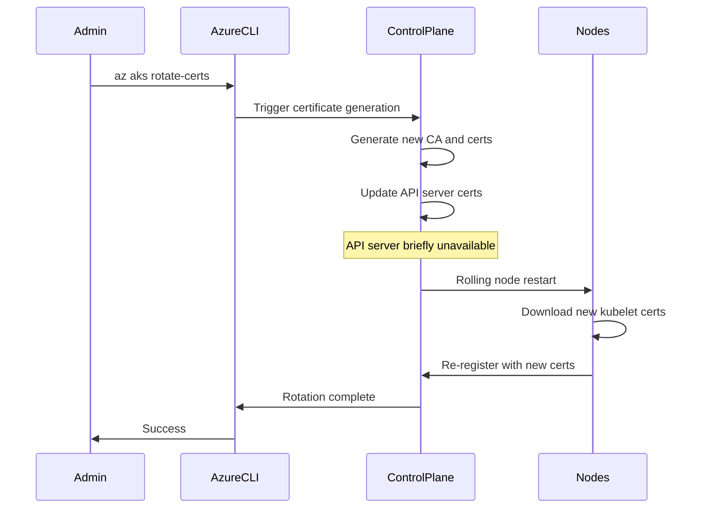

# How to Troubleshoot AKS Cluster Certificate Expiration and Manual Rotation Procedures

Author: [nawazdhandala](https://www.github.com/nawazdhandala)

Tags: AKS, Certificates, Kubernetes, Troubleshooting, Security, Azure, TLS

Description: A practical guide to identifying expired AKS cluster certificates, understanding the rotation lifecycle, and performing manual certificate rotation.

---

Nothing ruins your morning quite like discovering that your AKS cluster is unreachable because the internal certificates expired. AKS uses certificates extensively for securing communication between the API server, kubelets, etcd, and other control plane components. These certificates have a finite lifetime, and if they expire before rotation happens, your cluster can become unresponsive.

This guide covers how to check certificate expiration dates, understand the automatic rotation schedule, and perform manual rotation when things go wrong.

## How AKS Certificates Work

AKS manages several sets of certificates internally:

- **API server TLS certificate**: Secures HTTPS connections to the Kubernetes API server
- **Kubelet client certificates**: Authenticate kubelets to the API server
- **etcd peer and client certificates**: Secure communication between etcd members and from the API server to etcd
- **Front proxy certificates**: Used by the API server aggregation layer
- **Service account signing key**: Signs service account tokens

By default, AKS auto-rotates these certificates before they expire. The certificates are valid for a set period (typically around 2 years for some and shorter for others), and AKS rotates them during cluster upgrades and maintenance operations.

## Symptoms of Expired Certificates

When certificates expire, you will typically see one or more of these symptoms:

- `kubectl` commands fail with TLS handshake errors or unauthorized errors
- Nodes show as NotReady in the cluster
- Pods cannot be scheduled or restarted
- The Azure portal shows the cluster in a failed or unreachable state
- API server logs show certificate verification failures

The error messages often look like this:

```
Unable to connect to the server: x509: certificate has expired or is not yet valid
```

or

```
error: You must be logged in to the server (Unauthorized)
```

## Step 1: Check Certificate Expiration Dates

The first step is figuring out which certificates are close to expiration or already expired. AKS does not expose individual certificate details directly, but you can check the overall cluster certificate status.

```bash
# Check the cluster's certificate profile and expiration info
az aks show \
  --resource-group myResourceGroup \
  --name myAKSCluster \
  --query "{ \
    certificateProfileExpiry: certificateProfile.expirationDate, \
    provisioningState: provisioningState, \
    powerState: powerState.code \
  }" -o table
```

You can also check from within the cluster if you still have access:

```bash
# Check the API server certificate expiration from a pod
# This connects to the API server and displays the certificate details
kubectl run cert-check --rm -it --image=alpine/openssl -- \
  s_client -connect kubernetes.default.svc:443 -servername kubernetes.default.svc </dev/null 2>/dev/null | \
  openssl x509 -noout -dates
```

If you cannot connect to the cluster at all, the certificates are likely already expired.

## Step 2: Check Node Certificate Status

If you can still reach the API server but nodes are having issues, check the kubelet certificate status on individual nodes.

```bash
# SSH into a node (via a debug pod or SSH jump box)
# Then check the kubelet certificate expiration
kubectl debug node/<node-name> -it --image=mcr.microsoft.com/cbl-mariner/busybox:2.0

# Inside the debug container, check certificate files
chroot /host
openssl x509 -in /etc/kubernetes/pki/kubelet-client-current.pem -noout -dates
openssl x509 -in /etc/kubernetes/pki/apiserver.crt -noout -dates
```

## Step 3: Perform Manual Certificate Rotation

If certificates are expired or close to expiring, trigger a manual rotation. AKS provides a built-in command for this.

```bash
# Rotate all cluster certificates manually
# This triggers a rolling update of all nodes
az aks rotate-certs \
  --resource-group myResourceGroup \
  --name myAKSCluster
```

This command does the following:

1. Generates new certificates for all components
2. Updates the API server with the new certificates
3. Performs a rolling restart of all nodes to pick up the new kubelet certificates
4. Updates the cluster kubeconfig with new credentials

**Warning**: This operation causes a rolling restart of all nodes. Plan for temporary disruption. The API server will be unavailable for a short period during the rotation. On a large cluster, the full rotation can take 30 minutes or more.

## Step 4: Update Your Kubeconfig

After certificate rotation, your local kubeconfig is no longer valid because the API server certificate has changed. Download the new credentials.

```bash
# Get updated credentials after certificate rotation
az aks get-credentials \
  --resource-group myResourceGroup \
  --name myAKSCluster \
  --overwrite-existing

# Verify connectivity with the new credentials
kubectl get nodes
```

## Step 5: Verify the Rotation

After rotation completes, verify that everything is healthy.

```bash
# Check that all nodes are Ready
kubectl get nodes -o wide

# Check that system pods are running
kubectl get pods -n kube-system

# Verify API server certificate has been renewed
kubectl run cert-verify --rm -it --image=alpine/openssl -- \
  s_client -connect kubernetes.default.svc:443 </dev/null 2>/dev/null | \
  openssl x509 -noout -dates -subject
```

## Handling Completely Unreachable Clusters

If your cluster is completely unreachable due to expired certificates, you cannot use `kubectl` to diagnose the issue. In this case, work entirely through the Azure CLI and Azure portal.

```bash
# Check cluster provisioning state
az aks show \
  --resource-group myResourceGroup \
  --name myAKSCluster \
  --query provisioningState -o tsv

# If the cluster is in a Failed state, try rotating certs
# This works even when kubectl cannot connect
az aks rotate-certs \
  --resource-group myResourceGroup \
  --name myAKSCluster

# Monitor the operation progress
az aks show \
  --resource-group myResourceGroup \
  --name myAKSCluster \
  --query provisioningState -o tsv
```

If the rotation fails on a completely broken cluster, you may need to open a support ticket with Microsoft. In some cases, the cluster may need to be reconciled before rotation can proceed.

## Preventing Certificate Expiration

The best approach is to never let certificates expire in the first place. Here are practical strategies:

### Enable Automatic Upgrades

AKS rotates certificates during cluster upgrades. If you have automatic upgrades enabled, certificate rotation happens naturally.

```bash
# Enable automatic cluster upgrades
# Patch upgrades rotate certificates as a side effect
az aks update \
  --resource-group myResourceGroup \
  --name myAKSCluster \
  --auto-upgrade-channel patch
```

### Set Up Monitoring Alerts

Create an Azure Monitor alert that fires when certificates are within 30 days of expiration.

```bash
# Create an alert rule for certificate expiration
# This uses Azure Resource Health and custom metrics
az monitor metrics alert create \
  --resource-group myResourceGroup \
  --name "AKS-Cert-Expiry-Warning" \
  --scopes $(az aks show -g myResourceGroup -n myAKSCluster --query id -o tsv) \
  --condition "count CertificateExpirationWithin30Days > 0" \
  --description "AKS cluster certificates expiring within 30 days" \
  --severity 2
```

### Schedule Regular Rotations

Even with automatic upgrades, it is good practice to schedule certificate rotations quarterly. You can automate this with an Azure Automation runbook or a simple cron job in your CI/CD pipeline.

```bash
# Simple script to check and rotate if needed
# Run this monthly from your CI/CD pipeline

CLUSTER_NAME="myAKSCluster"
RESOURCE_GROUP="myResourceGroup"

# Check if cluster is healthy
STATE=$(az aks show -g $RESOURCE_GROUP -n $CLUSTER_NAME --query provisioningState -o tsv)

if [ "$STATE" == "Succeeded" ]; then
  echo "Cluster is healthy, performing certificate rotation"
  az aks rotate-certs -g $RESOURCE_GROUP -n $CLUSTER_NAME --yes
else
  echo "Cluster is in state: $STATE - skipping rotation"
fi
```

## Certificate Rotation Timeline

Here is what happens during the certificate rotation process:



## Common Issues During Rotation

**Rotation takes too long**: On clusters with many nodes (50+), rotation can take over an hour. Each node needs to be cordoned, drained, and restarted. Be patient and monitor with `az aks show`.

**Pods with PodDisruptionBudgets block rotation**: If you have strict PDBs that prevent draining nodes, the rotation may stall. Temporarily relax PDBs if needed.

**Azure AD integration complications**: If your cluster uses Azure AD for authentication, the rotation only affects the internal cluster certificates. Azure AD tokens are managed separately and are not impacted.

**Stuck in Rotating state**: If the rotation gets stuck, check the activity log in the Azure portal for specific error messages. Common causes include insufficient compute quota for the surge node during rolling restarts.

Certificate management in AKS is mostly automatic, but knowing how to diagnose and manually intervene when things go wrong is an essential skill for any AKS operator. Set up your monitoring, enable automatic upgrades, and you will rarely need to deal with certificate emergencies.
