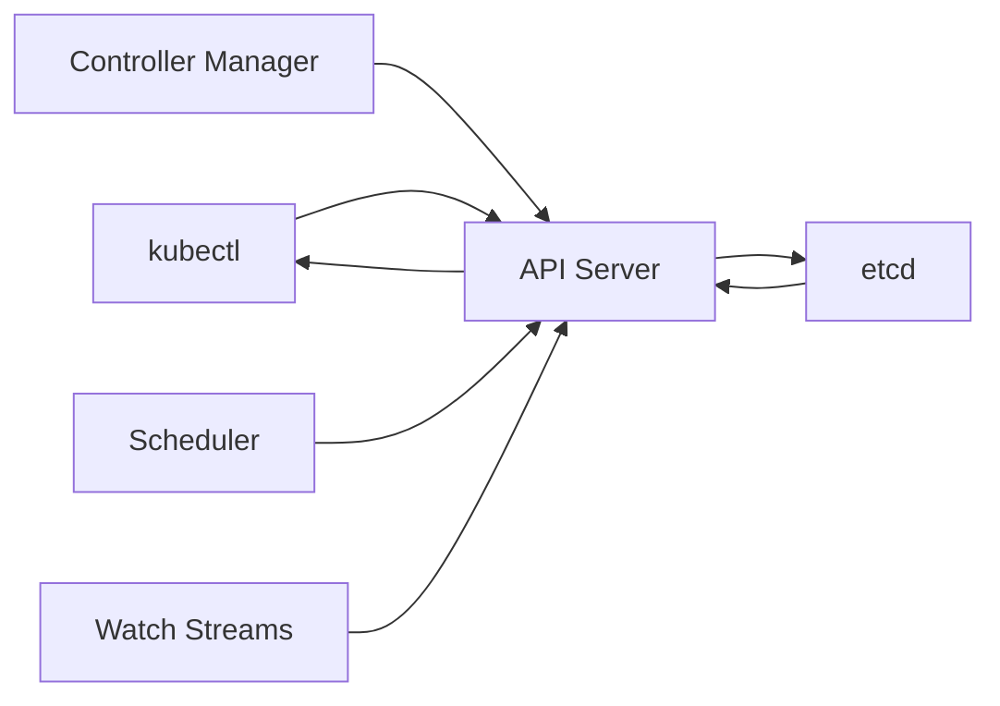

# How to Troubleshoot AKS etcd Latency Issues Affecting API Server Responsiveness

Author: [nawazdhandala](https://www.github.com/nawazdhandala)

Tags: AKS, etcd, Latency, Troubleshooting, API Server, Kubernetes, Performance

Description: Learn how to diagnose and resolve etcd latency issues in AKS that cause slow API server responses, failed deployments, and degraded cluster performance.

---

When your `kubectl` commands take 10 seconds instead of 1, or deployments fail with timeout errors, or the API server becomes intermittently unreachable, the root cause is often etcd latency. etcd is the backing store for all Kubernetes data - every pod, service, secret, and ConfigMap lives in etcd. When etcd is slow, everything in the cluster feels slow.

In AKS, etcd is managed by Microsoft as part of the control plane. You do not have direct access to etcd metrics or configuration. But you can still diagnose etcd-related issues through symptoms, API server behavior, and Azure diagnostics. This guide covers how to identify etcd latency problems and the actions you can take to resolve them.

## Understanding etcd's Role

etcd is a distributed key-value store that serves as Kubernetes' system of record. Every API request that reads or writes cluster state goes through etcd:

- `kubectl get pods` reads from etcd
- `kubectl create deployment` writes to etcd
- The controller manager reads and writes to etcd continuously
- The scheduler reads pod and node data from etcd

When etcd latency increases, all of these operations slow down proportionally. A healthy etcd cluster should handle read operations in under 10ms and write operations in under 50ms. When these numbers climb to hundreds of milliseconds or seconds, the cluster becomes visibly degraded.



## Symptoms of etcd Latency

Before diving into diagnostics, here is what etcd latency looks like from the user perspective:

- `kubectl` commands are slow (multiple seconds for simple operations)
- Deployments and scaling operations time out
- Pod scheduling is delayed
- Events and status updates are stale
- Watch connections drop and reconnect frequently
- The Azure portal shows the cluster as degraded
- Errors like `etcdserver: request timed out` or `context deadline exceeded` in API server logs

## Step 1: Confirm It Is an etcd Issue

First, rule out other causes of slow API responses. Check if the issue is network-related or specific to etcd.

```bash
# Time a simple API call to measure latency
time kubectl get namespaces

# Compare with a more complex query
time kubectl get pods --all-namespaces

# Check API server health endpoints
kubectl get --raw /healthz
kubectl get --raw /readyz

# Check the API server response time for different resource types
kubectl get --raw /api/v1/namespaces?limit=1 -v=6 2>&1 | grep "Response Status"
```

If simple queries (like listing namespaces) are slow, the issue is likely at the etcd or API server level rather than in your workloads.

## Step 2: Check Control Plane Diagnostic Logs

If you have diagnostic logging enabled (you should), query the API server logs for etcd-related errors.

```
// KQL query: Find etcd timeout errors in API server logs
AzureDiagnostics
| where Category == "kube-apiserver"
| where log_s contains "etcd" and (log_s contains "timeout" or log_s contains "slow" or log_s contains "deadline")
| project TimeGenerated, log_s
| order by TimeGenerated desc
| take 50
```

```
// KQL query: Find slow API requests that indicate etcd latency
AzureDiagnostics
| where Category == "kube-apiserver"
| where log_s contains "response"
| extend latency = extract("latency=([0-9.]+)", 1, log_s)
| where todouble(latency) > 1
| project TimeGenerated, log_s, latency
| order by todouble(latency) desc
| take 20
```

## Step 3: Check API Server Metrics

AKS exposes some API server metrics through Azure Monitor that can indicate etcd issues.

```bash
# Check API server request latency metrics
az monitor metrics list \
  --resource $(az aks show -g myResourceGroup -n myAKSCluster --query id -o tsv) \
  --metric "apiserver_request_duration_seconds" \
  --interval PT5M \
  --aggregation Average \
  --output table
```

If you have Prometheus monitoring set up (via Azure Monitor managed Prometheus or your own), query these metrics:

```
# PromQL: API server request duration by verb (shows read vs write latency)
histogram_quantile(0.99,
  sum(rate(apiserver_request_duration_seconds_bucket{job="apiserver"}[5m])) by (le, verb)
)

# PromQL: etcd request duration (if exposed)
histogram_quantile(0.99,
  sum(rate(etcd_request_duration_seconds_bucket[5m])) by (le, operation)
)
```

## Step 4: Identify Common Causes

### Too Many Objects in the Cluster

etcd performance degrades as the amount of stored data grows. Clusters with tens of thousands of ConfigMaps, Secrets, or completed Jobs accumulate data that slows down etcd.

```bash
# Count objects by type to identify bloat
echo "Pods: $(kubectl get pods -A --no-headers | wc -l)"
echo "Services: $(kubectl get svc -A --no-headers | wc -l)"
echo "ConfigMaps: $(kubectl get configmaps -A --no-headers | wc -l)"
echo "Secrets: $(kubectl get secrets -A --no-headers | wc -l)"
echo "Events: $(kubectl get events -A --no-headers | wc -l)"
echo "Jobs: $(kubectl get jobs -A --no-headers | wc -l)"

# Check for completed Jobs that should be cleaned up
kubectl get jobs -A --field-selector status.successful=1 --no-headers | wc -l
```

If you have thousands of completed Jobs or Events, clean them up:

```bash
# Delete completed Jobs older than 1 hour
kubectl get jobs -A -o json | \
  jq -r '.items[] | select(.status.succeeded==1) | "\(.metadata.namespace) \(.metadata.name)"' | \
  while read NS NAME; do
    kubectl delete job $NAME -n $NS
  done

# Set TTL on Jobs to auto-cleanup
# Add this to your Job specs
```

```yaml
# job-with-ttl.yaml
# Job that auto-deletes 1 hour after completion
apiVersion: batch/v1
kind: Job
metadata:
  name: cleanup-job
spec:
  # Automatically delete the Job 3600 seconds after completion
  ttlSecondsAfterFinished: 3600
  template:
    spec:
      containers:
      - name: worker
        image: busybox
        command: ["echo", "done"]
      restartPolicy: Never
```

### Too Many Watches

Kubernetes controllers, operators, and your applications use watch streams to monitor changes. Each watch creates load on etcd. Too many watches, especially broad watches on large collections, can overwhelm etcd.

```bash
# Check the number of active watch streams (requires API server metrics)
# If using Prometheus:
# apiserver_registered_watchers

# Check which controllers might be creating excessive watches
kubectl get pods -n kube-system -o name | while read POD; do
  echo "$POD:"
  kubectl top pod ${POD#pod/} -n kube-system 2>/dev/null
done
```

### Large Objects in etcd

Kubernetes has a 1.5MB limit on individual object sizes, but even objects well below this limit can cause latency if there are many large ones. Secrets and ConfigMaps with large data blobs are common culprits.

```bash
# Find the largest Secrets
kubectl get secrets -A -o json | \
  jq -r '.items[] | "\(.metadata.namespace)/\(.metadata.name) \(.data | to_entries | map(.value | length) | add // 0)"' | \
  sort -k2 -n -r | head -20

# Find large ConfigMaps
kubectl get configmaps -A -o json | \
  jq -r '.items[] | "\(.metadata.namespace)/\(.metadata.name) \(.data | to_entries | map(.value | length) | add // 0)"' | \
  sort -k2 -n -r | head -20
```

### Cluster Size Relative to Control Plane Tier

AKS scales the control plane based on the cluster tier. Free tier clusters get a less powerful control plane than Standard or Premium tier clusters.

```bash
# Check your cluster's SKU tier
az aks show \
  --resource-group myResourceGroup \
  --name myAKSCluster \
  --query "sku" -o json
```

If you are running a large cluster (50+ nodes) on the Free tier, upgrading to Standard or Premium gives you a more powerful control plane with better etcd performance.

```bash
# Upgrade to Standard tier for better control plane performance
az aks update \
  --resource-group myResourceGroup \
  --name myAKSCluster \
  --tier standard
```

## Step 5: Reduce etcd Load

### Clean Up Stale Resources

```bash
# Delete orphaned ReplicaSets (keep the 2 most recent per deployment)
kubectl get replicasets -A -o json | \
  jq -r '.items[] | select(.spec.replicas==0) | "\(.metadata.namespace) \(.metadata.name)"' | \
  while read NS NAME; do
    kubectl delete replicaset $NAME -n $NS
  done
```

### Configure Event TTL

Events accumulate quickly and add load to etcd. While you cannot configure the event TTL directly in AKS, you can use a cleanup CronJob:

```yaml
# event-cleanup.yaml
# CronJob that cleans up old events hourly
apiVersion: batch/v1
kind: CronJob
metadata:
  name: event-cleanup
  namespace: kube-system
spec:
  schedule: "0 * * * *"
  jobTemplate:
    spec:
      ttlSecondsAfterFinished: 300
      template:
        spec:
          serviceAccountName: event-cleanup-sa
          containers:
          - name: cleanup
            image: bitnami/kubectl:latest
            command:
            - /bin/sh
            - -c
            # Delete events older than 2 hours
            - |
              kubectl get events -A --sort-by='.lastTimestamp' -o json | \
              jq -r '.items[] | select((.lastTimestamp // .eventTime) < (now - 7200 | todate)) | "\(.metadata.namespace) \(.metadata.name)"' | \
              while read NS NAME; do
                kubectl delete event $NAME -n $NS 2>/dev/null
              done
          restartPolicy: OnFailure
```

### Reduce Watch Cardinality

If you have custom controllers or operators that watch all resources cluster-wide, add label selectors or namespace filters to reduce the watch scope.

## Step 6: Request Microsoft Support

If you have done everything you can on your end and etcd latency persists, open a support ticket with Microsoft. Since etcd is managed by Azure, Microsoft can:

- Check etcd cluster health metrics that are not exposed to customers
- Identify if the etcd cluster is experiencing compaction issues
- Move your control plane to a different infrastructure node if there is a noisy neighbor issue
- Resize the etcd instance if needed

When filing the ticket, include:

- Timestamps of when the latency occurs
- API server diagnostic log queries showing the slow requests
- The number of objects in your cluster
- Your cluster tier (Free, Standard, Premium)

etcd latency is one of the harder issues to debug in AKS because the root cause is in managed infrastructure you cannot directly access. But by systematically reducing the load on etcd, cleaning up stale resources, and using the right cluster tier, you can resolve most performance issues without needing Microsoft support.
