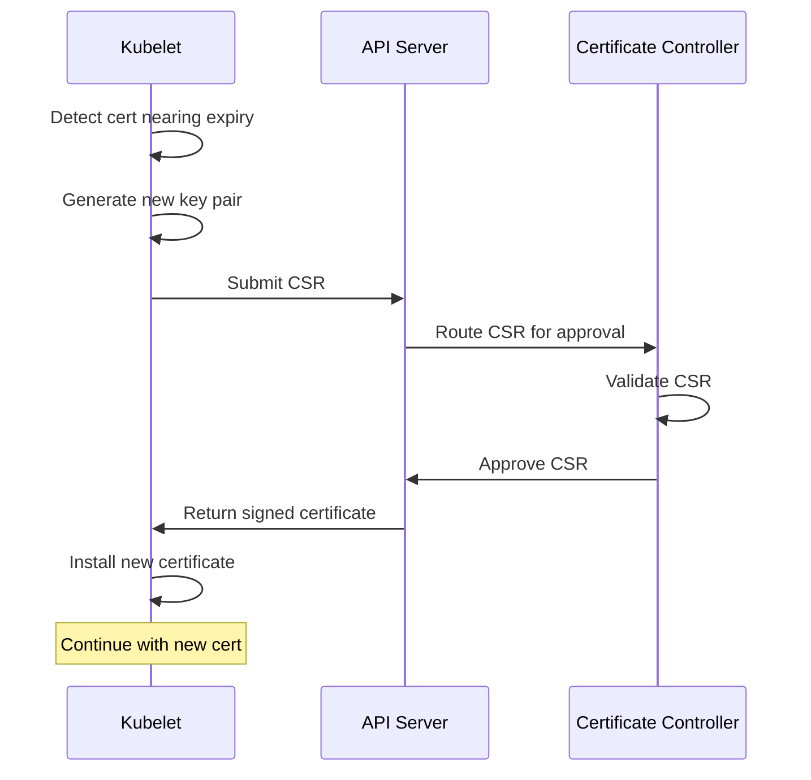

# How to Troubleshoot AKS Kubelet Certificate Rotation Failures and Node Authentication Issues

Author: [nawazdhandala](https://www.github.com/nawazdhandala)

Tags: AKS, Kubernetes, Kubelet, Certificate Rotation, TLS, Troubleshooting, Node Authentication

Description: Diagnose and fix kubelet certificate rotation failures on AKS that cause nodes to become NotReady and pods to stop scheduling.

---

You check your AKS cluster one morning and find several nodes in NotReady state. The pods on those nodes are still running, but no new pods can be scheduled and the existing ones are not being monitored. You check the kubelet logs and see errors about TLS handshake failures and expired certificates. Welcome to kubelet certificate rotation problems - one of the more obscure but impactful issues on AKS.

Kubelet uses TLS certificates to authenticate with the API server. These certificates have a limited lifetime and need to be rotated before they expire. When rotation fails, the kubelet loses its ability to communicate with the API server, and the node effectively becomes disconnected from the cluster.

## Understanding Kubelet Certificates

Every AKS node has a kubelet process that communicates with the Kubernetes API server. This communication is secured with mutual TLS (mTLS). The kubelet has two types of certificates.

**Client certificate**: Used by the kubelet to authenticate itself to the API server. This proves the node's identity.

**Serving certificate**: Used by the kubelet to serve its HTTPS endpoint (for metrics, health checks, and log retrieval).

Both certificates are issued by the cluster's certificate authority and have a limited lifetime. On AKS, client certificates typically expire after about one year, but the kubelet is supposed to rotate them well before expiration.

## How Certificate Rotation Works

Kubernetes has a built-in certificate rotation mechanism. Here is the normal flow.

1. The kubelet detects that its certificate is approaching expiration (typically at 70-80% of the certificate lifetime).
2. It generates a new private key and creates a Certificate Signing Request (CSR).
3. It sends the CSR to the API server.
4. The API server's certificate controller approves the CSR.
5. The new certificate is issued and the kubelet starts using it.
6. The process repeats before the next expiration.

When any step in this chain fails, the certificate expires and the node goes dark.



## Identifying Certificate Rotation Failures

### Check Node Status

```bash
# Look for NotReady nodes
kubectl get nodes

# Get details on a NotReady node
kubectl describe node <node-name>

# Look for certificate-related conditions
kubectl get nodes -o json | jq '.items[] | select(.status.conditions[] | select(.type=="Ready" and .status!="True")) | .metadata.name'
```

### Check Kubelet Logs

You need to access the node directly to see kubelet logs. On AKS, you can use node debugging.

```bash
# Create a debug pod on the affected node
kubectl debug node/<node-name> -it --image=mcr.microsoft.com/cbl-mariner/busybox:2.0

# Inside the debug pod, check kubelet logs
chroot /host
journalctl -u kubelet --since "1 hour ago" | grep -i "cert\|tls\|x509\|rotation"
```

Common error messages include.

- `x509: certificate has expired or is not yet valid`
- `Unable to rotate certificate: tls: failed to verify certificate`
- `failed to renew kubelet certificate`
- `certificate rotation failed: error creating certificate signing request`

### Check Certificate Signing Requests

```bash
# List pending or denied CSRs
kubectl get csr

# Look for CSRs from the affected node
kubectl get csr | grep <node-name>

# Check if there are denied or failed CSRs
kubectl get csr -o json | jq '.items[] | select(.status.conditions[0].type != "Approved") | {name: .metadata.name, condition: .status.conditions}'
```

## Common Causes and Fixes

### Cause 1: Clock Skew on the Node

If the node's system clock is significantly off (more than a few minutes), certificate validation fails because the certificate appears expired or not yet valid from the node's perspective.

```bash
# Check the node's time (from a debug pod)
kubectl debug node/<node-name> -it --image=mcr.microsoft.com/cbl-mariner/busybox:2.0 -- date

# Compare with the API server time
kubectl run time-check --image=busybox --restart=Never -- date
kubectl logs time-check
```

The fix is to ensure NTP is running and synchronized on all nodes. On AKS, this is managed by Azure, but occasionally a node's NTP configuration gets corrupted.

```bash
# From a debug pod on the node
chroot /host

# Check NTP status
systemctl status chronyd
# or
systemctl status systemd-timesyncd

# Force NTP sync
chronyc makestep
```

If the clock cannot be synchronized, the fastest fix is to cordon and drain the node, then delete and let AKS replace it.

```bash
# Cordon the node to prevent new pods from being scheduled
kubectl cordon <node-name>

# Drain existing pods (they will be rescheduled on healthy nodes)
kubectl drain <node-name> --ignore-daemonsets --delete-emptydir-data --force

# Delete the node - AKS VMSS will replace it automatically
az vmss delete-instances \
  --resource-group MC_myRG_myAKS_eastus \
  --name <vmss-name> \
  --instance-ids <instance-id>
```

### Cause 2: API Server Connectivity Issues

If the kubelet cannot reach the API server when it needs to submit a CSR, rotation fails. This can happen due to network policy changes, NSG rule modifications, or temporary network outages.

```bash
# From a debug pod on the node, test API server connectivity
chroot /host
curl -k https://<api-server-fqdn>:443/healthz

# Check if there are network policies blocking egress from the node
kubectl get networkpolicy -A

# Check NSG rules on the AKS subnet
az network nsg rule list \
  --resource-group MC_myRG_myAKS_eastus \
  --nsg-name <nsg-name> \
  -o table
```

### Cause 3: CSR Approval Failure

The certificate controller may fail to approve CSRs if it is overloaded, misconfigured, or if the CSR does not meet the approval criteria.

```bash
# Check for pending CSRs
kubectl get csr | grep Pending

# Manually approve a pending CSR (use with caution - verify the CSR first)
kubectl certificate approve <csr-name>

# View CSR details before approving
kubectl get csr <csr-name> -o yaml
```

Only manually approve CSRs that you have verified are legitimate. Check that the common name matches a valid node name and that the organizations match expected values.

### Cause 4: Certificate Rotation Disabled

In rare cases, certificate rotation might be disabled or misconfigured on the kubelet.

```bash
# From a debug pod, check kubelet configuration
chroot /host
cat /var/lib/kubelet/config.yaml | grep -i rotat

# Look for these settings:
# rotateCertificates: true
# serverTLSBootstrap: true
```

If `rotateCertificates` is false or missing, the kubelet will not attempt to rotate its certificates.

### Cause 5: Expired Bootstrap Token

When a node first joins the cluster, it uses a bootstrap token to obtain its initial certificate. If this token expires before the node can bootstrap, it cannot join the cluster at all.

```bash
# Check bootstrap tokens (these are usually managed by AKS automatically)
kubectl get secrets -n kube-system | grep bootstrap

# On a node that cannot bootstrap, check the kubelet bootstrap config
chroot /host
cat /var/lib/kubelet/bootstrap-kubeconfig
```

## The Nuclear Option: Node Replacement

If you cannot fix the certificate issue on a specific node, the safest approach is to replace it entirely. AKS makes this straightforward because nodes are managed by Virtual Machine Scale Sets.

```bash
# Step 1: Identify the affected node's VMSS instance
NODE_NAME="aks-nodepool1-12345678-vmss000003"
VMSS_NAME=$(echo $NODE_NAME | sed 's/-[0-9]*$//')
INSTANCE_ID=$(echo $NODE_NAME | grep -oP '\d+$')

# Step 2: Cordon and drain the node
kubectl cordon $NODE_NAME
kubectl drain $NODE_NAME --ignore-daemonsets --delete-emptydir-data --force --timeout=120s

# Step 3: Delete the VMSS instance (AKS will create a replacement)
VMSS_RG=$(az aks show --resource-group myRG --name myAKS --query nodeResourceGroup -o tsv)

az vmss delete-instances \
  --resource-group $VMSS_RG \
  --name <vmss-name> \
  --instance-ids $INSTANCE_ID

# Step 4: Wait for the replacement node to join
kubectl get nodes -w
```

The new node will bootstrap with fresh certificates and join the cluster normally.

## Preventive Measures

### Monitor Certificate Expiration

Set up monitoring to alert before certificates expire.

```promql
# If using Prometheus, check the kubelet certificate expiration
# This metric reports the time until the certificate expires in seconds
kubelet_certificate_manager_client_expiration_seconds - time()

# Alert when certificate expires in less than 30 days
kubelet_certificate_manager_client_expiration_seconds - time() < 2592000
```

### Keep Clusters Updated

AKS node images include kubelet updates that fix certificate rotation bugs. Keep your node images current.

```bash
# Check available node image upgrades
az aks nodepool get-upgrades \
  --resource-group myRG \
  --cluster-name myAKS \
  --nodepool-name nodepool1 -o table

# Upgrade node images
az aks nodepool upgrade \
  --resource-group myRG \
  --cluster-name myAKS \
  --name nodepool1 \
  --node-image-only
```

### Ensure NTP Is Always Running

Check NTP synchronization as part of your cluster health monitoring.

```bash
# Quick check across all nodes
for node in $(kubectl get nodes -o name); do
  echo "Checking $node..."
  kubectl debug $node -it --image=busybox -- date
done
```

## Checking Certificate Expiration Dates

You can check the current certificate expiration from the node.

```bash
# From a debug pod on the node
chroot /host

# Check kubelet client certificate expiration
openssl x509 -in /var/lib/kubelet/pki/kubelet-client-current.pem -noout -dates

# Check kubelet serving certificate expiration
openssl x509 -in /var/lib/kubelet/pki/kubelet.crt -noout -dates

# Check both certificates at once
echo "Client cert:" && openssl x509 -in /var/lib/kubelet/pki/kubelet-client-current.pem -noout -enddate
echo "Server cert:" && openssl x509 -in /var/lib/kubelet/pki/kubelet.crt -noout -enddate
```

## Wrapping Up

Kubelet certificate rotation failures are uncommon on AKS, but when they happen they can take down nodes and disrupt workloads. The troubleshooting process starts with checking node status and kubelet logs, then moves to examining CSRs and certificate expiration dates. Most issues come down to clock skew, network connectivity, or CSR approval problems. For nodes that cannot be recovered, replacement through VMSS instance deletion is a clean and fast solution. Monitor certificate expiration proactively with Prometheus alerts, keep node images updated, and ensure NTP is running on all nodes to prevent these issues from catching you off guard.
