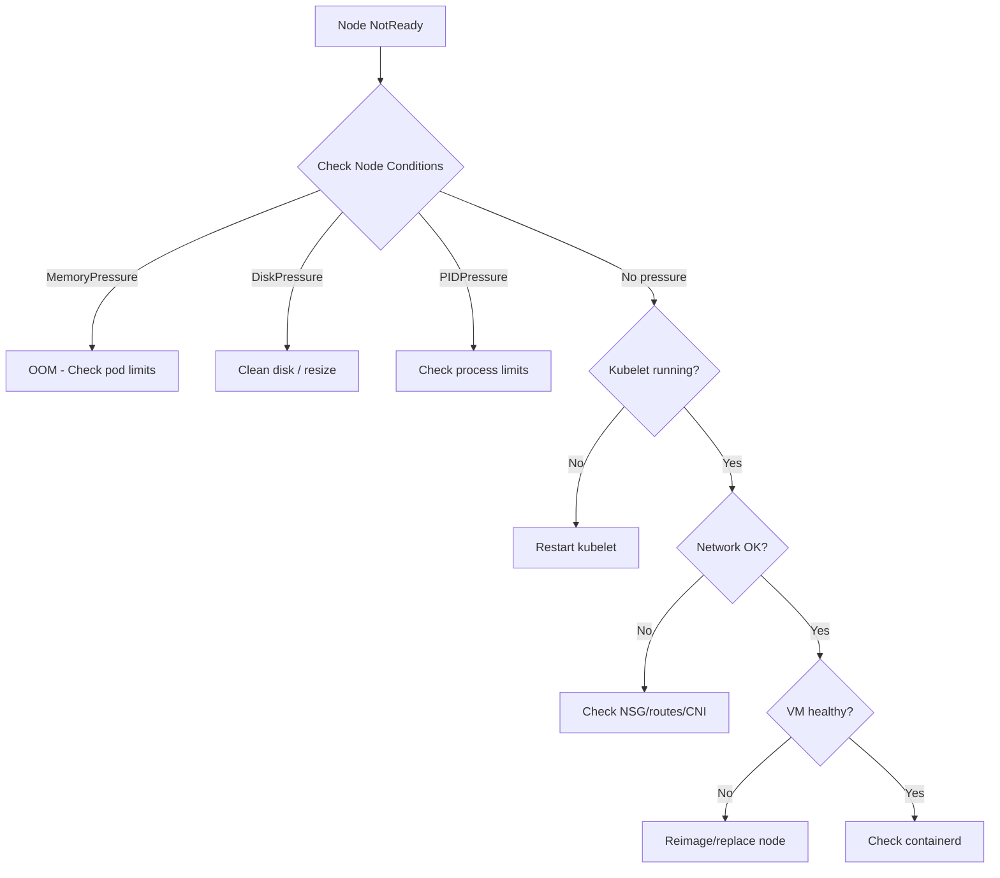

# How to Troubleshoot AKS Node NotReady Status and Recover Unresponsive Nodes

Author: [nawazdhandala](https://www.github.com/nawazdhandala)

Tags: AKS, Troubleshooting, Node NotReady, Kubernetes, Azure, Node Recovery, Debugging

Description: Practical guide to diagnosing why AKS nodes go into NotReady status and techniques to recover them without losing workloads.

---

You check your cluster one morning and find that one or more nodes are in NotReady status. Pods are being evicted, workloads are disrupted, and your monitoring dashboard lights up red. This is one of the most common operational issues with AKS, and the causes range from simple resource exhaustion to deeper networking or kubelet problems. In this post, I will walk through a systematic approach to diagnosing NotReady nodes and recovering them with minimal impact on your workloads.

## What NotReady Actually Means

A node goes into NotReady status when the Kubernetes API server has not received a heartbeat from the kubelet on that node within the configured timeout (default is 40 seconds). The kubelet sends periodic status updates to the API server. When those stop, the node is marked NotReady, and the node controller starts evicting pods from it.

The reasons the kubelet might stop sending heartbeats include:

- The node ran out of disk space, memory, or PIDs
- The kubelet process crashed or is stuck
- The VM itself is unresponsive or being throttled
- Network connectivity between the node and the API server is broken
- The container runtime (containerd) is unhealthy
- A kernel panic or OOM killer took down critical processes

## Step 1: Check Node Status and Conditions

Start by getting the full picture of what the node is reporting.

```bash
# List all nodes with their status
kubectl get nodes -o wide

# Get detailed conditions for the NotReady node
kubectl describe node <node-name>
```

Look at the Conditions section in the describe output. Each condition tells you something specific.

```
Conditions:
  Type                 Status  Reason
  ----                 ------  ------
  MemoryPressure       True    KubeletHasInsufficientMemory
  DiskPressure         True    KubeletHasDiskPressure
  PIDPressure          False   KubeletHasSufficientPID
  Ready                False   KubeletNotReady
```

If MemoryPressure or DiskPressure is True, you have your answer. If all pressures are False but Ready is also False, the problem is likely at the kubelet or network level.

## Step 2: Check Node Events

Events often reveal the specific trigger that caused the node to go NotReady.

```bash
# Get events for the specific node
kubectl get events --field-selector involvedObject.name=<node-name> --sort-by='.lastTimestamp'

# Get all recent events that might be related
kubectl get events --sort-by='.lastTimestamp' | tail -30
```

Common events you might see:

- `NodeNotReady` - The node condition changed
- `NodeHasDiskPressure` - Disk space is critically low
- `NodeHasInsufficientMemory` - Memory is exhausted
- `Rebooted` - The node was restarted (possibly by the OOM killer or a kernel crash)

## Step 3: Check Kubelet Logs

If the node is somewhat accessible, you can look at kubelet logs through the AKS node debug mechanism.

```bash
# Start a debug pod on the NotReady node
kubectl debug node/<node-name> -it --image=mcr.microsoft.com/cbl-mariner/base/core:2.0

# Inside the debug pod, check kubelet logs
chroot /host
journalctl -u kubelet --no-pager -n 100

# Check if kubelet is running
systemctl status kubelet

# Check container runtime status
systemctl status containerd
```

Look for error messages like "PLEG is not healthy" (Pod Lifecycle Event Generator), "failed to garbage collect" (disk pressure), or "context deadline exceeded" (network issues to the API server).

## Step 4: Check Resource Usage

If the node is still somewhat responsive, check its resource consumption.

```bash
# From the debug pod, check disk usage
df -h

# Check memory usage
free -h

# Check running processes and their resource usage
top -bn1 | head -20

# Check for zombie processes or PID exhaustion
ps aux | wc -l
```

Common resource problems:

- **/var/lib/containerd** filling up from too many container images
- **/var/log** filling up from pods writing excessive logs
- Memory exhaustion from pods without resource limits
- PID exhaustion from pods forking too many processes

## Step 5: Diagnose Network Connectivity

If the kubelet is running but the node is still NotReady, the problem might be network connectivity to the API server.

```bash
# From the debug pod, test connectivity to the API server
chroot /host
curl -k https://<api-server-fqdn>:443/healthz

# Check DNS resolution
nslookup <api-server-fqdn>

# Check the node's network interface
ip addr show
ip route show

# Test connectivity to the AKS API server
wget --spider --timeout=5 https://<api-server-fqdn>:443
```

Network issues can be caused by NSG rules blocking traffic, route table misconfiguration, Azure CNI IP exhaustion, or the node's primary NIC being in a failed state.

## Step 6: Check Azure-Level VM Health

Sometimes the problem is at the Azure infrastructure level.

```bash
# Check the VMSS instance health
az vmss list-instances \
  --resource-group MC_myResourceGroup_myCluster_eastus \
  --name <vmss-name> \
  --query "[].{name:name, provisioningState:provisioningState}" \
  --output table

# Check for Azure platform events
az monitor activity-log list \
  --resource-group MC_myResourceGroup_myCluster_eastus \
  --start-time 2026-02-16T00:00:00Z \
  --query "[?contains(operationName.value, 'VirtualMachineScaleSet')]" \
  --output table
```

## Recovery Options

Once you have identified the root cause, here are your recovery options.

### Option 1: Restart the Kubelet

If the kubelet is stuck but the VM is healthy, restarting the kubelet often resolves the issue.

```bash
# From the debug pod
chroot /host
systemctl restart kubelet

# Watch the node status from another terminal
kubectl get node <node-name> -w
```

### Option 2: Drain and Reimage the Node

If the node is in a bad state, drain it first to safely move workloads, then reimage it.

```bash
# Drain the node - moves pods to healthy nodes
kubectl drain <node-name> --ignore-daemonsets --delete-emptydir-data --timeout=300s

# Reimage the specific VMSS instance
az vmss reimage \
  --resource-group MC_myResourceGroup_myCluster_eastus \
  --name <vmss-name> \
  --instance-ids <instance-id>

# Uncordon the node after it comes back
kubectl uncordon <node-name>
```

### Option 3: Delete and Replace the Node

If reimaging does not work, delete the VMSS instance and let the cluster autoscaler provision a replacement.

```bash
# Delete the specific VMSS instance
az vmss delete-instances \
  --resource-group MC_myResourceGroup_myCluster_eastus \
  --name <vmss-name> \
  --instance-ids <instance-id>

# The cluster autoscaler will provision a new node if needed
```

### Option 4: Free Up Disk Space

If disk pressure caused the issue, clean up from inside the debug pod.

```bash
# From the debug pod
chroot /host

# Clean up unused container images
crictl rmi --prune

# Clean up old log files
find /var/log -name "*.gz" -mtime +7 -delete

# Check for large files
du -sh /var/lib/containerd/*
du -sh /var/log/pods/*
```

## Troubleshooting Flow

Here is a visual of the systematic approach to diagnosing NotReady nodes.



## Preventing NotReady Nodes

Prevention is better than firefighting. Here are steps to reduce the frequency of NotReady events.

**Set resource requests and limits on all pods.** Without limits, a single misbehaving pod can consume all memory or CPU on a node, taking it down.

```yaml
# Always set resource limits to prevent node resource exhaustion
resources:
  requests:
    cpu: 100m
    memory: 128Mi
  limits:
    cpu: 500m
    memory: 512Mi
```

**Use ephemeral OS disks.** They are faster and if a node gets into a bad state, reimaging is nearly instant since there is nothing to preserve.

**Enable node auto-repair.** AKS has a built-in node auto-repair feature that detects NotReady nodes and automatically tries to recover them.

```bash
# Node auto-repair is enabled by default on new clusters
# Verify it is enabled
az aks show \
  --resource-group myResourceGroup \
  --name myCluster \
  --query "autoRepairProfile"
```

**Monitor node health proactively.** Set up alerts for node conditions in your monitoring system. Catching MemoryPressure or DiskPressure early gives you time to act before the node goes NotReady.

**Use Pod Disruption Budgets.** PDBs ensure that when pods are evicted from a NotReady node, your application maintains its availability guarantees by limiting how many pods can be down simultaneously.

Node NotReady issues are not a matter of if but when. Having a systematic debugging process and the right preventive measures in place means the difference between a 5-minute fix and a stressful hour-long outage.
