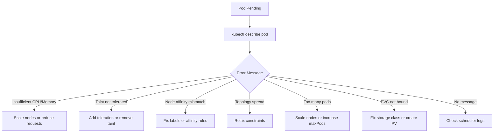

# How to Troubleshoot AKS Pod Scheduling Failures Due to Resource Constraints and Taints

Author: [nawazdhandala](https://www.github.com/nawazdhandala)

Tags: AKS, Scheduling, Troubleshooting, Kubernetes, Taints, Tolerations, Resource Management

Description: Practical guide to diagnosing and fixing AKS pod scheduling failures caused by resource constraints, taints, tolerations, and affinity rules.

---

Your deployment is scaled up, but pods are stuck in Pending status. The cluster seems to have plenty of nodes, yet Kubernetes refuses to schedule the pods. Pod scheduling failures are one of the most common operational challenges on AKS, and the causes range from simple resource exhaustion to complex interactions between taints, tolerations, affinity rules, and topology constraints. In this guide, I will walk through the systematic process of diagnosing why pods are not scheduling and how to fix each type of failure.

## Step 1: Check the Pod Events

The first thing to do with any Pending pod is check its events. Kubernetes tells you exactly why a pod cannot be scheduled.

```bash
# Get pods in Pending status
kubectl get pods --field-selector status.phase=Pending

# Describe the pending pod to see scheduling events
kubectl describe pod <pod-name>
```

Look at the Events section. You will see one or more of these messages:

- `0/5 nodes are available: 5 Insufficient cpu` - Not enough CPU
- `0/5 nodes are available: 5 Insufficient memory` - Not enough memory
- `0/5 nodes are available: 3 node(s) had taint {gpu: true}, that the pod didn't tolerate` - Taint/toleration mismatch
- `0/5 nodes are available: 5 node(s) didn't match Pod's node affinity/selector` - Affinity rules are too restrictive
- `0/5 nodes are available: 5 node(s) didn't match pod topology spread constraints` - Topology constraints cannot be satisfied
- `0/5 nodes are available: 2 Too many pods` - Node has reached maxPods limit

Each message tells you how many nodes were considered and why each was rejected. Let me walk through fixing each type.

## Diagnosing Resource Constraint Failures

This is the most common scheduling failure. The pod requests more CPU or memory than any node has available.

```bash
# Check resource usage across all nodes
kubectl top nodes

# Check how much capacity each node has
kubectl describe nodes | grep -A 5 "Allocated resources"

# Get a summary of resource requests and limits per node
kubectl get nodes -o custom-columns=\
NAME:.metadata.name,\
CPU_CAPACITY:.status.capacity.cpu,\
MEM_CAPACITY:.status.capacity.memory
```

To understand the gap, compare what the pod requests with what is available.

```bash
# Check what the pending pod requests
kubectl get pod <pod-name> -o jsonpath='{.spec.containers[*].resources.requests}'

# Check allocatable resources on each node
kubectl get nodes -o json | jq '.items[] | {name: .metadata.name, allocatable: .status.allocatable}'
```

The key insight is that "allocatable" is not the same as "available". Allocatable is the total that can be used by pods. Available is allocatable minus what is already requested by running pods. A node might show 8 CPU allocatable but have 7.5 CPU already requested, leaving only 0.5 CPU for new pods.

### Fixes for Resource Constraints

**Option 1: Scale the node pool.** Add more nodes to increase total cluster capacity.

```bash
# Scale up the node pool
az aks nodepool scale \
  --resource-group myResourceGroup \
  --cluster-name myCluster \
  --name nodepool1 \
  --node-count 10
```

**Option 2: Use larger VM sizes.** If individual pods need more resources than a single node can provide, switch to a larger VM size.

```bash
# Add a node pool with larger VMs
az aks nodepool add \
  --resource-group myResourceGroup \
  --cluster-name myCluster \
  --name largepool \
  --node-count 3 \
  --node-vm-size Standard_D16s_v5
```

**Option 3: Reduce pod resource requests.** If the requests are over-provisioned, lower them.

```yaml
# Reduce resource requests to fit on available nodes
resources:
  requests:
    cpu: 200m      # Reduced from 500m
    memory: 256Mi  # Reduced from 512Mi
  limits:
    cpu: 500m
    memory: 512Mi
```

**Option 4: Enable the cluster autoscaler.** Let AKS automatically add nodes when pods are pending.

```bash
# Enable cluster autoscaler
az aks nodepool update \
  --resource-group myResourceGroup \
  --cluster-name myCluster \
  --name nodepool1 \
  --enable-cluster-autoscaler \
  --min-count 3 \
  --max-count 20
```

## Diagnosing Taint and Toleration Failures

Taints on nodes repel pods unless the pod has a matching toleration. This is used to dedicate nodes to specific workloads (GPU, high-memory, etc.).

```bash
# List taints on all nodes
kubectl get nodes -o custom-columns=\
NAME:.metadata.name,\
TAINTS:.spec.taints

# Check a specific node's taints
kubectl describe node <node-name> | grep -A 5 Taints
```

Common taints you might encounter on AKS:

- `node.kubernetes.io/not-ready` - Node is not ready (system taint)
- `node.kubernetes.io/unreachable` - Node is unreachable (system taint)
- `kubernetes.azure.com/scalesetpriority=spot:NoSchedule` - Spot node pool taint
- Custom taints applied during node pool creation

### Fixes for Taint Issues

If your pod needs to run on a tainted node, add the matching toleration.

```yaml
# Add tolerations to your pod spec
spec:
  tolerations:
    # Tolerate the spot node taint
    - key: "kubernetes.azure.com/scalesetpriority"
      operator: "Equal"
      value: "spot"
      effect: "NoSchedule"
    # Tolerate a custom GPU taint
    - key: "gpu"
      operator: "Equal"
      value: "true"
      effect: "NoSchedule"
```

If the taint should not be there, remove it.

```bash
# Remove a taint from a node
kubectl taint nodes <node-name> gpu:NoSchedule-
```

## Diagnosing Node Affinity and Selector Failures

Node affinity and node selectors restrict which nodes a pod can run on. If no nodes match the criteria, the pod stays Pending.

```bash
# Check the pod's node affinity and selector
kubectl get pod <pod-name> -o jsonpath='{.spec.nodeSelector}'
kubectl get pod <pod-name> -o jsonpath='{.spec.affinity}'

# Check node labels to see if any match
kubectl get nodes --show-labels
```

### Fixes for Affinity Issues

If the node selector references a label that no node has, either add the label to appropriate nodes or update the selector.

```bash
# Add a label to a node
kubectl label nodes <node-name> workload-type=database

# Or fix the pod's node selector to match existing labels
```

For node affinity, check both `requiredDuringSchedulingIgnoredDuringExecution` (hard requirement) and `preferredDuringSchedulingIgnoredDuringExecution` (soft preference). Hard requirements cause Pending status; soft preferences just influence placement.

## Diagnosing Topology Spread Constraint Failures

Topology spread constraints ensure pods are distributed across nodes, zones, or other topology domains. If the constraint cannot be satisfied, scheduling fails.

```bash
# Check topology constraints on the pod
kubectl get pod <pod-name> -o jsonpath='{.spec.topologySpreadConstraints}'
```

A common scenario: you have a constraint that says "spread evenly across zones" with `whenUnsatisfiable: DoNotSchedule`, but all nodes in one zone are full. The scheduler will not put pods in other zones because that would violate the spread constraint.

### Fix

Change `whenUnsatisfiable` from `DoNotSchedule` to `ScheduleAnyway` to make the constraint soft.

```yaml
topologySpreadConstraints:
  - maxSkew: 1
    topologyKey: topology.kubernetes.io/zone
    # Changed from DoNotSchedule to allow imbalanced placement
    whenUnsatisfiable: ScheduleAnyway
    labelSelector:
      matchLabels:
        app: web-app
```

## Diagnosing MaxPods Limit

Each AKS node has a maximum number of pods it can run (default is 30 for Kubenet, 250 for Azure CNI). If all nodes have reached their limit, new pods cannot be scheduled even if there is CPU and memory available.

```bash
# Check the current pod count per node
kubectl get pods --all-namespaces -o json | \
  jq '[.items[] | .spec.nodeName] | group_by(.) | map({node: .[0], count: length}) | sort_by(.count) | reverse'

# Check the maxPods setting for the node pool
az aks nodepool show \
  --resource-group myResourceGroup \
  --cluster-name myCluster \
  --name nodepool1 \
  --query maxPods
```

### Fix

Scale the node pool or create a new node pool with a higher maxPods setting.

## The Debugging Decision Tree



## Preventing Scheduling Failures

**Set resource requests accurately.** Over-requesting wastes capacity and causes premature scheduling failures. Under-requesting leads to resource contention. Profile your applications and set requests based on actual usage patterns.

**Use Pod Priority and Preemption.** Critical workloads can preempt lower-priority pods when resources are scarce.

```yaml
# Create a PriorityClass for critical workloads
apiVersion: scheduling.k8s.io/v1
kind: PriorityClass
metadata:
  name: high-priority
value: 1000000
globalDefault: false
description: "Priority class for critical production workloads"
```

**Enable the cluster autoscaler.** It automatically adds nodes when pods are unschedulable due to resource constraints. Combined with Node Auto-Provisioning, it can even choose the right VM size.

**Monitor cluster capacity.** Set up alerts for when node CPU or memory usage exceeds 80%. This gives you time to scale before scheduling failures start.

**Document your taints and tolerations.** When teams add taints to node pools, make sure the expected tolerations are documented and added to relevant workloads. Undocumented taints are a constant source of scheduling confusion.

Scheduling failures are always solvable once you understand what the scheduler is looking for and why no node satisfies the requirements. The describe command is your best friend - it tells you exactly what is wrong, and from there, the fix is usually straightforward.
