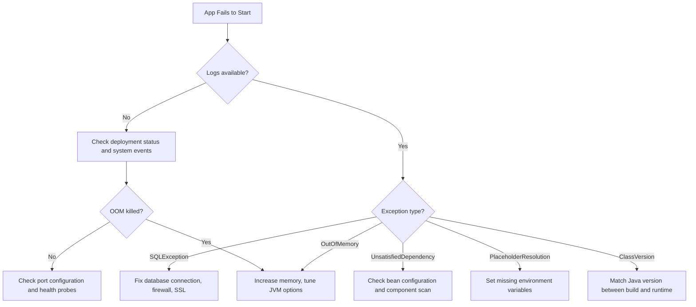

# How to Troubleshoot Application Startup Failures in Azure Spring Apps

Author: [nawazdhandala](https://www.github.com/nawazdhandala)

Tags: Azure, Spring Apps, Troubleshooting, Spring Boot, Java, Debugging, Startup Failures

Description: A systematic troubleshooting guide for diagnosing and fixing Spring Boot application startup failures in Azure Spring Apps with common causes and solutions.

---

Your Spring Boot application starts perfectly on your laptop but fails on Azure Spring Apps. The deployment shows "Failed" and the logs are either empty or filled with cryptic error messages. This is a frustrating but common experience. Spring Boot applications have many moving parts - dependency injection, database connections, configuration properties, auto-configuration - and any of them can cause a startup failure. This guide walks through the most common causes and how to fix them systematically.

## The Diagnostic Process

When a Spring Boot app fails to start on Azure Spring Apps, follow this sequence:

1. Check the deployment status for the failure reason
2. Read the application logs for Spring Boot error output
3. Check for environment-specific configuration issues
4. Verify external dependencies (databases, message brokers, etc.)
5. Test with a minimal configuration to isolate the problem

## Step 1: Check Deployment Status

Start by checking what Azure Spring Apps reports about the failure.

```bash
# Check the deployment status
az spring app deployment show \
  --app order-service \
  --service my-spring-service \
  --resource-group spring-rg \
  --deployment default \
  --query "{status:properties.provisioningState, instances:properties.instances}"
```

Common status messages and what they mean:

- **Failed:** The deployment could not complete. Check logs for details.
- **Running but unhealthy:** The app started but health probes are failing.
- **Deactivated:** The deployment was manually deactivated.

## Step 2: Read Application Logs

The application logs contain the Spring Boot startup output, including the full stack trace of any startup exception.

```bash
# Stream live logs
az spring app logs \
  --name order-service \
  --service my-spring-service \
  --resource-group spring-rg \
  --follow \
  --lines 500

# View logs from a specific instance
az spring app logs \
  --name order-service \
  --service my-spring-service \
  --resource-group spring-rg \
  --instance order-service-default-5-abc123 \
  --lines 1000
```

If the logs are empty, the application might be crashing before the logging framework initializes. Check the system-level logs.

```bash
# Check for system-level events
az spring app show \
  --name order-service \
  --service my-spring-service \
  --resource-group spring-rg \
  --query "properties.activeDeployment.properties.status"
```

## Common Failure #1: Database Connection Errors

This is by far the most common startup failure. Spring Boot tries to connect to the database during startup, and if it cannot, the application fails.

**Symptoms in logs:**
- `com.zaxxer.hikari.pool.HikariPool - Exception during pool initialization`
- `java.sql.SQLException: Cannot create PoolableConnectionFactory`
- `org.springframework.beans.factory.BeanCreationException: Error creating bean 'dataSource'`

**Common causes:**

The database URL is wrong or not set.

```bash
# Check current environment variables
az spring app show \
  --name order-service \
  --service my-spring-service \
  --resource-group spring-rg \
  --query "properties.activeDeployment.properties.deploymentSettings.environmentVariables"
```

The database firewall blocks access from Azure Spring Apps.

```bash
# For Azure PostgreSQL, add a firewall rule for Azure services
az postgres flexible-server firewall-rule create \
  --resource-group spring-rg \
  --name my-postgres-server \
  --rule-name allow-azure-services \
  --start-ip-address 0.0.0.0 \
  --end-ip-address 0.0.0.0
```

The SSL configuration is wrong. Azure databases require SSL by default.

```yaml
# Correct JDBC URL with SSL for Azure PostgreSQL
spring:
  datasource:
    url: jdbc:postgresql://myserver.postgres.database.azure.com:5432/mydb?sslmode=require
    username: admin@myserver
    password: ${DB_PASSWORD}
```

**Quick fix for testing:** Temporarily disable the data source auto-configuration to see if the app starts without the database.

```java
// Temporarily exclude DataSource auto-configuration for debugging
@SpringBootApplication(exclude = {
    DataSourceAutoConfiguration.class,
    HibernateJpaAutoConfiguration.class
})
public class OrderServiceApplication {
    public static void main(String[] args) {
        SpringApplication.run(OrderServiceApplication.class, args);
    }
}
```

## Common Failure #2: Missing or Wrong Configuration Properties

Spring Boot fails to start if a required property is missing or has an invalid value.

**Symptoms in logs:**
- `Failed to bind properties under 'spring.datasource' to javax.sql.DataSource`
- `Injection of autowired dependencies failed`
- `Could not resolve placeholder '${SOME_PROPERTY}'`

**Fix:** Verify that all required environment variables are set.

```bash
# Set missing environment variables
az spring app update \
  --name order-service \
  --service my-spring-service \
  --resource-group spring-rg \
  --env "DATABASE_URL=jdbc:postgresql://..." \
    "REDIS_HOST=myredis.redis.cache.windows.net" \
    "SPRING_PROFILES_ACTIVE=production"
```

A good practice is to provide default values for non-critical properties.

```java
// Use default values in @Value annotations
@Value("${cache.ttl:3600}")
private int cacheTtl;

@Value("${feature.new-checkout:false}")
private boolean newCheckoutEnabled;
```

## Common Failure #3: Port Mismatch

Azure Spring Apps expects your application to listen on port 1025 (the default for the platform) or the port configured in the `server.port` property. If your app listens on a different port, health probes fail.

**Symptoms:**
- App starts successfully (you see the Spring Boot banner) but is marked as unhealthy
- Health check endpoints return connection refused

**Fix:** Let Azure Spring Apps manage the port.

```yaml
# Let the platform set the port
server:
  port: 1025
```

Or use the `SERVER_PORT` environment variable, which Azure Spring Apps sets automatically.

```yaml
server:
  port: ${SERVER_PORT:8080}
```

## Common Failure #4: Out of Memory

Spring Boot applications, especially those with many dependencies, can run out of memory during startup.

**Symptoms:**
- Application stops abruptly without a clear error
- `java.lang.OutOfMemoryError: Java heap space` in logs
- Container killed by OOM killer (no application-level log)

**Fix:** Increase the memory allocation or tune JVM settings.

```bash
# Increase memory to 2Gi
az spring app scale \
  --name order-service \
  --service my-spring-service \
  --resource-group spring-rg \
  --memory 2Gi

# Set JVM options to limit heap and leave room for non-heap memory
az spring app update \
  --name order-service \
  --service my-spring-service \
  --resource-group spring-rg \
  --jvm-options "-Xms256m -Xmx1280m -XX:+UseG1GC"
```

A common mistake is setting `-Xmx` equal to the container memory limit. The JVM uses memory beyond the heap (thread stacks, native memory, class metadata). A safe rule is to set `-Xmx` to 60-70% of the container memory.

## Common Failure #5: Dependency Injection Errors

Spring cannot create a bean because of missing dependencies, circular references, or configuration issues.

**Symptoms:**
- `org.springframework.beans.factory.UnsatisfiedDependencyException`
- `org.springframework.beans.factory.NoSuchBeanDefinitionException`
- `org.springframework.beans.factory.BeanCurrentlyInCreationException` (circular dependency)

**Fix for circular dependencies:**

```java
// Use @Lazy to break circular dependencies
@Service
public class OrderService {
    private final PaymentService paymentService;

    // @Lazy defers the initialization of PaymentService
    public OrderService(@Lazy PaymentService paymentService) {
        this.paymentService = paymentService;
    }
}
```

**Fix for missing beans:** Check that all required dependencies are in your classpath and component scanning covers the right packages.

```java
// Explicitly scan the package containing your beans
@SpringBootApplication
@ComponentScan(basePackages = {"com.example.order", "com.example.shared"})
public class OrderServiceApplication {
    public static void main(String[] args) {
        SpringApplication.run(OrderServiceApplication.class, args);
    }
}
```

## Common Failure #6: Incompatible Java Version

The application was compiled with a Java version different from what is available on Azure Spring Apps.

**Symptoms:**
- `java.lang.UnsupportedClassVersionError`
- `class file has wrong version 61.0, should be 55.0`

**Fix:** Match the Java version in your build and deployment.

```bash
# Set the runtime version to match your build
az spring app update \
  --name order-service \
  --service my-spring-service \
  --resource-group spring-rg \
  --runtime-version Java_17
```

And in your `pom.xml`:

```xml
<!-- Match the Java version in Maven configuration -->
<properties>
    <java.version>17</java.version>
</properties>
```

## Debugging Flowchart



## Step 3: Enable Debug Logging

If the standard logs are not informative enough, enable Spring Boot debug logging.

```bash
# Enable debug logging for more detailed output
az spring app update \
  --name order-service \
  --service my-spring-service \
  --resource-group spring-rg \
  --env "LOGGING_LEVEL_ROOT=DEBUG" "LOGGING_LEVEL_ORG_SPRINGFRAMEWORK=DEBUG"
```

Be aware that debug logging is very verbose. Use it only for troubleshooting and disable it afterward to avoid excessive log volume and costs.

## Step 4: Use Remote Debugging

Azure Spring Apps supports remote debugging for deeper investigation.

```bash
# Enable remote debugging on the app
az spring app update \
  --name order-service \
  --service my-spring-service \
  --resource-group spring-rg \
  --jvm-options "-agentlib:jdwp=transport=dt_socket,server=y,suspend=n,address=*:5005"
```

Then connect your IDE's remote debugger to the application instance. This lets you set breakpoints and step through the startup process.

## Prevention Tips

1. **Run integration tests with a production-like configuration** before deploying. Use Testcontainers to spin up real databases and services in your test environment.

2. **Use Spring Boot's fail-fast configuration** for data sources so errors are clear and immediate.

```yaml
spring:
  datasource:
    hikari:
      initialization-fail-timeout: 30000
```

3. **Set up a health check that covers dependencies.** The `/actuator/health` endpoint should report the status of all critical dependencies.

4. **Use environment-specific profiles.** Have separate `application-dev.yml` and `application-production.yml` files so environment differences are explicit.

## Summary

Spring Boot startup failures on Azure Spring Apps usually come down to a small set of causes: database connectivity, missing configuration, port mismatches, insufficient memory, dependency injection errors, or Java version mismatches. The diagnostic process always starts with logs. Check the deployment status, read the application logs, identify the exception type, and apply the corresponding fix. For production deployments, invest in integration testing with production-like configurations to catch these issues before they reach Azure.
