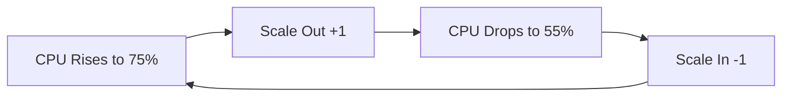

# How to Troubleshoot Autoscale Flapping in Azure VM Scale Sets

Author: [nawazdhandala](https://www.github.com/nawazdhandala)

Tags: Azure, VM Scale Sets, Autoscale, Flapping, Troubleshooting, Performance Tuning

Description: Diagnose and fix autoscale flapping in Azure VM Scale Sets where instances are continuously added and removed in rapid cycles.

---

Autoscale flapping is when a VM Scale Set repeatedly scales out and then immediately scales back in, creating a cycle where instances are continuously created and destroyed. It is one of the most frustrating autoscale problems because the system appears to be working - instances are being added when CPU is high and removed when it is low - but the net effect is instability, wasted time on provisioning, and possibly degraded application performance.

I once spent a week chasing a flapping issue that turned out to be caused by a 5-minute evaluation window combined with a 3-minute cooldown and instances that took 4 minutes to fully boot. The math did not work in our favor, and the autoscaler was in a constant loop. Here is how to diagnose and fix these situations.

## What Flapping Looks Like

The symptoms are pretty clear once you know what to look for:

- Instance count oscillates rapidly (for example, 3-5-3-5-3 over a few hours)
- The activity log shows frequent scale-out immediately followed by scale-in events
- CPU metrics show a sawtooth pattern - spikes triggering scale-out, drops triggering scale-in
- Application performance is inconsistent because the fleet size keeps changing
- You are paying for instances that only run for a few minutes before being terminated

Check the autoscale activity log to confirm flapping:

```bash
# View recent autoscale events
az monitor activity-log list \
  --resource-group myResourceGroup \
  --offset 24h \
  --query "[?contains(operationName.value, 'Autoscale')].{Time:eventTimestamp, Operation:operationName.localizedValue, Status:status.localizedValue, Description:description}" \
  -o table
```

If you see alternating scale-out and scale-in events with only minutes between them, you have a flapping problem.

## Root Causes

### Cause 1: Threshold Gap Too Narrow

This is the most common cause. If your scale-out threshold is 70% CPU and your scale-in threshold is 60%, the gap is only 10 percentage points. When the scale set adds an instance, the average CPU might drop from 72% to 58% - which immediately triggers scale-in. Removing the instance pushes CPU back above 70%, triggering scale-out again.

The fix is to widen the gap between thresholds:

```bash
# Remove the existing rules first
az monitor autoscale rule delete \
  --resource-group myResourceGroup \
  --autoscale-name cpu-autoscale \
  --index 0

az monitor autoscale rule delete \
  --resource-group myResourceGroup \
  --autoscale-name cpu-autoscale \
  --index 0

# Create rules with a wider gap
# Scale out at 75% CPU
az monitor autoscale rule create \
  --resource-group myResourceGroup \
  --autoscale-name cpu-autoscale \
  --condition "Percentage CPU > 75 avg 10m" \
  --scale out 1 \
  --cooldown 10

# Scale in at 30% CPU (45 percentage points gap)
az monitor autoscale rule create \
  --resource-group myResourceGroup \
  --autoscale-name cpu-autoscale \
  --condition "Percentage CPU < 30 avg 15m" \
  --scale in 1 \
  --cooldown 15
```

A good rule of thumb: after scaling out by one instance, the per-instance CPU should still be above the scale-in threshold. If you have N instances at X% CPU and scale to N+1, the new per-instance average is roughly X * N / (N+1). For 4 instances at 75%, adding one gives 75 * 4 / 5 = 60%. If your scale-in threshold is 30%, that 60% is safely above it.

### Cause 2: Cooldown Period Too Short

The cooldown period is the minimum time between consecutive scale actions. If the cooldown is shorter than the time it takes a new instance to boot, install software, and start handling traffic, the autoscaler evaluates metrics before the new instance has any effect on the load distribution.

```bash
# Set a longer cooldown that accounts for instance startup time
az monitor autoscale rule create \
  --resource-group myResourceGroup \
  --autoscale-name cpu-autoscale \
  --condition "Percentage CPU > 75 avg 10m" \
  --scale out 1 \
  --cooldown 10

# Scale-in should have an even longer cooldown
az monitor autoscale rule create \
  --resource-group myResourceGroup \
  --autoscale-name cpu-autoscale \
  --condition "Percentage CPU < 30 avg 15m" \
  --scale in 1 \
  --cooldown 15
```

Measure your actual instance startup time. From the moment a scale-out is triggered to the moment the new instance is handling traffic and affecting the average CPU metric, how long does it take? Your cooldown should be at least that long, plus a buffer.

### Cause 3: Evaluation Window Too Short

If the time window for metric evaluation is too short, transient spikes trigger scaling actions that are not really needed.

```bash
# Use a longer evaluation window to smooth out transient spikes
az monitor autoscale rule create \
  --resource-group myResourceGroup \
  --autoscale-name cpu-autoscale \
  --condition "Percentage CPU > 75 avg 10m" \
  --scale out 1 \
  --cooldown 10
```

A 10-minute window with Average aggregation means the average CPU across all instances must exceed 75% for a sustained 10 minutes. A 2-minute window would react to brief spikes that resolve on their own.

### Cause 4: Instance Startup Impact

New instances joining the scale set can temporarily increase the average CPU of the fleet. This happens when the instance's Custom Script Extension runs heavy installation tasks (compiling, downloading large packages) during startup. The new instance shows high CPU, which can re-trigger the scale-out rule before the instance is actually serving traffic.

To mitigate this, ensure that new instances are excluded from metrics until they pass health checks. The Application Health Extension with a grace period handles this:

```bash
# Add health extension with a grace period
az vmss extension set \
  --resource-group myResourceGroup \
  --vmss-name myScaleSet \
  --name ApplicationHealthLinux \
  --publisher Microsoft.ManagedServices \
  --version 1.0 \
  --settings '{
    "protocol": "http",
    "port": 8080,
    "requestPath": "/health",
    "gracePeriod": 600
  }'
```

### Cause 5: External Load Patterns

Sometimes flapping is caused by the actual traffic pattern, not the autoscale configuration. If your traffic oscillates rapidly (for example, a batch job runs every 5 minutes and causes a CPU spike each time), the autoscaler reacts to each spike.

For periodic workloads, consider:
- Using scheduled scaling to pre-provision instances before the known spike
- Increasing the evaluation window to smooth out the periodic pattern
- Using a metric other than CPU that better represents the actual load

## Diagnosing Flapping Step by Step

### Step 1: Review the Activity Log

```bash
# Get detailed autoscale events for the last 24 hours
az monitor activity-log list \
  --resource-group myResourceGroup \
  --offset 24h \
  --query "[?contains(operationName.value, 'Autoscale')].{Time:eventTimestamp, Description:description}" \
  -o json
```

Look at the timestamps. How often are scale events happening? How long between a scale-out and the subsequent scale-in?

### Step 2: Review the Autoscale Configuration

```bash
# Export the current autoscale settings
az monitor autoscale show \
  --resource-group myResourceGroup \
  --name cpu-autoscale \
  -o json > autoscale-config.json

# Review the configuration
cat autoscale-config.json | python3 -m json.tool
```

Check the thresholds, cooldowns, evaluation windows, and aggregation types. Look for the issues described above.

### Step 3: Chart the Instance Count and CPU

Use Azure Monitor to plot the instance count and average CPU on the same timeline:

```bash
# Get CPU metrics for the last 6 hours
az monitor metrics list \
  --resource "/subscriptions/<sub-id>/resourceGroups/myResourceGroup/providers/Microsoft.Compute/virtualMachineScaleSets/myScaleSet" \
  --metric "Percentage CPU" \
  --interval PT5M \
  --aggregation Average \
  --start-time 2026-02-16T00:00:00Z \
  --end-time 2026-02-16T06:00:00Z \
  -o table
```

The visual pattern will often make the problem obvious. You should see CPU rising above the scale-out threshold, a scale-out event, CPU dropping below the scale-in threshold, a scale-in event, and so on.



### Step 4: Calculate the Math

Do the math for your specific configuration:

- N instances at CPU threshold T
- After adding 1: average CPU = T * N / (N+1)
- Is that result above the scale-in threshold?
- If not, flapping will occur

For example: 3 instances at 75% CPU, scale out to 4 instances:
- New average: 75 * 3 / 4 = 56.25%
- If scale-in threshold is 55%, you are dangerously close to flapping
- If scale-in threshold is 30%, you have plenty of headroom

## A Stable Configuration Example

Here is a configuration that I have found works well for most web application workloads:

```bash
# Create the autoscale setting
az monitor autoscale create \
  --resource-group myResourceGroup \
  --resource myScaleSet \
  --resource-type Microsoft.Compute/virtualMachineScaleSets \
  --name stable-autoscale \
  --min-count 2 \
  --max-count 15 \
  --count 3

# Scale out: sustained high CPU
az monitor autoscale rule create \
  --resource-group myResourceGroup \
  --autoscale-name stable-autoscale \
  --condition "Percentage CPU > 75 avg 10m" \
  --scale out 1 \
  --cooldown 10

# Scale in: sustained low CPU with longer window and cooldown
az monitor autoscale rule create \
  --resource-group myResourceGroup \
  --autoscale-name stable-autoscale \
  --condition "Percentage CPU < 25 avg 15m" \
  --scale in 1 \
  --cooldown 15
```

This configuration has:
- A 50-percentage-point gap between thresholds (75% and 25%)
- A 10-minute evaluation window for scale-out (ignores brief spikes)
- A 15-minute evaluation window for scale-in (waits for sustained low usage)
- 10-minute cooldown for scale-out (allows new instances to start handling traffic)
- 15-minute cooldown for scale-in (extra caution before removing capacity)

## Monitoring for Flapping

Set up ongoing monitoring to detect flapping early:

```bash
# Alert if more than 4 scale events happen in 1 hour
az monitor activity-log alert create \
  --resource-group myResourceGroup \
  --name "flapping-alert" \
  --scope "/subscriptions/<sub-id>/resourceGroups/myResourceGroup" \
  --condition category=Autoscale \
  --description "Possible autoscale flapping detected"
```

Feed autoscale events into OneUptime to visualize scaling patterns over time. A healthy autoscale should show gradual, infrequent changes - not rapid oscillations.

## Wrapping Up

Autoscale flapping is almost always caused by the gap between scale-out and scale-in thresholds being too narrow, cooldowns being too short, or evaluation windows being too brief. The fix is straightforward: widen the threshold gap to at least 40-50 percentage points, set cooldowns longer than your instance startup time, use 10-15 minute evaluation windows, and make scale-in more conservative than scale-out. Test your configuration under realistic load and watch the activity log for the first few days to confirm the flapping is resolved.
