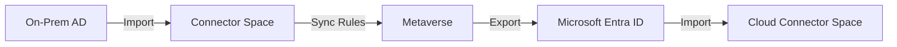

# How to Troubleshoot Azure AD Connect Synchronization Errors for User and Group Objects

Author: [nawazdhandala](https://www.github.com/nawazdhandala)

Tags: Azure AD Connect, Synchronization, Active Directory, Microsoft Entra ID, Identity, Troubleshooting, Hybrid Identity

Description: A practical guide to diagnosing and fixing the most common Azure AD Connect synchronization errors for users and groups in hybrid identity environments.

---

Azure AD Connect is the backbone of hybrid identity for organizations that run on-premises Active Directory alongside Microsoft Entra ID (formerly Azure AD). When synchronization works, nobody thinks about it. When it breaks, you get tickets from users who cannot access cloud resources, groups that are missing members, and mailboxes that refuse to provision.

This guide covers the most common synchronization errors I have encountered in production and walks through how to diagnose and fix each one.

## Understanding the Sync Pipeline

Before diving into errors, it helps to understand how Azure AD Connect processes objects. The sync engine has three main stages:

1. **Import** - reads objects from the connected directory (on-premises AD or Entra ID)
2. **Synchronization** - applies rules to match, filter, and transform objects
3. **Export** - writes changes to the target directory

Errors can happen at any stage. An import error means the connector could not read the object from the source. A sync error means the rules engine hit a conflict. An export error means the target directory rejected the change.



## Checking Sync Status

The first step in any troubleshooting session is to confirm whether sync is actually running and when it last completed.

Open PowerShell on the Azure AD Connect server and run the following.

```powershell
# Check the current sync cycle status and last run time
Get-ADSyncScheduler
```

Look at the `NextSyncCyclePolicyType` and `NextSyncCycleStartTimeInUTC` fields. If `SyncCycleEnabled` is `False`, the scheduler is stopped and nothing will sync until you restart it.

To see the results of the last sync cycle, use this command.

```powershell
# Get the most recent sync run history with status and error counts
Get-ADSyncRunProfileResult -ConnectorName "yourdomain.com" -NumberRequested 5
```

This shows you whether the last runs succeeded, how many objects were processed, and how many had errors.

## Error 1: InvalidSoftMatch - Duplicate Attribute Values

This is probably the most frequent error. It happens when Azure AD Connect tries to match an on-premises object to a cloud object using a soft match (typically based on the proxyAddresses or userPrincipalName attribute), but finds more than one match or a conflicting value.

**Symptoms:** The user object shows up in the sync error report with an `InvalidSoftMatch` error. The user exists in both on-premises AD and Entra ID but they are not linked.

**How to fix it:**

First, identify the conflicting attribute.

```powershell
# Find the specific sync error for a user
Get-ADSyncCSObject -ConnectorName "yourdomain.com" -DistinguishedName "CN=John Smith,OU=Users,DC=contoso,DC=com"
```

Then check Entra ID for objects that share the same proxyAddress or UPN.

```powershell
# Search for duplicate proxy addresses in Entra ID
Get-MgUser -Filter "proxyAddresses/any(p:p eq 'SMTP:john.smith@contoso.com')" -Property DisplayName,UserPrincipalName,ProxyAddresses
```

If you find a duplicate cloud-only account, you have two options:
- Delete the cloud-only account and let sync recreate it from on-premises
- Use hard match by setting the ImmutableID on the cloud account to match the on-premises objectGUID

To perform a hard match, convert the on-premises GUID and set it.

```powershell
# Get the on-premises objectGUID and convert to ImmutableID format
$guid = (Get-ADUser -Identity "john.smith").ObjectGUID
$immutableId = [System.Convert]::ToBase64String($guid.ToByteArray())

# Set the ImmutableID on the cloud account to force a hard match
Update-MgUser -UserId "john.smith@contoso.com" -OnPremisesImmutableId $immutableId
```

After setting this, trigger a delta sync and the objects should link up.

## Error 2: AttributeValueMustBeUnique

This error occurs when an attribute that must be unique across the tenant already exists on another object. The most common culprit is `proxyAddresses`.

**Symptoms:** Export error stating that the value for a proxy address is already in use by another object in the directory.

**How to fix it:**

Identify which object currently owns the conflicting address.

```powershell
# Find all objects in Entra ID that use a specific proxy address
Get-MgUser -All -Property DisplayName,ProxyAddresses | Where-Object {
    $_.ProxyAddresses -contains "smtp:shared-alias@contoso.com"
}

# Also check groups, since proxy addresses can conflict across object types
Get-MgGroup -All -Property DisplayName,ProxyAddresses | Where-Object {
    $_.ProxyAddresses -contains "smtp:shared-alias@contoso.com"
}
```

Once you find the conflicting object, either remove the duplicate address from one of the on-premises objects or adjust your sync rules to exclude that attribute for one of them.

## Error 3: LargeObject - Exceeding Attribute Size Limits

Entra ID has limits on multi-valued attributes. For example, a user can have a maximum of around 100 proxy addresses, and a group can have up to 50,000 members (but the sync engine has its own limits).

**Symptoms:** Export error with `LargeObject` code, typically on groups with thousands of members or users with many proxy addresses.

**How to fix it:**

For groups that exceed the member limit, the cleanest solution is to convert them to cloud-managed groups or use group writeback v2.

For proxy address bloat, audit the affected user and clean up unnecessary entries.

```powershell
# List all proxy addresses for a specific on-premises user
Get-ADUser -Identity "john.smith" -Properties proxyAddresses |
    Select-Object -ExpandProperty proxyAddresses |
    Sort-Object
```

Remove any stale or unnecessary addresses directly in on-premises AD, then run a delta sync.

## Error 4: DataValidationFailed - Invalid Characters or Format

Entra ID is stricter about attribute formatting than on-premises AD. Characters that are perfectly valid in on-premises attributes might get rejected during export to the cloud.

**Symptoms:** Export error with `DataValidationFailed`, usually pointing to a specific attribute like `mailNickname` or `displayName`.

Common causes include:
- Leading or trailing spaces in the display name
- Special characters in the mail nickname (only alphanumeric, periods, hyphens, and underscores are allowed)
- UPN values with unsupported characters

**How to fix it:**

Clean the data at the source. Here is a script that finds common formatting issues.

```powershell
# Find users with leading/trailing spaces in display names
Get-ADUser -Filter * -Properties displayName | Where-Object {
    $_.displayName -match '^\s|\s$'
} | Select-Object SamAccountName, displayName

# Find users with invalid characters in mailNickname
Get-ADUser -Filter * -Properties mailNickname | Where-Object {
    $_.mailNickname -match '[^a-zA-Z0-9._\-]'
} | Select-Object SamAccountName, mailNickname
```

Fix the invalid values in on-premises AD, then trigger a delta sync.

## Error 5: IdentitySync Errors with Group Objects

Group sync errors are their own category of pain. The most common issues are:

- Groups with members from domains that are not synced
- Nested groups where one of the child groups is out of scope
- Distribution groups with no mail attribute

**How to diagnose:**

```powershell
# Check for groups that have sync errors in the connector space
$connector = Get-ADSyncConnector -Name "yourdomain.com"
$errors = Get-ADSyncConnectorStatistics -ConnectorIdentifier $connector.Identifier
Write-Host "Export errors: $($errors.ExportErrors)"
```

For groups with out-of-scope members, you either need to bring those members into sync scope or configure the sync rules to handle missing references gracefully.

## Using the Synchronization Service Manager

The Synchronization Service Manager UI is still the most direct way to inspect individual object errors. You can find it at `C:\Program Files\Microsoft Azure AD Sync\UIShell\miisclient.exe` on the Azure AD Connect server.

In the Operations tab, look for runs with a status other than `success`. Click into the run to see the per-object error details. Each error includes the object DN, the failing attribute, and the specific error code.

## Forcing a Full Sync After Fixes

After making bulk corrections, a delta sync might not pick up all changes. You can trigger a full sync cycle with this command.

```powershell
# Start a full synchronization cycle (this can take a long time for large directories)
Start-ADSyncSyncCycle -PolicyType Initial
```

Be cautious with full syncs in large environments. They can take hours and generate significant load on both the on-premises domain controllers and the Entra ID tenant. Schedule them during off-hours if possible.

## Monitoring Ongoing Sync Health

Rather than waiting for users to report problems, set up proactive monitoring.

Azure AD Connect Health provides a dashboard in the Azure portal that shows sync errors, agent status, and performance metrics. Make sure the health agent is installed and reporting.

```powershell
# Check the Azure AD Connect Health agent status
Get-Service -Name "Azure AD Connect Health Sync Insights Service" |
    Select-Object Name, Status, StartType
```

You can also configure email notifications for sync errors through the Azure portal under Microsoft Entra ID > Entra Connect > Connect Sync.

## Prevention Tips

Most sync errors come from dirty data in on-premises AD. Here are a few ways to prevent them:

1. Run the IdFix tool periodically. Microsoft provides this free tool specifically to find and fix identity issues before they cause sync failures.
2. Enforce naming standards in your on-premises AD through group policy or custom provisioning scripts.
3. Use Azure AD Connect filtering to exclude OUs or objects that should never sync to the cloud.
4. Keep Azure AD Connect updated. Microsoft releases regular updates that fix known sync bugs and improve error handling.
5. Test sync rule changes in staging mode before applying them to your production connector.

## Wrapping Up

Azure AD Connect synchronization errors are inevitable in any hybrid identity environment, but they do not have to be mysterious. The key is understanding the sync pipeline, knowing where to look for error details, and having a systematic approach to fixing the most common issues. Start with the sync status check, drill into the specific error codes, fix the data at the source, and verify with a delta sync. Over time, proactive monitoring and data hygiene will reduce the volume of errors significantly.
