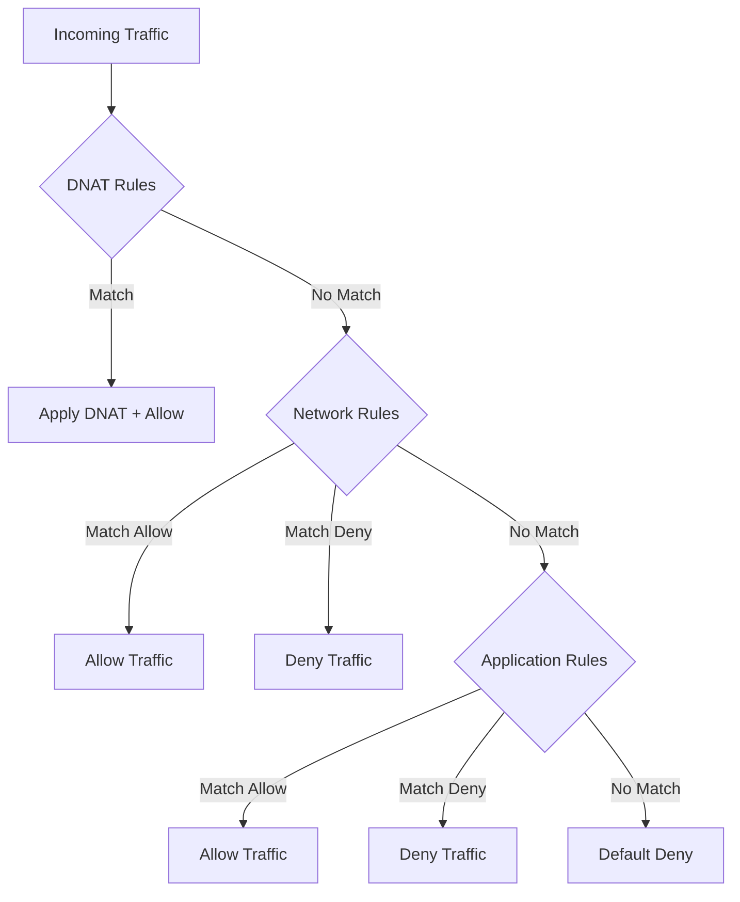

# How to Troubleshoot Azure Firewall Rule Collection Ordering and Traffic Denials

Author: [nawazdhandala](https://www.github.com/nawazdhandala)

Tags: Azure, Azure Firewall, Network Security, Firewall Rules, Traffic Filtering, Troubleshooting, Cloud Networking

Description: Understand how Azure Firewall processes rule collections and learn to diagnose why traffic is being denied with practical troubleshooting steps.

---

Azure Firewall is a managed, cloud-native firewall service that provides network and application-level filtering. It works well once properly configured, but the rule processing logic is not intuitive. I have seen teams spend hours wondering why traffic is being denied when they clearly have an allow rule in place. The answer almost always comes down to rule collection ordering, rule types, or the precedence of DNAT, network, and application rules.

Let me explain how Azure Firewall evaluates rules and walk you through a systematic approach to troubleshooting traffic denials.

## How Azure Firewall Processes Rules

Azure Firewall has three types of rule collections, and they are processed in a specific order:

1. **DNAT rule collections** - processed first
2. **Network rule collections** - processed second
3. **Application rule collections** - processed last

Within each type, rule collections are processed by priority (lower number = higher priority). Within a rule collection, individual rules are processed in order from top to bottom. The first matching rule wins.

Here is the critical detail that catches people: if a network rule matches and allows traffic, application rules are never evaluated. If no network rule matches, the firewall then evaluates application rules. If nothing matches in any rule type, the traffic is denied by the built-in deny-all rule.



## Understanding Rule Collection Priority

Each rule collection has a priority from 100 to 65000. Lower numbers are processed first. This is where most ordering issues come from.

Example scenario: You have two network rule collections.

Collection A (priority 200): Deny all traffic to 10.0.0.0/8
Collection B (priority 300): Allow traffic from 10.1.0.0/16 to SQL on port 1433

In this case, Collection A is evaluated first. Traffic from 10.1.0.0/16 matches the deny rule in Collection A and gets blocked. The allow rule in Collection B is never reached.

The fix is to either reorder the priorities (make the allow rule lower priority number than the deny rule) or combine them into a single collection with the allow rule listed first.

```bash
# Check the priority of all rule collections
# Network rule collections
az network firewall network-rule collection list \
  --resource-group rg-networking \
  --firewall-name fw-production \
  --query "[].{name:name, priority:priority, action:action.type}" \
  -o table

# Application rule collections
az network firewall application-rule collection list \
  --resource-group rg-networking \
  --firewall-name fw-production \
  --query "[].{name:name, priority:priority, action:action.type}" \
  -o table
```

## Using Azure Firewall Logs for Troubleshooting

The single most useful troubleshooting tool is the Azure Firewall diagnostic logs. Enable them if you have not already.

```bash
# Enable diagnostic logging for Azure Firewall
# Send logs to Log Analytics for querying
az monitor diagnostic-settings create \
  --name "fw-diagnostics" \
  --resource "/subscriptions/{sub-id}/resourceGroups/rg-networking/providers/Microsoft.Network/azureFirewalls/fw-production" \
  --workspace "/subscriptions/{sub-id}/resourceGroups/rg-monitoring/providers/Microsoft.OperationalInsights/workspaces/law-production" \
  --logs '[
    {"category":"AzureFirewallNetworkRule","enabled":true},
    {"category":"AzureFirewallApplicationRule","enabled":true},
    {"category":"AzureFirewallDnsProxy","enabled":true}
  ]'
```

Once logging is enabled, query the logs in Log Analytics to see exactly why traffic was allowed or denied.

```
// KQL query to find denied traffic from a specific source IP
// Shows which rule type denied the traffic and the reason
AzureDiagnostics
| where ResourceType == "AZUREFIREWALLS"
| where msg_s contains "Deny"
| where msg_s contains "10.1.2.3"
| project TimeGenerated, msg_s
| order by TimeGenerated desc
| take 50
```

The `msg_s` field contains detailed information about the traffic flow including source IP, destination IP, port, protocol, and which rule (or default deny) applied.

## Common Denial Scenarios and Fixes

### Scenario 1: Application Rule Not Matching HTTPS Traffic

Application rules work on FQDNs and require the firewall to inspect the TLS SNI (Server Name Indication) header. If the client does not send SNI or uses IP addresses directly instead of FQDNs, application rules cannot match and the traffic is denied.

Fix: Either ensure clients use FQDNs, or create a network rule to allow the traffic by IP and port instead.

### Scenario 2: Non-HTTP/S Traffic Hitting Application Rules

Application rules only work for HTTP (port 80), HTTPS (port 443), and MSSQL (port 1433) protocols. If you create an application rule for a service that uses a different port, it will not work.

Fix: Use network rules for non-HTTP/S traffic. Network rules work with any port and protocol combination.

### Scenario 3: Deny Rule Overriding Allow Rule

If you have a deny rule collection with a lower priority number (processed first) than an allow rule collection, the deny takes effect.

```bash
# Example: Reorder collection priorities
# Move the allow collection to a lower priority number than the deny collection
az network firewall network-rule collection list \
  --resource-group rg-networking \
  --firewall-name fw-production \
  -o table

# If Allow collection is priority 300 and Deny is priority 200,
# you need to delete and recreate the Allow collection at priority 150
```

### Scenario 4: FQDN Resolution Issues

Application rules with FQDN targets require Azure Firewall DNS proxy to be enabled. Without it, the firewall cannot resolve FQDNs in network rules (application rules always resolve FQDNs).

```bash
# Enable DNS proxy on Azure Firewall
az network firewall update \
  --resource-group rg-networking \
  --name fw-production \
  --dns-proxy true \
  --dns-servers "168.63.129.16"
```

### Scenario 5: Asymmetric Routing

If return traffic does not go through the firewall, connection tracking fails and the traffic is denied. This is common when you have multiple routes and the return path differs from the forward path.

Verify your route tables send both directions of traffic through the firewall.

## Azure Firewall Policy vs Classic Rules

If you are using Azure Firewall Policy (the newer and recommended approach), the rule evaluation order is slightly different. Firewall Policy supports rule collection groups, which add another layer of priority.

The evaluation order with Firewall Policy is:

1. DNAT rules (by rule collection group priority, then rule collection priority)
2. Network rules (same ordering)
3. Application rules (same ordering)

Additionally, Firewall Policy inherits rules from parent policies. Inherited rules are processed before local rules at each priority level.

```bash
# List rule collection groups in a Firewall Policy
az network firewall policy rule-collection-group list \
  --resource-group rg-networking \
  --policy-name fwpolicy-production \
  --query "[].{name:name, priority:priority}" \
  -o table
```

## Threat Intelligence and IDPS

Azure Firewall Premium includes threat intelligence-based filtering and IDPS (Intrusion Detection and Prevention). These features can deny traffic independently of your rule collections.

If traffic is being denied and your rules look correct, check whether threat intelligence is blocking it.

```
// KQL query to check for threat intelligence denials
AzureDiagnostics
| where ResourceType == "AZUREFIREWALLS"
| where OperationName == "AzureFirewallThreatIntelLog"
| project TimeGenerated, msg_s
| order by TimeGenerated desc
| take 20
```

You can configure threat intelligence to "Alert only" mode while troubleshooting to see if it is the source of denials without actually blocking traffic.

## Best Practices for Rule Organization

After troubleshooting many firewall rule ordering issues, I recommend the following structure:

1. Use Firewall Policy instead of classic rules
2. Create rule collection groups for logical groupings (e.g., by environment or team)
3. Within each group, use explicit deny collections at higher priority numbers (processed last)
4. Use allow collections at lower priority numbers (processed first)
5. Always log denied traffic for troubleshooting
6. Review rule hit counts monthly and remove unused rules

Azure Firewall rule evaluation is deterministic. If you understand the ordering, you can predict exactly how any traffic flow will be handled. When in doubt, check the diagnostic logs. They tell you exactly what happened and why.
