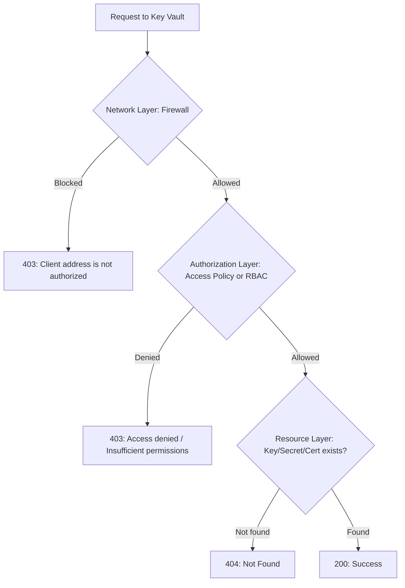

# How to Troubleshoot Azure Key Vault 403 Forbidden Errors Caused by Firewall and Access Policy Misconfigurations

Author: [nawazdhandala](https://www.github.com/nawazdhandala)

Tags: Azure, Key Vault, Troubleshooting, Firewall, Access Policy, RBAC, 403 Errors

Description: A systematic troubleshooting guide for diagnosing and resolving Azure Key Vault 403 Forbidden errors from firewall restrictions, access policy gaps, and RBAC misconfigurations.

---

Few Azure error messages cause as much frustration as the Key Vault 403 Forbidden response. It tells you that your request was denied, but it does not always make it obvious why. The denial could come from the network layer (firewall), the authorization layer (access policies or RBAC), or the key vault's soft-delete and purge protection settings. And when multiple layers are involved, the error message from one layer can mask the real issue on another.

In this post, I will walk through a systematic approach to diagnosing 403 errors on Key Vault, covering each possible cause with specific checks and fixes.

## The Three Layers of Key Vault Access Control

Key Vault access is controlled by three independent layers:



A request must pass ALL three layers. The firewall is checked first. If it passes, the authorization is checked. If that passes, the actual resource is accessed.

## Step 1: Check the Error Message

The 403 error message gives you a clue about which layer is blocking:

**"Client address is not authorized and caller is not a trusted service"** - This is a firewall (network) issue. The IP address making the request is not in the allowed list.

**"The user, group or application does not have secrets/get permission"** (or similar) - This is an access policy issue. The identity has insufficient permissions.

**"Caller is not authorized to perform action on resource"** - This is an RBAC issue. The identity does not have the required role assignment.

**"Access denied"** with no additional detail - Could be either authorization layer. Need to dig deeper.

## Step 2: Diagnose Firewall Issues

The most common cause of 403 errors is the Key Vault firewall blocking the request. Check the firewall configuration:

```bash
# Check the Key Vault's network ACL settings
az keyvault show \
  --name myKeyVault \
  --resource-group myResourceGroup \
  --query "properties.networkAcls" \
  --output json
```

Look at the output:

```json
{
  "bypass": "AzureServices",
  "defaultAction": "Deny",
  "ipRules": [
    {"value": "203.0.113.0/24"}
  ],
  "virtualNetworkRules": [
    {
      "id": "/subscriptions/.../subnets/mySubnet",
      "ignoreMissingVnetServiceEndpoint": false
    }
  ]
}
```

If `defaultAction` is `Deny`, only traffic from the listed IPs and subnets is allowed. Check if the requesting IP or subnet is in the allowed list.

**Finding the client's IP:**

```bash
# For local development machines, find your public IP
curl -s https://ifconfig.me

# For Azure VMs, the outbound IP depends on the NAT configuration
# Check the VM's effective routes and NAT gateway
az network nic show-effective-route-table \
  --name myNIC \
  --resource-group myResourceGroup \
  --output table
```

**Common firewall-related 403 scenarios:**

1. **Developer's home IP changed:** DHCP gave them a new IP. Add the new IP or use a VPN.
2. **Azure service not in the trusted services list:** Some Azure services are not in the bypass list. Check the Microsoft documentation for which services are trusted.
3. **Service endpoint not configured:** The subnet has a VNet rule, but the Microsoft.KeyVault service endpoint is not enabled on the subnet.
4. **Deploying from a CI/CD agent:** The build agent's IP is not in the allowed list. Either add it or use a self-hosted agent in an allowed VNet.

**Fix: Add the IP to the allow list:**

```bash
# Add a specific IP address
az keyvault network-rule add \
  --name myKeyVault \
  --resource-group myResourceGroup \
  --ip-address "198.51.100.42/32"

# Or temporarily allow all networks for troubleshooting (revert after!)
az keyvault update \
  --name myKeyVault \
  --resource-group myResourceGroup \
  --default-action Allow
```

## Step 3: Diagnose Access Policy Issues

If your Key Vault uses access policies (not RBAC), check what permissions the identity has:

```bash
# List all access policies on the Key Vault
az keyvault show \
  --name myKeyVault \
  --resource-group myResourceGroup \
  --query "properties.accessPolicies[].{ObjectId:objectId, TenantId:tenantId, Secrets:permissions.secrets, Keys:permissions.keys, Certificates:permissions.certificates}" \
  --output table
```

Common issues:

**Missing access policy entirely:** The identity has no access policy. This happens when:
- A new service principal was created but nobody added the access policy
- The application's managed identity was recreated (new object ID)
- The Key Vault was redeployed without including the access policy

```bash
# Add an access policy for a service principal or managed identity
az keyvault set-policy \
  --name myKeyVault \
  --resource-group myResourceGroup \
  --object-id "the-identity-object-id" \
  --secret-permissions get list
```

**Wrong object ID:** Access policies use Azure AD object IDs, not application IDs. A common mistake is using the app registration's application ID instead of its service principal's object ID.

```bash
# Find the correct object ID for an application
# The application ID and service principal object ID are different!
az ad sp show --id "your-application-id" --query "id" --output tsv
```

**Insufficient permissions:** The access policy exists but does not include the needed operation. For example, the policy grants `get` on secrets but the app is trying to `list` secrets.

```bash
# Update the access policy to add missing permissions
az keyvault set-policy \
  --name myKeyVault \
  --resource-group myResourceGroup \
  --object-id "the-identity-object-id" \
  --secret-permissions get list set
```

## Step 4: Diagnose RBAC Issues

If your Key Vault uses Azure RBAC (check the "Permission model" in the vault's Access Configuration), you need to check role assignments instead of access policies:

```bash
# Check the Key Vault's permission model
az keyvault show \
  --name myKeyVault \
  --resource-group myResourceGroup \
  --query "properties.enableRbacAuthorization"

# If true, the vault uses RBAC. List role assignments
az role assignment list \
  --scope "/subscriptions/{sub-id}/resourceGroups/{rg}/providers/Microsoft.KeyVault/vaults/myKeyVault" \
  --query "[].{Principal:principalName, Role:roleDefinitionName, PrincipalType:principalType}" \
  --output table
```

Key Vault RBAC roles and their permissions:

| Role | Secrets | Keys | Certificates |
|---|---|---|---|
| Key Vault Administrator | Full | Full | Full |
| Key Vault Secrets Officer | Full | None | None |
| Key Vault Secrets User | Get, List | None | None |
| Key Vault Crypto Officer | None | Full | None |
| Key Vault Certificates Officer | None | None | Full |
| Key Vault Reader | List metadata | List metadata | List metadata |

**Common RBAC issues:**

1. **No role assignment:** The identity has no role at the vault's scope. Add one:

```bash
az role assignment create \
  --assignee "the-identity-object-id" \
  --role "Key Vault Secrets User" \
  --scope "/subscriptions/{sub-id}/resourceGroups/{rg}/providers/Microsoft.KeyVault/vaults/myKeyVault"
```

2. **Role assigned at wrong scope:** The role is assigned at the subscription level, but the vault is in a different subscription. Or the role is assigned at the resource group level but you are checking at the vault level.

3. **Role propagation delay:** RBAC changes can take up to 10 minutes to propagate. Wait and retry.

4. **Mixed mode confusion:** The vault has both access policies AND RBAC enabled (or one is enabled and you configured the other). Check which permission model is active and configure the right one.

## Step 5: Check Diagnostic Logs

When the error message is not clear enough, check the Key Vault diagnostic logs:

```bash
# First, ensure diagnostic logging is enabled
az monitor diagnostic-settings list \
  --resource "/subscriptions/{sub-id}/resourceGroups/{rg}/providers/Microsoft.KeyVault/vaults/myKeyVault" \
  --output table
```

Query the logs for the specific failure:

```
// Find all 403 errors with details
AzureDiagnostics
| where ResourceProvider == "MICROSOFT.KEYVAULT"
| where ResultSignature == "Forbidden" or httpStatusCode_d == 403
| where TimeGenerated > ago(1h)
| project
    TimeGenerated,
    OperationName,
    CallerIPAddress,
    // The identity that made the request
    identity_claim_appid_g,
    identity_claim_upn_s,
    ResultSignature,
    ResultDescription,
    // Resource being accessed
    id_s,
    requestUri_s
| order by TimeGenerated desc
```

The `identity_claim_appid_g` field tells you which application ID made the request, and `CallerIPAddress` tells you where the request came from. This is the definitive way to determine whether it is a firewall or authorization issue.

## Step 6: Common Scenario Fixes

**Scenario: App Service cannot read secrets after redeployment**

App Service slot swaps or redeployments can change the managed identity's object ID. Verify and update:

```bash
# Get the current managed identity object ID
az webapp identity show \
  --name myWebApp \
  --resource-group myResourceGroup \
  --query "principalId" --output tsv

# Update the access policy or RBAC assignment with the new object ID
```

**Scenario: Azure DevOps pipeline fails with 403**

The service connection's service principal needs access. Also check if the pipeline runs from a Microsoft-hosted agent (the IP changes frequently) or a self-hosted agent.

```bash
# Find the Azure DevOps service principal
az ad sp list --display-name "AzureDevOps-ServiceConnection" --query "[].{Id:id, AppId:appId}" --output table

# Add Key Vault access for this principal
az keyvault set-policy --name myKeyVault --object-id "sp-object-id" --secret-permissions get list
```

**Scenario: Terraform apply fails with 403**

Terraform needs broader permissions than just get. It often needs get, list, set, and delete for managing secrets as resources:

```bash
az keyvault set-policy --name myKeyVault \
  --object-id "terraform-sp-object-id" \
  --secret-permissions get list set delete purge recover
```

## Systematic Troubleshooting Checklist

When you get a 403, work through this checklist in order:

1. Read the error message carefully. Does it mention "address" or "network"? That is the firewall.
2. Check the vault's `defaultAction`. If it is `Deny`, verify the client's IP or subnet is allowed.
3. Check if the vault uses access policies or RBAC (`enableRbacAuthorization`).
4. For access policies: verify the object ID (not app ID) has the right permissions.
5. For RBAC: verify the role assignment exists at the right scope.
6. Check diagnostic logs for the specific caller IP and identity.
7. If nothing is obviously wrong, wait 10 minutes (RBAC propagation) and retry.
8. As a last resort, temporarily set `defaultAction` to `Allow` to isolate whether it is a network or auth issue. Revert immediately after testing.

## Summary

Key Vault 403 errors have three possible sources: firewall, access policies, and RBAC. The error message usually tells you which layer is the problem, but when it does not, systematic checking of each layer will find the root cause. Keep diagnostic logging enabled on your Key Vaults so you can quickly identify the caller IP and identity when issues arise. And always check the permission model (access policies vs RBAC) first - configuring the wrong one is a surprisingly common mistake.
