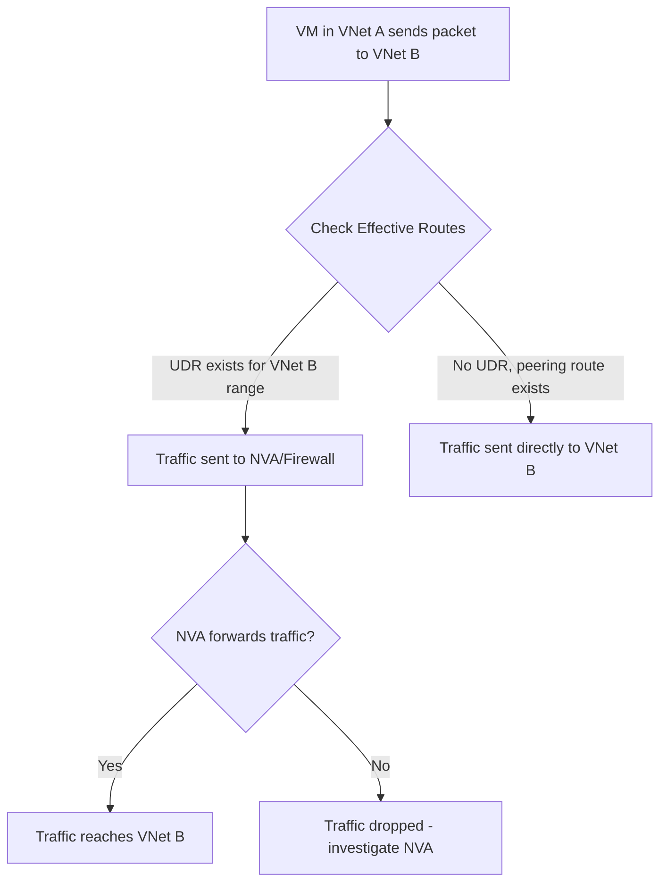

# How to Troubleshoot Azure VNet Peering Connectivity Issues

Author: [nawazdhandala](https://www.github.com/nawazdhandala)

Tags: Azure, VNet Peering, Troubleshooting, Networking, Connectivity, Virtual Network, Diagnostics

Description: A systematic guide to diagnosing and fixing Azure VNet peering connectivity issues including common misconfigurations and resolution steps.

---

VNet peering in Azure is supposed to be straightforward - two VNets linked together, traffic flows between them. In practice, there are enough configuration details that things go wrong regularly. I have seen teams spend hours debugging connectivity between peered VNets only to find a simple misconfiguration that took two minutes to fix once identified.

This post is a systematic troubleshooting guide for VNet peering issues. I will go through the most common problems in order of likelihood.

## Start Here: Check Peering Status

Before doing anything else, check that the peering is actually connected on both sides:

```bash
# Check peering status on VNet A
az network vnet peering show \
  --resource-group rgVNetA \
  --vnet-name vnetA \
  --name peerToVNetB \
  --query "{peeringState:peeringState, provisioningState:provisioningState}" \
  --output json

# Check peering status on VNet B
az network vnet peering show \
  --resource-group rgVNetB \
  --vnet-name vnetB \
  --name peerToVNetA \
  --query "{peeringState:peeringState, provisioningState:provisioningState}" \
  --output json
```

Both must show `peeringState: Connected`. If either side shows `Initiated` or `Disconnected`, the peering is not complete.

Common status issues:

- **Initiated:** The peering was created on one side but not the other. Create the peering from the other VNet as well.
- **Disconnected:** The peering was previously connected but the remote VNet's peering was deleted. Delete the remaining side and recreate both.

## Issue 1: Overlapping Address Spaces

VNet peering requires non-overlapping address spaces. If VNet A uses `10.0.0.0/16` and VNet B uses `10.0.0.0/16`, peering will fail.

```bash
# Check address spaces for both VNets
az network vnet show \
  --resource-group rgVNetA \
  --name vnetA \
  --query "addressSpace.addressPrefixes" \
  --output json

az network vnet show \
  --resource-group rgVNetB \
  --name vnetB \
  --query "addressSpace.addressPrefixes" \
  --output json
```

If they overlap, you need to re-address one of the VNets. There is no workaround for this - Azure will not create a peering with overlapping address spaces.

## Issue 2: NSG Rules Blocking Traffic

This is the most common cause of "peering is connected but traffic does not flow." NSGs are evaluated independently of peering. Just because two VNets are peered does not mean traffic is allowed.

Check the NSGs on both the source and destination:

```bash
# Check NSG rules on the source VM's NIC
az network nic show \
  --resource-group rgVNetA \
  --name vm1NIC \
  --query "networkSecurityGroup.id" \
  --output tsv

# Check NSG rules on the destination VM's subnet
az network vnet subnet show \
  --resource-group rgVNetB \
  --name backendSubnet \
  --vnet-name vnetB \
  --query "networkSecurityGroup.id" \
  --output tsv
```

Then examine the rules:

```bash
# List effective NSG rules for a VM
az network nic list-effective-nsg \
  --resource-group rgVNetB \
  --name vm2NIC \
  --output table
```

Look for deny rules that might be blocking traffic from the peered VNet's address range. Remember that NSGs are evaluated at both the source (outbound rules) and destination (inbound rules).

## Issue 3: Route Tables Overriding Peering Routes

User-defined routes (UDRs) take precedence over peering routes. If you have a route table on a subnet that sends traffic destined for the peered VNet's address range to an NVA or firewall, the peering route will be ignored.

```bash
# Check the effective routes on the source VM's NIC
az network nic show-effective-route-table \
  --resource-group rgVNetA \
  --name vm1NIC \
  --output table
```

Look for routes with the source `User` that cover the destination VNet's address range. If there is a UDR pointing to a virtual appliance, traffic goes through that appliance instead of directly to the peered VNet.



## Issue 4: Gateway Transit Not Configured

If VNet A has a VPN or ExpressRoute gateway and VNet B needs to use it, you must enable gateway transit:

```bash
# On VNet A (the one with the gateway): allow gateway transit
az network vnet peering update \
  --resource-group rgVNetA \
  --vnet-name vnetA \
  --name peerToVNetB \
  --set allowGatewayTransit=true

# On VNet B (the one using the remote gateway): use remote gateways
az network vnet peering update \
  --resource-group rgVNetB \
  --vnet-name vnetB \
  --name peerToVNetA \
  --set useRemoteGateways=true
```

If `useRemoteGateways` is set on VNet B but `allowGatewayTransit` is not set on VNet A, the peering update will fail.

## Issue 5: Not Allowing Forwarded Traffic

By default, peering does not allow forwarded traffic. This means if a VM in VNet A sends traffic to VNet B that is destined for a third network (like on-premises), VNet B will drop it unless `allowForwardedTraffic` is enabled.

```bash
# Enable forwarded traffic on the peering
az network vnet peering update \
  --resource-group rgVNetB \
  --vnet-name vnetB \
  --name peerToVNetA \
  --set allowForwardedTraffic=true
```

This is commonly needed when VNet A has an NVA that forwards traffic to VNet B for further routing.

## Issue 6: DNS Resolution Across Peered VNets

VMs in peered VNets cannot resolve each other's private DNS names by default. If VM1 in VNet A tries to resolve `vm2.internal.cloudapp.net` in VNet B, it will fail.

Solutions:

- Use Azure Private DNS zones linked to both VNets
- Configure custom DNS servers that can resolve both VNets
- Use IP addresses directly (works but is not ideal)

```bash
# Check what DNS servers a VNet is using
az network vnet show \
  --resource-group rgVNetA \
  --name vnetA \
  --query "dhcpOptions.dnsServers" \
  --output json
```

If this returns empty, the VNet is using Azure-provided DNS, which does not resolve names across peered VNets.

## Issue 7: Service Endpoint Conflicts

If you have service endpoints configured on a subnet and the peered VNet needs to access those same services, things can get complicated. Service endpoints route traffic for the target service (like Azure Storage) directly to the service, bypassing peering.

This does not cause peering to fail, but it can cause unexpected routing where traffic you expected to go through the peered VNet instead goes directly to the Azure service.

## Issue 8: Peering Across Subscriptions

Cross-subscription peering requires that the user creating the peering has permissions on both VNets. If the peering was created but one side lacks permissions, it may stay in `Initiated` state.

```bash
# Create peering from VNet A to VNet B in a different subscription
az network vnet peering create \
  --resource-group rgVNetA \
  --vnet-name vnetA \
  --name peerToVNetB \
  --remote-vnet "/subscriptions/<sub-B-id>/resourceGroups/rgVNetB/providers/Microsoft.Network/virtualNetworks/vnetB" \
  --allow-vnet-access
```

The user needs at least `Network Contributor` role on both VNets.

## Using Network Watcher for Diagnosis

Network Watcher provides tools specifically for peering troubleshooting:

```bash
# Use IP Flow Verify to check if traffic is allowed
az network watcher test-ip-flow \
  --resource-group rgVNetA \
  --vm vm1 \
  --direction Outbound \
  --protocol TCP \
  --local 10.0.1.4:* \
  --remote 10.1.1.4:80

# Use Next Hop to see where traffic is being routed
az network watcher show-next-hop \
  --resource-group rgVNetA \
  --vm vm1 \
  --source-ip 10.0.1.4 \
  --dest-ip 10.1.1.4
```

The Next Hop command is especially useful. If it returns `VNetPeering`, traffic should flow directly. If it returns something else (like `VirtualAppliance`), a UDR is overriding the peering route.

## Systematic Troubleshooting Checklist

When peering connectivity fails, work through this list in order:

1. Verify peering status is `Connected` on both sides
2. Verify address spaces do not overlap
3. Check NSG rules at source (outbound) and destination (inbound)
4. Check route tables for UDRs overriding peering routes
5. Verify `allowVirtualNetworkAccess` is true on both peerings
6. If using gateway transit, verify both `allowGatewayTransit` and `useRemoteGateways`
7. If traffic is forwarded (not originated), check `allowForwardedTraffic`
8. Check DNS resolution
9. Use Network Watcher IP Flow Verify and Next Hop for deeper diagnosis

## Summary

VNet peering connectivity issues almost always come down to one of a few misconfigurations: incomplete peering setup, NSG rules blocking traffic, UDRs overriding peering routes, or missing settings like gateway transit or forwarded traffic. The key is to work through the checklist systematically rather than guessing. Use `az network nic show-effective-route-table` and Network Watcher's IP Flow Verify to get a clear picture of what is happening at the network layer, and you will find the issue quickly.
