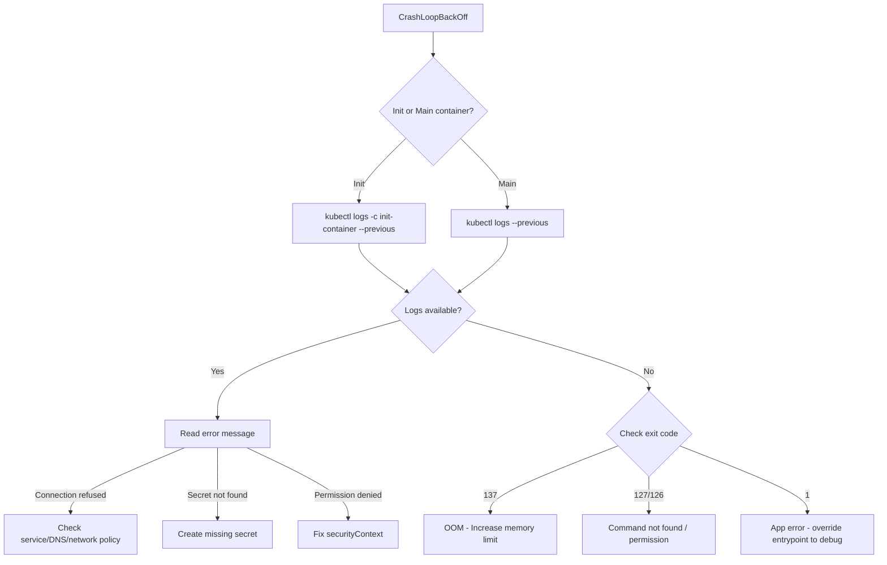

# How to Troubleshoot CrashLoopBackOff Errors on AKS Pods with Init Container Debugging

Author: [nawazdhandala](https://www.github.com/nawazdhandala)

Tags: AKS, CrashLoopBackOff, Troubleshooting, Kubernetes, Init Containers, Debugging, Pods

Description: Practical debugging guide for CrashLoopBackOff errors on AKS, including init container failures, with step-by-step diagnostic techniques.

---

CrashLoopBackOff is one of the most frustrating Kubernetes errors because it tells you almost nothing about what went wrong. Your pod keeps crashing, Kubernetes keeps restarting it, and the backoff delay keeps growing. When init containers are involved, it gets even trickier because the init container might crash before your main container even starts, and the error messages can be buried. In this post, I will walk through a systematic approach to debugging CrashLoopBackOff errors on AKS, covering both init container and main container failures.

## Understanding CrashLoopBackOff

CrashLoopBackOff is not an error state itself - it is a restart policy behavior. When a container exits with a non-zero exit code, Kubernetes restarts it. If it keeps crashing, Kubernetes increases the delay between restarts: 10 seconds, 20 seconds, 40 seconds, up to a maximum of 5 minutes. The "BackOff" part refers to this exponential backoff.

The actual error that caused the crash is somewhere in the container logs, events, or pod description. Your job is to find it.

## Step 1: Get the Pod Status

Start by getting an overview of what is happening.

```bash
# List pods and their status
kubectl get pods -n <namespace>

# Example output showing CrashLoopBackOff
# NAME              READY   STATUS             RESTARTS   AGE
# myapp-abc123      0/1     CrashLoopBackOff   5          10m
# myapp-def456      0/2     Init:CrashLoopBackOff  3     5m
```

The status tells you a lot:

- **CrashLoopBackOff** - The main container is crashing
- **Init:CrashLoopBackOff** - An init container is crashing
- **Init:0/2** - The first of two init containers has not completed yet
- **0/1 vs 1/2** - How many containers in the pod are ready

## Step 2: Check Pod Events

Events are usually the fastest way to understand what is going wrong.

```bash
# Describe the pod to see events and status
kubectl describe pod <pod-name> -n <namespace>
```

Scroll to the Events section at the bottom. Look for messages like:

- `Back-off restarting failed container` - The container crashed
- `Failed to pull image` - Image pull problem
- `OOMKilled` - Container ran out of memory
- `Error: secret "xxx" not found` - Missing secret reference
- `Error: configmap "xxx" not found` - Missing ConfigMap reference

The `Last State` section for each container shows the exit code and reason for the last crash.

```bash
# Check the last state of all containers in the pod
kubectl get pod <pod-name> -o jsonpath='{.status.containerStatuses[*].lastState}' | jq
kubectl get pod <pod-name> -o jsonpath='{.status.initContainerStatuses[*].lastState}' | jq
```

## Step 3: Read Container Logs

Logs from the crashing container are your primary debugging tool.

```bash
# Get logs from the main container
kubectl logs <pod-name> -n <namespace>

# If the container has already restarted, get logs from the previous crash
kubectl logs <pod-name> -n <namespace> --previous

# Get logs from a specific init container
kubectl logs <pod-name> -n <namespace> -c <init-container-name>

# Get previous logs from an init container
kubectl logs <pod-name> -n <namespace> -c <init-container-name> --previous
```

If the container crashes immediately (before writing any logs), you will get an empty response. In that case, the error is likely at the container startup level - wrong command, missing binary, or permission issues.

## Step 4: Debug Init Container Failures

Init containers run sequentially before the main containers start. If any init container fails, the pod cannot progress. Common init container patterns include:

- Waiting for a database to be ready
- Running database migrations
- Downloading configuration files
- Setting up filesystem permissions

Here is how to diagnose init container issues.

```bash
# Check which init container is failing
kubectl get pod <pod-name> -o jsonpath='{range .status.initContainerStatuses[*]}{.name}{"\t"}{.state}{"\n"}{end}'

# Get the logs of the failing init container
kubectl logs <pod-name> -c <init-container-name>

# If logs are empty, check the exit code
kubectl get pod <pod-name> -o jsonpath='{.status.initContainerStatuses[0].lastState.terminated.exitCode}'
```

Common exit codes and their meanings:

| Exit Code | Meaning |
|-----------|---------|
| 0 | Success (should not cause CrashLoopBackOff) |
| 1 | Generic application error |
| 2 | Shell command not found |
| 126 | Permission denied (binary not executable) |
| 127 | Command not found |
| 137 | OOM killed (SIGKILL) |
| 139 | Segfault (SIGSEGV) |
| 143 | Graceful termination (SIGTERM) |

## Step 5: Common Init Container Failures and Fixes

**Database not ready.** Init containers that wait for databases often crash because the database is not accessible yet.

```yaml
# Common init container waiting for a database
initContainers:
  - name: wait-for-db
    image: busybox:1.36
    command: ['sh', '-c']
    args:
      # Loop until the database is reachable
      - |
        until nc -z db-service 5432; do
          echo "Waiting for database..."
          sleep 2
        done
        echo "Database is ready"
```

If this init container crashes, check:
- Is the database service name correct?
- Is the database running and in the right namespace?
- Are network policies blocking the connection?

**Missing secrets or ConfigMaps.** Init containers that reference non-existent secrets will prevent the pod from starting.

```bash
# Check if the referenced secrets exist
kubectl get secrets -n <namespace>

# Check if referenced ConfigMaps exist
kubectl get configmaps -n <namespace>
```

**Permission issues with volume mounts.** Init containers that write to shared volumes may fail due to filesystem permissions.

```yaml
# Init container that fixes permissions on a shared volume
initContainers:
  - name: fix-permissions
    image: busybox:1.36
    command: ['sh', '-c', 'chown -R 1000:1000 /data']
    volumeMounts:
      - name: data-volume
        mountPath: /data
    # Run as root to be able to change ownership
    securityContext:
      runAsUser: 0
```

## Step 6: Debug with an Ephemeral Container

If you need to inspect the pod's environment without changing the deployment, use ephemeral debug containers.

```bash
# Attach a debug container to the running pod
kubectl debug <pod-name> -it --image=busybox:1.36 --target=<container-name>

# Inside the debug container, you can:
# - Check DNS resolution
nslookup db-service
# - Test network connectivity
nc -z db-service 5432
# - Check mounted files
ls -la /var/run/secrets/
# - Check environment variables
env
```

## Step 7: Debug by Overriding the Entry Point

If the container crashes too fast to inspect, override the entry point to keep it running.

```yaml
# Temporarily override the command to keep the pod alive for debugging
apiVersion: apps/v1
kind: Deployment
metadata:
  name: myapp-debug
spec:
  template:
    spec:
      containers:
        - name: myapp
          image: myregistry.azurecr.io/myapp:v1
          # Override the command to sleep instead of running the app
          command: ["sleep", "3600"]
```

Apply this temporary deployment, exec into the pod, and run the application manually to see the error.

```bash
# Exec into the sleeping pod
kubectl exec -it <debug-pod-name> -- /bin/sh

# Try running the original command manually
/app/start.sh
# Now you can see the exact error output
```

## The Debugging Flow

Here is a systematic flow for debugging CrashLoopBackOff.



## Step 8: Check Resource Limits

OOMKilled is one of the most common causes of CrashLoopBackOff, and it is easy to miss because the container does not get a chance to log anything before being killed.

```bash
# Check if the pod was OOM killed
kubectl get pod <pod-name> -o jsonpath='{.status.containerStatuses[0].lastState.terminated.reason}'

# If it says "OOMKilled", increase the memory limit
kubectl describe pod <pod-name> | grep -A 5 "Limits"
```

Fix by increasing the memory limit in your deployment.

```yaml
resources:
  requests:
    memory: 256Mi
  limits:
    # Increase from the previous value
    memory: 512Mi
```

## Step 9: Check Image and Registry Issues

Sometimes the container starts but immediately exits because the image is wrong.

```bash
# Verify the image exists and is pullable
kubectl get pod <pod-name> -o jsonpath='{.spec.containers[0].image}'

# Check for image pull errors in events
kubectl get events --field-selector involvedObject.name=<pod-name> | grep -i pull
```

Common image issues:
- Wrong tag or tag does not exist
- Image is for a different architecture (ARM image on AMD node)
- Registry authentication is not configured
- The entrypoint in the Dockerfile is wrong

## Prevention Strategies

**Always set resource limits.** Without them, a memory leak will crash the container and potentially take down the node.

**Use readiness and liveness probes carefully.** An overly aggressive liveness probe can kill a healthy container that is just slow to respond, causing a CrashLoopBackOff cycle.

**Test init containers in isolation.** Run your init container image locally with the same command and environment to verify it works before deploying.

**Use startup probes for slow-starting applications.** If your app takes 30+ seconds to start, use a startup probe to prevent the liveness probe from killing it during initialization.

```yaml
# Startup probe gives the app time to initialize
startupProbe:
  httpGet:
    path: /health
    port: 8080
  failureThreshold: 30
  periodSeconds: 10
  # This gives the app 300 seconds (5 min) to start
```

CrashLoopBackOff is always solvable - it is just a matter of finding the right log message, exit code, or configuration error. The key is to work systematically through the debugging steps rather than making random changes and hoping for the best.
