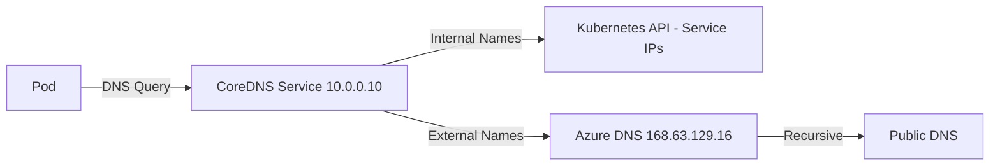

# How to Troubleshoot DNS Resolution Failures Inside AKS Pods

Author: [nawazdhandala](https://www.github.com/nawazdhandala)

Tags: AKS, DNS, Troubleshooting, CoreDNS, Kubernetes, Networking, Debugging

Description: Systematic approach to diagnosing and fixing DNS resolution failures inside AKS pods including CoreDNS issues and network policy conflicts.

---

DNS resolution failures inside AKS pods are among the most frustrating issues to debug. Your application cannot reach other services, external APIs return connection errors, and everything looks fine from outside the cluster. DNS is the foundation of Kubernetes networking, and when it breaks, everything breaks. This guide provides a systematic approach to finding and fixing the root cause.

## How DNS Works in AKS

Understanding the DNS resolution path helps narrow down where the problem is:

1. A pod makes a DNS query (e.g., resolving `my-service.default.svc.cluster.local`).
2. The query goes to the pod's DNS server, configured in `/etc/resolv.conf`.
3. In AKS, this points to the CoreDNS service IP (usually `10.0.0.10`).
4. CoreDNS handles the query. For cluster-internal names, it returns the Service ClusterIP. For external names, it forwards to the upstream DNS server.
5. The upstream DNS server is typically Azure DNS (`168.63.129.16`) or a custom DNS server.



## Step 1: Verify DNS Resolution Is Actually Failing

Before diving deep, confirm the problem is DNS and not something else.

```bash
# Run a temporary debug pod
kubectl run dns-debug --rm -it --image=busybox:1.36 -- sh

# Inside the pod, try resolving a cluster service
nslookup kubernetes.default.svc.cluster.local

# Try resolving an external domain
nslookup google.com

# Check what DNS server the pod is configured to use
cat /etc/resolv.conf
```

The `/etc/resolv.conf` should look like this:

```
search default.svc.cluster.local svc.cluster.local cluster.local
nameserver 10.0.0.10
options ndots:5
```

If `nslookup kubernetes.default.svc.cluster.local` fails, the problem is with CoreDNS or the network path to it. If internal resolution works but external fails, the issue is with upstream DNS forwarding.

## Step 2: Check CoreDNS Pod Health

CoreDNS runs as a Deployment in the `kube-system` namespace.

```bash
# Check CoreDNS pods are running
kubectl get pods -n kube-system -l k8s-app=kube-dns

# Check CoreDNS logs for errors
kubectl logs -n kube-system -l k8s-app=kube-dns --tail=100

# Check the CoreDNS service
kubectl get svc kube-dns -n kube-system
```

Common CoreDNS issues in the logs:

- **"i/o timeout"**: CoreDNS cannot reach upstream DNS servers. Network problem.
- **"SERVFAIL"**: Upstream DNS server returned an error.
- **"plugin/forward: no healthy upstreams"**: All configured upstream DNS servers are unreachable.
- **OOMKilled in events**: CoreDNS ran out of memory. Increase its resource limits.

## Step 3: Check CoreDNS Resource Usage

If your cluster has many pods or services, CoreDNS might be resource-starved.

```bash
# Check CoreDNS resource usage
kubectl top pods -n kube-system -l k8s-app=kube-dns

# Check if CoreDNS has been OOM killed recently
kubectl get events -n kube-system --field-selector reason=OOMKilling

# View CoreDNS resource limits
kubectl get deployment coredns -n kube-system -o jsonpath='{.spec.template.spec.containers[0].resources}'
```

If CoreDNS is using close to its memory limit, scale it up.

```bash
# Increase CoreDNS replicas for more capacity
kubectl scale deployment coredns -n kube-system --replicas=3

# Or increase memory limits through the CoreDNS ConfigMap addon
# This is managed by AKS, so use the customization path
```

## Step 4: Check the CoreDNS ConfigMap

CoreDNS configuration is stored in a ConfigMap. Incorrect configuration is a common cause of DNS failures.

```bash
# View the CoreDNS ConfigMap
kubectl get configmap coredns -n kube-system -o yaml
```

The default Corefile looks something like this:

```
.:53 {
    errors
    ready
    health
    kubernetes cluster.local in-addr.arpa ip6.arpa {
        pods insecure
        fallthrough in-addr.arpa ip6.arpa
    }
    forward . /etc/resolv.conf
    cache 30
    loop
    reload
    loadbalance
}
```

If you have custom CoreDNS configurations, check for syntax errors. A common mistake is incorrect forward directives.

## Step 5: Check for Network Policy Interference

If you have Calico or Azure Network Policies, they might be blocking DNS traffic.

```bash
# Check for network policies in kube-system
kubectl get networkpolicies -n kube-system

# Check for network policies in the pod's namespace
kubectl get networkpolicies -n <namespace>
```

DNS traffic needs to be allowed from pods to the CoreDNS service on port 53 (both TCP and UDP). Here is a policy that allows it.

```yaml
# allow-dns.yaml
# Allow all pods in the namespace to reach CoreDNS
apiVersion: networking.k8s.io/v1
kind: NetworkPolicy
metadata:
  name: allow-dns-egress
  namespace: default
spec:
  podSelector: {}
  policyTypes:
  - Egress
  egress:
  - to:
    - namespaceSelector:
        matchLabels:
          kubernetes.io/metadata.name: kube-system
      podSelector:
        matchLabels:
          k8s-app: kube-dns
    ports:
    - protocol: UDP
      port: 53
    - protocol: TCP
      port: 53
```

## Step 6: Check the ndots Setting

The `ndots:5` setting in `/etc/resolv.conf` means that any name with fewer than 5 dots is treated as a relative name. Kubernetes appends search domains to it before trying the absolute name. This means a lookup for `google.com` (1 dot, less than 5) first tries:

1. `google.com.default.svc.cluster.local`
2. `google.com.svc.cluster.local`
3. `google.com.cluster.local`
4. `google.com`

This creates 4 DNS queries for every external name resolution. In high-traffic applications, this can overwhelm CoreDNS.

**Fix for specific pods:**

```yaml
# Reduce ndots to decrease DNS query volume for external lookups
spec:
  dnsConfig:
    options:
    - name: ndots
      value: "2"
```

**Fix by using FQDNs in your application:**

```yaml
# Use fully qualified domain names (with trailing dot) to skip search domain appending
env:
- name: DATABASE_HOST
  value: "mydb.postgres.database.azure.com."
```

The trailing dot tells the resolver this is an absolute name - no search domains are appended.

## Step 7: Check for DNS Caching Issues

CoreDNS caches responses by default (30 seconds in the default config). Sometimes stale cache entries cause problems, especially after service changes.

```bash
# Force CoreDNS to restart and clear cache
kubectl rollout restart deployment coredns -n kube-system

# Wait for new pods to be ready
kubectl rollout status deployment coredns -n kube-system
```

For applications that need fresher DNS, consider adding a local DNS cache per node using NodeLocal DNSCache.

```bash
# Check if NodeLocal DNSCache is running
kubectl get daemonset node-local-dns -n kube-system
```

NodeLocal DNSCache runs a DNS caching agent on each node, reducing latency and load on CoreDNS.

## Step 8: Check Node-Level DNS

Sometimes the problem is at the node level, not the cluster level.

```bash
# Check the node's DNS configuration
kubectl get nodes -o wide

# SSH or exec into a node to check DNS
kubectl debug node/<node-name> -it --image=busybox -- sh

# Inside the debug container
nslookup google.com 168.63.129.16
cat /etc/resolv.conf
```

If node-level DNS is broken, the issue is with the VNet DNS configuration or Azure DNS.

## Step 9: Check for DNS Throttling

Azure DNS has rate limits. If your cluster generates a very high volume of DNS queries, you might hit these limits.

Symptoms of DNS throttling:
- Intermittent DNS failures (some queries succeed, some fail)
- Failures correlate with high traffic periods
- CoreDNS logs show timeouts to upstream

Mitigations:
- Deploy NodeLocal DNSCache to reduce queries to CoreDNS and upstream
- Set appropriate ndots values to reduce unnecessary queries
- Use FQDNs with trailing dots for external services
- Enable DNS caching in your application framework

## Step 10: Check Custom DNS Server Configuration

If your AKS VNet uses custom DNS servers (common in enterprise environments with on-premises DNS), check that those servers are reachable and functioning.

```bash
# Check VNet DNS configuration
az network vnet show \
  --resource-group myResourceGroup \
  --name myVNet \
  --query "dhcpOptions.dnsServers" \
  --output json
```

If custom DNS servers are configured, all DNS queries (including cluster-internal ones forwarded externally) go through those servers. If they are down or misconfigured, external DNS resolution fails.

## Quick Diagnostic Script

Here is a script that runs through the common checks.

```bash
#!/bin/bash
# dns-diagnostic.sh
# Run this to quickly diagnose DNS issues in AKS

echo "=== CoreDNS Pods ==="
kubectl get pods -n kube-system -l k8s-app=kube-dns -o wide

echo -e "\n=== CoreDNS Service ==="
kubectl get svc kube-dns -n kube-system

echo -e "\n=== CoreDNS Logs (last 20 lines) ==="
kubectl logs -n kube-system -l k8s-app=kube-dns --tail=20

echo -e "\n=== Network Policies in kube-system ==="
kubectl get networkpolicies -n kube-system

echo -e "\n=== DNS Resolution Test ==="
kubectl run dns-test-$(date +%s) --rm -it --restart=Never \
  --image=busybox:1.36 -- nslookup kubernetes.default.svc.cluster.local
```

## Summary

DNS issues in AKS pods usually trace back to one of these causes: CoreDNS pods are unhealthy or resource-starved, network policies are blocking port 53 traffic, the ndots setting is causing excessive queries, or upstream DNS servers are unreachable. Start by verifying what specifically fails (internal vs. external resolution), check CoreDNS health and logs, look for network policies, and work your way up to node-level and VNet-level DNS configuration. Most issues resolve with either fixing a network policy, restarting CoreDNS, or adjusting the ndots setting.
