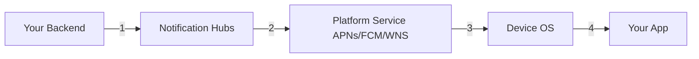

# How to Troubleshoot Dropped Push Notifications in Azure Notification Hubs

Author: [nawazdhandala](https://www.github.com/nawazdhandala)

Tags: Azure, Notification Hubs, Troubleshooting, Push Notifications, Debugging, Diagnostics, Mobile

Description: A systematic guide to troubleshooting dropped or missing push notifications in Azure Notification Hubs with practical debugging steps.

---

You sent a push notification through Azure Notification Hubs. The API returned success. But the notification never arrived on the device. This is one of the most frustrating debugging scenarios because the problem can be anywhere in the pipeline - your code, the Notification Hub configuration, the platform notification service, or the device itself.

In this post, I will walk through a systematic approach to finding and fixing dropped push notifications. I have dealt with this enough times to know the common culprits and the order in which to check them.

## The Notification Delivery Pipeline

Before debugging, understand the full pipeline. A notification passes through several stages, and it can fail at any of them.



1. Your backend sends the notification to Notification Hubs.
2. Notification Hubs routes it to the appropriate platform service.
3. The platform service delivers it to the device.
4. The device OS passes it to your app.

Each stage can silently drop the notification with no indication to the previous stage.

## Step 1: Check the Send Result

Start at the beginning. When you send a notification, the API returns a tracking ID and correlation ID. A successful HTTP response (201) only means Notification Hubs accepted the request - it does not mean the notification was delivered.

```javascript
// check-send-result.js - Capture and log the send result
const result = await client.sendNotification(
  {
    kind: 'Gcm',
    body: JSON.stringify({
      notification: { title: 'Test', body: 'Testing delivery' }
    })
  },
  { tagExpression: 'user:test-user', enableTestSend: true }
);

// Log everything for debugging
console.log('Tracking ID:', result.trackingId);
console.log('Correlation ID:', result.correlationId);
console.log('State:', result.state);
```

## Step 2: Use Test Send for Detailed Feedback

The most valuable debugging tool is test send mode. It limits delivery to a maximum of 10 devices but returns detailed results for each delivery attempt.

```javascript
// test-send-debug.js - Use test send for detailed delivery feedback
async function debugNotification(tagExpression) {
  const result = await client.sendNotification(
    {
      kind: 'Gcm',
      body: JSON.stringify({
        notification: {
          title: 'Debug Test',
          body: 'Checking delivery pipeline'
        }
      })
    },
    {
      tagExpression: tagExpression,
      enableTestSend: true // This is the key flag
    }
  );

  console.log('Test send result:');
  console.log('  Success:', result.successCount);
  console.log('  Failure:', result.failureCount);
  console.log('  Results:', JSON.stringify(result.results, null, 2));

  return result;
}
```

The test send result tells you exactly what happened:
- If `successCount` is 0 and `failureCount` is 0, there are no matching registrations for your tag expression.
- If there are failures, the results array will tell you the error code from the platform service.

## Step 3: Verify Registrations Exist

If the test send shows no matching registrations, the problem is in your registration logic.

```javascript
// check-registrations.js - List and verify device registrations
async function checkRegistrations(tagExpression) {
  console.log(`Checking registrations for: ${tagExpression}`);

  const registrations = client.listRegistrationsByTag(tagExpression);
  let count = 0;

  for await (const reg of registrations) {
    count++;
    console.log(`Registration ${count}:`);
    console.log('  ID:', reg.registrationId);
    console.log('  Kind:', reg.kind);
    console.log('  Tags:', reg.tags);
    console.log('  ETag:', reg.etag);

    // Check the push handle
    if (reg.gcmRegistrationId) {
      console.log('  FCM Token:', reg.gcmRegistrationId.substring(0, 20) + '...');
    }
    if (reg.deviceToken) {
      console.log('  APNs Token:', reg.deviceToken.substring(0, 20) + '...');
    }
    if (reg.bodyTemplate) {
      console.log('  Template:', reg.bodyTemplate);
    }
  }

  if (count === 0) {
    console.log('NO REGISTRATIONS FOUND - this is why notifications are not arriving');
  } else {
    console.log(`Found ${count} registration(s)`);
  }
}

checkRegistrations('user:test-user');
```

Common registration problems:

- The device never registered (app bug or network issue during registration).
- The registration was created with wrong tags.
- The push token expired and was not renewed.
- A previous cleanup job accidentally removed the registration.

## Step 4: Check Platform Credentials

If registrations exist but the platform service is rejecting the notification, check your credentials.

```bash
# Check the notification hub configuration
az notification-hub show \
  --name my-notification-hub \
  --namespace-name my-notification-ns \
  --resource-group rg-notifications
```

For each platform, verify:

**APNs (iOS)**:
- Certificate has not expired (if using certificate auth).
- You are using the correct environment (sandbox for development builds, production for App Store builds). This is the most common iOS issue.
- The bundle ID matches your app.
- If using token auth, the key ID and team ID are correct.

**FCM (Android)**:
- The server key or service account JSON is from the correct Firebase project.
- The Firebase project has Cloud Messaging API enabled.

## Step 5: Check the Notification Payload

Invalid payloads get rejected by the platform services. Each platform has strict requirements.

```javascript
// validate-payload.js - Common payload issues and fixes

// iOS - APNs requires specific structure
const validIosPayload = {
  aps: {
    alert: {
      title: 'Title here',
      body: 'Body here'
    },
    sound: 'default'
    // badge must be a number, not a string
    // badge: 1  (correct)
    // badge: "1" (will work but is technically incorrect)
  }
};

// Android - FCM payload
const validAndroidPayload = {
  notification: {
    title: 'Title here',
    body: 'Body here'
  },
  // data values MUST be strings
  data: {
    key1: 'value1',
    key2: 'value2'  // NOT: key2: 123 (number would cause rejection)
  }
};

// Common mistake: exceeding payload size limits
// APNs: 4096 bytes max
// FCM: 4096 bytes max
function checkPayloadSize(payload) {
  const size = Buffer.byteLength(JSON.stringify(payload), 'utf8');
  console.log(`Payload size: ${size} bytes`);
  if (size > 4096) {
    console.error('PAYLOAD TOO LARGE - will be rejected by platform service');
  }
}
```

## Step 6: Check Device-Side Issues

If the notification reaches the platform service successfully but still does not appear, the problem is on the device.

Common device-side issues:

- **Notifications are disabled in settings.** The user may have turned off notifications for your app.
- **Do Not Disturb mode.** The notification arrives but is silenced.
- **Battery optimization (Android).** Some Android manufacturers aggressively kill background processes. Apps like Xiaomi, Huawei, and Samsung have their own battery optimization that can block notifications.
- **App is force-closed (iOS).** On iOS, if the user swipes the app away from the app switcher, silent notifications will not be delivered.
- **Notification channels (Android 8+).** If you send to a channel that is disabled, the notification will not appear.

## Step 7: Enable Diagnostic Logs

For a comprehensive view of what is happening, enable diagnostic logging on your notification hub.

```bash
# Enable diagnostic logging
az monitor diagnostic-settings create \
  --name nh-diagnostics \
  --resource "/subscriptions/<sub-id>/resourceGroups/rg-notifications/providers/Microsoft.NotificationHubs/namespaces/my-notification-ns/notificationHubs/my-notification-hub" \
  --workspace <log-analytics-workspace-id> \
  --logs '[
    {"category":"OperationalLogs","enabled":true,"retentionPolicy":{"enabled":false,"days":0}},
    {"category":"PushNotificationLogs","enabled":true,"retentionPolicy":{"enabled":false,"days":0}}
  ]'
```

Once enabled, you can query the logs in Log Analytics.

```
// Kusto query to find failed notifications
NHPushNotificationLog
| where TimeGenerated > ago(1h)
| where Result != "Success"
| project TimeGenerated, Platform, PnsHandle, Result, Error
| order by TimeGenerated desc
```

## Step 8: Check for Throttling

Both Notification Hubs and the platform services have rate limits.

- **Notification Hubs Free tier**: 1 million pushes per month, limited API call rate.
- **APNs**: Throttles if you send too many notifications to the same device in a short period.
- **FCM**: Has per-project and per-device rate limits.

If you are hitting rate limits, the notifications are queued or dropped. Check the hub's metrics in the Azure portal for throttling indicators.

## The Debugging Checklist

Here is a quick checklist to run through when notifications go missing:

1. Did the send API return a 2xx response? If not, fix the request.
2. Does a test send show matching registrations? If not, fix registration.
3. Does the test send show delivery success? If not, check platform credentials and payload format.
4. Are platform credentials valid and for the correct environment? Check expiration dates.
5. Is the payload within size limits and correctly formatted? Validate against platform specs.
6. Is the device online and has notifications enabled? Check device settings.
7. Are diagnostic logs showing any errors? Enable and query them.
8. Is the notification hub or platform service throttling? Check metrics.

## Wrapping Up

Debugging dropped push notifications is a process of elimination. Start from the sending side and work your way through the pipeline until you find where the notification gets lost. The test send feature is your best friend for this. Enable it, read the detailed results, and let the error codes guide you to the root cause. Most issues fall into a handful of categories: missing registrations, expired credentials, invalid payloads, or wrong environment settings. Once you know where to look, the fix is usually straightforward.
