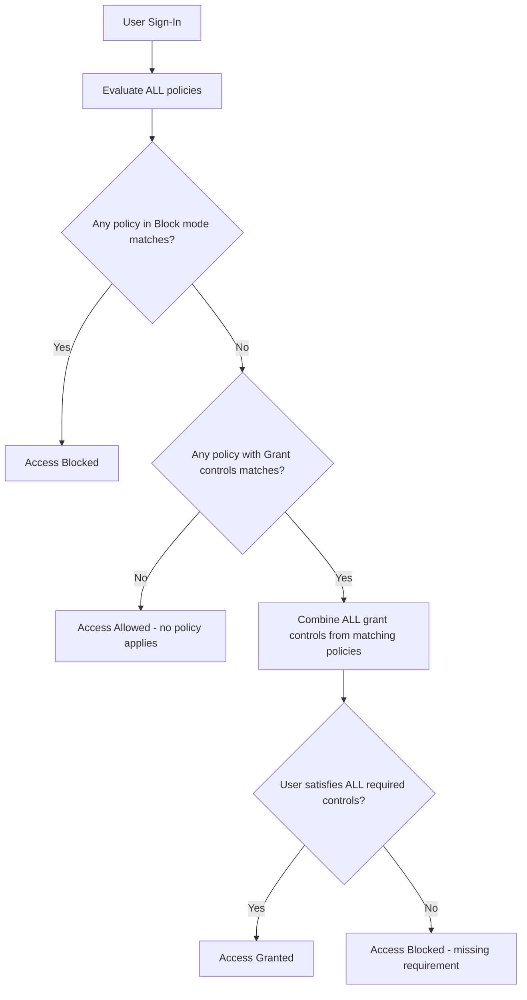

# How to Troubleshoot Microsoft Entra Conditional Access Policy Conflicts Using the What If Tool

Author: [nawazdhandala](https://www.github.com/nawazdhandala)

Tags: Azure, Microsoft Entra, Conditional Access, Troubleshooting, Identity, Security, What If

Description: A hands-on guide to using the Microsoft Entra Conditional Access What If tool to diagnose policy conflicts, understand why users are blocked, and test policy changes safely.

---

Conditional Access policies are the gatekeepers of your Microsoft Entra ID environment. They control who can access what, from where, and under what conditions. But as your policy set grows, conflicts emerge. A user gets blocked when they should not be. MFA is required on a device that is already compliant. An app that worked yesterday suddenly stops working after a policy change.

The What If tool is your best friend for debugging these issues. It lets you simulate a sign-in scenario and see exactly which policies would apply, which would grant access, and which would block it - all without affecting real users.

## Understanding Policy Evaluation Logic

Before diving into the tool, you need to understand how Conditional Access evaluates policies. This is where most confusion comes from.

All applicable policies are evaluated simultaneously. There is no priority order. The result is determined by combining all matching policies:

- If any matching policy blocks access, the result is **Block** (regardless of other policies)
- If no policy blocks but at least one requires a grant control, all grant controls from all matching policies must be satisfied
- Policies with "Report-only" mode are logged but do not enforce

The critical insight: **Block wins over everything.** If you have 10 policies that allow access and 1 policy that blocks, the user is blocked.



## Accessing the What If Tool

Go to the Microsoft Entra admin center (entra.microsoft.com). Navigate to Protection, then Conditional Access. Click the "What If" button in the toolbar at the top.

You will see a form where you can specify the simulation parameters:

- **User or workload identity:** Which user or service principal is signing in
- **Cloud apps or actions:** Which application they are accessing
- **IP address:** Where they are connecting from (to evaluate location conditions)
- **Country:** Override location detection
- **Device platform:** iOS, Android, Windows, macOS, Linux
- **Device state:** Compliant, Hybrid Azure AD joined, etc.
- **Client app:** Browser, mobile app, desktop client
- **Sign-in risk level:** None, Low, Medium, High
- **User risk level:** None, Low, Medium, High

## Running Your First What If Simulation

Let us say a user named Sarah from the engineering team reports that she cannot access the Azure portal from her home network. She gets an error saying access is blocked by a Conditional Access policy.

Open the What If tool and fill in:

- **User:** sarah@contoso.com
- **Cloud app:** Microsoft Azure Management
- **IP address:** Sarah's home IP (ask her or check sign-in logs)
- **Device platform:** Windows
- **Client app:** Browser

Click "What If." The tool returns a list of policies organized into sections:

### Policies That Will Apply

These policies match the conditions of your simulation and will enforce their controls. Look at each one:

- **Policy name:** The name of the matching policy
- **State:** Enabled or Report-only
- **Result:** Grant (with conditions) or Block

### Policies That Will Not Apply

These policies exist but did not match the simulation. The tool tells you why each one did not apply - maybe the user is not in the target group, or the cloud app does not match, or the condition (like device platform) does not match.

## Common Conflict Scenarios and How to Debug Them

### Scenario 1: User Blocked But Should Not Be

Sarah is blocked. The What If results show two policies that apply:

1. "Require MFA for Azure Management" - Grant: Require MFA
2. "Block access from untrusted locations" - Block

The second policy has a location condition set to "All locations except trusted." Sarah's home IP is not in the trusted locations list. That is the problem.

**Fix options:**
- Add Sarah's home IP range to trusted locations
- Exclude Sarah's group from the blocking policy
- Modify the policy to require MFA from untrusted locations instead of blocking

### Scenario 2: Double MFA Prompt

A user complains about being asked for MFA twice when accessing an application. Run the What If simulation and check if multiple policies apply that each require MFA independently:

1. "Require MFA for all users" - Grant: Require MFA
2. "Require MFA for risky sign-ins" - Grant: Require MFA

Both match, but the user should only be prompted once. In practice, Entra ID combines grant controls from multiple policies. If both require MFA, the user only does MFA once. But if one requires MFA AND compliant device, while another requires MFA AND approved app, the user must satisfy all four controls.

Run What If with both policies and look at the combined grant controls.

### Scenario 3: Report-Only Policy Surprise

You moved a policy from "Report-only" to "On" and users started getting blocked. Run What If with the policy in its current state. Then check what changed - the policy was probably blocking something that you did not notice in report-only mode because report-only does not enforce.

**Best practice:** Before enabling a report-only policy, run What If simulations for your key user populations and applications.

## Using Sign-In Logs to Find the Policy ID

When a user is blocked, the sign-in logs show which policy caused the failure. This is the fastest way to identify the problem policy.

```
1. Go to Entra ID > Sign-in logs
2. Find the failed sign-in for the user
3. Click on it and go to the "Conditional Access" tab
4. Look for the policy with Result = "Failure"
5. Note the Policy ID
6. Go to Conditional Access > Policies and find that policy
```

You can also query sign-in logs with KQL in Log Analytics:

```
// Find sign-ins blocked by Conditional Access for a specific user
// Shows the policy name and failure reason
SigninLogs
| where TimeGenerated > ago(24h)
| where UserPrincipalName == "sarah@contoso.com"
| where ResultType != 0
| mv-expand ConditionalAccessPolicies
| where ConditionalAccessPolicies.result == "failure"
| project
    TimeGenerated,
    UserPrincipalName,
    AppDisplayName,
    IPAddress,
    // Extract the policy that caused the failure
    PolicyName = ConditionalAccessPolicies.displayName,
    PolicyResult = ConditionalAccessPolicies.result,
    GrantControls = ConditionalAccessPolicies.enforcedGrantControls,
    ResultType,
    ResultDescription
| order by TimeGenerated desc
```

## Testing Policy Changes Before Deployment

The What If tool is invaluable for testing changes before you make them. Here is a workflow I recommend:

1. **Identify the change:** You want to add a new policy or modify an existing one.
2. **Create the policy in Report-only mode** first.
3. **Run What If simulations** for different user personas:
   - A regular user accessing email from a corporate device
   - An admin accessing Azure portal from home
   - A contractor accessing a specific SaaS app from a personal device
   - A user on a mobile device in a foreign country
4. **Check the sign-in logs** after a few days of report-only mode to see how many sign-ins would have been affected.
5. **Enable the policy** only after you are confident in the results.

## Bulk Testing with PowerShell

For large policy sets, manually running What If in the portal for every scenario is tedious. You can script it using Microsoft Graph:

```powershell
# Evaluate Conditional Access policies for a specific scenario
# This uses the Microsoft Graph API What If endpoint
Connect-MgGraph -Scopes "Policy.Read.All", "Directory.Read.All"

# Define the simulation parameters
$whatIfParams = @{
    # The user to simulate
    "conditionalAccessWhatIfSubject" = @{
        "userId" = "user-object-id-here"
    }
    # The conditions to simulate
    "conditionalAccessWhatIfConditions" = @{
        "clientAppType" = "browser"
        "country" = "US"
        "ipAddress" = "203.0.113.50"
        "devicePlatform" = "windows"
        "servicePrincipalRiskLevel" = "none"
        "signInRiskLevel" = "none"
        "userRiskLevel" = "none"
        # The target application
        "includeApplications" = @("00000003-0000-0000-c000-000000000000")
    }
}

# Make the What If API call
$result = Invoke-MgGraphRequest `
    -Method POST `
    -Uri "https://graph.microsoft.com/beta/identity/conditionalAccess/evaluate" `
    -Body ($whatIfParams | ConvertTo-Json -Depth 5)

# Display results - which policies apply and their effect
foreach ($policy in $result.appliedPolicies) {
    Write-Output "Policy: $($policy.displayName)"
    Write-Output "  Result: $($policy.result)"
    Write-Output "  Grant Controls: $($policy.enforcedGrantControls -join ', ')"
    Write-Output ""
}
```

## Documenting Your Policy Set

As your policy count grows, keep a document that maps policies to their purpose. This makes What If results easier to interpret.

| Policy Name | Purpose | Target Users | Target Apps | Grant/Block |
|---|---|---|---|---|
| Require MFA - All Users | Baseline MFA | All users | All apps | Grant: MFA |
| Block Legacy Auth | Prevent password spray | All users | All apps | Block (condition: legacy clients) |
| Require Compliant Device - Finance | Data protection | Finance group | SharePoint, OneDrive | Grant: Compliant device |
| Block Untrusted Locations - Admins | Admin security | Admin group | Azure Management | Block (condition: untrusted location) |

## Tips for Avoiding Policy Conflicts

- Use a consistent naming convention that includes the action (Block, Require MFA, Require Device) and the target audience.
- Avoid overlapping Block and Grant policies for the same user/app combination. Block always wins, so a user in both scopes will always be blocked.
- Use exclusion groups sparingly. Every exclusion is a security gap that you need to track.
- Number your policies or use a prefix to group them (e.g., "01-Baseline", "02-Admin", "03-External").
- Review your full policy set quarterly. Stale policies that no one remembers create unexpected conflicts.

## Summary

The What If tool in Microsoft Entra Conditional Access is the single most useful debugging tool for identity-related access problems. When a user reports they cannot access something, your first step should always be to simulate their scenario in What If. Combine this with sign-in log analysis to get the full picture. And before you deploy any new policy, run it through What If for your key scenarios to avoid surprises in production.
