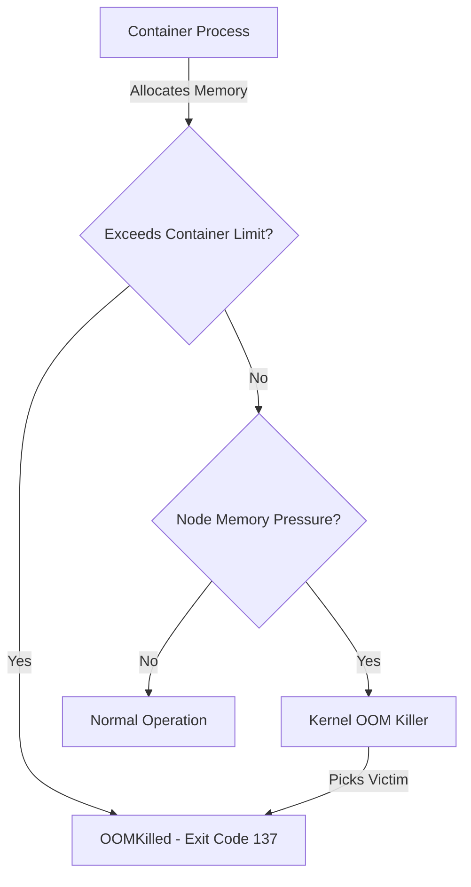

# How to Troubleshoot OOMKilled Pods on AKS and Configure Proper Memory Limits

Author: [nawazdhandala](https://www.github.com/nawazdhandala)

Tags: AKS, OOMKilled, Memory Limits, Kubernetes, Troubleshooting, Resource Management, Containers

Description: Practical guide to diagnosing OOMKilled pod errors on AKS, finding the root cause of memory issues, and setting correct memory limits.

---

Your monitoring page lights up. Pods are restarting. kubectl shows the dreaded OOMKilled status. Out of Memory kills are one of the most common issues in Kubernetes, and they happen when a container exceeds its memory limit. The Linux kernel terminates the process immediately - no graceful shutdown, no chance to save state. This guide walks through finding why it happened and setting memory limits that prevent it from happening again.

## Understanding OOMKilled

OOMKilled (exit code 137) means the Linux Out-of-Memory killer terminated the container's main process because it exceeded its memory limit. In Kubernetes terms, there are two scenarios:

1. **Container exceeds its memory limit**: The container tried to allocate more memory than the `resources.limits.memory` value. The kubelet kills the container.

2. **Node runs out of memory**: Even if no individual container exceeds its limit, the sum of all container memory usage can overwhelm the node. The kernel OOM killer picks a process to terminate based on the OOM score.



## Step 1: Confirm OOMKilled and Get Details

Start by identifying the affected pods and gathering details.

```bash
# Find pods with OOMKilled status
kubectl get pods --all-namespaces -o json | \
  python3 -c "
import sys, json
data = json.load(sys.stdin)
for item in data['items']:
    for cs in item.get('status', {}).get('containerStatuses', []):
        last = cs.get('lastState', {}).get('terminated', {})
        if last.get('exitCode') == 137:
            print(f\"{item['metadata']['namespace']}/{item['metadata']['name']} - {cs['name']} - OOMKilled at {last.get('finishedAt', 'unknown')}\")
"

# Get detailed pod information
kubectl describe pod <pod-name> -n <namespace>
```

The `kubectl describe` output shows the last terminated reason and the container's memory limit. Look for lines like:

```
Last State:     Terminated
  Reason:       OOMKilled
  Exit Code:    137
```

## Step 2: Check Current Memory Configuration

Review the pod's memory requests and limits.

```bash
# Show resource requests and limits for all containers in the pod
kubectl get pod <pod-name> -n <namespace> \
  -o jsonpath='{range .spec.containers[*]}{.name}{"\t"}{.resources.requests.memory}{"\t"}{.resources.limits.memory}{"\n"}{end}'
```

Common configurations that lead to OOMKilled:

- **No memory limit set**: The container can use all available node memory, but the kernel OOM killer may terminate it unpredictably.
- **Limit equals request**: No burst capacity. Any memory spike causes an immediate kill.
- **Limit too close to typical usage**: Normal usage is 90% of the limit, leaving no room for spikes.

## Step 3: Analyze Actual Memory Usage

Before changing limits, understand what the application actually uses.

### Using kubectl top

```bash
# View current memory usage (requires metrics-server)
kubectl top pods -n <namespace>

# View memory usage per container
kubectl top pod <pod-name> -n <namespace> --containers
```

### Using Prometheus Queries

If you have Prometheus, these queries give deeper insight.

```
// Maximum memory usage over the last 24 hours
// This helps set limits that accommodate peak usage
max_over_time(container_memory_working_set_bytes{
  namespace="default",
  pod=~"my-app-.*",
  container="my-app"
}[24h])

// P99 memory usage over 7 days
// Good for understanding typical usage patterns
quantile_over_time(0.99, container_memory_working_set_bytes{
  namespace="default",
  pod=~"my-app-.*",
  container="my-app"
}[7d])

// Memory usage as percentage of limit
// Containers consistently above 80% are at risk of OOMKill
container_memory_working_set_bytes{namespace="default"}
  / on(container, pod)
container_spec_memory_limit_bytes{namespace="default"}
  * 100
```

### Using Container Insights (Azure Monitor)

```
// KQL query for memory usage trends
// Shows peak and average memory per pod over 24 hours
Perf
| where ObjectName == "K8SContainer"
| where CounterName == "memoryRssBytes"
| where TimeGenerated > ago(24h)
| summarize AvgMemoryMB = avg(CounterValue) / 1048576,
            MaxMemoryMB = max(CounterValue) / 1048576
            by bin(TimeGenerated, 5m), InstanceName
| order by TimeGenerated desc
```

## Step 4: Identify the Root Cause

OOMKilled is a symptom. The root cause is one of these:

### Memory Leak

The application gradually consumes more memory over time without releasing it. Signs include:

- Memory usage grows steadily hour over hour
- Restarts temporarily fix the issue
- Usage is not correlated with traffic

```
// Prometheus query to detect memory leaks
// Positive derivative over time indicates growing memory usage
deriv(container_memory_working_set_bytes{
  pod=~"my-app-.*"
}[1h])
```

### Traffic Spike

A sudden increase in requests causes the application to allocate more memory for handling connections, buffering data, or caching.

### Large Payloads

Processing large files, images, or API responses that are loaded entirely into memory.

### JVM Heap Misconfiguration

Java applications often have JVM heap settings that conflict with container limits. The JVM reserves more memory than the container limit allows.

```bash
# Check JVM memory settings inside a Java container
kubectl exec <pod-name> -- java -XX:+PrintFlagsFinal -version | grep -i heap
```

### In-Memory Caching

Unbounded caches that grow with data volume. Libraries like Redis clients, ORM caches, or application-level caches can accumulate data.

## Step 5: Set Proper Memory Limits

Use the data from Step 3 to set appropriate limits.

### General Formula

```
memory.request = average memory usage + 20% buffer
memory.limit = peak memory usage + 30% buffer
```

For example, if your application typically uses 200 Mi and peaks at 350 Mi:

```yaml
resources:
  requests:
    memory: 240Mi      # 200 * 1.2 = 240
  limits:
    memory: 455Mi      # 350 * 1.3 = 455 (round to 512Mi)
```

### Application-Specific Settings

```yaml
# Web application with moderate memory usage
resources:
  requests:
    cpu: 100m
    memory: 256Mi
  limits:
    cpu: 500m
    memory: 512Mi

# Java application with managed heap
# JVM heap should be 60-70% of the container limit
# Container limit: 2Gi
# JVM flags: -Xmx1400m -Xms1400m (70% of 2Gi)
resources:
  requests:
    cpu: 500m
    memory: 1536Mi
  limits:
    cpu: 2000m
    memory: 2Gi

# Data processing worker that handles large payloads
resources:
  requests:
    cpu: 250m
    memory: 1Gi
  limits:
    cpu: 1000m
    memory: 4Gi
```

### Java-Specific Configuration

For Java applications, set JVM memory flags that align with the container limit.

```yaml
containers:
- name: java-app
  image: myacr.azurecr.io/java-app:1.0.0
  resources:
    requests:
      memory: 1Gi
    limits:
      memory: 2Gi
  env:
  # Set heap to 70% of the container limit
  # Leave 30% for non-heap memory (metaspace, thread stacks, NIO buffers)
  - name: JAVA_OPTS
    value: "-Xmx1400m -Xms1400m -XX:MaxMetaspaceSize=256m -XX:+UseContainerSupport"
```

The `-XX:+UseContainerSupport` flag (default in modern JVMs) makes the JVM aware of container memory limits.

## Step 6: Add Memory-Based Alerts

Set up alerts before pods get OOM killed.

```yaml
# prometheus-alert.yaml
# Alert when memory usage exceeds 85% of the limit
apiVersion: monitoring.coreos.com/v1
kind: PrometheusRule
metadata:
  name: memory-alerts
  namespace: monitoring
spec:
  groups:
  - name: memory-usage
    rules:
    - alert: ContainerMemoryNearLimit
      expr: |
        container_memory_working_set_bytes{container!=""}
          / container_spec_memory_limit_bytes{container!=""}
          > 0.85
      for: 5m
      labels:
        severity: warning
      annotations:
        summary: "Container {{ $labels.container }} in {{ $labels.pod }} is using {{ $value | humanizePercentage }} of its memory limit"
        description: "Memory usage has been above 85% for 5 minutes. OOMKill risk is high."
```

## Step 7: Implement Application-Level Protections

Beyond Kubernetes limits, add protections in your application code.

```python
# Example: Limit in-memory cache size to prevent unbounded growth
from cachetools import LRUCache

# Cap the cache at 1000 items instead of letting it grow forever
cache = LRUCache(maxsize=1000)

# Example: Stream large files instead of loading them into memory
def process_large_file(file_path):
    # Bad: loads entire file into memory
    # data = open(file_path).read()

    # Good: process line by line
    with open(file_path) as f:
        for line in f:
            process_line(line)
```

## Step 8: Use LimitRange for Namespace Defaults

Prevent future OOMKills by setting default limits for namespaces.

```yaml
# limit-range.yaml
# Default resource limits for pods in the namespace
apiVersion: v1
kind: LimitRange
metadata:
  name: default-limits
  namespace: default
spec:
  limits:
  - type: Container
    default:
      memory: 512Mi
      cpu: 500m
    defaultRequest:
      memory: 256Mi
      cpu: 100m
    max:
      memory: 4Gi
      cpu: 4000m
    min:
      memory: 64Mi
      cpu: 10m
```

This ensures every container gets reasonable defaults even if developers forget to specify them.

## Quick Reference: OOMKilled Checklist

1. Confirm OOMKilled with `kubectl describe pod`
2. Check current limits: `kubectl get pod -o jsonpath`
3. Check actual usage: `kubectl top pods`
4. Check historical usage in Prometheus or Container Insights
5. Identify root cause (leak, spike, misconfiguration)
6. Set limits using the formula: peak usage + 30% buffer
7. For Java: set JVM heap to 60-70% of container limit
8. Add monitoring alerts at 85% memory utilization
9. Consider VPA for automatic right-sizing

## Summary

OOMKilled errors are fixable once you understand the memory profile of your application. The process is straightforward: gather usage data, identify the root cause (leak, spike, or misconfiguration), and set limits that accommodate peak usage with a buffer. For Java applications, aligning JVM heap settings with container limits is essential. Monitoring memory usage as a percentage of the limit catches problems before they cause outages, and LimitRange defaults prevent unconfigured pods from consuming unbounded memory.
