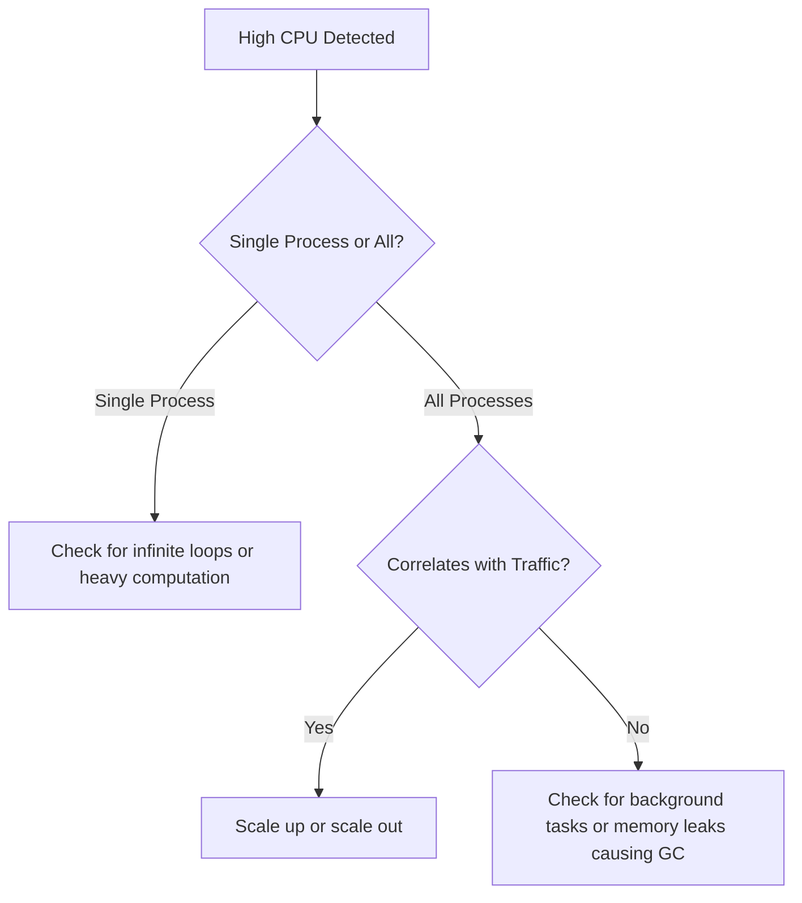

# How to Troubleshoot Slow Performance on Azure App Service

Author: [nawazdhandala](https://www.github.com/nawazdhandala)

Tags: Azure, App Service, Performance, Troubleshooting, Monitoring, Optimization, Cloud Computing

Description: Practical techniques for identifying and fixing slow performance issues on Azure App Service including CPU, memory, and dependency bottlenecks.

---

Your Azure App Service is slow, and your users are complaining. Maybe response times jumped from 200ms to 5 seconds overnight, or maybe things have been getting gradually worse for weeks. Either way, you need to figure out what is going on and fix it.

This post covers the systematic approach I use to diagnose performance problems on Azure App Service. We will look at the built-in tools, common causes, and concrete fixes.

## Start with the Metrics

Before diving into logs and profilers, look at the high-level metrics. Go to your App Service in the Azure Portal and check the Metrics blade. The key metrics to look at first are:

- **Response Time** - Average response time for requests. If this is high, you have a performance problem.
- **CPU Percentage** - If CPU is consistently above 80%, your app is compute-bound.
- **Memory Percentage** - High memory usage can cause swapping and GC pressure.
- **Http Server Errors** - A spike in 5xx errors often correlates with performance problems.
- **Requests** - Request volume. Performance issues that correlate with traffic increases point to scaling problems.

Set the time range to cover when the problem started. Look for correlations between metrics. If CPU and response time spike together, you have a CPU bottleneck. If response time spikes but CPU stays low, the bottleneck is probably in an external dependency.

## Use the Diagnose and Solve Problems Tool

Azure has a built-in diagnostic tool that automates a lot of the investigation work. Go to "Diagnose and solve problems" in your App Service and look at these sections:

- **Web App Slow** - This runs automated analysis of your app's performance and gives specific recommendations.
- **High CPU Analysis** - Breaks down CPU usage by process and identifies what is consuming resources.
- **High Memory Analysis** - Same thing for memory.

These tools are surprisingly good. They often pinpoint the exact issue without you having to dig through logs.

## Check for CPU Bottlenecks

If CPU is the problem, you need to figure out what code is consuming it. There are several approaches.

### Auto-Heal CPU Profiling

Azure can automatically capture a profiling trace when CPU exceeds a threshold. Go to "Diagnose and solve problems" > "Diagnostic Tools" > "Auto-Heal" and configure a rule to collect a memory dump or profiling trace when CPU stays above 80% for more than 60 seconds.

### Process Explorer

In the Kudu console (`https://your-app.scm.azurewebsites.net`), go to Process Explorer. This shows you all running processes and their CPU/memory usage. It is the equivalent of Task Manager for your App Service.

### Application Insights Profiler

If you have Application Insights enabled, the Profiler can capture traces on production traffic with minimal overhead. Go to Application Insights > Performance > Profiler. It shows you exactly which methods are taking the most time.

Here is a common pattern I see with CPU issues:



## Check for Memory Issues

Memory problems on App Service usually manifest as:

- Gradual increase in memory over time (memory leak)
- Sudden spikes in memory usage
- OutOfMemory exceptions in your logs

To investigate, look at the Memory Analysis in the diagnostic tools. For .NET applications, you can capture a memory dump from the Kudu console:

```bash
# Navigate to the process explorer in Kudu
# Then use the "Collect Memory Dump" option for your w3wp process
# Or use the API directly:
curl -X POST https://your-app.scm.azurewebsites.net/api/processes/0/dump?dumpType=2
```

For Node.js applications, check for common memory leak patterns:

- Event listeners that are added but never removed
- Caches that grow unbounded
- Closures that hold references to large objects

## Check External Dependencies

This is the most common cause of slow performance that I see. Your App Service is fine, but it is waiting on a database, API, or storage account that is slow.

Application Insights tracks dependencies automatically. Go to Application Insights > Performance > Dependencies to see:

- Which dependencies are slowest
- Which have the highest failure rate
- How dependency performance has changed over time

Common dependency issues:

### Slow Database Queries

Check if your database is under-provisioned or if specific queries are slow. Look at the Application Insights dependency data to find the slowest database calls. Then optimize those queries - add indexes, reduce result sets, or cache frequently accessed data.

### Connection Pool Exhaustion

If your app opens many connections to a database or external service and does not close them properly, you will run out of connections. The symptoms are intermittent timeouts and slow responses.

For .NET applications, make sure you are using connection pooling and disposing connections properly:

```csharp
// Good - using statement ensures the connection is returned to the pool
using (var connection = new SqlConnection(connectionString))
{
    await connection.OpenAsync();
    // Use the connection
}

// Bad - connection is never explicitly closed
var connection = new SqlConnection(connectionString);
connection.Open();
// If an exception occurs, this connection leaks
```

### Cold Start Latency

If your App Service plan allows instances to go idle (no "Always On" setting), the first request after idle takes longer because the runtime needs to initialize. Enable Always On in Configuration > General settings.

## Check Your App Service Plan

Sometimes the fix is simple: you need more resources.

- **Scale Up** - Move to a higher tier with more CPU and memory. Good for apps that are CPU or memory bound on a single instance.
- **Scale Out** - Add more instances. Good for apps that handle high traffic and need more parallelism.

To check if scaling is the answer, look at the per-instance metrics. If all instances are maxed out, you need to scale out. If a single instance is maxed out and others are idle, you might have a load balancing issue.

```bash
# Check current App Service Plan details
az appservice plan show \
    --resource-group my-resource-group \
    --name my-app-plan \
    --output table

# Scale up to a larger SKU
az appservice plan update \
    --resource-group my-resource-group \
    --name my-app-plan \
    --sku P2v3

# Scale out to 3 instances
az appservice plan update \
    --resource-group my-resource-group \
    --name my-app-plan \
    --number-of-workers 3
```

## Check for Noisy Neighbors

On shared App Service plans (Free, Shared, Basic), your app shares resources with other tenants. This can cause unpredictable performance. The fix is to move to a Standard or Premium tier where you get dedicated compute.

## Application-Level Optimizations

Once you have identified the bottleneck, here are common application-level fixes:

- **Enable response compression** - Reduces the amount of data sent over the network.
- **Use async/await properly** - Blocking threads kills performance under load.
- **Add caching** - Use Azure Redis Cache for frequently accessed data.
- **Optimize static file serving** - Use a CDN for static assets instead of serving them from your App Service.
- **Reduce payload sizes** - Return only the fields the client needs.

## Setting Up Alerts

Do not wait for users to tell you about performance problems. Set up alerts:

1. Go to Alerts in the Monitoring section of your App Service
2. Create an alert rule for Response Time > your threshold (e.g., 2 seconds)
3. Create another for CPU Percentage > 80%
4. Configure an action group to notify your team via email, SMS, or webhook

This way you know about performance regressions before they become incidents.

## Summary

Performance troubleshooting on Azure App Service follows a predictable pattern: check metrics, identify the bottleneck (CPU, memory, or dependencies), and apply the appropriate fix. The built-in diagnostic tools are genuinely helpful and should be your first stop. For deeper analysis, Application Insights with its Profiler and dependency tracking gives you the detail you need to find and fix the root cause.
