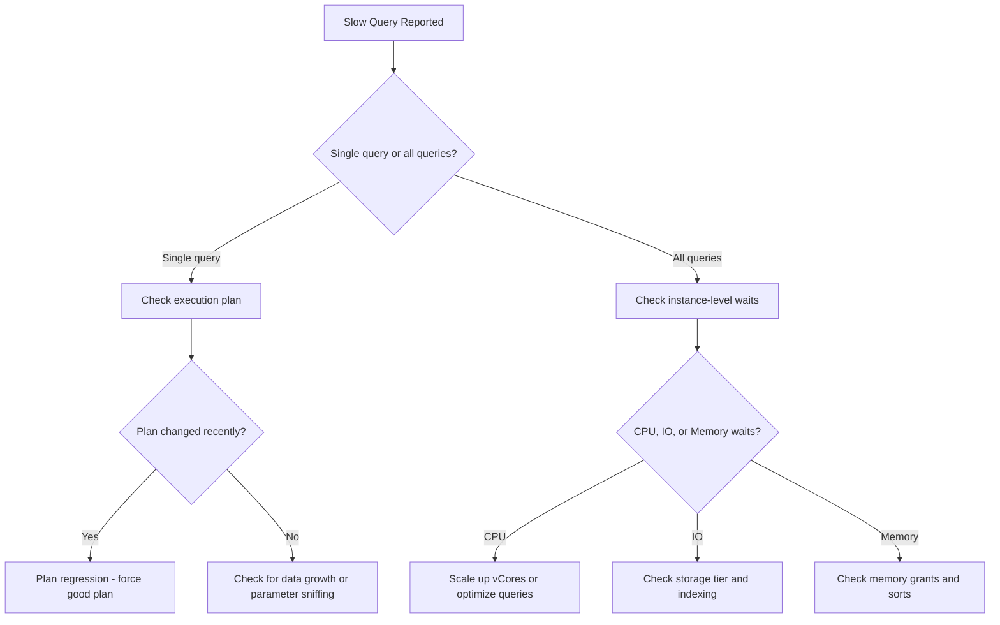

# How to Troubleshoot Slow Queries in Azure SQL Managed Instance

Author: [nawazdhandala](https://www.github.com/nawazdhandala)

Tags: Azure, SQL Managed Instance, Performance Tuning, Query Optimization, SQL Server, Monitoring

Description: A hands-on guide to finding and fixing slow queries in Azure SQL Managed Instance using built-in tools, DMVs, and Query Store.

---

Slow queries in Azure SQL Managed Instance can grind your application to a halt. The good news is that Managed Instance gives you access to the same rich set of diagnostic tools available in SQL Server, including Query Store, dynamic management views (DMVs), execution plans, and wait statistics. This guide covers a systematic approach to identifying and resolving performance bottlenecks.

## Start with the Symptoms

Before diving into DMVs, understand what "slow" actually means in your context. Is it a specific query that used to be fast and is now slow? Is it all queries? Is it intermittent? The answers will guide your investigation.

Here is a quick diagnostic flowchart:



## Finding the Slowest Queries

The first step is identifying which queries are consuming the most resources. Query Store makes this straightforward because it captures query performance data automatically.

```sql
-- Find the top 20 queries by average duration in the last 24 hours
-- Query Store must be enabled (it is by default on Managed Instance)
SELECT TOP 20
    q.query_id,
    qt.query_sql_text,
    rs.avg_duration / 1000.0 AS avg_duration_ms,
    rs.avg_cpu_time / 1000.0 AS avg_cpu_ms,
    rs.avg_logical_io_reads,
    rs.avg_physical_io_reads,
    rs.count_executions,
    rs.last_execution_time
FROM sys.query_store_query q
JOIN sys.query_store_query_text qt ON q.query_text_id = qt.query_text_id
JOIN sys.query_store_plan p ON q.query_id = p.query_id
JOIN sys.query_store_runtime_stats rs ON p.plan_id = rs.plan_id
JOIN sys.query_store_runtime_stats_interval rsi ON rs.runtime_stats_interval_id = rsi.runtime_stats_interval_id
WHERE rsi.start_time > DATEADD(HOUR, -24, GETUTCDATE())
ORDER BY rs.avg_duration DESC;
```

If you need to see what is running right now, use DMVs:

```sql
-- Find currently running queries and their resource usage
-- This shows active requests with their elapsed time and wait info
SELECT
    r.session_id,
    r.start_time,
    DATEDIFF(SECOND, r.start_time, GETDATE()) AS elapsed_seconds,
    r.status,
    r.command,
    r.wait_type,
    r.wait_time,
    r.cpu_time,
    r.logical_reads,
    r.reads AS physical_reads,
    r.writes,
    SUBSTRING(t.text,
        (r.statement_start_offset / 2) + 1,
        ((CASE r.statement_end_offset
            WHEN -1 THEN DATALENGTH(t.text)
            ELSE r.statement_end_offset
        END - r.statement_start_offset) / 2) + 1
    ) AS current_statement
FROM sys.dm_exec_requests r
CROSS APPLY sys.dm_exec_sql_text(r.sql_handle) t
WHERE r.session_id > 50  -- Exclude system sessions
ORDER BY r.cpu_time DESC;
```

## Analyzing Execution Plans

Once you have identified a slow query, look at its execution plan. The plan tells you exactly how SQL Server is processing the query - which indexes it uses, where it scans instead of seeks, and where the most time is spent.

```sql
-- Get the actual execution plan for a specific query from Query Store
-- Replace the query_id with the one you found above
SELECT
    p.plan_id,
    p.query_id,
    p.is_forced_plan,
    TRY_CAST(p.query_plan AS XML) AS execution_plan,
    rs.avg_duration / 1000.0 AS avg_duration_ms,
    rs.avg_logical_io_reads,
    rs.count_executions
FROM sys.query_store_plan p
JOIN sys.query_store_runtime_stats rs ON p.plan_id = rs.plan_id
WHERE p.query_id = 12345  -- Your query ID here
ORDER BY rs.avg_duration DESC;
```

Common problems you will see in execution plans:

- **Table scans** instead of index seeks: The query is reading every row in the table
- **Key lookups** with high row counts: The index covers part of the query but not all columns
- **Hash joins** on large datasets: Sometimes indicates missing indexes
- **Sort operators** with large memory grants: Can cause tempdb spills
- **Parallelism warnings**: Threads waiting for each other

## Check Wait Statistics

Wait statistics tell you what SQL Server is waiting on. This is essential for understanding whether the bottleneck is CPU, disk I/O, memory, or something else entirely.

```sql
-- Get the top wait types for the instance
-- This shows where time is being spent waiting
SELECT TOP 15
    wait_type,
    wait_time_ms / 1000.0 AS wait_time_seconds,
    signal_wait_time_ms / 1000.0 AS signal_wait_seconds,
    waiting_tasks_count,
    wait_time_ms / NULLIF(waiting_tasks_count, 0) AS avg_wait_ms
FROM sys.dm_os_wait_stats
WHERE wait_type NOT IN (
    -- Filter out benign waits that are always present
    'SLEEP_TASK', 'BROKER_TO_FLUSH', 'BROKER_TASK_STOP',
    'CLR_AUTO_EVENT', 'CLR_MANUAL_EVENT', 'LAZYWRITER_SLEEP',
    'WAITFOR', 'SQLTRACE_BUFFER_FLUSH', 'XE_TIMER_EVENT',
    'CHECKPOINT_QUEUE', 'LOGMGR_QUEUE', 'REQUEST_FOR_DEADLOCK_SEARCH',
    'HADR_FILESTREAM_IOMGR_IOCOMPLETION', 'DIRTY_PAGE_POLL',
    'XE_DISPATCHER_WAIT', 'SP_SERVER_DIAGNOSTICS_SLEEP'
)
ORDER BY wait_time_ms DESC;
```

Here is what the most common waits mean:

| Wait Type | Meaning | Likely Fix |
|-----------|---------|------------|
| PAGEIOLATCH_SH | Waiting for data pages from disk | Add indexes, scale storage |
| CXPACKET | Parallelism coordination | Check MAXDOP settings |
| SOS_SCHEDULER_YIELD | CPU pressure | Scale up vCores, optimize queries |
| WRITELOG | Transaction log writes | Reduce transaction size, scale storage |
| LCK_M_X, LCK_M_S | Lock contention | Optimize transaction scope |
| MEMORY_ALLOCATION_EXT | Memory pressure | Scale up, optimize memory grants |

## Investigating Index Issues

Missing indexes are the single most common cause of slow queries. Managed Instance tracks missing index suggestions:

```sql
-- Find missing index suggestions ranked by improvement potential
-- The improvement_measure combines seeks, scans, and user impact
SELECT TOP 20
    ROUND(s.avg_total_user_cost * s.avg_user_impact * (s.user_seeks + s.user_scans), 0)
        AS improvement_measure,
    d.statement AS table_name,
    d.equality_columns,
    d.inequality_columns,
    d.included_columns,
    s.user_seeks,
    s.user_scans,
    s.avg_total_user_cost,
    s.avg_user_impact
FROM sys.dm_db_missing_index_group_stats s
JOIN sys.dm_db_missing_index_groups g ON s.group_handle = g.index_group_handle
JOIN sys.dm_db_missing_index_details d ON g.index_handle = d.index_handle
ORDER BY improvement_measure DESC;
```

Do not blindly create every suggested index. Each index has a maintenance cost on writes. Evaluate whether the read improvement justifies the write overhead.

## Detecting Parameter Sniffing

Parameter sniffing occurs when SQL Server creates an execution plan optimized for the first parameter value it sees, but that plan performs poorly for other values.

```sql
-- Check if a query has multiple plans with very different performance
-- This is a classic sign of parameter sniffing
SELECT
    q.query_id,
    p.plan_id,
    rs.avg_duration / 1000.0 AS avg_duration_ms,
    rs.min_duration / 1000.0 AS min_duration_ms,
    rs.max_duration / 1000.0 AS max_duration_ms,
    rs.count_executions,
    TRY_CAST(p.query_plan AS XML) AS plan_xml
FROM sys.query_store_query q
JOIN sys.query_store_plan p ON q.query_id = p.query_id
JOIN sys.query_store_runtime_stats rs ON p.plan_id = rs.plan_id
WHERE q.query_id = 12345  -- Your query ID
ORDER BY rs.avg_duration DESC;
```

If you see wildly different performance between plans, you have a few options:

```sql
-- Option 1: Force a specific good plan using Query Store
EXEC sp_query_store_force_plan @query_id = 12345, @plan_id = 67;

-- Option 2: Add OPTIMIZE FOR hints to the query
-- This tells the optimizer to use a specific parameter value for planning
SELECT * FROM Orders
WHERE CustomerID = @CustomerID
OPTION (OPTIMIZE FOR (@CustomerID = 'TYPICAL_VALUE'));

-- Option 3: Use RECOMPILE hint (use sparingly - adds CPU overhead)
SELECT * FROM Orders
WHERE CustomerID = @CustomerID
OPTION (RECOMPILE);
```

## Checking Resource Limits

Managed Instance has resource limits based on your service tier and hardware generation. If you are hitting these limits, no amount of query tuning will help.

```sql
-- Check current resource utilization
SELECT
    avg_cpu_percent,
    avg_data_io_percent,
    avg_log_write_percent,
    avg_memory_usage_percent,
    avg_instance_cpu_percent
FROM sys.server_resource_stats
ORDER BY end_time DESC;

-- Check if tempdb is under pressure
SELECT
    SUM(unallocated_extent_page_count) * 8 / 1024.0 AS free_space_mb,
    SUM(internal_object_reserved_page_count) * 8 / 1024.0 AS internal_objects_mb,
    SUM(user_object_reserved_page_count) * 8 / 1024.0 AS user_objects_mb
FROM tempdb.sys.dm_db_file_space_usage;
```

## Automatic Tuning

Managed Instance supports automatic tuning features that can fix some problems without manual intervention:

```sql
-- Enable automatic plan correction
-- This forces the last known good plan when a regression is detected
ALTER DATABASE CURRENT SET AUTOMATIC_TUNING (FORCE_LAST_GOOD_PLAN = ON);

-- Check automatic tuning recommendations
SELECT
    reason,
    score,
    JSON_VALUE(details, '$.implementationDetails.script') AS fix_script,
    JSON_VALUE(state, '$.currentValue') AS current_state
FROM sys.dm_db_tuning_recommendations;
```

## Quick Wins Checklist

Before wrapping up, here is a checklist of quick things to try:

1. Update statistics if they are stale: `UPDATE STATISTICS dbo.YourTable WITH FULLSCAN;`
2. Check for implicit conversions in WHERE clauses (comparing varchar to nvarchar, for example)
3. Look for queries doing SELECT * when only a few columns are needed
4. Check if any queries are missing TOP or pagination and returning millions of rows
5. Verify that your MAXDOP setting is appropriate for your workload
6. Look for long-running transactions holding locks

Troubleshooting slow queries is part detective work, part science. Start with the data - Query Store, DMVs, wait stats - and let it guide you to the root cause. Resist the urge to guess or try random fixes. The tools in Managed Instance give you everything you need to find and fix the problem methodically.
