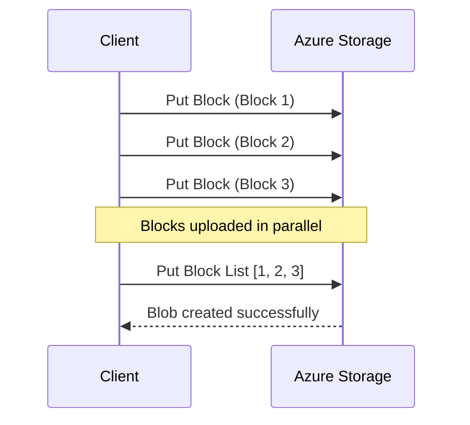

# How to Upload Large Files to Azure Blob Storage Using Block Blobs and Parallel Upload

Author: [nawazdhandala](https://www.github.com/nawazdhandala)

Tags: Azure, Blob Storage, Block Blobs, Parallel Upload, Large Files, SDK, Data Transfer

Description: A detailed guide to uploading large files to Azure Blob Storage using block blob APIs with parallel uploads for maximum throughput.

---

Uploading a multi-gigabyte file to Azure Blob Storage as a single HTTP request is asking for trouble. Network hiccups, timeouts, and memory constraints make it impractical. Block blobs solve this by letting you split a file into smaller blocks, upload them independently (and in parallel), and then commit them into a single blob. This post goes deep into the block blob upload mechanism, showing you how to use it effectively with the Azure SDKs and how to handle the edge cases that come up with large files.

## How Block Blob Upload Works

A block blob is composed of blocks, each identified by a base64-encoded block ID. The upload process has two phases:

1. **Stage blocks**: Upload individual blocks using the Put Block API. Each block is stored temporarily on the server but is not yet part of any blob.
2. **Commit block list**: Call Put Block List with the ordered list of block IDs. This assembles the blocks into the final blob.

The constraints to know:

- Maximum block size: 4000 MiB (with API version 2019-12-12 and later)
- Maximum number of blocks per blob: 50,000
- Maximum blob size: approximately 190.7 TiB (50,000 blocks x 4000 MiB)
- Staged blocks expire after 7 days if not committed



## Manual Block Upload with Python

While the Azure SDK handles block uploads automatically when you call `upload_blob()`, understanding the manual process helps when you need fine-grained control, progress reporting, or custom retry logic.

```python
import os
import base64
import math
from azure.storage.blob import BlobServiceClient, BlobBlock
from azure.identity import DefaultAzureCredential
from concurrent.futures import ThreadPoolExecutor, as_completed

def upload_large_file(account_url, container_name, blob_name, file_path,
                      block_size=64*1024*1024, max_workers=8):
    """Upload a large file using manual block staging with parallel threads.

    Args:
        account_url: The storage account URL
        container_name: Target container name
        blob_name: Target blob name
        file_path: Local file path to upload
        block_size: Size of each block in bytes (default 64 MB)
        max_workers: Number of parallel upload threads
    """

    credential = DefaultAzureCredential()
    blob_service = BlobServiceClient(account_url, credential=credential)
    blob_client = blob_service.get_blob_client(container_name, blob_name)

    file_size = os.path.getsize(file_path)
    total_blocks = math.ceil(file_size / block_size)
    block_ids = []

    print(f"File size: {file_size / (1024**3):.2f} GB")
    print(f"Block size: {block_size / (1024**2)} MB")
    print(f"Total blocks: {total_blocks}")
    print(f"Parallel workers: {max_workers}")

    def upload_block(block_index):
        """Upload a single block at the given index."""
        # Generate a deterministic block ID
        # Block IDs must be the same length and base64-encoded
        block_id = base64.b64encode(
            f"{block_index:06d}".encode()
        ).decode()

        offset = block_index * block_size
        length = min(block_size, file_size - offset)

        # Read the specific chunk from the file
        with open(file_path, "rb") as f:
            f.seek(offset)
            data = f.read(length)

        # Stage the block
        blob_client.stage_block(block_id=block_id, data=data, length=length)
        return block_id, block_index

    # Upload blocks in parallel using a thread pool
    with ThreadPoolExecutor(max_workers=max_workers) as executor:
        futures = {
            executor.submit(upload_block, i): i
            for i in range(total_blocks)
        }

        completed = 0
        for future in as_completed(futures):
            block_id, index = future.result()
            block_ids.append((index, block_id))
            completed += 1

            # Print progress
            pct = (completed / total_blocks) * 100
            print(f"Block {completed}/{total_blocks} ({pct:.1f}%) uploaded")

    # Sort block IDs by index to maintain correct order
    block_ids.sort(key=lambda x: x[0])
    ordered_ids = [bid for _, bid in block_ids]

    # Commit all blocks into the final blob
    blob_client.commit_block_list(
        [BlobBlock(block_id=bid) for bid in ordered_ids]
    )
    print(f"Blob committed: {blob_name}")

# Usage
upload_large_file(
    account_url="https://mystorageaccount.blob.core.windows.net",
    container_name="uploads",
    blob_name="backup/database-2026-02-16.bak",
    file_path="/data/database-2026-02-16.bak",
    block_size=100 * 1024 * 1024,  # 100 MB blocks
    max_workers=8
)
```

## .NET Implementation

Here is the same concept in C#, using the Azure.Storage.Blobs SDK:

```csharp
using Azure.Storage.Blobs;
using Azure.Storage.Blobs.Specialized;
using Azure.Storage.Blobs.Models;
using Azure.Identity;
using System.Collections.Concurrent;

public class LargeFileUploader
{
    // Upload a file using parallel block staging
    // Returns the committed blob URL
    public static async Task UploadLargeFileAsync(
        string accountUrl, string containerName, string blobName,
        string filePath, int blockSizeMb = 64, int maxParallelism = 8)
    {
        var credential = new DefaultAzureCredential();
        var blobServiceClient = new BlobServiceClient(new Uri(accountUrl), credential);
        var containerClient = blobServiceClient.GetBlobContainerClient(containerName);
        var blockBlobClient = containerClient.GetBlockBlobClient(blobName);

        var fileInfo = new FileInfo(filePath);
        long fileSize = fileInfo.Length;
        int blockSize = blockSizeMb * 1024 * 1024;
        int totalBlocks = (int)Math.Ceiling((double)fileSize / blockSize);

        Console.WriteLine($"Uploading {fileSize / (1024.0 * 1024 * 1024):F2} GB in {totalBlocks} blocks");

        // Track block IDs in order
        var blockIds = new string[totalBlocks];

        // Use SemaphoreSlim to limit parallelism
        var semaphore = new SemaphoreSlim(maxParallelism);
        var tasks = new List<Task>();
        int completedBlocks = 0;

        for (int i = 0; i < totalBlocks; i++)
        {
            int blockIndex = i;
            await semaphore.WaitAsync();

            tasks.Add(Task.Run(async () =>
            {
                try
                {
                    // Generate block ID (must be same length, base64-encoded)
                    string blockId = Convert.ToBase64String(
                        System.Text.Encoding.UTF8.GetBytes($"{blockIndex:D6}")
                    );
                    blockIds[blockIndex] = blockId;

                    long offset = (long)blockIndex * blockSize;
                    int length = (int)Math.Min(blockSize, fileSize - offset);

                    // Read the block from file
                    byte[] buffer = new byte[length];
                    using var fs = new FileStream(filePath, FileMode.Open,
                        FileAccess.Read, FileShare.Read);
                    fs.Seek(offset, SeekOrigin.Begin);
                    await fs.ReadAsync(buffer, 0, length);

                    // Stage the block
                    using var stream = new MemoryStream(buffer);
                    await blockBlobClient.StageBlockAsync(blockId, stream);

                    int done = Interlocked.Increment(ref completedBlocks);
                    Console.WriteLine($"Block {done}/{totalBlocks} uploaded");
                }
                finally
                {
                    semaphore.Release();
                }
            }));
        }

        await Task.WhenAll(tasks);

        // Commit the block list
        await blockBlobClient.CommitBlockListAsync(blockIds);
        Console.WriteLine($"Upload complete: {blobName}");
    }
}
```

## Using the SDK's Built-in Parallel Upload

If you do not need the fine-grained control of manual block staging, the Azure SDKs handle parallelism for you. You just need to configure the transfer options:

### Python - Simple Parallel Upload

```python
from azure.storage.blob import BlobServiceClient
from azure.identity import DefaultAzureCredential

credential = DefaultAzureCredential()
blob_service = BlobServiceClient(
    "https://mystorageaccount.blob.core.windows.net",
    credential=credential
)

blob_client = blob_service.get_blob_client("uploads", "large-dataset.tar.gz")

# The SDK automatically uses block upload for large files
# max_block_size and max_concurrency control the behavior
with open("/data/large-dataset.tar.gz", "rb") as f:
    blob_client.upload_blob(
        f,
        overwrite=True,
        max_block_size=100 * 1024 * 1024,  # 100 MB blocks
        max_concurrency=8                    # 8 parallel uploads
    )
```

### .NET - Simple Parallel Upload

```csharp
var blobClient = containerClient.GetBlobClient("large-dataset.tar.gz");

// Configure transfer options for parallel upload
// The SDK handles block staging and committing internally
var options = new BlobUploadOptions
{
    TransferOptions = new StorageTransferOptions
    {
        MaximumTransferSize = 100 * 1024 * 1024,     // 100 MB blocks
        MaximumConcurrency = 8,                        // 8 parallel
        InitialTransferSize = 100 * 1024 * 1024        // Start chunking at 100 MB
    }
};

await blobClient.UploadAsync("/data/large-dataset.tar.gz", options);
```

## Handling Upload Failures

Block uploads are inherently resilient because each block is independent. If a block upload fails, you only need to retry that specific block, not the entire file.

### Retry Individual Blocks

```python
import time

def upload_block_with_retry(blob_client, block_id, data, max_retries=3):
    """Upload a single block with exponential backoff retry."""
    for attempt in range(max_retries):
        try:
            blob_client.stage_block(block_id=block_id, data=data)
            return True
        except Exception as e:
            if attempt < max_retries - 1:
                # Wait with exponential backoff before retrying
                wait_time = 2 ** attempt
                print(f"Block {block_id} failed (attempt {attempt + 1}), "
                      f"retrying in {wait_time}s: {e}")
                time.sleep(wait_time)
            else:
                print(f"Block {block_id} failed after {max_retries} attempts")
                raise
```

### Resume Interrupted Uploads

```python
def get_uploaded_blocks(blob_client):
    """Get the list of blocks already staged on the server."""
    try:
        block_list = blob_client.get_block_list(block_list_type="uncommitted")
        return {b.id for b in block_list.uncommitted_blocks}
    except Exception:
        return set()

# Before uploading each block, check if it is already staged
uploaded = get_uploaded_blocks(blob_client)
if block_id in uploaded:
    print(f"Block {block_id} already staged, skipping")
else:
    blob_client.stage_block(block_id=block_id, data=data)
```

## Performance Benchmarks

To give you a sense of what to expect, here are rough throughput numbers from my testing:

| Block Size | Concurrency | Single VM Throughput | Notes |
|-----------|-------------|---------------------|-------|
| 4 MB | 4 | ~200 MB/s | SDK default, too much overhead |
| 32 MB | 8 | ~600 MB/s | Good for 1-10 GB files |
| 64 MB | 8 | ~800 MB/s | Sweet spot for most workloads |
| 100 MB | 16 | ~1.2 GB/s | Needs a VM with high network bandwidth |
| 256 MB | 16 | ~1.5 GB/s | Diminishing returns above this |

These numbers assume uploading from an Azure VM in the same region as the storage account, with Accelerated Networking enabled.

## When to Use AzCopy Instead

For one-off or scripted uploads, AzCopy is often a better choice than writing custom code. It handles block sizing, parallelism, retry, and progress reporting out of the box:

```bash
# AzCopy handles all the block management automatically
azcopy copy "/data/large-dataset.tar.gz" \
  "https://mystorageaccount.blob.core.windows.net/uploads/large-dataset.tar.gz" \
  --block-size-mb 64 \
  --cap-mbps 0 \
  --put-md5
```

Use custom SDK code when you need to embed uploads in an application workflow, provide custom progress callbacks, or implement business-specific retry logic. Use AzCopy for operational tasks like backups, migrations, and data loading scripts.

Block blob uploads are the foundation of reliable large file transfers in Azure Storage. Whether you use the SDK's built-in parallel upload or manage blocks manually, understanding how blocks work gives you the ability to tune performance and handle failures gracefully.
