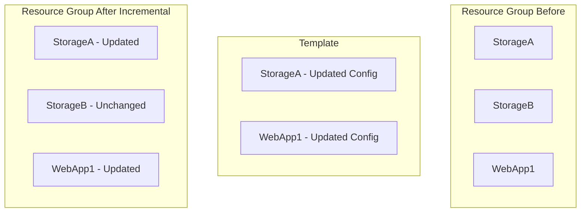
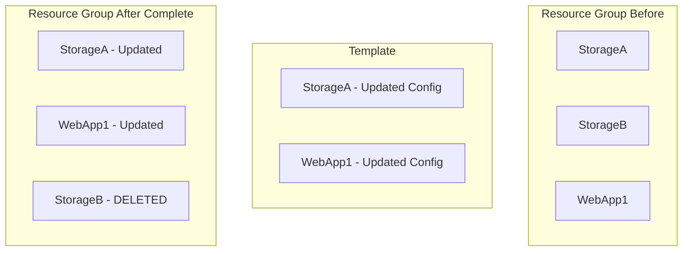

# How to Use ARM Template Deployment Modes to Control Incremental and Complete Resource Updates

Author: [nawazdhandala](https://www.github.com/nawazdhandala)

Tags: ARM Templates, Deployment Modes, Infrastructure as Code, Azure, Bicep, Incremental Deployment, Complete Deployment

Description: Learn how ARM template deployment modes work and when to use incremental versus complete mode to safely manage Azure resource updates and prevent accidental deletions.

---

ARM template deployments have a behavior that catches people off guard. When you deploy a template, Azure has to decide what to do with resources that exist in the resource group but are not in the template. Should they be left alone, or should they be deleted because they are no longer declared? This decision is controlled by the deployment mode, and picking the wrong one can either leave orphaned resources cluttering your environment or, worse, delete resources that were supposed to stay.

There are two deployment modes: incremental and complete. Understanding the difference between them - and knowing when to use each - is one of the most important things to get right when working with ARM templates and Bicep.

## Incremental Mode

Incremental mode is the default. When you deploy in incremental mode, Azure only modifies the resources that are defined in the template. Resources that exist in the resource group but are not in the template are left untouched.

```bash
# Deploy in incremental mode (this is the default)
az deployment group create \
  --resource-group "my-rg" \
  --template-file main.bicep \
  --mode Incremental
```

In practice, this means:

- Resources in the template that do not exist yet are **created**
- Resources in the template that already exist are **updated** to match the template
- Resources in the resource group that are not in the template are **left alone**

This is the safe default. It will not delete anything you did not explicitly ask it to. But it also means that if you remove a resource from your template, it does not get removed from Azure. The resource just sits there, unmanaged.

### Example: Incremental Deployment Behavior

Suppose your resource group contains three resources: StorageA, StorageB, and WebApp1. Your template only defines StorageA and WebApp1.



StorageA and WebApp1 get updated. StorageB stays as-is because incremental mode does not touch resources outside the template.

## Complete Mode

Complete mode treats the template as the full desired state for the resource group. Any resource that exists in the resource group but is not in the template gets deleted.

```bash
# Deploy in complete mode - WARNING: this will delete unlisted resources
az deployment group create \
  --resource-group "my-rg" \
  --template-file main.bicep \
  --mode Complete
```

In complete mode:

- Resources in the template that do not exist yet are **created**
- Resources in the template that already exist are **updated**
- Resources in the resource group that are not in the template are **deleted**

This is powerful for ensuring your resource group exactly matches your template, but it is also dangerous. If you accidentally forget a resource in your template, complete mode will delete it.

### Example: Complete Deployment Behavior

Using the same scenario as above - resource group has StorageA, StorageB, and WebApp1, but the template only defines StorageA and WebApp1.



StorageB gets deleted because it is not in the template.

## Using What-If to Preview Changes

Before running any deployment (especially in complete mode), use the what-if operation to preview what will happen.

```bash
# Preview what an incremental deployment would do
az deployment group what-if \
  --resource-group "my-rg" \
  --template-file main.bicep \
  --mode Incremental

# Preview what a complete deployment would do
# Pay special attention to resources marked for deletion
az deployment group what-if \
  --resource-group "my-rg" \
  --template-file main.bicep \
  --mode Complete
```

The what-if output uses color-coded symbols:

- Green (+): Resource will be created
- Purple (~): Resource will be modified
- Red (-): Resource will be deleted
- White (=): Resource is unchanged

Always run what-if before complete mode deployments. The few seconds it takes can prevent a catastrophic deletion.

## When to Use Each Mode

### Use Incremental Mode When:

- You are deploying updates to specific resources without managing the entire resource group
- The resource group contains resources managed by different templates or teams
- You are building incrementally and adding resources over time
- You are not confident that your template captures every resource that should exist

```bash
# Typical incremental deployment scenario:
# Deploying just the app infrastructure, not touching shared resources
az deployment group create \
  --resource-group "shared-rg" \
  --template-file app-resources.bicep \
  --mode Incremental \
  --parameters appName=myapp environment=staging
```

### Use Complete Mode When:

- Your template is the single source of truth for the resource group
- You want to enforce drift detection and correction
- The resource group is dedicated to a single application or service
- You have verified the template is comprehensive using what-if

```bash
# Complete mode for a dedicated resource group where the template is authoritative
az deployment group create \
  --resource-group "myapp-production-rg" \
  --template-file complete-infrastructure.bicep \
  --mode Complete \
  --parameters environment=production
```

## Complete Mode with Resource Locks

Resource locks provide a safety net for complete mode. If a resource has a CanNotDelete lock, complete mode will not delete it even if it is missing from the template. The deployment will fail instead.

```bicep
// Add a lock to critical resources to prevent accidental deletion
resource storageAccount 'Microsoft.Storage/storageAccounts@2023-01-01' = {
  name: 'criticaldata'
  location: resourceGroup().location
  sku: { name: 'Standard_GRS' }
  kind: 'StorageV2'
  properties: {}
}

// Lock the storage account against deletion
resource storageLock 'Microsoft.Authorization/locks@2020-05-01' = {
  name: 'do-not-delete'
  scope: storageAccount
  properties: {
    level: 'CanNotDelete'
    notes: 'Critical data store - do not delete'
  }
}
```

## How Properties Behave in Each Mode

An important subtlety: deployment mode affects resources, not individual properties. In both modes, when a resource is in the template, its properties are updated to match. But there is a catch with certain resource types.

Some resource types have properties that behave differently. For example, tags in incremental mode are merged (existing tags are kept, new tags are added), while in complete mode they are replaced (only tags in the template survive).

```bicep
// In incremental mode, deploying this will ADD the "Version" tag
// but keep any existing tags like "Owner" that were set manually
resource storageAccount 'Microsoft.Storage/storageAccounts@2023-01-01' = {
  name: 'mystore'
  location: resourceGroup().location
  tags: {
    Environment: 'production'
    Version: '2.0'
  }
  sku: { name: 'Standard_LRS' }
  kind: 'StorageV2'
  properties: {}
}

// In complete mode, deploying this will REPLACE all tags
// Any tags not listed here will be removed
```

## Combining Modes in a Pipeline

A common pattern is to use incremental mode during development and complete mode for production deployments, with what-if gating.

```yaml
# azure-pipelines.yml - Deployment with mode selection

parameters:
  - name: deploymentMode
    type: string
    default: 'Incremental'
    values:
      - Incremental
      - Complete

stages:
  - stage: WhatIf
    displayName: 'Preview Changes'
    jobs:
      - job: Preview
        pool:
          vmImage: 'ubuntu-latest'
        steps:
          - task: AzureCLI@2
            displayName: 'What-If Analysis'
            inputs:
              azureSubscription: 'Azure-Connection'
              scriptType: 'bash'
              scriptLocation: 'inlineScript'
              inlineScript: |
                echo "Deployment mode: ${{ parameters.deploymentMode }}"
                echo ""

                # Run what-if to show planned changes
                az deployment group what-if \
                  --resource-group "myapp-rg" \
                  --template-file main.bicep \
                  --mode ${{ parameters.deploymentMode }} \
                  --parameters environment=production

                # If complete mode, warn about potential deletions
                if [ "${{ parameters.deploymentMode }}" = "Complete" ]; then
                  echo ""
                  echo "WARNING: Complete mode is selected."
                  echo "Resources not in the template WILL BE DELETED."
                  echo "Review the what-if output carefully."
                fi

  - stage: Deploy
    displayName: 'Deploy Infrastructure'
    dependsOn: WhatIf
    jobs:
      - deployment: DeployInfra
        environment: 'production'  # Requires approval
        strategy:
          runOnce:
            deploy:
              steps:
                - task: AzureCLI@2
                  displayName: 'Deploy with ${{ parameters.deploymentMode }} mode'
                  inputs:
                    azureSubscription: 'Azure-Connection'
                    scriptType: 'bash'
                    scriptLocation: 'inlineScript'
                    inlineScript: |
                      az deployment group create \
                        --resource-group "myapp-rg" \
                        --template-file main.bicep \
                        --mode ${{ parameters.deploymentMode }} \
                        --parameters environment=production
```

## Handling Mixed Ownership Resource Groups

In organizations where multiple teams share a resource group, complete mode is problematic. Team A's template does not know about Team B's resources, so a complete mode deployment by Team A would delete Team B's resources.

Solutions for this scenario:

1. Use separate resource groups per team/application (best practice)
2. Always use incremental mode and handle cleanup separately
3. Create a single consolidated template that includes all resources

```bash
# Option 3: Export the full resource group state, then build a comprehensive template
az group export \
  --name "shared-rg" \
  --include-parameter-default-value \
  --output json > full-state.json

# Use this as a starting point for a complete template
az bicep decompile --file full-state.json
```

## The Case for Complete Mode in Production

Despite its risks, complete mode has significant benefits for production environments:

Drift correction: If someone manually creates a resource in the resource group through the portal, the next complete mode deployment removes it. This enforces the rule that all infrastructure must be in code.

Resource cleanup: When you remove a resource from your template, complete mode ensures it is actually deleted from Azure. With incremental mode, you would need a separate cleanup step.

Audit clarity: With complete mode, the template is the exact representation of what should exist. There are no surprise resources lurking in the resource group.

The choice between incremental and complete mode comes down to confidence. If you are confident your template captures everything in the resource group, complete mode gives you stronger guarantees. If there is any doubt, incremental mode is the safer choice. And regardless of which mode you choose, always run what-if first.
