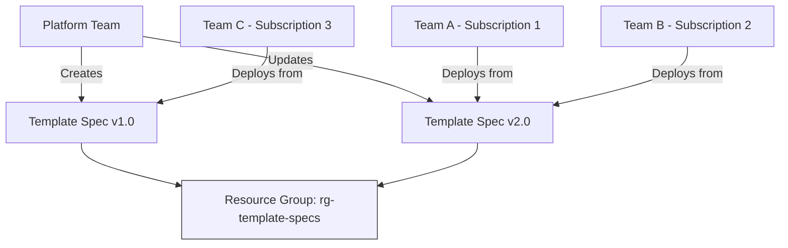

# How to Use ARM Template Specs to Version and Share Infrastructure Templates Across Subscriptions

Author: [nawazdhandala](https://www.github.com/nawazdhandala)

Tags: ARM Templates, Template Specs, Infrastructure as Code, Azure Resource Manager, DevOps, Azure Governance

Description: Create and manage ARM template specs to version, share, and reuse infrastructure templates across multiple Azure subscriptions and teams.

---

When your organization has multiple teams deploying to multiple subscriptions, you inevitably end up with copies of the same ARM templates scattered across repositories. Each team modifies their copy slightly, and over time you lose any consistency in how infrastructure is deployed. ARM template specs solve this by giving you a centralized, versioned, RBAC-controlled way to share infrastructure templates across your entire organization.

A template spec is an Azure resource that stores an ARM template (or Bicep template, which gets compiled to ARM). Teams can deploy from the template spec without having access to the source files, and you can control who can use, update, or manage each spec.

## How Template Specs Work

A template spec is stored as a resource in a resource group, just like a storage account or virtual network. It has a name, a version, and the template content. When someone deploys from the template spec, Azure Resource Manager retrieves the template from the spec and executes the deployment.



The key benefits:

- **Single source of truth**: One template, many consumers
- **Versioning**: Multiple versions coexist, teams can upgrade on their own schedule
- **RBAC**: Control who can read, deploy from, or modify the spec
- **No file access needed**: Consumers do not need access to a Git repository or file share

## Creating a Template Spec

### From an ARM Template

Let me start with a simple ARM template for a storage account and create a template spec from it.

First, the template:

```json
{
    "$schema": "https://schema.management.azure.com/schemas/2019-04-01/deploymentTemplate.json#",
    "contentVersion": "1.0.0.0",
    "parameters": {
        "storageAccountName": {
            "type": "string",
            "metadata": {
                "description": "Name of the storage account"
            }
        },
        "location": {
            "type": "string",
            "defaultValue": "[resourceGroup().location]"
        },
        "sku": {
            "type": "string",
            "defaultValue": "Standard_LRS",
            "allowedValues": [
                "Standard_LRS",
                "Standard_GRS",
                "Standard_ZRS"
            ]
        }
    },
    "resources": [
        {
            "type": "Microsoft.Storage/storageAccounts",
            "apiVersion": "2023-01-01",
            "name": "[parameters('storageAccountName')]",
            "location": "[parameters('location')]",
            "sku": {
                "name": "[parameters('sku')]"
            },
            "kind": "StorageV2",
            "properties": {
                "minimumTlsVersion": "TLS1_2",
                "supportsHttpsTrafficOnly": true,
                "allowBlobPublicAccess": false
            }
        }
    ],
    "outputs": {
        "storageAccountId": {
            "type": "string",
            "value": "[resourceId('Microsoft.Storage/storageAccounts', parameters('storageAccountName'))]"
        }
    }
}
```

Now create the template spec:

```bash
# Create a resource group to hold template specs
az group create \
  --name "rg-template-specs" \
  --location "eastus2"

# Create the template spec with version 1.0
az ts create \
  --name "storage-account" \
  --version "1.0" \
  --resource-group "rg-template-specs" \
  --location "eastus2" \
  --template-file "storage-account.json" \
  --description "Standard storage account with security best practices" \
  --display-name "Secure Storage Account"
```

### From a Bicep File

You can also create template specs directly from Bicep files. Azure CLI compiles the Bicep to ARM behind the scenes:

```bicep
// secure-webapp.bicep - a reusable web application template
param appName string
param location string = resourceGroup().location
param sku string = 'P1v3'

@allowed([
  'dotnet|8.0'
  'node|20-lts'
  'python|3.11'
])
param runtime string = 'dotnet|8.0'

// App Service Plan
resource plan 'Microsoft.Web/serverfarms@2023-01-01' = {
  name: 'asp-${appName}'
  location: location
  sku: {
    name: sku
  }
  properties: {
    reserved: true
  }
}

// Web App with security defaults
resource webApp 'Microsoft.Web/sites@2023-01-01' = {
  name: 'app-${appName}'
  location: location
  properties: {
    serverFarmId: plan.id
    httpsOnly: true
    siteConfig: {
      linuxFxVersion: runtime
      minTlsVersion: '1.2'
      ftpsState: 'Disabled'
      http20Enabled: true
    }
  }
  identity: {
    type: 'SystemAssigned'
  }
}

output webAppName string = webApp.name
output webAppHostName string = webApp.properties.defaultHostName
output managedIdentityId string = webApp.identity.principalId
```

Create the template spec from Bicep:

```bash
# Create a template spec from a Bicep file
az ts create \
  --name "secure-webapp" \
  --version "1.0" \
  --resource-group "rg-template-specs" \
  --location "eastus2" \
  --template-file "secure-webapp.bicep" \
  --description "Web application with security best practices and managed identity"
```

## Deploying from a Template Spec

### Using Azure CLI

```bash
# Get the template spec resource ID
SPEC_ID=$(az ts show \
  --name "secure-webapp" \
  --version "1.0" \
  --resource-group "rg-template-specs" \
  --query "id" -o tsv)

# Deploy from the template spec
az deployment group create \
  --resource-group "rg-myapp-dev" \
  --template-spec "$SPEC_ID" \
  --parameters appName="myapp-dev" runtime="node|20-lts"
```

### Using Bicep Modules

This is where template specs really shine. You can reference a template spec as a module in another Bicep file:

```bicep
// main.bicep - references the template spec as a module
// The template spec ID is used as the module source
module webapp 'ts:rg-template-specs/secure-webapp:1.0' = {
  name: 'webapp-deployment'
  params: {
    appName: 'myapp-prod'
    runtime: 'dotnet|8.0'
    sku: 'P1v3'
  }
}

// You can use outputs from the template spec module
output webAppUrl string = 'https://${webapp.outputs.webAppHostName}'
```

### In an Azure Pipeline

```yaml
# Deploy from a template spec in a pipeline
steps:
  - task: AzureCLI@2
    inputs:
      azureSubscription: 'Production-ServiceConnection'
      scriptType: 'bash'
      scriptLocation: 'inlineScript'
      inlineScript: |
        # Get the template spec ID
        SPEC_ID=$(az ts show \
          --name "secure-webapp" \
          --version "1.0" \
          --resource-group "rg-template-specs" \
          --query "id" -o tsv)

        # Deploy using the template spec
        az deployment group create \
          --resource-group "$(resourceGroup)" \
          --template-spec "$SPEC_ID" \
          --parameters appName="$(appName)" \
                       runtime="$(runtime)"
    displayName: 'Deploy from template spec'
```

## Version Management

### Publishing New Versions

When you update a template, publish a new version:

```bash
# Publish version 2.0 with new features
az ts create \
  --name "secure-webapp" \
  --version "2.0" \
  --resource-group "rg-template-specs" \
  --location "eastus2" \
  --template-file "secure-webapp-v2.bicep" \
  --description "v2.0 - Added Application Insights and autoscale"

# The old version 1.0 still exists and can still be deployed
```

### Listing Versions

```bash
# List all versions of a template spec
az ts list \
  --name "secure-webapp" \
  --resource-group "rg-template-specs" \
  --output table
```

### Using Version Tags

You can add tags to template spec versions to track metadata:

```bash
# Tag a version as the recommended production version
az ts update \
  --name "secure-webapp" \
  --version "2.0" \
  --resource-group "rg-template-specs" \
  --tags status=recommended environment=production
```

## Setting Up RBAC for Template Specs

Control who can do what with your template specs:

```bash
# Allow a team to deploy from template specs (Reader role on the spec)
az role assignment create \
  --assignee "team-a-group-object-id" \
  --role "Reader" \
  --scope "/subscriptions/{sub-id}/resourceGroups/rg-template-specs/providers/Microsoft.Resources/templateSpecs/secure-webapp"

# Allow the platform team to manage template specs (Contributor role)
az role assignment create \
  --assignee "platform-team-group-object-id" \
  --role "Contributor" \
  --scope "/subscriptions/{sub-id}/resourceGroups/rg-template-specs"
```

With this setup:
- Team A can deploy from the spec but cannot modify it
- The platform team can create new versions and update existing ones

## Template Specs with Linked Templates

If your ARM template uses linked templates, you can include them in the template spec. Azure stores all linked templates within the spec, so consumers do not need access to the linked template files.

```bash
# Create a template spec with linked templates
az ts create \
  --name "full-application" \
  --version "1.0" \
  --resource-group "rg-template-specs" \
  --location "eastus2" \
  --template-file "main.json" \
  --linked-templates "networking.json" "compute.json" "storage.json"
```

## Governance Patterns

### Centralized Template Library

The most common pattern is a centralized library managed by a platform or infrastructure team:

1. Platform team maintains a repository of vetted templates
2. Templates are published as template specs through a CI/CD pipeline
3. Application teams deploy from the specs
4. Platform team controls versioning and deprecation

### Automated Publishing Pipeline

Here is a pipeline that publishes template specs whenever the templates change:

```yaml
# Publish template specs when template files change
trigger:
  branches:
    include:
      - main
  paths:
    include:
      - templates/**

pool:
  vmImage: 'ubuntu-latest'

steps:
  - task: AzureCLI@2
    inputs:
      azureSubscription: 'Platform-ServiceConnection'
      scriptType: 'bash'
      scriptLocation: 'inlineScript'
      inlineScript: |
        # Find all changed template files
        CHANGED=$(git diff --name-only HEAD~1 HEAD -- templates/)

        for file in $CHANGED; do
            # Extract template name from file path
            TEMPLATE_NAME=$(basename "$file" .bicep)
            VERSION="$(Build.BuildNumber)"

            echo "Publishing $TEMPLATE_NAME version $VERSION"
            az ts create \
              --name "$TEMPLATE_NAME" \
              --version "$VERSION" \
              --resource-group "rg-template-specs" \
              --location "eastus2" \
              --template-file "$file" \
              --yes
        done
    displayName: 'Publish template specs'
```

## Wrapping Up

ARM template specs provide a structured way to share infrastructure templates across your organization. Instead of copying templates between repositories and hoping everyone uses the latest version, you publish vetted templates as specs and let teams deploy from them. The combination of versioning, RBAC, and native Bicep module integration makes template specs a practical choice for organizations that need consistency in their Azure infrastructure deployments without sacrificing team autonomy.
