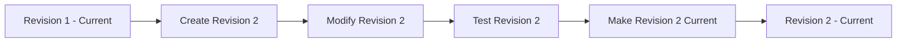

# How to Use Azure API Management Revisions for Non-Breaking API Changes

Author: [nawazdhandala](https://www.github.com/nawazdhandala)

Tags: Azure, API Management, API Revisions, API Lifecycle, Change Management, Cloud

Description: Learn how to use revisions in Azure API Management to safely make non-breaking changes to your APIs without disrupting existing consumers.

---

Versions and revisions in Azure API Management serve different purposes, and confusing them is a common mistake. Versions are for breaking changes - when you need a new URL like `/v2/orders` because the API contract has fundamentally changed. Revisions are for non-breaking changes - when you want to tweak a policy, add a new operation, or update a description without affecting live traffic.

Think of revisions like drafts. You make changes in a revision, test them, and when you are satisfied, you make that revision current. Consumers never see the intermediate state. In this post, I will show you how to use revisions effectively for safe API updates.

## How Revisions Work

Every API in APIM starts at revision 1. This is the current revision that all consumers are using. When you want to make a change, you create a new revision (say, revision 2). This revision is a copy of the current one, and you can modify it freely without affecting the live API.

While revision 2 exists, consumers still hit revision 1. The new revision is only accessible if you explicitly include the revision identifier in the request. Once you are happy with the changes, you make revision 2 the current revision, and all consumers automatically start hitting it.

The flow looks like this:



## Creating a New Revision

Go to your API in APIM, click the "Revisions" tab, and click "Add revision." Give it a description (e.g., "Add pagination support to list endpoint") and click Create.

APIM creates a copy of the current revision. You will see both revision 1 and revision 2 in the revisions list, with revision 1 still marked as current.

Switch to revision 2 using the revision selector dropdown at the top of the API editor. Now any changes you make - adding operations, modifying policies, updating schemas - only affect revision 2.

## Making Changes in a Revision

Once you are working in the new revision, you can safely:

- Add new operations
- Modify existing operation definitions (URL templates, parameters)
- Update inbound, outbound, and error policies
- Change the backend service URL
- Update request and response schemas
- Modify API-level settings

Here is an example scenario. You want to add a new `limit` query parameter to your GET /orders operation and update the response schema to include pagination metadata.

Switch to revision 2, open the GET /orders operation, and add the `limit` query parameter. Then update the response schema to include the pagination fields. Finally, add a policy that passes the limit parameter to the backend:

```xml
<!-- Added in revision 2: set default pagination limit if not provided -->
<inbound>
    <base />
    <set-query-parameter name="limit" exists-action="skip">
        <value>50</value>
    </set-query-parameter>
</inbound>
```

All of this is isolated to revision 2. Revision 1 is untouched.

## Testing a Revision Before Going Live

You can test a revision by including the revision identifier in the API request. The revision identifier is passed via a header or a query parameter.

Using the query parameter approach:

```bash
# Test revision 2 of an API
# The rev query parameter specifies which revision to use
curl -H "Ocp-Apim-Subscription-Key: YOUR_KEY" \
     "https://yourapi.azure-api.net/orders?rev=2"
```

Using the header approach:

```bash
# Test revision 2 using the header approach
curl -H "Ocp-Apim-Subscription-Key: YOUR_KEY" \
     -H "Ocp-Apim-Revision: 2" \
     "https://yourapi.azure-api.net/orders"
```

The portal's built-in test console also lets you select which revision to test against.

This is the key benefit of revisions: you can test changes against the live APIM instance with real backend connectivity, without any risk to existing consumers.

## Making a Revision Current

Once testing confirms that revision 2 works correctly, it is time to promote it. Go to the Revisions tab, find revision 2, and click "Make current."

APIM will ask you to provide a changelog entry. This is optional but highly recommended - it creates a public record of what changed and shows up in the developer portal. Write something meaningful:

"Added pagination support to GET /orders. The 'limit' query parameter now controls page size (default 50). Response includes 'total' and 'nextPage' fields."

After making revision 2 current, all consumers immediately start hitting revision 2. The transition is instant with no downtime. Revision 1 still exists in the history, so you can review what it looked like or even revert to it if needed.

## Reverting to a Previous Revision

If the new revision causes problems, you can revert by making the previous revision current again. Go to the Revisions tab, find revision 1, and click "Make current." This is your rollback mechanism.

The revert is instant because the old revision still exists with all its operations and policies. You are not deploying anything new - you are just switching which revision is active.

This is much safer than manually undoing changes. There is no risk of making a mistake during the rollback because you are restoring an exact previous state.

## Revisions vs. Versions: When to Use Each

This is the question that comes up most often. Here is a practical guide:

**Use a revision when:**
- Adding a new optional query parameter
- Adding a new operation (new endpoint)
- Adding a new optional field to a response
- Changing a policy (rate limits, caching, transformations)
- Updating descriptions or documentation
- Fixing a bug in a policy

**Use a version when:**
- Removing an operation or field
- Changing the type or format of an existing field
- Renaming a field in the response
- Changing the URL structure
- Any change that would break existing clients

The rule of thumb: if an existing client's code would break, it needs a version. If existing clients would not notice the change, use a revision.

## Revision Workflow in CI/CD

Revisions fit naturally into a CI/CD pipeline. Here is a typical workflow:

1. **Create revision**: Automated step that creates a new revision via the Azure CLI or REST API
2. **Apply changes**: Import an updated OpenAPI spec or apply policy changes to the new revision
3. **Run tests**: Execute integration tests against the new revision using the `rev=N` query parameter
4. **Promote**: If tests pass, make the new revision current
5. **Rollback**: If tests fail, delete the revision

Here is the CLI version:

```bash
# Step 1: Create a new revision
az apim api revision create \
    --resource-group my-rg \
    --service-name my-apim \
    --api-id order-service \
    --api-revision 2 \
    --api-revision-description "Add pagination support"

# Step 2: Import updated spec into the new revision
az apim api import \
    --resource-group my-rg \
    --service-name my-apim \
    --api-id "order-service;rev=2" \
    --path orders \
    --specification-format OpenApiJson \
    --specification-path ./openapi-v2.json

# Step 3: Run tests against the new revision
# (your test framework hits the API with ?rev=2)

# Step 4: Make the new revision current
az apim api release create \
    --resource-group my-rg \
    --service-name my-apim \
    --api-id order-service \
    --api-revision 2 \
    --notes "Added pagination support to GET /orders"
```

## Managing Multiple Revisions

APIM keeps a history of all revisions, and you can have multiple non-current revisions at once. This is useful when multiple teams are working on different changes simultaneously.

However, I recommend keeping the number of active revisions small. Each revision is a complete copy of the API definition, and having many revisions makes it confusing to track which changes are in which revision. Merge and promote revisions regularly.

APIM supports up to 10 non-current revisions per API. If you need more, delete old ones that you no longer need.

## Changelog in the Developer Portal

When you make a revision current and provide a changelog entry, it appears in the developer portal under the API's changelog tab. Developers can see a history of changes with dates and descriptions.

This is valuable for external API consumers who need to know what changed and when. A well-maintained changelog reduces support questions and builds trust with your developer community.

## Summary

Revisions in Azure API Management give you a safe way to make non-breaking changes to your APIs. Create a revision, make your changes, test them against the live gateway with the revision identifier, and promote when ready. If something goes wrong, revert instantly. Integrate revisions into your CI/CD pipeline for automated, zero-downtime API updates. And maintain a changelog to keep your consumers informed.
