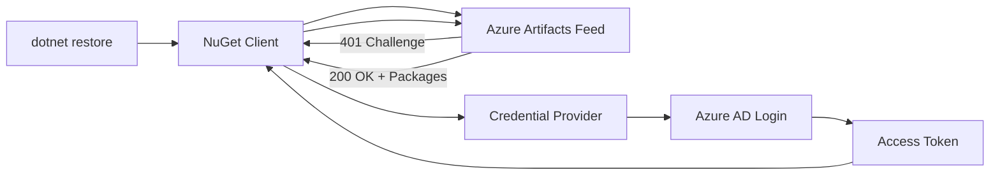

# How to Use Azure Artifacts Credential Provider for Seamless Authentication in Local Development

Author: [nawazdhandala](https://www.github.com/nawazdhandala)

Tags: Azure Artifacts, Credential Provider, NuGet, npm, Authentication, Local Development, DevOps

Description: Learn how to install and configure the Azure Artifacts Credential Provider for seamless package authentication in NuGet, npm, pip, and other package managers.

---

Every developer who has set up a new machine to work with Azure Artifacts feeds has experienced the authentication dance. You try to restore NuGet packages, get a 401 error, search for how to configure credentials, generate a PAT, paste it into a config file, and hope it works. A few months later, the PAT expires and you do the whole thing again. The Azure Artifacts Credential Provider eliminates this friction by handling authentication automatically using your Azure AD identity.

The credential provider is a plugin for package managers (NuGet, dotnet, npm, pip, and others) that intercepts authentication challenges from Azure Artifacts feeds and handles them transparently. On first use, it opens a browser window for you to sign in. After that, it caches your credentials and refreshes them automatically. No more PATs in config files.

## How the Credential Provider Works

When your package manager tries to access an Azure Artifacts feed, the feed returns a 401 challenge. The credential provider intercepts this challenge, authenticates you against Azure AD, obtains an access token, and passes it back to the package manager. The token is cached locally and refreshed before it expires.



The credential provider supports multiple authentication modes:

- Interactive browser login (default for developer machines)
- Device code flow (for headless environments)
- Service principal authentication (for CI/CD)
- Managed identity (for Azure-hosted environments)

## Installing the Credential Provider

The installation process differs by operating system. Here are the commands for each platform.

On macOS and Linux, use the installation script.

```bash
# Install the Azure Artifacts Credential Provider on macOS or Linux
# This downloads and installs the plugin to the correct location
sh -c "$(curl -fsSL https://aka.ms/install-artifacts-credprovider.sh)"

# Verify the installation
ls ~/.nuget/plugins/netcore/CredentialProvider.Microsoft/
```

On Windows, use the PowerShell installation script.

```powershell
# Install the Azure Artifacts Credential Provider on Windows
# Run in PowerShell
iex "& { $(irm https://aka.ms/install-artifacts-credprovider.ps1) }"

# Verify the installation
Get-ChildItem "$env:USERPROFILE\.nuget\plugins\netcore\CredentialProvider.Microsoft\"
```

For environments where you cannot run the install script, you can download the credential provider manually from the GitHub releases page and place it in the NuGet plugins directory.

## Configuring NuGet for Azure Artifacts

With the credential provider installed, configure your NuGet source to point at your Azure Artifacts feed. Create or update your `nuget.config` file.

```xml
<?xml version="1.0" encoding="utf-8"?>
<configuration>
  <packageSources>
    <!-- Clear default sources to ensure only your feeds are used -->
    <clear />
    <!-- Your Azure Artifacts feed -->
    <add key="MyOrgFeed"
         value="https://pkgs.dev.azure.com/your-org/your-project/_packaging/your-feed/nuget/v3/index.json" />
    <!-- Public NuGet gallery as fallback -->
    <add key="nuget.org"
         value="https://api.nuget.org/v3/index.json" />
  </packageSources>
</configuration>
```

Now when you run `dotnet restore`, the credential provider handles authentication automatically. On the first run, it opens a browser for you to sign in.

```bash
# First restore will prompt for authentication
dotnet restore

# Subsequent restores use cached credentials
dotnet restore  # No prompt, just works
```

## Configuring npm for Azure Artifacts

For npm packages, the credential provider works through a helper tool. First, install `vsts-npm-auth` or use the credential provider directly with the npm registry configuration.

```bash
# Option 1: Use vsts-npm-auth (Windows)
npm install -g vsts-npm-auth
vsts-npm-auth -config .npmrc

# Option 2: Configure .npmrc manually with credential provider
# Create project-level .npmrc
cat > .npmrc << 'EOF'
registry=https://pkgs.dev.azure.com/your-org/your-project/_packaging/your-feed/npm/registry/
always-auth=true
EOF
```

For a cross-platform approach that works with the credential provider, use the `ado-npm-auth` tool.

```bash
# Install ado-npm-auth globally
npm install -g ado-npm-auth

# Configure authentication for the current project
ado-npm-auth

# This reads your .npmrc, detects Azure Artifacts registries,
# and configures authentication tokens automatically
```

## Configuring pip for Azure Artifacts

Python developers can use the credential provider with pip through the `artifacts-keyring` package.

```bash
# Install the Azure Artifacts keyring backend
pip install artifacts-keyring

# Now pip install from Azure Artifacts feeds just works
pip install --index-url https://pkgs.dev.azure.com/your-org/your-project/_packaging/your-feed/pypi/simple/ my-package

# Or configure it in pip.conf for persistent use
mkdir -p ~/.config/pip
cat > ~/.config/pip/pip.conf << 'EOF'
[global]
index-url = https://pkgs.dev.azure.com/your-org/your-project/_packaging/your-feed/pypi/simple/
EOF
```

When you run `pip install`, the `artifacts-keyring` backend intercepts the authentication challenge and uses the same Azure AD flow as the NuGet credential provider.

## Non-Interactive Authentication

For environments without a browser (Docker containers, SSH sessions, CI runners), use the device code flow or service principal authentication.

```bash
# Use device code flow for headless authentication
# Set the environment variable before running your package manager
export NUGET_CREDENTIALPROVIDER_SESSIONTOKENCACHE_ENABLED=true
export VSS_NUGET_EXTERNAL_FEED_ENDPOINTS='{
  "endpointCredentials": [{
    "endpoint": "https://pkgs.dev.azure.com/your-org/_packaging/your-feed/nuget/v3/index.json",
    "username": "optional",
    "password": "your-pat-or-token"
  }]
}'

# Run dotnet restore - it will use the provided credentials
dotnet restore
```

For service principal authentication in automated environments, set the following environment variables.

```bash
# Service principal authentication for CI/CD environments
export AZURE_TENANT_ID="your-tenant-id"
export AZURE_CLIENT_ID="your-client-id"
export AZURE_CLIENT_SECRET="your-client-secret"

# The credential provider will detect these and authenticate automatically
dotnet restore
```

## Docker Container Configuration

When building Docker images that need to pull from Azure Artifacts, pass credentials at build time without baking them into the image.

```dockerfile
# Dockerfile - Multi-stage build with Azure Artifacts authentication
FROM mcr.microsoft.com/dotnet/sdk:8.0 AS build

# Install the credential provider
RUN curl -L https://aka.ms/install-artifacts-credprovider.sh | sh

# Copy the nuget.config and project files
COPY nuget.config .
COPY *.csproj ./

# Restore using the feed credentials passed as build arguments
ARG FEED_ACCESSTOKEN
ENV VSS_NUGET_EXTERNAL_FEED_ENDPOINTS="{\"endpointCredentials\": [{\"endpoint\":\"https://pkgs.dev.azure.com/your-org/_packaging/your-feed/nuget/v3/index.json\", \"password\":\"${FEED_ACCESSTOKEN}\"}]}"

RUN dotnet restore

# Copy source and build
COPY . .
RUN dotnet publish -c Release -o /app

# Runtime image - no credentials included
FROM mcr.microsoft.com/dotnet/aspnet:8.0
COPY --from=build /app .
ENTRYPOINT ["dotnet", "MyApp.dll"]
```

Build the image with the token.

```bash
# Build with the feed access token (use a PAT or service connection token)
docker build --build-arg FEED_ACCESSTOKEN=$(az account get-access-token --query accessToken -o tsv) -t myapp .
```

## Troubleshooting Common Issues

The most frequent problem is the credential provider not being found by the package manager. Verify the installation location matches what your tool expects.

```bash
# Check NuGet credential provider location
# Should be in one of these directories
ls ~/.nuget/plugins/netcore/CredentialProvider.Microsoft/
ls ~/.nuget/plugins/netfx/CredentialProvider.Microsoft/

# Check if the plugin is detected
dotnet nuget list source
```

If you get persistent 401 errors after signing in, clear the credential cache and try again.

```bash
# Clear the credential provider cache on macOS/Linux
rm -rf ~/.local/share/MicrosoftCredentialProvider/

# On Windows
Remove-Item -Recurse -Force "$env:LOCALAPPDATA\MicrosoftCredentialProvider"

# Then run restore again to re-authenticate
dotnet restore
```

For npm authentication issues, check that your `.npmrc` does not have stale PAT-based credentials that conflict with the credential provider.

## Managing Multiple Feeds

When your organization has multiple Azure Artifacts feeds (internal packages, team-specific feeds, upstream proxies), the credential provider handles all of them transparently.

```xml
<?xml version="1.0" encoding="utf-8"?>
<configuration>
  <packageSources>
    <clear />
    <!-- Team-specific feed -->
    <add key="TeamAlpha" value="https://pkgs.dev.azure.com/your-org/alpha/_packaging/alpha-packages/nuget/v3/index.json" />
    <!-- Shared organization feed -->
    <add key="OrgShared" value="https://pkgs.dev.azure.com/your-org/_packaging/shared-packages/nuget/v3/index.json" />
    <!-- Public NuGet -->
    <add key="nuget.org" value="https://api.nuget.org/v3/index.json" />
  </packageSources>
</configuration>
```

The credential provider authenticates each feed independently, so you can access feeds across different projects and even different organizations (as long as your Azure AD account has access to all of them).

The credential provider transforms Azure Artifacts from a source of developer friction into something that just works. Install it once, sign in once, and forget about it. No PATs in config files, no expired tokens, no searching for authentication instructions. It is the kind of tooling improvement that saves small amounts of time repeatedly, which adds up to significant productivity gains across a team.
