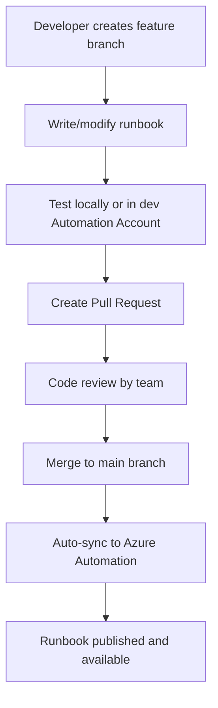

# How to Use Azure Automation Source Control Integration with GitHub Repositories

Author: [nawazdhandala](https://www.github.com/nawazdhandala)

Tags: Azure Automation, Source Control, GitHub, Runbooks, DevOps, Version Control, CI/CD

Description: Learn how to connect Azure Automation to a GitHub repository for version-controlled runbooks with automatic sync and collaborative development workflows.

---

Managing runbooks directly in the Azure Portal works for a handful of scripts, but it falls apart quickly. There is no version history, no code review process, no way to test changes before they go live, and no collaboration workflow. If someone makes a bad edit to a production runbook, you have no easy way to roll it back.

Azure Automation's source control integration solves this by syncing your runbooks from a GitHub repository. You develop and review runbooks in GitHub using normal Git workflows - branches, pull requests, code reviews - and Azure Automation automatically picks up the changes. This turns your runbook management into a proper software development process.

## How Source Control Integration Works

The integration creates a one-way or two-way sync between a GitHub repository (or a folder within it) and your Azure Automation account:

- **Source to Automation (recommended)**: Changes in GitHub are synced to Azure Automation. This makes GitHub the source of truth.
- **Auto-sync**: Changes pushed to the configured branch are automatically synced to Azure Automation.
- **Manual sync**: You trigger the sync manually when ready.

The sync process publishes runbooks to Azure Automation. PowerShell files (.ps1) become PowerShell runbooks. Python files (.py) become Python runbooks.

## Step 1: Prepare Your GitHub Repository

Create a repository structure for your runbooks:

```
azure-automation-runbooks/
    runbooks/
        Restart-VM.ps1
        Scale-VMSS.ps1
        Cleanup-OldSnapshots.ps1
        Update-NSGRules.ps1
    python-runbooks/
        process_logs.py
        sync_inventory.py
    README.md
    .gitignore
```

Each .ps1 file should contain a complete, publishable runbook:

```powershell
# Restart-VM.ps1
# Runbook to restart a specified Azure VM with logging and validation
# Triggered by webhook or schedule

param(
    [Parameter(Mandatory=$true)]
    [string]$VMName,

    [Parameter(Mandatory=$true)]
    [string]$ResourceGroupName,

    [Parameter(Mandatory=$false)]
    [object]$WebhookData
)

# If triggered by webhook, parse the body for parameters
if ($WebhookData) {
    $Body = ConvertFrom-Json -InputObject $WebhookData.RequestBody
    $VMName = $Body.VMName
    $ResourceGroupName = $Body.ResourceGroup
}

Write-Output "Starting restart of VM: $VMName in RG: $ResourceGroupName"

# Authenticate using managed identity
Connect-AzAccount -Identity

# Verify the VM exists before attempting restart
$vm = Get-AzVM -ResourceGroupName $ResourceGroupName -Name $VMName -ErrorAction SilentlyContinue
if (-not $vm) {
    Write-Error "VM '$VMName' not found in resource group '$ResourceGroupName'"
    exit 1
}

# Restart the VM
Restart-AzVM -ResourceGroupName $ResourceGroupName -Name $VMName -Force
Write-Output "Successfully restarted VM: $VMName"
```

## Step 2: Create a GitHub Personal Access Token

Azure Automation needs a token to access your GitHub repository. Create a personal access token (PAT) or use a GitHub App.

For a PAT:

1. Go to GitHub > Settings > Developer settings > Personal access tokens > Tokens (classic)
2. Click "Generate new token"
3. Select the `repo` scope (full control of private repositories)
4. Set a reasonable expiration date
5. Generate and copy the token

For better security, use a fine-grained personal access token with access only to the specific repository.

## Step 3: Configure Source Control in Azure Automation

Connect your Automation Account to the GitHub repository:

```bash
# Create source control connection to GitHub
az automation source-control create \
  --automation-account-name myAutomationAccount \
  --resource-group myRG \
  --name github-runbooks \
  --repo-url "https://github.com/myorg/azure-automation-runbooks.git" \
  --source-type GitHub \
  --branch main \
  --folder-path "/runbooks" \
  --auto-sync true \
  --publish-runbook true \
  --token-type PersonalAccessToken \
  --access-token "<your-github-pat>"
```

Key parameters:

- **folder-path**: The folder in the repository that contains your runbooks. Only files in this folder are synced.
- **auto-sync**: When true, changes pushed to the branch are automatically synced to Azure Automation.
- **publish-runbook**: When true, synced runbooks are automatically published (made available for execution).
- **branch**: The branch to sync from. Use your main/production branch.

You can also set this up through the portal:

1. Go to your Automation Account
2. Click "Source control" under Process Automation
3. Click "Add"
4. Select GitHub as the source type
5. Authorize with your GitHub account or enter the PAT
6. Select the repository, branch, and folder
7. Configure auto-sync and publish settings
8. Click Save

## Step 4: Set Up a Development Workflow

With source control in place, establish a proper development workflow:



**Use separate Automation Accounts for environments**:

- `myAutomation-dev`: Syncs from the `develop` branch for testing
- `myAutomation-prod`: Syncs from the `main` branch for production

This way, developers can test changes in the dev account before merging to main.

## Step 5: Add CI Testing for Runbooks

Use GitHub Actions to validate your runbooks before they are synced:

```yaml
# .github/workflows/validate-runbooks.yml
name: Validate Runbooks

on:
  pull_request:
    paths:
      - 'runbooks/**'

jobs:
  validate-powershell:
    runs-on: ubuntu-latest
    steps:
      - uses: actions/checkout@v4

      - name: Install PowerShell modules
        shell: pwsh
        run: |
          Install-Module -Name PSScriptAnalyzer -Force -Scope CurrentUser

      - name: Run PSScriptAnalyzer on all runbooks
        shell: pwsh
        run: |
          # Analyze all PowerShell runbooks for best practices
          $results = Invoke-ScriptAnalyzer -Path ./runbooks -Recurse -Severity Warning,Error
          if ($results) {
            $results | Format-Table -AutoSize
            Write-Error "PSScriptAnalyzer found issues in runbooks"
            exit 1
          } else {
            Write-Output "All runbooks passed PSScriptAnalyzer validation"
          }

      - name: Check runbook syntax
        shell: pwsh
        run: |
          # Verify all runbooks have valid PowerShell syntax
          Get-ChildItem -Path ./runbooks -Filter *.ps1 | ForEach-Object {
            $errors = $null
            [System.Management.Automation.PSParser]::Tokenize(
              (Get-Content $_.FullName -Raw), [ref]$errors
            ) | Out-Null
            if ($errors) {
              Write-Error "Syntax errors in $($_.Name): $($errors | Out-String)"
              exit 1
            }
            Write-Output "Syntax OK: $($_.Name)"
          }
```

## Step 6: Handle Runbook Dependencies

If your runbooks use custom modules, manage them through source control too.

Create a requirements file:

```powershell
# requirements.psd1 - PowerShell modules needed by runbooks
@{
    'Az.Accounts'  = '2.12.1'
    'Az.Compute'   = '6.0.0'
    'Az.Network'   = '6.0.0'
    'Az.Storage'   = '5.0.0'
}
```

Add a GitHub Actions workflow to ensure modules are available in the Automation Account:

```yaml
# .github/workflows/sync-modules.yml
name: Sync Automation Modules

on:
  push:
    branches: [main]
    paths:
      - 'requirements.psd1'

jobs:
  sync-modules:
    runs-on: ubuntu-latest
    steps:
      - uses: actions/checkout@v4
      - uses: azure/login@v1
        with:
          creds: ${{ secrets.AZURE_CREDENTIALS }}

      - name: Update Automation Account modules
        shell: pwsh
        run: |
          # Read the requirements file and update modules
          $requirements = Import-PowerShellDataFile -Path ./requirements.psd1
          foreach ($module in $requirements.GetEnumerator()) {
            Write-Output "Updating module: $($module.Key) to version $($module.Value)"
            az automation module create `
              --automation-account-name myAutomationAccount `
              --resource-group myRG `
              --name $module.Key `
              --content-link "https://www.powershellgallery.com/api/v2/package/$($module.Key)/$($module.Value)"
          }
```

## Step 7: Monitor Sync Status

Check the sync status to make sure changes are being applied:

```bash
# List recent source control sync jobs
az automation source-control-sync-job list \
  --automation-account-name myAutomationAccount \
  --resource-group myRG \
  --source-control-name github-runbooks \
  --output table
```

If a sync fails, check the sync job details:

```bash
# Get details of a specific sync job
az automation source-control-sync-job show \
  --automation-account-name myAutomationAccount \
  --resource-group myRG \
  --source-control-name github-runbooks \
  --sync-job-id <job-id>
```

Common sync failures:

- **Authentication expired**: GitHub PAT has expired. Generate a new one and update the source control configuration.
- **File syntax errors**: A runbook has a syntax error that prevents publishing. Fix in GitHub and push again.
- **Branch deleted**: The configured branch no longer exists. Update the source control to point to the correct branch.

## Step 8: Manage Multiple Automation Accounts

For organizations with multiple Automation Accounts (per region, per environment, or per team), use the same repository with different folder paths or branches:

```
azure-automation-runbooks/
    production/
        runbooks/
            Restart-VM.ps1
    staging/
        runbooks/
            Restart-VM.ps1  # Same runbook with staging parameters
    shared/
        runbooks/
            Common-Functions.ps1
```

Configure each Automation Account to sync from its corresponding folder.

## Best Practices

1. **Never edit runbooks in the portal**: If you edit directly in Azure, the next sync from GitHub will overwrite your changes. Make GitHub the single source of truth.

2. **Use meaningful commit messages**: Since sync history maps to Git commits, good commit messages help you understand what changed and why.

3. **Tag releases**: Use Git tags to mark stable versions of your runbook collection. This helps with auditing and rollback.

4. **Separate secrets from code**: Use Azure Automation variables, credentials, and Key Vault for secrets. Never hardcode them in runbooks.

5. **Review before merge**: Require pull request reviews for the branch that syncs to production. Runbooks have the same potential for damage as any other code that runs in production.

## Summary

Source control integration transforms Azure Automation from a collection of scripts in a portal into a properly managed codebase. Your runbooks get version history, code review, automated testing, and a clear promotion path from development to production. The setup takes about 30 minutes, and the payoff is immediate - especially the first time you need to roll back a bad change or figure out who modified a runbook and why.
