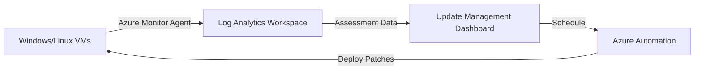

# How to Use Azure Automation Update Management to Patch Windows and Linux VMs

Author: [nawazdhandala](https://www.github.com/nawazdhandala)

Tags: Azure, Azure Automation, Update Management, Patching, Windows, Linux, Security

Description: A practical guide to using Azure Automation Update Management to assess, schedule, and deploy OS patches across your Windows and Linux virtual machines.

---

Keeping your virtual machines patched is one of those tasks that everyone agrees is important but nobody enjoys doing manually. Azure Automation Update Management takes the pain out of patching by giving you a centralized way to assess missing updates, schedule patch deployments, and track compliance across your entire fleet of Windows and Linux VMs - whether they run in Azure, on-premises, or in other clouds.

In this post, I will walk through setting up Update Management, assessing your current patch status, creating deployment schedules, and handling the edge cases that come up in real environments.

## How Update Management Works

Update Management uses the Azure Monitor Agent (AMA) or the older Log Analytics agent to collect update assessment data from your machines. The data flows into a Log Analytics workspace where you can query it. When you schedule a deployment, Azure Automation orchestrates the patching process - downloading updates, installing them, rebooting if necessary, and reporting the results back.



Update Management works with:
- Azure VMs (Windows and Linux)
- Azure Arc-enabled servers (on-premises or other clouds)
- Windows Server 2012 R2 and later
- Ubuntu 16.04 LTS and later, RHEL 7 and later, CentOS 7 and later, SUSE 12 and later

## Step 1: Set Up the Prerequisites

You need a Log Analytics workspace and an Azure Automation account linked together.

```bash
# Create a Log Analytics workspace
az monitor log-analytics workspace create \
  --resource-group rg-automation \
  --workspace-name la-update-management \
  --location eastus

# Get the workspace ID for later use
WORKSPACE_ID=$(az monitor log-analytics workspace show \
  --resource-group rg-automation \
  --workspace-name la-update-management \
  --query "id" -o tsv)
```

## Step 2: Enable Update Management

Enable Update Management on your Automation account. In the Azure portal:

1. Go to your Automation account
2. Click "Update management" under Update Management in the left menu
3. Select the Log Analytics workspace you created
4. Click Enable

Through the CLI you can link the workspace:

```bash
# Link the Log Analytics workspace to the Automation account
az monitor log-analytics workspace linked-service create \
  --resource-group rg-automation \
  --workspace-name la-update-management \
  --name Automation \
  --resource-id "/subscriptions/<sub-id>/resourceGroups/rg-automation/providers/Microsoft.Automation/automationAccounts/aa-operations"
```

## Step 3: Onboard VMs

For Azure VMs, you can onboard them directly from the Update Management blade. For on-premises or other cloud VMs, you need to install the Azure Monitor Agent and onboard them to Azure Arc first.

### Onboarding Azure VMs

```bash
# Enable the Azure Monitor Agent on an Azure VM
# This installs the agent that collects update assessment data
az vm extension set \
  --resource-group myResourceGroup \
  --vm-name myVM \
  --name AzureMonitorWindowsAgent \
  --publisher Microsoft.Azure.Monitor \
  --version 1.0

# Create a data collection rule for update assessment
az monitor data-collection rule create \
  --resource-group rg-automation \
  --name dcr-update-assessment \
  --location eastus \
  --data-flows '[{"destinations":["la-update-management"],"streams":["Microsoft-OperationalData"]}]' \
  --destinations '{"logAnalytics":[{"name":"la-update-management","workspaceResourceId":"'"$WORKSPACE_ID"'"}]}'
```

### Bulk Onboarding

For large environments, use Azure Policy to automatically deploy the agent to all VMs:

```bash
# Assign a built-in policy to deploy Azure Monitor Agent to all VMs
# This ensures any new VM automatically gets onboarded
az policy assignment create \
  --name "deploy-ama-windows" \
  --display-name "Deploy Azure Monitor Agent to Windows VMs" \
  --policy "/providers/Microsoft.Authorization/policyDefinitions/ca817e41-e85a-4783-bc7f-dc532d36235e" \
  --scope "/subscriptions/<sub-id>" \
  --params '{"logAnalyticsWorkspace":{"value":"'"$WORKSPACE_ID"'"}}'
```

## Step 4: Assess Missing Updates

Once VMs are onboarded and reporting, you can view the assessment results.

In the portal, go to your Automation account and click "Update management." You will see a dashboard showing:

- **Machines** - how many machines are reporting and their compliance status
- **Missing updates** - a list of patches that are not yet installed across your fleet
- **Update deployments** - history of past deployments

You can also query the data directly in Log Analytics:

```
// KQL query to find machines with critical missing updates
// Run this in the Log Analytics workspace
Update
| where UpdateState == "Needed"
| where Classification in ("Critical Updates", "Security Updates")
| summarize MissingUpdates=count() by Computer, Classification
| order by MissingUpdates desc
```

Another useful query shows you which specific updates are missing across your environment:

```
// KQL query for the most common missing updates
Update
| where UpdateState == "Needed"
| summarize AffectedMachines=dcount(Computer) by Title, Classification, KBID
| order by AffectedMachines desc
| take 20
```

## Step 5: Create Update Deployments

An update deployment is a scheduled patching job that targets specific machines with specific update criteria.

### Through the Portal

1. In Update Management, click "Schedule update deployment"
2. Give it a name (e.g., "Weekly-Windows-Security-Patches")
3. Select the operating system (Windows or Linux)
4. Choose which machines to target (specific machines, or dynamically by resource group, tags, etc.)
5. Configure update classifications to include (Critical, Security, Update Rollup, etc.)
6. Set a maintenance window (how long the deployment can run)
7. Configure reboot behavior
8. Set the schedule (one-time or recurring)

### Through the CLI

```bash
# Create a recurring update deployment for Windows VMs
# This targets VMs by tag and runs every Saturday at 2 AM
az automation software-update-configuration create \
  --resource-group rg-automation \
  --automation-account-name aa-operations \
  --name "Weekly-Windows-Security" \
  --operating-system Windows \
  --included-update-classifications "Critical,Security" \
  --duration "PT2H" \
  --reboot-setting IfRequired \
  --frequency Week \
  --interval 1 \
  --start-time "2026-02-21T02:00:00Z" \
  --time-zone "Eastern Standard Time" \
  --azure-queries '[{
    "scope": ["/subscriptions/<sub-id>"],
    "tagSettings": {
      "tags": {"PatchGroup": ["windows-weekly"]},
      "filterOperator": "All"
    }
  }]'
```

For Linux machines:

```bash
# Create an update deployment for Linux VMs
# Linux uses different classification names
az automation software-update-configuration create \
  --resource-group rg-automation \
  --automation-account-name aa-operations \
  --name "Weekly-Linux-Security" \
  --operating-system Linux \
  --included-update-classifications "Critical,Security" \
  --duration "PT2H" \
  --reboot-setting IfRequired \
  --frequency Week \
  --interval 1 \
  --start-time "2026-02-21T03:00:00Z" \
  --time-zone "Eastern Standard Time" \
  --azure-queries '[{
    "scope": ["/subscriptions/<sub-id>"],
    "tagSettings": {
      "tags": {"PatchGroup": ["linux-weekly"]},
      "filterOperator": "All"
    }
  }]'
```

## Step 6: Configure Pre and Post Scripts

Update Management supports running scripts before and after the patch deployment. This is useful for tasks like:

- **Pre-script:** Drain a node from a load balancer, take a snapshot, or enable maintenance mode in your monitoring tool
- **Post-script:** Re-enable the node in the load balancer, run smoke tests, or disable maintenance mode

Create a PowerShell runbook for the pre-script:

```powershell
# Runbook: Pre-PatchDeployment
# Purpose: Prepare machines for patching by taking snapshots and draining from load balancer
# This runs before the update deployment starts

param(
    [string]$SoftwareUpdateConfigurationRunContext
)

# Parse the context to get information about the deployment
$context = ConvertFrom-Json $SoftwareUpdateConfigurationRunContext
$vmIds = $context.SoftwareUpdateConfigurationSettings.AzureVirtualMachines

Connect-AzAccount -Identity

foreach ($vmId in $vmIds) {
    # Extract resource group and VM name from the resource ID
    $parts = $vmId.Split('/')
    $rgName = $parts[4]
    $vmName = $parts[8]

    Write-Output "Taking snapshot of OS disk for VM: $vmName"

    # Get the VM's OS disk
    $vm = Get-AzVM -ResourceGroupName $rgName -Name $vmName
    $disk = Get-AzDisk -ResourceGroupName $rgName -DiskName $vm.StorageProfile.OsDisk.Name

    # Create a snapshot configuration
    $snapshotConfig = New-AzSnapshotConfig `
        -SourceUri $disk.Id `
        -Location $disk.Location `
        -CreateOption Copy

    # Take the snapshot with a timestamp in the name
    $snapshotName = "$vmName-pre-patch-$(Get-Date -Format 'yyyyMMdd-HHmm')"
    New-AzSnapshot -ResourceGroupName $rgName -SnapshotName $snapshotName -Snapshot $snapshotConfig

    Write-Output "Snapshot created: $snapshotName"
}
```

## Handling Reboot Behavior

The reboot setting is one of the most important configuration choices. Your options are:

- **IfRequired** - reboot only if the installed updates require it
- **NeverReboot** - never reboot, even if updates require it (the updates will not take effect until next reboot)
- **AlwaysReboot** - always reboot after installing updates
- **RebootOnly** - do not install updates, just reboot (useful for applying previously installed updates)

For production servers behind load balancers, I recommend using **IfRequired** combined with a pre-script that drains the server from the load balancer first.

## Monitoring Deployment Results

After a deployment runs, check the results in the portal under Update Management > Deployment history. Each deployment shows:

- Overall status (succeeded, failed, in progress)
- Per-machine results
- Which updates were installed
- Whether a reboot was performed
- Any errors encountered

You can also set up alerts for failed deployments:

```bash
# Create an alert for failed update deployments
# This queries the Log Analytics workspace for deployment failures
az monitor scheduled-query create \
  --resource-group rg-automation \
  --name "UpdateDeploymentFailure" \
  --scopes "$WORKSPACE_ID" \
  --condition "count 'UpdateRunProgress | where InstallationStatus == \"Failed\" | summarize count()' > 0" \
  --action-groups "/subscriptions/<sub-id>/resourceGroups/rg-monitoring/providers/Microsoft.Insights/actionGroups/ag-ops-team" \
  --evaluation-frequency 1h \
  --window-size 1h \
  --severity 2
```

## Best Practices

- **Use tags for targeting.** Tag your VMs with a `PatchGroup` tag (e.g., `windows-weekly`, `linux-critical-only`) and use dynamic queries in your deployments. This way, new VMs automatically get included in the right patching schedule.
- **Stagger deployments.** Do not patch all machines at once. Patch non-production first (e.g., Saturday morning), then production (e.g., Sunday night). This gives you a chance to catch issues before they hit production.
- **Set appropriate maintenance windows.** Allow enough time for downloads, installation, and reboot. Two hours is a good starting point for most environments.
- **Exclude specific KBs when needed.** If a particular update is known to cause issues, you can exclude it by KB number in the deployment configuration.
- **Review compliance weekly.** Make it a habit to check the Update Management dashboard weekly and investigate any machines that are consistently non-compliant.

## Wrapping Up

Azure Automation Update Management removes the manual toil from OS patching and gives you visibility into your fleet's compliance posture. The combination of automated assessment, scheduled deployments, pre and post scripts, and detailed reporting means you can keep your machines patched without babysitting the process. Start by onboarding your VMs, assess where you stand, and create your first deployment schedule this week.
