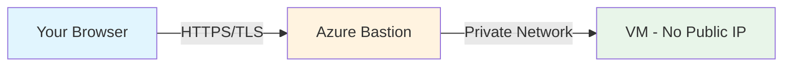

# How to Use Azure Bastion to Securely Connect to Virtual Machines Without Public IPs

Author: [nawazdhandala](https://www.github.com/nawazdhandala)

Tags: Azure, Bastion, Virtual Machine, Security, SSH, RDP, Zero Trust, Networking

Description: Learn how to deploy Azure Bastion to securely connect to Azure VMs over SSH and RDP without exposing public IP addresses.

---

Exposing SSH port 22 or RDP port 3389 to the internet is a security risk, even with strong passwords and NSG rules. Bots constantly scan for open management ports, and one misconfigured rule can expose your entire infrastructure. Azure Bastion eliminates this attack surface entirely by providing a managed PaaS service that lets you connect to VMs through the Azure portal - no public IPs, no NSG rules for management ports, and no VPN clients required.

In this guide, I will show you how to deploy Azure Bastion, connect to your VMs, and understand the different SKUs and features available.

## How Azure Bastion Works

Azure Bastion sits in a dedicated subnet within your virtual network. When you want to connect to a VM, you open the Azure portal (or use the CLI), and Bastion establishes an SSH or RDP session through a TLS-encrypted connection in your browser. The traffic flows over Azure's backbone network, never touching the public internet.



Key points:
- VMs do not need public IP addresses.
- No SSH or RDP ports are exposed to the internet.
- Connection happens through the browser - no local SSH/RDP client needed.
- All traffic is encrypted with TLS.
- Bastion authenticates against Azure AD, adding another security layer.

## Bastion SKUs

Azure Bastion comes in three SKUs:

**Basic**: Supports up to 25 concurrent connections. Provides portal-based SSH/RDP. Good for small environments.

**Standard**: Supports up to 50 concurrent connections (scalable with host scaling). Adds native client support (az ssh), file transfer, and shareable links.

**Developer** (Preview): Single-connection, low-cost option for individual developers. No dedicated subnet required.

For most teams, the Standard SKU is the right choice because it supports native CLI access and file transfers.

## Prerequisites

Azure Bastion requires a dedicated subnet named `AzureBastionSubnet` in your virtual network. This is not optional - the name must be exactly `AzureBastionSubnet`.

The subnet must be at least /26 (64 addresses) for the Basic and Standard SKUs.

## Deploying Azure Bastion

### Step 1: Create the Bastion Subnet

If your virtual network does not already have a `AzureBastionSubnet`:

```bash
# Add the AzureBastionSubnet to your existing virtual network
az network vnet subnet create \
  --resource-group myResourceGroup \
  --vnet-name myVNet \
  --name AzureBastionSubnet \
  --address-prefix 10.0.2.0/26
```

### Step 2: Create a Public IP for Bastion

Bastion itself needs a public IP (this is the entry point for your browser connections):

```bash
# Create a static Standard public IP for Bastion
az network public-ip create \
  --resource-group myResourceGroup \
  --name bastionPublicIP \
  --sku Standard \
  --allocation-method Static \
  --location eastus
```

### Step 3: Create the Bastion Host

```bash
# Create an Azure Bastion host with the Standard SKU
az network bastion create \
  --resource-group myResourceGroup \
  --name myBastion \
  --public-ip-address bastionPublicIP \
  --vnet-name myVNet \
  --sku Standard \
  --location eastus
```

Bastion deployment takes about 10 minutes. Once deployed, it is ready to use.

## Connecting via the Azure Portal

The simplest way to connect:

1. Navigate to your VM in the Azure portal.
2. Click "Connect" in the top menu.
3. Select "Bastion."
4. Enter your credentials:
   - For Linux: Username and password, or SSH private key (paste it directly into the browser).
   - For Windows: Username and password.
5. Click "Connect."

A new browser tab opens with the SSH or RDP session. The session runs entirely in the browser - no client software needed.

## Connecting via the Azure CLI (Standard SKU)

With the Standard SKU, you can use the native SSH client through the `az ssh` command:

```bash
# Connect using the native SSH client through Bastion
az ssh vm \
  --resource-group myResourceGroup \
  --name myLinuxVM
```

Or use a tunnel for tools that need direct SSH access:

```bash
# Create an SSH tunnel through Bastion
az network bastion tunnel \
  --resource-group myResourceGroup \
  --name myBastion \
  --target-resource-id "/subscriptions/{sub-id}/resourceGroups/myResourceGroup/providers/Microsoft.Compute/virtualMachines/myLinuxVM" \
  --resource-port 22 \
  --port 2222
```

This creates a tunnel on localhost port 2222. In another terminal:

```bash
# Connect through the tunnel using your regular SSH client
ssh -p 2222 azureuser@localhost
```

This is useful when you need to use SSH tools that cannot run in a browser, like SCP for file transfers or VS Code Remote SSH.

## Connecting to Windows VMs via RDP

For Windows VMs through the portal:

1. Navigate to the Windows VM.
2. Click "Connect" > "Bastion."
3. Enter the Windows username and password.
4. Click "Connect."

A full RDP session opens in your browser. The experience is similar to a native RDP client, with support for clipboard sharing and screen resizing.

For native RDP client access (Standard SKU):

```bash
# Create an RDP tunnel through Bastion
az network bastion tunnel \
  --resource-group myResourceGroup \
  --name myBastion \
  --target-resource-id "/subscriptions/{sub-id}/resourceGroups/myResourceGroup/providers/Microsoft.Compute/virtualMachines/myWindowsVM" \
  --resource-port 3389 \
  --port 33389
```

Then connect with your RDP client to `localhost:33389`.

## File Transfer (Standard SKU)

The Standard SKU supports file upload and download through the browser session:

**Upload**: In the Bastion SSH session toolbar, click the upload icon. Select a file from your local machine. The file is uploaded to the user's home directory.

**Download**: In the Bastion SSH session, click the download icon. Enter the full path to the file on the VM. The file downloads to your local machine.

File transfer through the portal is convenient for small files. For large transfers, use the tunnel approach with SCP:

```bash
# Transfer a file through the Bastion tunnel
scp -P 2222 ./myfile.tar.gz azureuser@localhost:/home/azureuser/
```

## Shareable Links (Standard SKU)

Shareable links let you give someone access to a VM through Bastion without them needing Azure portal access:

1. In the Bastion resource, go to "Shareable links."
2. Click "Add."
3. Select the target VM.
4. Set an expiration time.
5. Generate the link.

The recipient opens the link in their browser, enters the VM credentials, and gets connected. This is useful for granting temporary access to contractors or support teams.

## Removing Public IPs from VMs

After deploying Bastion, remove public IPs from your VMs to eliminate the attack surface:

```bash
# Disassociate the public IP from a VM's NIC
NIC_NAME=$(az vm show \
  --resource-group myResourceGroup \
  --name myLinuxVM \
  --query networkProfile.networkInterfaces[0].id \
  --output tsv | xargs basename)

az network nic ip-config update \
  --resource-group myResourceGroup \
  --nic-name $NIC_NAME \
  --name ipconfig1 \
  --remove publicIpAddress

# Optionally delete the public IP resource
az network public-ip delete \
  --resource-group myResourceGroup \
  --name myLinuxVM-PublicIP
```

Also remove or restrict NSG rules that allowed SSH/RDP from the internet:

```bash
# Delete the NSG rule that allowed SSH from the internet
az network nsg rule delete \
  --resource-group myResourceGroup \
  --nsg-name myNSG \
  --name AllowSSH
```

## Cost Considerations

Azure Bastion pricing has two components:

- **Hourly rate**: Charged per hour while the Bastion host is deployed (roughly $0.19/hour for Basic, $0.29/hour for Standard).
- **Data transfer**: Outbound data transfer charges apply.

Monthly estimate: ~$140 for Basic, ~$210 for Standard (running 24/7).

For dev/test environments where cost is a concern, you can deploy Bastion only when needed and delete it afterward. Or use the Developer SKU (preview) which has a lower cost.

## Best Practices

1. **Use Bastion as your only management access path.** Remove all public IPs and close management ports in NSGs.
2. **Enable Azure AD integration.** Use Azure AD authentication for SSH to eliminate shared passwords and SSH keys.
3. **Use the Standard SKU for teams.** The native client support and file transfer capabilities are worth the extra cost.
4. **Monitor Bastion access.** Azure Bastion integrates with Azure Monitor. Review connection logs to track who accessed which VM and when.
5. **Pair with Just-In-Time access.** For an additional layer, combine Bastion with JIT VM access in Defender for Cloud.

## Wrapping Up

Azure Bastion is the cleanest way to manage Azure VMs securely. It removes the need for public IPs, eliminates the attack surface of exposed management ports, and provides a smooth connection experience through the browser or native clients. The setup takes about 15 minutes, and the ongoing cost is reasonable for the security improvement. If you have VMs with public IPs today, deploying Bastion and removing those IPs should be at the top of your to-do list.
