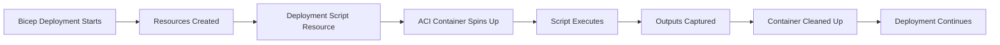

# How to Use Azure Bicep Deployment Scripts to Run Custom Logic During Infrastructure Provisioning

Author: [nawazdhandala](https://www.github.com/nawazdhandala)

Tags: Azure Bicep, Deployment Scripts, Infrastructure as Code, Azure, PowerShell, Azure CLI, Provisioning

Description: Learn how to use Bicep deployment scripts to execute custom PowerShell or Azure CLI logic during infrastructure deployments for tasks that ARM cannot handle natively.

---

There are things that ARM templates and Bicep simply cannot do natively. Seeding a database after creation, uploading an initial configuration file to a storage account, registering a DNS record with an external provider, or calling a third-party API to configure something outside of Azure. These gaps are exactly what deployment scripts fill.

Deployment scripts in Bicep let you run PowerShell or Azure CLI scripts as part of your infrastructure deployment. They execute inside a container instance that Azure manages for you, and they have full access to the Azure context of the deployment. The script runs, produces outputs that other resources can reference, and then the container is cleaned up.

## How Deployment Scripts Work

When Azure encounters a deployment script resource during template processing, it spins up an Azure Container Instance (ACI) with either a PowerShell or Azure CLI image. Your script runs inside that container with the identity you specify (usually a user-assigned managed identity). The container has network access and can reach Azure APIs and external endpoints.

The lifecycle looks like this:



After the script completes, its outputs are available to other resources in the template through the reference function. The container instance and associated storage account are retained for a configurable period (for debugging) and then deleted.

## Basic Deployment Script Example

Here is a simple Bicep deployment script that seeds initial data into a storage account after it is created.

```bicep
// main.bicep - Deploy a storage account and seed it with initial configuration

@description('The Azure region for all resources')
param location string = resourceGroup().location

@description('Name of the storage account')
param storageAccountName string

// User-assigned managed identity for the deployment script
// This identity needs appropriate permissions on the target resources
resource managedIdentity 'Microsoft.ManagedIdentity/userAssignedIdentities@2023-01-31' = {
  name: 'deploy-script-identity'
  location: location
}

// Storage account to be provisioned
resource storageAccount 'Microsoft.Storage/storageAccounts@2023-01-01' = {
  name: storageAccountName
  location: location
  sku: {
    name: 'Standard_LRS'
  }
  kind: 'StorageV2'
  properties: {
    minimumTlsVersion: 'TLS1_2'
  }
}

// Role assignment - give the managed identity Contributor on the storage account
resource roleAssignment 'Microsoft.Authorization/roleAssignments@2022-04-01' = {
  name: guid(storageAccount.id, managedIdentity.id, 'contributor')
  scope: storageAccount
  properties: {
    principalId: managedIdentity.properties.principalId
    roleDefinitionId: subscriptionResourceId(
      'Microsoft.Authorization/roleDefinitions',
      'ba92f5b4-2d11-453d-a403-e96b0029c9fe' // Storage Blob Data Contributor
    )
    principalType: 'ServicePrincipal'
  }
}

// Deployment script to seed initial configuration
resource seedScript 'Microsoft.Resources/deploymentScripts@2023-08-01' = {
  name: 'seed-storage-config'
  location: location
  kind: 'AzureCLI'
  identity: {
    type: 'UserAssigned'
    userAssignedIdentities: {
      '${managedIdentity.id}': {}
    }
  }
  dependsOn: [
    roleAssignment  // Wait for permissions before running
  ]
  properties: {
    azCliVersion: '2.52.0'
    retentionInterval: 'PT1H'  // Keep container logs for 1 hour
    timeout: 'PT10M'            // Script timeout of 10 minutes
    scriptContent: '''
      # Create a config container and upload initial settings
      az storage container create \
        --name "config" \
        --account-name $STORAGE_ACCOUNT_NAME \
        --auth-mode login

      # Create a default configuration JSON file
      cat > /tmp/default-config.json << 'CONFIGEOF'
      {
        "version": "1.0.0",
        "features": {
          "darkMode": false,
          "betaFeatures": false
        },
        "limits": {
          "maxUploadSize": 10485760,
          "maxConcurrentUsers": 100
        }
      }
      CONFIGEOF

      # Upload the configuration file
      az storage blob upload \
        --container-name "config" \
        --name "default-config.json" \
        --file "/tmp/default-config.json" \
        --account-name $STORAGE_ACCOUNT_NAME \
        --auth-mode login

      # Output the blob URL for reference by other resources
      echo "{\"configUrl\": \"https://${STORAGE_ACCOUNT_NAME}.blob.core.windows.net/config/default-config.json\"}" > $AZ_SCRIPTS_OUTPUT_PATH
    '''
    environmentVariables: [
      {
        name: 'STORAGE_ACCOUNT_NAME'
        value: storageAccount.name
      }
    ]
  }
}

// Output the config URL from the deployment script
output configBlobUrl string = seedScript.properties.outputs.configUrl
```

## Using PowerShell Deployment Scripts

If your team is more comfortable with PowerShell, you can use the PowerShell variant instead.

```bicep
// Deployment script using PowerShell to register an application in Azure AD
resource registerApp 'Microsoft.Resources/deploymentScripts@2023-08-01' = {
  name: 'register-aad-app'
  location: location
  kind: 'AzurePowerShell'
  identity: {
    type: 'UserAssigned'
    userAssignedIdentities: {
      '${managedIdentity.id}': {}
    }
  }
  properties: {
    azPowerShellVersion: '10.0'
    retentionInterval: 'PT1H'
    timeout: 'PT15M'
    scriptContent: '''
      # Register an Azure AD application for the deployed service
      param(
        [string]$AppName,
        [string]$AppUri
      )

      # Check if the app already exists (idempotent)
      $existingApp = Get-AzADApplication -DisplayName $AppName -ErrorAction SilentlyContinue

      if ($existingApp) {
          Write-Output "Application '$AppName' already exists with ID: $($existingApp.AppId)"
          $appId = $existingApp.AppId
      } else {
          # Create the application registration
          $app = New-AzADApplication -DisplayName $AppName -IdentifierUris $AppUri
          $appId = $app.AppId
          Write-Output "Created application '$AppName' with ID: $appId"
      }

      # Set the output for use by other resources
      $DeploymentScriptOutputs = @{}
      $DeploymentScriptOutputs['appId'] = $appId
    '''
    arguments: '-AppName "MyDeployedService" -AppUri "https://myservice.example.com"'
  }
}
```

## Passing Secrets to Deployment Scripts

Deployment scripts support secure environment variables for passing secrets. These values are not logged and are encrypted in transit.

```bicep
// Pass secrets securely using secureValue environment variables
resource dbSetupScript 'Microsoft.Resources/deploymentScripts@2023-08-01' = {
  name: 'setup-database'
  location: location
  kind: 'AzureCLI'
  identity: {
    type: 'UserAssigned'
    userAssignedIdentities: {
      '${managedIdentity.id}': {}
    }
  }
  properties: {
    azCliVersion: '2.52.0'
    retentionInterval: 'PT1H'
    timeout: 'PT10M'
    scriptContent: '''
      # Run database migrations using the connection string
      # The DB_CONNECTION_STRING variable is injected securely
      echo "Running database setup..."
      # Your database migration logic here
      az sql db execute \
        --connection-string "$DB_CONNECTION_STRING" \
        --query "CREATE TABLE IF NOT EXISTS AppConfig (Key NVARCHAR(256), Value NVARCHAR(MAX))"
    '''
    environmentVariables: [
      {
        name: 'DB_CONNECTION_STRING'
        secureValue: sqlConnectionString  // Passed as a secure parameter
      }
      {
        name: 'ENVIRONMENT'
        value: 'production'
      }
    ]
  }
}
```

## Using External Scripts

For longer scripts, you can reference external files instead of inlining everything. Upload your scripts to a storage account or include them as supporting files.

```bicep
// Reference an external script file from a storage account
resource externalScript 'Microsoft.Resources/deploymentScripts@2023-08-01' = {
  name: 'run-external-setup'
  location: location
  kind: 'AzureCLI'
  identity: {
    type: 'UserAssigned'
    userAssignedIdentities: {
      '${managedIdentity.id}': {}
    }
  }
  properties: {
    azCliVersion: '2.52.0'
    retentionInterval: 'PT1H'
    timeout: 'PT30M'
    // Primary script that orchestrates the setup
    primaryScriptUri: 'https://mysetupscripts.blob.core.windows.net/scripts/setup.sh'
    // Additional supporting files
    supportingScriptUris: [
      'https://mysetupscripts.blob.core.windows.net/scripts/helpers.sh'
      'https://mysetupscripts.blob.core.windows.net/scripts/config.json'
    ]
  }
}
```

## Idempotency Considerations

Deployment scripts need to be idempotent because Azure might re-run them during retries or redeployments. By default, a deployment script runs every time the template is deployed. You can control this with the `forceUpdateTag` property.

```bicep
// Use forceUpdateTag to control when the script re-runs
// Only re-run when this tag value changes
param scriptVersion string = '1.0.0'

resource idempotentScript 'Microsoft.Resources/deploymentScripts@2023-08-01' = {
  name: 'conditional-setup'
  location: location
  kind: 'AzureCLI'
  identity: {
    type: 'UserAssigned'
    userAssignedIdentities: {
      '${managedIdentity.id}': {}
    }
  }
  properties: {
    azCliVersion: '2.52.0'
    retentionInterval: 'PT1H'
    timeout: 'PT10M'
    forceUpdateTag: scriptVersion  // Script only re-runs when version changes
    scriptContent: '''
      echo "Setting up resources - this only runs when forceUpdateTag changes"
      # Your setup logic here
    '''
  }
}
```

## Debugging Failed Scripts

When a deployment script fails, you need access to the logs. The `retentionInterval` property controls how long the container and its logs stick around after execution. Set it to a longer duration during development.

You can view logs through the Azure Portal by navigating to the deployment script resource, or through the CLI.

```bash
# View deployment script logs from the CLI
# The script resource is in the same resource group as the deployment
az deployment-scripts show-log \
  --resource-group "my-rg" \
  --name "seed-storage-config"

# List all deployment scripts in a resource group
az deployment-scripts list \
  --resource-group "my-rg" \
  --output table
```

## Networking and Security

By default, deployment script containers run with public network access. For production deployments, you can configure them to run inside a virtual network using the `containerSettings` property.

```bicep
// Run the deployment script inside a virtual network
resource secureScript 'Microsoft.Resources/deploymentScripts@2023-08-01' = {
  name: 'secure-setup'
  location: location
  kind: 'AzureCLI'
  identity: {
    type: 'UserAssigned'
    userAssignedIdentities: {
      '${managedIdentity.id}': {}
    }
  }
  properties: {
    azCliVersion: '2.52.0'
    retentionInterval: 'PT1H'
    timeout: 'PT10M'
    containerSettings: {
      subnetIds: [
        {
          id: deploymentSubnet.id  // Reference to your VNet subnet
        }
      ]
    }
    scriptContent: '''
      echo "Running in a private network context"
      # This script can access private endpoints and internal resources
    '''
  }
}
```

Deployment scripts bridge the gap between what Bicep can declare and what your infrastructure actually needs. They let you keep your entire provisioning workflow in a single template, including the custom steps that ARM resources alone cannot handle. Use them for seeding data, registering applications, calling external APIs, and any other procedural logic that needs to happen as part of your infrastructure deployment.
